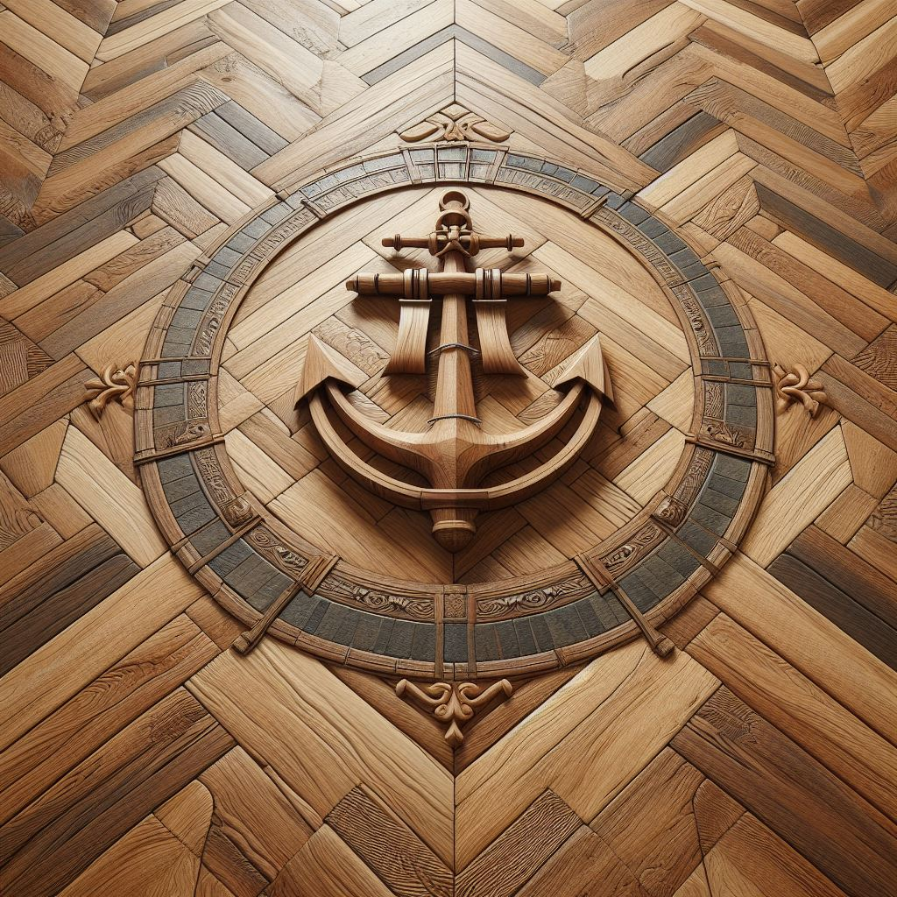

<figure class="wp-caption aligncenter img-thumbnail">
    
    <figcaption class="text-center">Rustikales Eichenparkett im Schiffsbodenmuster verlegt</figcaption>
</figure>

## Herringbone

90°-Winkel

* Single Herringbone
* Double Herringbone

## Chevron

* 90° angle
* 45° cuts

Leads to a wavy pattern

## Wood Strip

## Brick Bond

Every second line is aligned (like stack bond).

The two ones are moved to the middle.

## Stack Bond

Just simply aligned over each other

## Checkerboard

## Mosaic

## Chantilly

## Basket Weave

## Double Basket Weave

## Versailles
