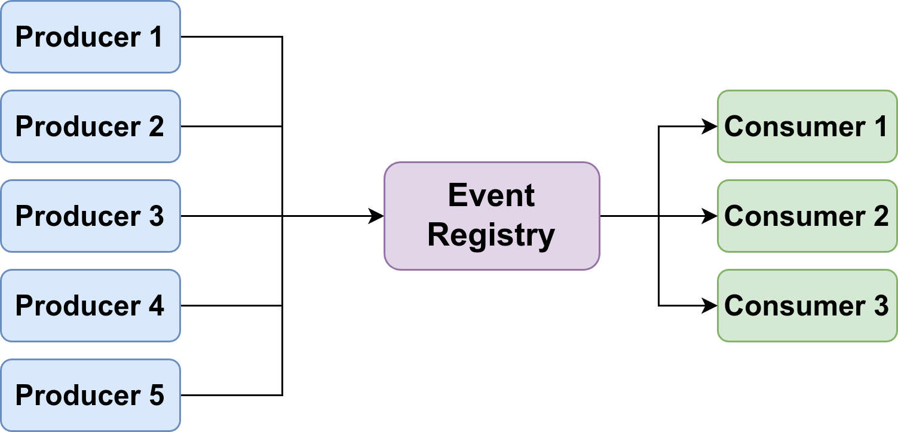
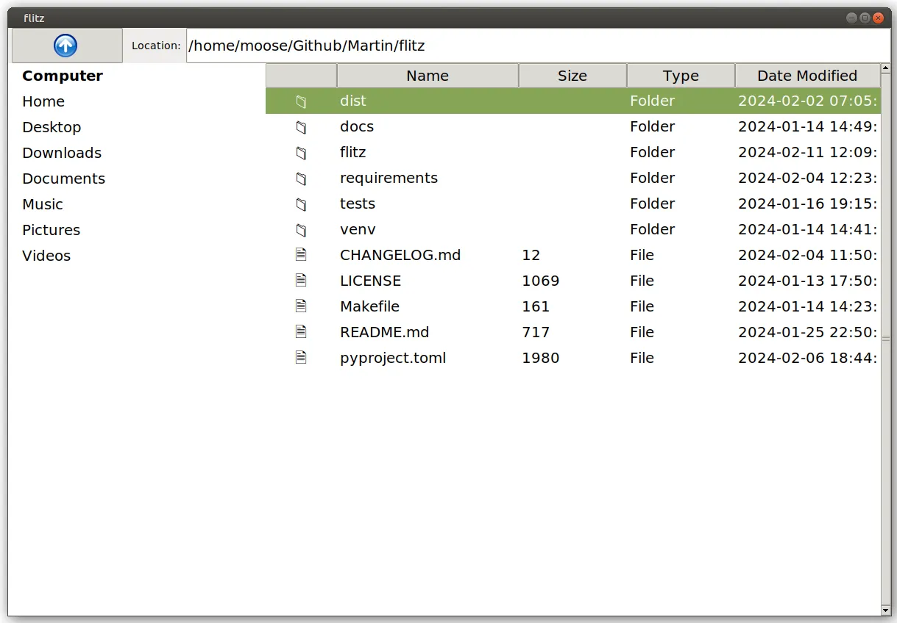

*An event-driven system decouples producers of events and the effects that those events should have on the remaining softwaresystem.*

An event-driven software architecture sometimes allows you to write cleaner code. Most software engineers likely know pre-defined event systems such as the ones given by frontend frameworks/languages, e.g. [keypress in JavaScript](https://developer.mozilla.org/en-US/docs/Web/API/Element/keypress_event), [bind in Tkinter](https://www.geeksforgeeks.org/python-binding-function-in-tkinter/), or [keyPressEvent in PyQt/PySide](https://doc.qt.io/qtforpython-6/PySide6/QtGui/QKeyEvent.html#detailed-description). You might also know [Django Signals](https://docs.djangoproject.com/en/5.0/topics/signals/). You might have heard of Apache Kafka or Google Cloud Pub/Sub in the context of distributed systems.

**An event-driven software architecture does not have to be that complicated.**

The components of an event-driven system are simple: You have events, producers of those events, and consumers of the events. Then you need some glue code that forwards the events from the producers to the consumers. This is the event registry.

## Building Event-Driven Software

I’m recently building the [flitz file manager](https://pypi.org/project/flitz/) to tip my toes into the development of graphical user interfaces with Python. I started with the Tkinter framework but recognized it was not a good match. Porting to Qt is hard as I have a tight coupling with Tkinter.

*A file explorer with an up-button, a URL bar showing the current path, and a details view showing the content of the current directory.*

For example, when changing the current path via the URL bar, I want the listed documents to be changed. Flitz also has an “up” button. When it is clicked the current path shown in the URL bar is changed + the shown documents in the details pane are changed.

Conceptionally, the code could look like this:

```python
class FileExplorer:
    def __init__(self):
        current_path = Path(".")

        # Show the UI widgets
        details_view = DetailsView(self)
        url_bar = UrlBar(self)
        up_button = UpButton(self)


class UrlBar:
    def __init__(self, root):
        self.root = root
        self.text = str(self.root.current_path)

    def on_keypress_enter(self):
        # Let the main application know that the path changed
        self.root.current_path = Path(self.text)

        # Trigger follow-up changes
        self.root.details_view.refresh()
        self.refresh()

    def refresh(self):
        self.text = str(self.root.current_path)


class UpButton:
    def __init__(self, root):
        self.root = root

    def on_press(self):
        # Let the main application know that the path changed
        self.root.current_path = self.root.current_path.parent

        # Trigger follow-up changes
        self.root.details_view.refresh()
        self.root.url_bar.refresh()


class DetailsView:
    def refresh():
        """Show the files from the root.current_path."""
```

You can see that there is logic duplication in UpButton.on_press and UrlBar.on_keypress_enter . Such parts become harder to maintain the bigger the application becomes. At some point, somebody will forget to update/refresh one GUI widget of the application.

Instead, you can define an set_current_pathfunction:

```python
class FileExplorer:
    def __init__(self):
        current_path = Path(".")

        # Show the UI widgets
        self.details_view = DetailsView(self)
        self.url_bar = UrlBar(self)
        self.up_button = UpButton(self)

    def set_current_path(self, current_path):
        self.current_path = current_path
        self.details_view.refresh()
        self.url_bar.refresh()


class UrlBar:
    def __init__(self, root):
        self.root = root
        self.text = str(self.root.current_path)

    def on_keypress_enter(self):
        self.root.set_current_path(Path(self.text))


class UpButton:
    def __init__(self, root):
        self.root = root

    def on_press(self):
        self.root.set_current_path(self.root.current_path.parent)


class DetailsView:
    def refresh():
        """Show the files from the root.current_path."""
```

The next part we want to improve is the **locality of the code**. Meaning, that one component should have all of its code in one place. Having several unrelated lines in set_current_path makes it harder to change those components and inspect if they do the right thing. I mean, how do you know if there is a component that should be touched in set_current_path without checking the code of every single component?

```python
from pathlib import Path

# events.py
class Event:
    def __init__(self, name):
        self.name = name
        self.listeners = []

    def consumed_by(self, listener):
        self.listeners.append(listener)

    def produce(self):
        for listener in self.listeners:
            listener()


current_path_changed = Event("current_path_changed")

# Remaining code:
class FileExplorer:
    def __init__(self):
        self.current_path = Path(".")
        self.event_registry = {}  # Event registry to hold component listeners

        # Show the UI widgets
        self.details_view = DetailsView(self)
        self.url_bar = UrlBar(self)
        self.up_button = UpButton(self)

    def set_current_path(self, current_path):
        self.current_path = current_path
        current_path_changed.produce()


class UrlBar:
    def __init__(self, root):
        self.root = root
        self.text = str(self.root.current_path)
        current_path_changed.consumed_by(self.refresh)

    def on_keypress_enter(self):
        self.root.set_current_path(Path(self.text))

    def refresh(self):
        self = self.root.url_bar
        self.text = str(self.root.current_path)
        print(f"UrlBar refreshed")


class UpButton:
    def __init__(self, root):
        self.root = root

    def on_press(self):
        self.root.set_current_path(self.root.current_path.parent.resolve())


class DetailsView:
    def __init__(self, root):
        self.root = root
        current_path_changed.consumed_by(self.refresh)

    def refresh(self):
        """Show the files from the root.current_path."""
        print(f"Refreshing details view with files from {self.root.current_path}")


# Example usage:
explorer = FileExplorer()
explorer.up_button.on_press()
```

You can also use a library like [blinker](https://pypi.org/project/blinker/) for that.

**And that’s it. You’ve seen an event-driven system 🎉**

In this case, the registry is every single Event object.

## That’s simple — why does Apache Kafka exist?

Kafka is used in large distributed systems. That especially means that you have a network with latency and errors. Consumers might come and go; just like producers.

## Gotcha, but why do we need blinker?

* **Multi-threading**

* **Disconnecting Consumers**

* **Attached data**: In this simple example the event didn’t come with any data. That is different in many use-cases.

## Terminology — many words for the same concepts

Events and signals are the same thing. Similarly, we have a couple of pairs that belong together:

<table border="1">
  <tr>
    <th>Event</th>
    <th>Action</th>
    <th>Follow-up</th>
    <th>Comment</th>
  </tr>
  <tr>
    <td>Event</td>
    <td>Publisher</td>
    <td>Subscriber</td>
    <td>Apache Kafka, Google Pub/Sub</td>
  </tr>
  <tr>
    <td>Event</td>
    <td>Producer</td>
    <td>Consumer</td>
    <td>RabbitMQ, Spring Cloud Stream</td>
  </tr>
  <tr>
    <td>Event</td>
    <td>Dispatch</td>
    <td>Listener</td>
    <td>JavaScript</td>
  </tr>
  <tr>
    <td>Signal</td>
    <td>Sender</td>
    <td>Receiver</td>
    <td>Blinker</td>
  </tr>
</table>

## Pitfalls of Event-Driven Systems

* **Order**: You should design your event-driven system in a way that the order of execution of the consumers does not matter.

* **Infinite Loops**: Event A might cause Event B which causes Event A.

## TL;DR

* **What**: Event-driven systems have **events**, parts of code that **produce** those events, and other parts that **consume** those events.

* **Why**: It’s useful to decouple the senders from the receivers. That increases maintainability.

* **How**: The simplest way to implement event-driven software is by using global objects for the signals. Those are then used by the producers and automatically call the consumers. Libraries like blinker can help. If you are in a distributed system things become more complicated.
