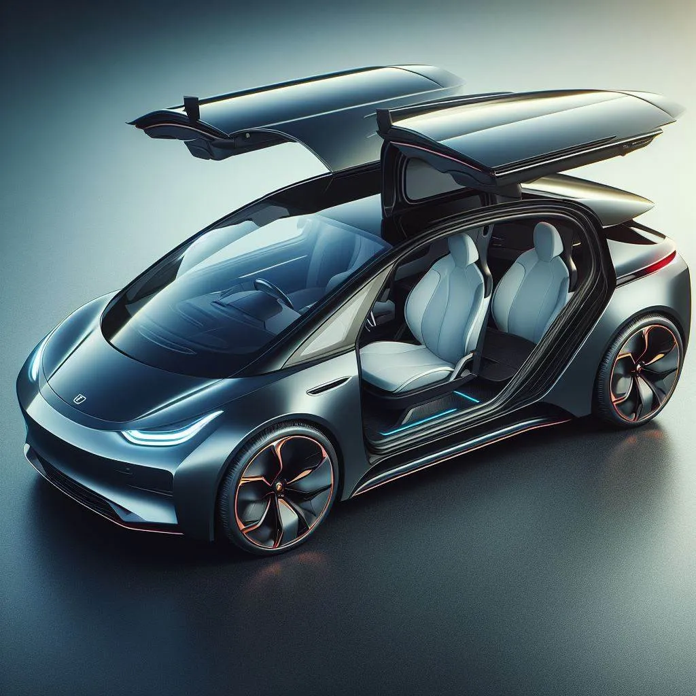

Ich lese und höre immer wieder Beschwerden von älteren Menschen über
Elektroautos oder batterieelektrische Fahrzeuge (BEVs) im Allgemeinen. Sie
bevorzugen ihre Benzin- oder Dieselautos, die ich als ICE — Internal Combustion
Engine (Verbrennungsmotor) — abkürzen werde.

Dieser Artikel listet alle Gründe auf, warum ich glaube, dass wir einen
allmählichen Anstieg des Anteils von Elektrofahrzeugen erleben werden, bis sie
den Markt vollständig dominieren und mehr als 90 % aller Autos auf den Straßen
in Deutschland bis 2060 ausmachen.

Warum 2060? Weil ab 2035 in der EU gesetzlich keine neuen Verbrennerautos mehr
verkauft werden dürfen, und ich schätze, dass es etwa 25 Jahre dauert, bis die
vorhandenen Autos ersetzt sind.

## E-Autos sind günstiger 💸

Die Betriebskosten sind niedriger, weil die Motoren viel effizienter sind. Ein
BEV benötigt 97–198 Wh/km ([Quelle](https://ev-database.org/car/1555/Tesla-Model-3#:~:text=Real%20Energy%20Consumption%20Estimation%20between%2097%20%2D%20198%20Wh%2Fkm)), während der VW Arteon 2024 4 Gallonen / 100
Meilen (9,4 L/100 km, [Quelle](https://www.fueleconomy.gov/feg/bymodel/2024_Volkswagen_Arteon.shtml)) verbraucht. Ich zahle derzeit 0,26 €/kWh bzw. 1,63
€/L Benzin in Deutschland. Das bedeutet, dass der Tesla&nbsp;3 0,025 €/km kostet und
der VW Arteon 0,15 €/km. Anders ausgedrückt: Ein BEV kann 600 Meilen für den
Preis von 100 Meilen eines ICE fahren.

Zusätzlich sind die Steuern für den Besitz eines BEV niedriger und die
Versicherung ist etwa 25 % günstiger, da es weniger Schäden gibt ([Quelle](https://www.spiegel.de/auto/kfz-versicherung-elektroautos-lassen-sich-deutlich-billiger-versichern-als-verbrenner-a-011ead08-e76e-41d7-a5d4-c7df0d9e02d6)).

Typischer Verbrauch

<table border="1">
  <thead>
    <tr>
      <th>Kategorie</th>
      <th>BEV (Verbrauch, Modell)</th>
      <th>Benziner (Verbrauch, Modell)</th>
      <th>Diesel (Verbrauch, Modell)</th>
      <th>Wasserstoff (Verbrauch, Modell)</th>
    </tr>
  </thead>
  <tbody>
    <tr>
      <th><a href="https://de.wikipedia.org/wiki/Kleinstwagen">Kleinstwagen</a></th>
      <td>14,1 kWh/100 km (<a href="https://www.spritmonitor.de/de/uebersicht/50-Volkswagen/1234-Up!.html">VW up!</a>)</td>
      <td>5,4 L/100 km (<a href="https://www.spritmonitor.de/de/uebersicht/50-Volkswagen/1234-Up!.html?fueltype=2">VW up!</a>)</td>
      <td>5,2 L/100 km (<a href="https://www.spritmonitor.de/de/uebersicht/50-Volkswagen/1234-Up!.html?fueltype=2">VW up!</a>)</td>
      <td>N/A</td>
    </tr>
    <tr>
      <th><a href="https://de.wikipedia.org/wiki/Kleinwagen">Kleinwagen</a></th>
      <td>19,0 kWh/100 km (<a href="https://www.adac.de/rund-ums-fahrzeug/autokatalog/marken-modelle/renault/renault-zoe/">Renault Zoe</a>)</td>
      <td>6,2 L/100 km (<a href="https://www.adac.de/rund-ums-fahrzeug/autokatalog/marken-modelle/vw/vw-polo/">VW Polo</a>)</td>
      <td>5,8 L/100 km (<a href="https://www.auto-motor-und-sport.de/test/kosten-realverbrauch-vw-polo-1-6-tdi/">VW Polo Diesel</a>)</td>
      <td>N/A</td>
    </tr>
    <tr>
      <th><a href="https://de.wikipedia.org/wiki/Kompaktklasse">Kompaktklasse</a></th>
      <td>16,7 kWh/100 km (<a href="https://www.adac.de/rund-ums-fahrzeug/autokatalog/autotest/vw-id3-dauertest/">VW ID.3</a>)</td>
      <td>7,6 L/100 km (<a href="https://www.spritmonitor.de/de/uebersicht/50-Volkswagen/452-Golf.html?fueltype=2">VW Golf</a>)</td>
      <td>4,8 L/100 km (<a href="https://www.adac.de/rund-ums-fahrzeug/autokatalog/marken-modelle/vw/vw-golf/">VW Golf 2.0 TDI SCR Life</a>)</td>
      <td>N/A</td>
    </tr>
    <tr>
      <th><a href="https://de.wikipedia.org/wiki/Mittelklasse">Mittelklasse</a></th>
      <td>17,2 kWh/100 km (<a href="https://www.adac.de/rund-ums-fahrzeug/autokatalog/marken-modelle/tesla/tesla-model-3/">Tesla Model 3</a>)</td>
      <td>9,3 L/100 km (<a href="https://www.spritmonitor.de/de/uebersicht/6-BMW/37-3er.html?fueltype=2">BMW 3er</a>)</td>
      <td>5,1 L/100 km (<a href="https://www.adac.de/rund-ums-fahrzeug/autokatalog/marken-modelle/bmw/bmw-3er/">BMW 3er Diesel</a>)</td>
      <td>1,2 kg/100 km (<a href="https://www.adac.de/rund-ums-fahrzeug/autokatalog/marken-modelle/hyundai/hyundai-nexo/">Hyundai Nexo</a>)</td>
    </tr>
    <tr>
      <th><a href="https://de.wikipedia.org/wiki/Obere_Mittelklasse">Obere Mittelklasse</a></th>
      <td>19,5 kWh/100 km (<a href="https://www.adac.de/rund-ums-fahrzeug/autokatalog/marken-modelle/bmw/bmw-i4/">BMW i4</a>)</td>
      <td>9,8 L/100 km (<a href="https://www.auto-motor-und-sport.de/test/kosten-realverbrauch-audi-a6-avant-55-tfsi-quattro-sport/">Audi A6</a>)</td>
      <td>6,5 L/100 km (<a href="https://www.adac.de/rund-ums-fahrzeug/autokatalog/marken-modelle/audi/audi-a6-avant/">Audi A6 Diesel</a>)</td>
      <td>N/A</td>
    </tr>
    <tr>
      <th><a href="https://de.wikipedia.org/wiki/Oberklasse">Oberklasse</a></th>
      <td>21,5 kWh/100 km (<a href="https://www.adac.de/rund-ums-fahrzeug/autokatalog/marken-modelle/mercedes-benz/mercedes-eqs/">Mercedes EQS</a>)</td>
      <td>8,7 L/100 km (<a href="https://www.adac.de/rund-ums-fahrzeug/autokatalog/marken-modelle/mercedes-benz/mercedes-s-klasse/">Mercedes S-Klasse</a>)</td>
      <td>8,2 L/100 km (<a href="https://sportauto.auto-motor-und-sport.de/test/kosten-realverbrauch-mercedes-s400-d-4matic/technische-daten/">Mercedes S-Klasse</a>)</td>
      <td>N/A</td>
    </tr>
    <tr>
      <th>Geländewagen/SUV</th>
      <td>22,4 kWh/100 km (<a href="https://www.adac.de/rund-ums-fahrzeug/autokatalog/marken-modelle/audi/audi-q4-e-tron/">Audi Q4 e-tron</a>)</td>
      <td>11,1 L/100 km (<a href="https://www.faz.net/aktuell/technik-motor/motor/geprueft-suv-bmw-x5-xdrive-40i-19415886.html">BMW X5</a>)</td>
      <td>7,8 L/100 km (<a href="https://www.adac.de/rund-ums-fahrzeug/autokatalog/marken-modelle/bmw/bmw-x5/">BMW X5 Diesel</a>)</td>
      <td>N/A</td>
    </tr>
  </tbody>
</table>

Die folgende Tabelle zeigt, wie viel man bei einem E-Auto spart, wenn man 100km
fährt und nicht mit einem Benziner. Das Ganze ist natürlich vom Strom- und vom
Benzinpreis abhängig. Angenommen wird ein Verbrauch von 9,3L Super auf 100km
sowie von 17,2kWh auf 100km:

<!--
l_per_100km = 9.3
kwh_per_100km = 17.2

for eur_per_l in range(125, 200, 5):
    eur_per_l /= 100
    line = f"<tr>\n"
    bezin_cost = eur_per_l*l_per_100km
    line+= f"    <td>{eur_per_l:.2f} €/L ({bezin_cost:.2f} €/100km)</td>\n"
    for eur_per_kwh in [0.2, 0.3, 0.4, 0.5, 0.6]:
        bev_cost = eur_per_kwh*kwh_per_100km
        line += f"    <td>{bezin_cost-bev_cost:.2f}€</td>\n"
    line += "</tr>\n"
    print(line, end="")
-->
<table>
    <thead>
        <tr>
            <th>€/L Benzin</th>
            <th>0,20€/kWh (3,44€/100km)</th>
            <th>0,30€/kWh (5,16€/100km)</th>
            <th>0,40€/kWh (6,88€/100km)</th>
            <th>0,50€/kWh (8,60€/100km)</th>
            <th>0,60€/kWh (10,32€/100km)</th>
        </tr>
    </thead>
    <tbody>
        <tr>
            <td>1,25 €/L (11,62 €/100km)</td>
            <td>8,19€</td>
            <td>6,47€</td>
            <td>4,75€</td>
            <td>3,03€</td>
            <td>1,31€</td>
        </tr>
        <tr>
            <td>1,30 €/L (12,09 €/100km)</td>
            <td>8,65€</td>
            <td>6,93€</td>
            <td>5,21€</td>
            <td>3,49€</td>
            <td>1,77€</td>
        </tr>
        <tr>
            <td>1,35 €/L (12,56 €/100km)</td>
            <td>9,12€</td>
            <td>7,40€</td>
            <td>5,68€</td>
            <td>3,96€</td>
            <td>2,24€</td>
        </tr>
        <tr>
            <td>1,40 €/L (13,02 €/100km)</td>
            <td>9,58€</td>
            <td>7,86€</td>
            <td>6,14€</td>
            <td>4,42€</td>
            <td>2,70€</td>
        </tr>
        <tr>
            <td>1,45 €/L (13,49 €/100km)</td>
            <td>10,05€</td>
            <td>8,33€</td>
            <td>6,61€</td>
            <td>4,89€</td>
            <td>3,17€</td>
        </tr>
        <tr>
            <td>1,50 €/L (13,95 €/100km)</td>
            <td>10,51€</td>
            <td>8,79€</td>
            <td>7,07€</td>
            <td>5,35€</td>
            <td>3,63€</td>
        </tr>
        <tr>
            <td>1,55 €/L (14,42 €/100km)</td>
            <td>10,98€</td>
            <td>9,26€</td>
            <td>7,54€</td>
            <td>5,82€</td>
            <td>4,10€</td>
        </tr>
        <tr>
            <td>1,60 €/L (14,88 €/100km)</td>
            <td>11,44€</td>
            <td style="background-color: green;">9,72€</td>
            <td>8,00€</td>
            <td>6,28€</td>
            <td>4,56€</td>
        </tr>
        <tr>
            <td>1,65 €/L (15,35 €/100km)</td>
            <td>11,91€</td>
            <td>10,19€</td>
            <td>8,46€</td>
            <td>6,75€</td>
            <td>5,03€</td>
        </tr>
        <tr>
            <td>1,70 €/L (15,81 €/100km)</td>
            <td>12,37€</td>
            <td>10,65€</td>
            <td>8,93€</td>
            <td>7,21€</td>
            <td>5,49€</td>
        </tr>
        <tr>
            <td>1,75 €/L (16,28 €/100km)</td>
            <td>12,84€</td>
            <td>11,12€</td>
            <td>9,40€</td>
            <td>7,68€</td>
            <td>5,96€</td>
        </tr>
        <tr>
            <td>1,80 €/L (16,74 €/100km)</td>
            <td>13,30€</td>
            <td>11,58€</td>
            <td>9,86€</td>
            <td>8,14€</td>
            <td>6,42€</td>
        </tr>
        <tr>
            <td>1,85 €/L (17,21 €/100km)</td>
            <td>13,77€</td>
            <td>12,05€</td>
            <td>10,33€</td>
            <td>8,61€</td>
            <td>6,89€</td>
        </tr>
        <tr>
            <td>1,90 €/L (17,67 €/100km)</td>
            <td>14,23€</td>
            <td>12,51€</td>
            <td>10,79€</td>
            <td>9,07€</td>
            <td>7,35€</td>
        </tr>
        <tr>
            <td>1,95 €/L (18,14 €/100km)</td>
            <td>14,70€</td>
            <td>12,98€</td>
            <td>11,26€</td>
            <td>9,54€</td>
            <td>7,82€</td>
        </tr>
    </tbody>
</table>

Aktuell zahle ich 0,26 €/kWh für den Haushaltsstrom und 1,63€/L für Super E10.

Eine 10kWp Photovoltaik-Anlage (inkl. 10 kWh Speicher, inkl. Montage) kostet etwa
16.000€ und erzeugt etwa 10.000kWh pro Jahr. Wenn man von 20 Jahren Lebensdauer
ausgeht, hat man Stromkosten von 0,08€/kWh.

Die **Wartungskosten** sind geringer, da es weniger Teile gibt, die kaputtgehen
können: Der Motor muss keine Explosionen aushalten, der Benutzer muss keinen
richtigen Kraftstoff einfüllen, es gibt
[kein Getriebe](https://www.carbuyer.co.uk/tips-and-advice/169767/do-electric-cars-have-gearboxes),
keine Abgasanlage, kein
Kühlsystem für den Motor. Es sind
[keine Ölwechsel](https://www.kia.com/mu/discover-kia/ask/do-electric-cars-need-oil-changes.html)
nötig. Die Bremsen halten
länger dank der [Rekuperationsbremse](https://de.wikipedia.org/wiki/Nutzbremse).
Lediglich die Reifen nutzen sich schneller ab aufgrund des höheren Gewichts.

Die **Anschaffungskosten** sind derzeit höher, aber sie werden deutlich sinken,
sobald BEVs in größeren Stückzahlen produziert werden. Das sehen wir bereits.
Sie können günstiger sein als herkömmliche Fahrzeuge mit Verbrennungsmotor
(ICE), da sie einfacher zu bauen sind. Hauptsächlich muss die Batterie
erschwinglicher werden. Durch den Anstieg von Solar- und Windenergie benötigen
wir bessere netzgebundene Batterien. Aufgrund der Beliebtheit von Smartphones
brauchen wir bessere kleine Batterien. Es gibt bereits viele Menschen, die an
Batterieforschung arbeiten, allein wegen dieser beiden Anwendungsbereiche. Wir
werden massive Verbesserungen in der Batterietechnologie sehen, die die Kosten
senken werden (z.B. [Natrium-Ionen-Batterien](https://www.youtube.com/watch?v=UmW2D_At1PY)).

## E-Autos sind besser für die Umwelt 🌍

Verbrenner-Autos (ICE) benötigen Öl. Öl muss gefördert, raffiniert und
transportiert werden. [Ölverschmutzungen](https://en.wikipedia.org/wiki/List_of_oil_spills)
sind leider nicht so selten.

Stickoxide entstehen, wenn das Öl in den Autos verbrannt wird ([Quelle](https://www.umweltbundesamt.de/en/press/pressinformation/real-nitrogen-oxide-emissions-of-diesel-passenger)). „Erhöhte Stickstoffdioxidwerte können das menschliche Atmungssystem schädigen und die Anfälligkeit sowie die Schwere von Atemwegsinfektionen und Asthma erhöhen.“ ([Quelle](https://www.qld.gov.au/environment/management/monitoring/air/air-pollution/pollutants/nitrogen-oxides#:~:text=Environmental%20and%20health%20effects%20of,can%20cause%20chronic%20lung%20disease.)).

Die Batterieproduktion von BEVs kann verbessert werden. Seltene Erden werden in
Ländern abgebaut, die nicht die gleichen Umwelt- und Arbeitsschutzgesetze wie
Deutschland einhalten. Das Ausmaß dieses Problems ist jedoch deutlich geringer
als bei Verbrennerfahrzeugen (ICE). Darüber hinaus haben wir begonnen, Batterien
zu entwickeln, die den Bedarf an problematischen seltenen Erden reduzieren oder
sogar ganz eliminieren können ([Quelle](https://www.isi.fraunhofer.de/en/blog/themen/batterie-update/alternative-batterie-technologien-lithium-ionen-potenziale-herausforderungen.html)). Verbrennerfahrzeuge werden immer einen
Katalysator benötigen, der ebenfalls seltene Erden erfordert ([Quelle](https://eu.detroitnews.com/story/tech/2019/06/02/chinese-rare-earth-materials-used-widely/39533417/)).

[Feinstaub](https://de.wikipedia.org/wiki/Feinstaub) ist ein weiteres Problem,
das BEVs nicht vollständig beseitigen. Die Reifen und Bremsen nutzen sich ab und
setzen dadurch Partikel frei. Allerdings stellt die OECD-Studie „Non-exhaust
Particulate Emissions from Road Transport“ (2020) fest:

> While electric vehicles are estimated to emit slightly less PM10 from
> non-exhaust sources than conventional vehicles, heavier-weight EVs are
> estimated to emit more PM2.5 than conventional vehicles.

Das bedeutet: Wenn man schwere BEVs mit kleinen Verbrennerautos (ICE)
vergleicht, sind die PM2.5-Emissionen schlechter. Allerdings muss man sagen,
dass BEVs derzeit etwa 11 % schwerer sind als ihre Benzinvarianten.

Beispiele:

* BMW 760i xDrive (2345 kg) vs BMW i7 eDrive50 (2595 kg): +250 kg
* VW Golf 2.0 TDI (1449 kg) vs VW eGolf 2017 (1615 kg): +166 kg

Der Grund dafür liegt im Unterschied der Energiedichte:

* E10: 12,1 kWh/kg
* Lithium-Ionen-Batterie: 0,2 kWh/kg

Gleichzeitig sind BEVs etwa 5-mal energieeffizienter. Wenn man die gleiche
Reichweite erzielen möchte, benötigt man 12,1/(0,2 × 5) = 12,1-mal das Gewicht.
Ein typischer Kraftstofftank fasst etwa 50 Liter (13 Gallonen) oder 40 kg
Kraftstoff. Ein BEV muss also 484 kg Batterien tragen, um die gleiche Reichweite
zu erreichen.

Hier sind die Zahlen für ein [Tesla Model S](https://ecomento.de/2014/06/23/so-viel-wiegen-die-teile-des-tesla-model-s/),
die ich aus Neugier recherchiert habe:

* Batterie / Tank: 600 kg vs 12 kg ([Quelle](https://www.ws-autoteile.com/en/i108088/aic-kraftstofftanks-kraftstoffbehaelter-54245))
* Motor: 158 kg vs 194 kg ([BMW M50](https://de.wikipedia.org/wiki/BMW_M50))
* Getriebe: 0 kg vs 48 kg
* Ölpumpe, Öl: 0 kg vs 90 kg
* Auspuffanlage: 0 kg vs 20 kg ([Quelle](https://www.amazon.com/Flowmaster-717857-FlowFX-Cat-back-Exhaust/dp/B07R686CHY/))

## Fahrspaß 😄

Die Autos sind moderner — sie verfügen über Kameras und Assistenzsysteme. Das
Multimedia-System ist auf einem ganz anderen Niveau. Ihre Beschleunigung ist
deutlich besser. Außerdem sind sie viel leiser.

Wenn man sich die Top-5 der beliebtesten Automarken anschaut, sieht man Tesla
und Rivian darin. Zwei Hersteller, die ausschließlich BEVs bauen.

## Siehe auch

* [Neuer E-Motor](https://www.youtube.com/watch?v=mL1-G__Hc9U) auf YouTube
* [Lithium im Oberrheingraben](https://www.youtube.com/watch?v=T8wabl79YS0) von Vulcan Energy
* [Lithium am Rhein](https://www.youtube.com/watch?v=GXbSI2FJf0k)
* [Altenberg Lithium](https://www.youtube.com/watch?v=yR87lQUi_xs) (Östliches Erzgebirge)
