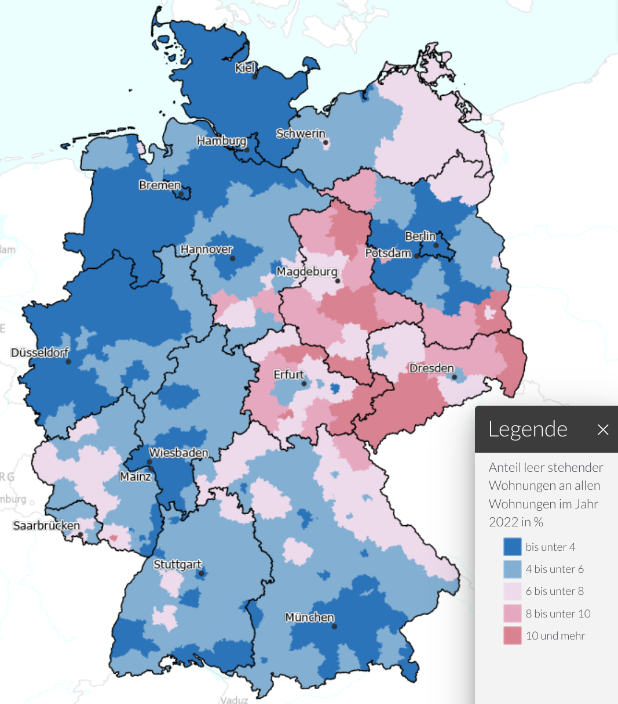

Der Wohnngsmangel ist eines der heißesten Themen in der deutschen Politik.
Wir machen keinen Fortschritt aus ein paar einfachen Gründen.

## Wohnungsmangel - Ein Verteilungsproblem

Die Wohnungen sind häufiger nicht dort wo wir sie brauchen und Menschen haben
nicht immer eine Wohnung, deren größe für sie passend ist.

### Wohnfläche pro Person

Es gibt Familien die auf kleinstem Raum leben und es gibt Menschen die alleine
in einem Haus wohnen. Zum einen ist das natürlich eine Frage des Geldes, aber
zum anderen auch eine Frage der Verfügbarkeit. Insbesondere für ältere Menschen
lohnt sich ein Umzug oft nicht, da sie in kleineren Wohnungen eventuell sogar
höhere Kosten haben.

### Leerstand

Wir haben über 43,4 Millionen Wohnungen mit Durchschnittlich 92.2m² in Deutschland ([destatis.de](https://www.destatis.de/DE/Presse/Pressemitteilungen/2023/07/PD23_297_31231.html), 2022). Davon standen 1,9 Millionen Wohnungen leer ([deutschlandatlas.bund.de](https://www.deutschlandatlas.bund.de/DE/Karten/Wie-wir-wohnen/046-Wohnungsleerstand.html)).

Leider sind diese nicht gleichmäßig verteilt:



Schaut man sich z.B. nur Nordrhein-Westfalen (NRW) an:

* 18.190.422 [Einwohner in NRW](https://de.wikipedia.org/wiki/Nordrhein-Westfalen)
* [9,1 Millionen Wohnungen](https://www.mieterbund-nrw.de/startseite/news-details/leerstand-wohnungen)
    * Davon 310.000 am Stichtag Leerstehend
    * Davon ca. 48% mehr als in Jahr ungenutzt
        * 24% der Wohnungen wegen Baumaßnahmen oder Sanierungen ungenutzt
        * 4%: Gebäude-Abriss geplant


## Wer kann bauen?

Es gibt zwei wichtige finanzielle Faktoren:

1. **Eigenkapital**: Nimm was du hast x10. Das ist das teuerste Haus, das dir
   eine Bank finanzieren wird wenn das Einkommen noch passt.
2. **Einkommen**: Hier wirds komplzierter. Das hängt sehr stark vom Bauzins ab.

### Eigenkapital

Die Bank will sicher sein, dass sie nicht auf den Kosten
sitzen bleibt. Wenn das Haus gebaut wird, hat sie das Haus als Sicherheit.
In gewisser weiße ist hier also kein Risiko, weil das Geld nur in ein Haus
"umgewandelt" wird, das soviel wert sein sollte wie man dafür bezahlt hat.
Was jedoch einfach verschwindet sind die Hauskaufnebenkosten:

* Grunderwerbsteuer: 3,5% in Bayern, bis zu 6,5% in anderen Bundesländern
* Notar: 1,5%
* Grundbuch: 0,5%
* Makler: 3,57%

Insgesamt also mindestens 9,07% des Kaufpreises. Damit wir uns richtig
verstehen: Das kommt oben drauf. Das ist nicht inbegriffen. Und die Bank
erwartet, dass man das aus Eigenkapital zahlt. Dafür bekommt man keinen Kredit.
Weil noch ein paar "kleinere" Sachen anfallen rechnen wir mal mit 10%.

Wenn man mehr Eigenkapital mitbringt benötigt man einfach einen geringeren
Kredit. Damit kann man mehr tilgen.

### Einkommen

Die Bank vergibt nicht beliebig große Kreditbeträge. Sie will typischerweise,
dass die monatliche Rate maximal 33% des monatlichen Haushalts-Nettoeinkommens
beträgt. Eine anfängliche Tilgung von 2% ist typisch. Natürlich sollte mit der
gewählten Tilgung das Haus innerhalb der Lebensarbeitszeit abbezahlt sein; je
nach Alter kann das die benötigte Tilgung also deutlich erhöhen.

$$\text{Monatliche Rate} = \frac{\text{Kredithöhe} \cdot ( \text{Zinssatz} + \text{Tilgungssatz})}{12}$$

Wenn man das nach der Kredithöhe auflöst, erhält man:

$$
\begin{align*}
\text{Kredithöhe} &= \frac{12 \cdot (\text{Nettoeinkommen} \cdot 0.33)}{\text{Zinssatz} + \text{Tilgungssatz}}\\
&= 3.96 \cdot \frac{\text{Nettoeinkommen}}{0.02 + \text{Zinssatz}}
\end{align*}
$$

Nimmt man nun ein Haushalts-Nettoeinkommen von 4000€ an, ergibt sich:

<table>
    <tr>
        <th>Haushalts-Nettoeinkommen</th>
        <th>Zinssatz</th>
        <th>Kredithöhe</th>
    </tr>
    <tr>
        <td>4000€</td>
        <td>1%</td>
        <td>528.000€</td>
    </tr>
    <tr>
        <td>4000€</td>
        <td>2%</td>
        <td>396.000€</td>
    </tr>
    <tr>
        <td>4000€</td>
        <td>3%</td>
        <td>316.800€</td>
    </tr>
    <tr>
        <td>4000€</td>
        <td>4%</td>
        <td>264.000€</td>
    </tr>
    <tr>
        <td>4000€</td>
        <td>5%</td>
        <td>226.286€</td>
    </tr>
</table>

**Konkret** kann man auf [drklein.de](https://www.drklein.de/zinsentwicklung-prognose.html#!/) die Zinsentwicklung sehen. Bis November 2021 waren wir bei 0.66% Zinsen für 10 Jahre Zinsbindung und 1.27% für 30 Jahre Zinsbindung. Im Oktober 2022 waren es
dann plötzlich 3.88% / 4.23% und inzwischen sind wir bei 2.99% / 3.43%.

<table>
    <tr>
        <th>Immobilienpreis</th>
        <th>Benötigtes Eigenkapital für eine 100%-Finanzierung</th>
        <th>Zinssatz</th>
        <th>Rate</th>
        <th>Benötigtes Nettoeinkommen</th>
        <th>Restschulden nach 10 Jahren</th>
        <th>Restschulden nach 20 Jahren</th>
        <th>Restschulden nach 30 Jahren</th>
    <tr>
<tr>
    <td>200.000.00€</td>
    <td>20.000.00€</td>
    <td>0.66%</td>
    <td>443€</td>
    <td>1.343€</td>
    <td>158.662€</td>
    <td>114.505€</td>
    <td>67.336€</td>
</tr>
<tr>
    <td>200.000.00€</td>
    <td>20.000.00€</td>
    <td>1.00%</td>
    <td>500€</td>
    <td>1.515€</td>
    <td>157.950€</td>
    <td>111.480€</td>
    <td>60.124€</td>
</tr>
<tr>
    <td>200.000.00€</td>
    <td>20.000.00€</td>
    <td>2.00%</td>
    <td>667€</td>
    <td>2.020€</td>
    <td>155.760€</td>
    <td>101.734€</td>
    <td>35.758€</td>
</tr>
<tr>
    <td>200.000.00€</td>
    <td>20.000.00€</td>
    <td>3.00%</td>
    <td>833€</td>
    <td>2.525€</td>
    <td>153.420€</td>
    <td>90.566€</td>
    <td>5.754€</td>
</tr>
<tr>
    <td>200.000.00€</td>
    <td>20.000.00€</td>
    <td>4.00%</td>
    <td>1.000€</td>
    <td>3.030€</td>
    <td>150.917€</td>
    <td>77.742€</td>
    <td>0€</td>
</tr>
<tr>
    <td>400.000.00€</td>
    <td>40.000.00€</td>
    <td>0.66%</td>
    <td>887€</td>
    <td>2.687€</td>
    <td>317.324€</td>
    <td>229.010€</td>
    <td>134.671€</td>
</tr>
<tr>
    <td>400.000.00€</td>
    <td>40.000.00€</td>
    <td>1.00%</td>
    <td>1.000€</td>
    <td>3.030€</td>
    <td>315.900€</td>
    <td>222.959€</td>
    <td>120.248€</td>
</tr>
<tr>
    <td>400.000.00€</td>
    <td>40.000.00€</td>
    <td>2.00%</td>
    <td>1.333€</td>
    <td>4.040€</td>
    <td>311.520€</td>
    <td>203.469€</td>
    <td>71.516€</td>
</tr>
<tr>
    <td>400.000.00€</td>
    <td>40.000.00€</td>
    <td>3.00%</td>
    <td>1.667€</td>
    <td>5.051€</td>
    <td>306.839€</td>
    <td>181.132€</td>
    <td>11.509€</td>
</tr>
<tr>
    <td>400.000.00€</td>
    <td>40.000.00€</td>
    <td>4.00%</td>
    <td>2.000€</td>
    <td>6.061€</td>
    <td>301.833€</td>
    <td>155.484€</td>
    <td>0€</td>
</tr>
<tr>
    <td>500.000.00€</td>
    <td>50.000.00€</td>
    <td>0.66%</td>
    <td>1.108€</td>
    <td>3.359€</td>
    <td>396.656€</td>
    <td>286.262€</td>
    <td>168.339€</td>
</tr>
<tr>
    <td>500.000.00€</td>
    <td>50.000.00€</td>
    <td>1.00%</td>
    <td>1.250€</td>
    <td>3.788€</td>
    <td>394.875€</td>
    <td>278.699€</td>
    <td>150.310€</td>
</tr>
<tr>
    <td>500.000.00€</td>
    <td>50.000.00€</td>
    <td>2.00%</td>
    <td>1.667€</td>
    <td>5.051€</td>
    <td>389.400€</td>
    <td>254.336€</td>
    <td>89.396€</td>
</tr>
<tr>
    <td>500.000.00€</td>
    <td>50.000.00€</td>
    <td>3.00%</td>
    <td>2.083€</td>
    <td>6.313€</td>
    <td>383.549€</td>
    <td>226.415€</td>
    <td>14.386€</td>
</tr>
<tr>
    <td>500.000.00€</td>
    <td>50.000.00€</td>
    <td>4.00%</td>
    <td>2.500€</td>
    <td>7.576€</td>
    <td>377.292€</td>
    <td>194.354€</td>
    <td>0€</td>
</tr>
</table>

Diese Tabelle kann man mit folgendem Python-Script erstellen:

```python
eigenkapital = 0.1
tilgungssatz = 0.02


def get_data(
    immobilienpreis: int, zinssatz: float, verbose: bool = False
) -> list[float]:
    # Eigenkapital wird für die Kaufnebenkosten benötigt
    kredithoehe = immobilienpreis

    monatliche_rate = kredithoehe * (zinssatz + tilgungssatz) / 12
    if verbose:
        print(f"Monatliche Rate: {monatliche_rate:,.2f}€")

    gezahlt = 0
    gezahlte_zinsen = 0

    data = [immobilienpreis, eigenkapital * immobilienpreis, zinssatz, monatliche_rate]

    for year in range(50):
        for _month in range(12):
            zinsen = kredithoehe * zinssatz / 12
            tilgung = monatliche_rate - zinsen
            if kredithoehe < monatliche_rate:
                tilgung = kredithoehe
            kredithoehe = kredithoehe - tilgung
            gezahlte_zinsen += zinsen
            gezahlt += monatliche_rate
            if kredithoehe <= 0:
                break
        if verbose:
            print(
                f"Restschulden nach {year + 1} Jahren: {kredithoehe:,.2f}€ "
                f"({gezahlt:,.2f}€ gezahlt, davon {gezahlte_zinsen:,.2f}€ Zinsen)"
            )
        if kredithoehe <= 0:
            break
        if year in [9, 19, 29, 39, 49]:
            data.append(kredithoehe)
    while len(data) < 7:
        data.append(0)
    return data


def print_data(data: list[float]):
    print("<tr>")
    print(f"    <td>{data[0]:,.2f}€</td>".replace(",", "."))
    print(f"    <td>{data[1]:,.2f}€</td>".replace(",", "."))
    print(f"    <td>{data[2]*100:,.2f}%</td>")
    print(f"    <td>{data[3]:,.0f}€</td>".replace(",", "."))  # Rate
    print(f"    <td>{data[3] / 0.33:,.0f}€</td>".replace(",", "."))  # Rate
    print(f"    <td>{data[4]:,.0f}€</td>".replace(",", "."))
    print(f"    <td>{data[5]:,.0f}€</td>".replace(",", "."))
    print(f"    <td>{data[6]:,.0f}€</td>".replace(",", "."))
    print("</tr>")


for immobilienpreis in [200_000, 400_000, 500_000]:
    for zinssatz in [0.66 / 100, 1.0 / 100, 2.0 / 100, 3.0 / 100, 4.0 / 100]:
        data = get_data(immobilienpreis, zinssatz)
        print_data(data)
```

## Bau von Mietwohnungen


### Baukosten

Die Baukosten betragen heutzutage etwa 2.500€/m². Das bedeutet, wenn man ein
Haus mit 100m² bauen will, kostet das 250.000€. Das ist nur der Baukostenanteil.
Dazu kommen noch Grundstückskosten mit ggf. Erschließungskosten.

Rechnen wir mit einer "Lebenszeit" von 50 Jahren bei Immobilien.
Das heißt über diese 50 Jahre muss die Immobilie den Kaufpreis + Rendite
einbringen.

### Rendite-Erwartungen

Eine der sichersten Investitionen sind Bundesanleihen. Diese
sind aktuell bei ca. 2.5% ([statista.com](https://de.statista.com/statistik/daten/studie/238018/umfrage/rendite-zehnjaehriger-staatsanleihen-in-deutschland-nach-monaten/)).

Der S&P 500 war in den letzten 30 Jahren im schnitt bei 9-12% ([boerse.de](https://www.boerse.de/renditedreieck/SundP-500/US78378X1072))

Von extrem Einzelwerten wie
[Nvidia](https://www.finanzen.net/aktien/nvidia-aktie),
[Tesla](https://www.finanzen.net/aktien/tesla-aktie) oder
[Bitcoin](https://www.finanzen.net/aktien/tesla-aktie) will ich gar nicht erst
anfangen.


### Aktuelle Mietpreise

Typische Mietpreise (kalt) sind laut [statista](https://de.statista.com/statistik/daten/studie/1885/umfrage/mietpreise-in-den-groessten-staedten-deutschlands/):

* 21.87€/m² in München
* 18.52€/m² in Frankfurt
* 18.20€/m² in Berlin
* 15.40€/m² in Köln

### Mietpreis nach Rendite-Erwartung

Das Verhältnis von Monatsmiete zu Baupreis ist einfach:

$$\text{Monatsmiete pro m²} = \text{Baupreis pro m²} \cdot \frac{{(1+ \text{Rendite})}^{50}}{12 \cdot 50}$$

Das bedeut, wenn sich die Baukosten verdoppeln, verdoppelt sich auch die Miete
bei Neubauten.

Wenn man mit einer Rendite von 2.5% rechnet, ergibt das einen Faktor von
0.0057. Das bedeutet, bei einem Baupreis von 2500€/m² ergibt sich eine
Monatsmiete von 14.25€/m².

Nun würde aber kein Investor zu diesem Preis bauen. Das kann nur der Staat
machen.

<table>
    <tr>
        <th>Baupreis</th>
        <th>Rendite-Erwartung</th>
        <th>Monatsmiete</th>
    </tr>
    <tr>
        <td>2.500€/m²</td>
        <td>2.5%</td>
        <td>14,25€/m²</td>
    </tr>
    <tr>
        <td>2.500€/m²</td>
        <td>3.0%</td>
        <td>18,27€/m²</td>
    </tr>
    <tr>
        <td>2.500€/m²</td>
        <td>3.5%</td>
        <td>23,27€/m²</td>
    </tr>
    <tr>
        <td>2.500€/m²</td>
        <td>4.0%</td>
        <td>29,61€/m²</td>
    </tr>
    <tr>
        <td>2.500€/m²</td>
        <td>4.5%</td>
        <td>37,64€/m²</td>
    </tr>
    <tr>
        <td>2.500€/m²</td>
        <td>5.0%</td>
        <td>47,78€/m²</td>
</table>

## Schlussfolgerungen

**Investoren bauen nicht**: Wegen der hohen Baukosten kann man nicht erwarten,
dass private Investoren groß anfangen Wohnungen zu bauen. Solange man die
Baukosten nicht um den Faktor 2 oder mehr senken kann, lohnt es sich einfach
nicht. Ausgenommen sind natürlich externe Effekte wie Steuersparmodelle oder
Geldwäsche. Wer auf den freien Markt wartet, wird lange warten.

**Bau zur Eigennutzung**: Anders sieht es aus, wenn Menschen für sich selbst
bauen. Zum einen bietet ein Eigenheim Sicherheit, z.B. vor
Eigenbedarfskündigung. Zum anderen würde eine wirtschaftliche Betrachtung auch
berücksichtigen müssen, dass die Mieten steigen.

**Staatlicher Wohnungsbau**: Der Staat muss keine Rendite erwirtschaften. Er
kann weitere Faktoren berücksichtigen, wie z.B. Kosten die er beim Wohnungsgeld
spart, wirtschaftliche Förderung, und ganz allgemein das Wohl der Bürger.
Selbst wenn er nur für den Bundeshaushalt neutral bauen würde, könnte er mit
einer Rendite von 2.5% bauen und die Miete für 14.25€/m² anbieten. Das wäre in
vielen Großstädten ein echter Segen.


## Was können wir tun?

Wir wollen, dass jeder Mensch sich eine angemessene Wohnungsgröße (z.B. 25m²)
pro Person zu maximal 33% des Netto-Einkommens (warm) leisten kann. Und
natürlich in der Region, in der die Menschen wohnen.

Ein erster Schritt wäre **Leerstandvermeidung**. Dafür kann man finanzielle
Anreize schaffen, z.B. durch eine Leerstands-Steuer welche ggf. durch die
Gemeinde erhoben werden kann. Diese Leerstands-Steuer sollte erst greifen wenn
die Wohnung mindestens 6 Monate leer steht.

Der Kauf/Verkauf sollte auch einfacher gemacht werden. Das bedeutet vor allem
die Kaufnebenkosten zu reduzieren. Man könnte z.B. die Grunderwerbssteuer
bei selbstgenutzen Immobilien abschaffen.

Der Staat könnte beim Wohnungstausch unterstützen: Wenn eine Familie in zu
engen Wohnverhältnissen lebt, und ein Rentner mehr Platz hat als er/sie braucht,
könnte der Staat den Tausch subventionieren. Insbesondere wenn die Familie
sowieso anspruch auf Wohnungsgeld hätte. Dann würde man die Wohnung des Rentners
ggf. subventionieren obwohl dieser eigentlich keinen Anspruch hätte - aber dafür
weniger Wohngeld an die Familie zahlen.

Dennoch brauchen wir **Neubau bei Wohnungsmangel**. Dafür müssen wir zuerst
bessere Daten haben. Wir brauchen für jede Gemeinde die Anzahl an Menschen in
ihr und die Anzahl der Woheinheiten.

Der Staat sollte [Wohnheime bauen](https://martin-thoma.com/wohnungsmangel/),
aber auch den Anteil an Sozialwohnungen erhöhen. Und bitte nicht nur temporär.
Gemeinden/Städte sollten einen zweistelligen Prozentsatz der Wohnungen auf ihrem
Kerngebiet besitzen.


### Wohngeld

Wohngeld sollte nur zeitlich begrenzt gezahlt werden, z.B. wenn man gerade den
Job verloren hat. Sagen wir für maximal 6 Monate. Dannach sollte die Kommune
(Stadt oder Gemeinde) den Menschen eine Wohnung bereitstellen, die sie
verwaltet. Damit kann man verhindern, dass das Wohngeld die Mieten in die Höhe
treibt.

### Mietpreisbremse

Noch habe ich dafür kein geschlossenes Konzept, allerdings erscheint mir die
aktuelle ausgestaltung der Mietpreisbremse schlicht keinen Effekt zu haben. So
wie es ist, würde ich sie eher abschaffen.
