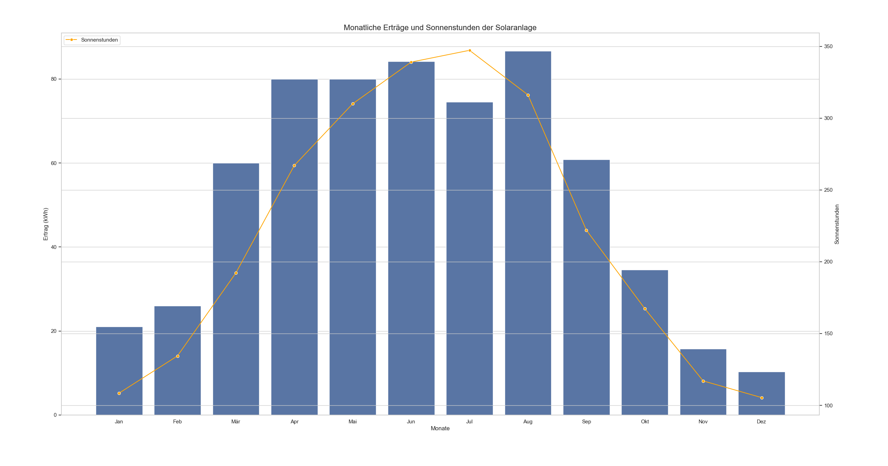

Seit diesem Jahr bin ich stolzer Besitzer eines Steckersolargerätes 🎉🥳
Seit diesem Jahr ist die Anmeldung auch vereinfacht und ein Schuko-Stecker
ist genug.

Es besteht aus:

* **Micro-Wechselrichter mit WiFi DTU**: [Hoymiles HMS-800W-2T](https://www.hoymiles.com/wp-content/uploads/2022/06/User-manual_HMS-6007008009001000-2T_EU_DE_V202302.pdf).
  Die DTU (Data Transmission Unit) dient als Kommunikationsschnittstelle
  zwischen den Wechselrichtern und einer zentralen Überwachungs- oder
  Managementplattform.
* **Module**: 2x 500 Wp (Watt-peak)
* **Montageset**: Entweder zur Aufständerung oder zur Montage an der
  Balkonbrüstung.

Interessant ist hier, dass ich 1 kWp habe, aber der Micro-Wechselrichter maximal
800 W liefert. Das ist bewusst so gewählt, weil die Panels in der Regel nicht
die volle Leistung bringen.

Ich habe es über [epp-solar.de](https://epp-solar.de/product/) gekauft
(sonst habe ich mit denen nichts zu tun).

## Anmeldung

Ich habe es im [Marktstammdatenregister](https://www.marktstammdatenregister.de/MaStR/)
angemeldet. Ein paar Monate später hat der Netzbetreiber sich gemeldet, wollte
ein paar Informationen, und hat dann meinen Ferraris-Zähler gegen einen
digitalen Zähler ausgetauscht.

Seit 2024 muss man das nur noch im Marktstammdatenregister anmelden.

## Ertrag



* Januar (geschätzt): 21 kWh
* Februar (geschätzt): 26 kWh
* März (geschätzt): 60 kWh
* April (geschätzt): 80 kWh
* Mai (geschätzt): 80 kWh
* Juni 2025: 84.17 kWh
* Juli 2025: 74.52 kWh
* August 2025: 86.64 kWh
* September 2025: 60.85 kWh
* Oktober 2025: 34.61 kWh
* November 2025: 15.79 kWh
* Dezember 2025: 10.27 kWh

Das Diagram habe ich mit Python erstellt. Die Anzahl der Sonnenstunden findet
man in [Klimatabellen](https://de.climate-data.org/europa/deutschland/bayern/muenchen-6426/).
Konkret variiert das natürlich von Jahr zu Jahr.

```python
# pip install seaborn matplotlib pandas
import seaborn as sns
import matplotlib.pyplot as plt
import pandas as pd

# Daten definieren
monate = [
    "Jan",
    "Feb",
    "Mär",
    "Apr",
    "Mai",
    "Jun",
    "Jul",
    "Aug",
    "Sep",
    "Okt",
    "Nov",
    "Dez",
]
ertraege = [21, 26, 60, 80, 80, 84.17, 74.52, 86.64, 60.85, 34.61, 15.79, 10.27]
sonnenstunden = [
    108.5,
    134.4,
    192.2,
    267,
    310,
    339,
    347.2,
    316.2,
    222,
    167.4,
    117,
    105.4,
]

# Daten in einen DataFrame umwandeln
data = pd.DataFrame(
    {"Monat": monate, "Ertrag (kWh)": ertraege, "Sonnenstunden": sonnenstunden}
)
sns.set_theme(style="whitegrid")
fig, ax1 = plt.subplots(figsize=(10, 6))

# Erste y-Achse: Erträge
sns.barplot(x="Monat", y="Ertrag (kWh)", data=data, ax=ax1)
ax1.set_ylabel("Ertrag (kWh)", fontsize=12)
ax1.set_xlabel("Monate", fontsize=12)
ax1.set_title("Monatliche Erträge und Sonnenstunden der Solaranlage", fontsize=16)

# Zweite y-Achse: Sonnenstunden
ax2 = ax1.twinx()
sns.lineplot(
    x="Monat",
    y="Sonnenstunden",
    data=data,
    ax=ax2,
    color="orange",
    marker="o",
    label="Sonnenstunden",
)
ax2.set_ylabel("Sonnenstunden", fontsize=12)

# Legende und Layout
ax2.legend(loc="upper left")
plt.tight_layout()
plt.show()
```

Ganz grob würde ich von $0.24 \cdot \text{kWp} \cdot \text{Sonnenstunden}$
bei meinem Standort und meiner Panel-Neigung ausgehen.

In Summe: 630 kWh pro Jahr bei 2626.3 Sonnenstunden mit 1 kWp.

## Wirtschaftlichkeit

* Strompreis (Arbeitspreis): 0.26 €/kWh
* Jahresertrag (geschätzt): 630 kWh, also 163.80 €

Das Gerät kostet inzwischen nur noch [370€](https://epp.solar/product/1000w-balkonkraftwerk-mit-hoymiles-hms-800w-2t-upgradefahiger-wifi-wechselrichter-5/),
die Aufständerung vielleicht nochmals 80€. In Summe also 450€. Das hätte man nach
drei Jahren wieder drin (Amortisation).

Geht man von 20 Jahren Lebensdauer aus, hätte man damit 2826€ eingenommen.


$$
\begin{align}
450\text{€} \cdot p^{20} &= 2826\text{€}\\
\Leftrightarrow p^{20} &= 6.28\\
\Leftrightarrow \log p &= \frac{\log 6.28}{20} \approx 0.0919\\
\Leftrightarrow p &\approx 1.096
\end{align}
$$

Wir hätten das Geld also zu einem Zins von 9.6% anlegen müssen um den selben
Gewinn zu machen. Allerdings ist das noch konservativ gerechnet. Man könnte das
gesparte Geld ja auch tatsächlich anlegen. Bei 5% pro Jahr wäre man dann nicht
bei 2826€ nach 20 Jahren, sondern bei 5416.20€. Das wäre ein Zinssatz von 13.2%.

Selbst hier sind wir noch konservativ:

* Die Strompreise steigen, was die Anlage profitabler macht
* Die Anlage hält ziemlich sicher mehr als 20 Jahre

## Weiteres

* Akku-Doktor:
    * [PVTool Rechner](https://www.akkudoktor.net/pvtool-rechner/)
    * [Microwechselrichter Liste](https://akkudoktor.net/pub/mikrowechselrichter-liste)
* [Wechselrichter: Test und Vergleich 2024](https://gruenes.haus/wechselrichter-test-vergleich/)
* Lidl und Netto besser nicht: https://www.youtube.com/watch?v=2fDy71J2E_M
* [Anker Solix](https://www.anker.com/eu-de/ankerpower/balkonkraftwerk-produkteinfuehrung) klang auch interessant. Einfach nur deshalb, weil Anker eine bekannte Marke ist.
