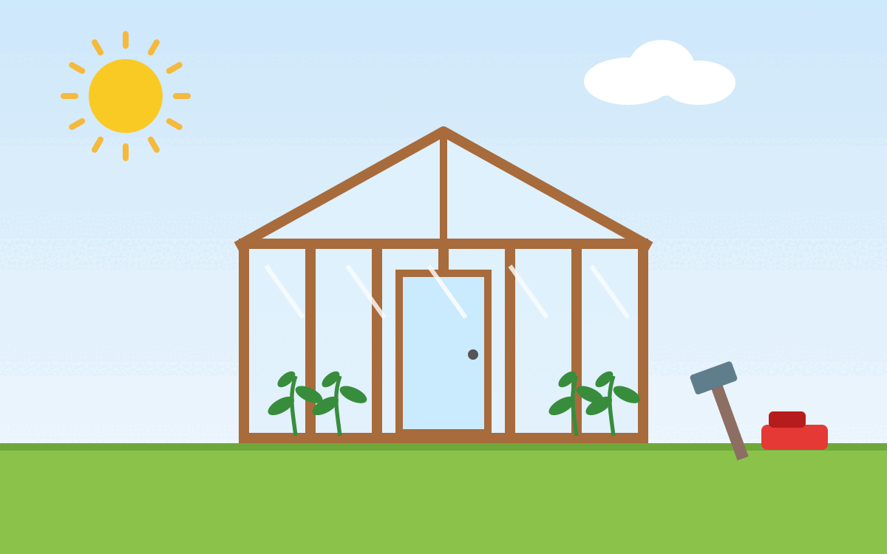

<figure class="wp-caption aligncenter img-thumbnail">
    
    <figcaption class="text-center">Mit Claude AI generierte Illustration: Ein selbstgebautes Gewächshaus aus Holzlatten und Gewächshausfolie</figcaption>
</figure>

## Material

* Gewächshausfolie
* Holzlatten
* Nägel
* Tacker
* Scharnier für Tür

## Werkzeuge

* Hammer
* Tacker
* Cutter-Messer

## Aufbau

1. Tür bauen
2. Wände bauen

https://www.youtube.com/watch?v=STZT3LitIYk
