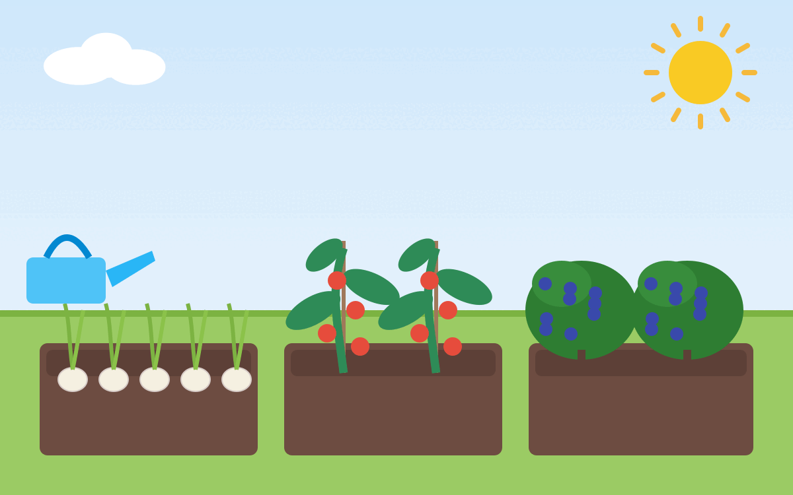

<figure class="wp-caption aligncenter img-thumbnail">
    
    <figcaption class="text-center">Mit Claude AI generierte Illustration: Beete mit Knoblauch, Tomaten und Heidelbeeren</figcaption>
</figure>

## Karotten

## Kartoffeln

## Knoblauch

* Standort: Sonnig
* Boden: Locker, humusreich, nicht sandig, keine Staunässe
* Pflanzzeit: 15. September bis 10. Oktober (Winterknoblauch) oder Januar/Februar (Sommerknoblauch)
* Erntezeitpunkt: ab Juli (Winterknoblauch) bzw. August (Sommerknoblauch);
  sobald sich das Laub braun verfärbt
* Saattiefe: 5cm
* Pflanzabstand: 10x20cm

Quellen:

* [meine-ernte.de](https://www.meine-ernte.de/pflanzen-a-z/gemuese/knoblauch/)

## Zwiebeln

* Standort: Sonnig, guter Wind
* Boden: -
* Pflanzzeit: März bis April
* Erntezeitpunkt: ab August, wenn das Laub austrocknet und einknickt
* Saattiefe: Bei der Steckzwiebel sollte der obere Teil der Zwiebel aus dem Boden schauen
* Pflanzabstand: 5-10 cm

Quellen:

* [meine-ernte.de](https://www.meine-ernte.de/pflanzen-a-z/gemuese/zwiebel/)

## Tomaten

* Standort: Sonnig, warm, wind- und regengeschützt
* Boden: Humus- und nährstoffreich
* Pflanzzeit: Vorziehen ab März, Auspflanzen nach den Eisheiligen (Mitte Mai)
* Erntezeitpunkt: Juli bis Oktober
* Saattiefe: 0,5-1 cm
* Gute Nachbarn: Knoblauch, Kohl, Kohlrabi, Salat
* Schlechte Nachbarn: Fenchel, Gurke, Kartoffeln, Erbsen

Quellen:

* [meine-ernte.de](https://www.meine-ernte.de/pflanzen-a-z/gemuese/tomate/)

## Salat

## Heidelbeeren

* Boden:
    * sauer, pH=4-5,5 (Moorbeet-Erde oder Rhododendron-Erde).
    * Deshalb auch besser im Topf (min. 30L, eher flacher; mit Loch im Boden, um Staunässe zu vermeiden) als im Beet
    * Rhododendron-Langzeitdünger
    * Rindenmulch (ca. 5cm) abdecken
* Anpflanzen: Gut angießen
* Düngen: Vinasse (?) Flüssig-Dünger
* Pflanzzeit: Herbst oder Frühjahr
* Ernte:
    * Juli bis September, je nach Sorte
    * dauert 5-8 Jahre, bis der Strauch voll ertragreich ist
    * im YouTube-Video ist von bis zu 17kg pro Pflanze die Rede; üblich sind eher 2-5kg
* Schädlinge:
    * Vögel: Mit Netz schützen
* Mischkulturpartner: Preiselbeeren
* Gießen:
    * Heidelbeeren vertragen keinen Kalk. Das Gießwasser sollte daher weich sein (max. 8°dH)
    * Bei kalkhaltigem Leitungswasser besser Regenwasser verwenden
* Pflege: In den ersten Jahren muss man nicht schneiden; ältere Sträucher (ab ca. 5 Jahren) sollte man auslichten, indem man alte Triebe entfernt
* Winter: Frosthart; kann man im Winter einfach draußen lassen
* Preis: [10€](https://www.globus-baumarkt.de/p/obststrauch-heidelbeere-2-l-container-0684801513/)

Quellen:

* Marie Diederich: [Heidelbeere Anbau-Guide: So erntest du 17 kg pro Pflanze](https://www.youtube.com/watch?v=KetHJTLnrEk&t=6s) auf YouTube, 31.10.2023.

## Brombeeren

## Johannisbeeren

* Pflege: Jedes Jahr schneiden

## Himbeeren

* Pflege: Jedes Jahr schneiden
