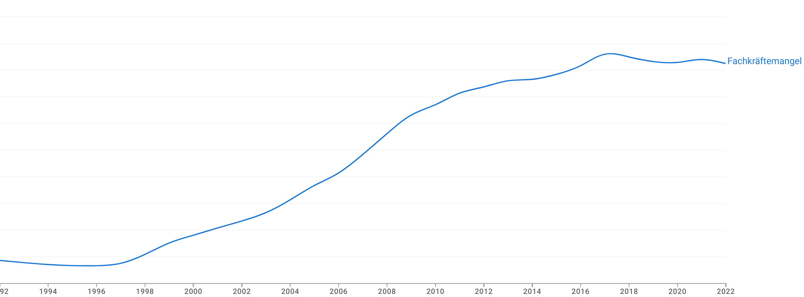

Seit Jahren schieben wir in der Politik die selben Themen vor uns her. Ich habe
duzende von politischen Ideen, aber in diesem Beitrag möchte ich nur die größten
Themen ansprechen.

## Arbeit- und Sozialpolitik

"Arbeit muss sich wieder lohnen" ist ein Kampfspruch rechter Politiker. Damit
wird impliziert, dass aktuell Leute finanziell schlechter gestellt sind wenn sie
"die soziale Hängematte" verlassen um zu Arbeiten.

Das ist Quatsch.

Leicht umformuliert sieht es allerdings anders aus: "Mehr zu arbeiten muss sich
äquivalent zur Mehrarbeit lohnen". Aufgrund wegfallender Sozialleistungen ist
das aktuell nicht der Fall.

Die Politik hat verschiedene Stellschrauben:

* **Regelbedarf im Bürgergeld**: Der Regelbedarf im Bürgergeld (ehemals Hartz
  IV) deckt die grundlegenden Lebenshaltungskosten, die für das tägliche Leben
  notwendig sind. Dazu gehören Lebensmittel, Kleidung, Körperpflege,
  Haushaltsstrom und kleinere Anschaffungen des täglichen Bedarfs. Der Betrag
  variiert je nach Lebenssituation (z.B. alleinstehend, verheiratet, Kinder im
  Haushalt). Der Gesetzgeber ist bei Vorliegen einer neuen Einkommens- und
  Verbrauchsstichprobe (EVS) des Statistischen Bundesamtes verpflichtet, die
  Höhe der Regelbedarfe neu zu ermitteln.<a class="footnote-ref" href="#fn:1">1</a> Ab 2024 beträgt der Regelbedarf für einen alleinstehenden Erwachsenen 564 EUR/Monat.<a class="footnote-ref" href="#fn:2">2</a> Dazu kommt
  [Wohngeld](https://de.wikipedia.org/wiki/Wohngeld) was auch eine
  Heizkostenkomponente enthält.
* **Mindestlohn**: Seit 2024 beträgt der Mindestlohn 12.41 EUR/Stunde (Brutto).<a class="footnote-ref" href="#fn:3">3</a> Bei 40h/Woche sind das 2159.34EUR/Monat (Brutto). Bei Steuerklasse 1 sind das ca. 1566€/Monat (Netto). Also das 2.77-fache vom Regelbedarf.

> **Forderung 1**: Der Mindestlohn soll an den Bürgergeld-Regelbedarf gekoppelt
> werden. Ich würde das 3-fache vom Regelbedarf eines Alleinstehenden als
> Mindest-Nettolohn für 40h/Woche vorschlagen. Beim aktuellen Regelbedarf von
> 564€/Monat und 174h/Monat wäre das 564€/Monat * 3 = 1692€/Monat (Netto).
> Bei Steuerklasse 1 wären das ca. [2373.66 €/Monat (Brutto)](https://www.nettolohn.de/rechner/netto-brutto-ergebnis) und somit 13.64€/Stunde (Brutto).

Nun gibt es die berechtigte Kritik, dass ein höheres Gehalt sich nicht so sehr
lohnt, weil im gleichen Verhältnis die Sozialleistungen (wie das Wohngeld) reduziert
werden.

> **Forderung 2**: Die Sozialleistungen sollen nicht mehr vom Einkommen
> abhängen. Berechtigt zum Bezug von Sozialleistungen ist, wer mindestens 16
> Jahre alt ist.

Nun kommt natürlich auch direkt die Frage "aber wie soll das finanziert werden?".

Der Steuerfreibetrag sollte so hoch sein, dass man damit ein einfaches Leben
führen kann. Also die Kosten für Miete, Essen, Kleidung, Strom, Wasser, Heizung,
Telefon, Internet, Transport und Haftpflichtversicherung decken. Bei der Miete
nehmen wir die durchschnittlichen Quadratmeterpreis in der teuersten Stadt bei
Neuvermietungen an. Das wären in München aktuell ca 23.79€/m². Wir rechnen mit
40m² pro Person. Das wären also 951.60€/Monat. Dazu kommen 200€ für Essen, 50€
für Kleidung, 30€ für Strom, 20€ für Wasser, 20€ für Heizung, 20€ für Internet.
Also alles in allem ca. 1290€/Monat, also ein Freibetrag von 15480€/Jahr.
Aktuell haben wir 11604 EUR/Jahr.<a class="footnote-ref" href="#fn:4">4</a>

Alternativ könnte man den Grenzwerkt zur Armutsgefährdung nehmen. Bei
Alleinlebenden war das 2023 bei 1.247€/Monat oder 14.964€/Jahr.

Die Logik dahinter: Wer gerade so über die Runden kommt, bezahlt keine Steuern.

Dannach sollten zwei Steuerbereiche kommen:

* 0% Einkommenssteuer für Einkommen bis zum Grundbedarf (ca. 15k€/Jahr)
* x% Einkommenssteuer für Einommen bis ca. 10xGrundbedarf (ca. 155k €/Jahr)
* 3x% Einkommenssteuer für Einkommen über 10xGrundbedarf

x soll so gewählt werden, dass die Steuereinnahmen die Ausgaben decken. Es soll
außerdem keine enormen Schwankungen auf kurze Sicht geben.

> **Forderung 3**: Der Freibetrag wird jährlich angepasst, sodass Menschen mit
> Armutsgefährdung keine Einkommenssteuer zahlen müssen. Das statistische
> Bundesamt berechnet diese Grenze.

Für viele zentralen Dienstleistung wie die Miete einer Wohnung oder das Eröffnen
eines Bankkontos ist es notwendig, dass man sich ausweisen kann - manchmal
zwingend mit einem deutschen Ausweisdokument.

Um hier die Hürde niedriger zu machen, sollte Deutschland auch für
nicht-deutsche Menschen ein Ausweisdokument einführen. Dieses Dokument sollte
jeder Mensch beantragen können, unabhängig von Staatsangehörigkeit und Wohnsitz.
Dabei sollten biometrische Marker wie die Fingerabdrücke und ein biometrisches
Foto verwendet werden um sicherzustellen, dass es keine Doppelanträge gibt.

> **Forderung 4**: Einführung eines biometrischen Ausweisdokuments für alle
> Menschen. Dieses Dokument speichert den Namen, das Geburtsdatum, sowie die
> Fingerabdrücke und ein biometrisches Foto.

## Wohnen

Wohnraummangel und unbezahlbare Mieten sind in den großen Städten seit vielen
Jahren ein Dauerthema. Der sinkende Bestand an Sozialwohnungen und die steigenden
Einwohnerzahlen bei gleichzeitig stagnierendem Neubau führen zu einer immer
größeren Verdrängung von Menschen mit geringem Einkommen aus den Innenstädten.

> **Forderung 4**: Der Bund sollte jeder Stadt Geld zum Bau von
> Studentenwohnheimen geben; vgl. [Wohnungsmangel](https://martin-thoma.com/wohnungsmangel)

## Rente

TODO

## Gesundheit

Der Bedarf an Pflegekräften steigt bis zum Jahr 2049 [...] auf 2.15 Millionen.
Laut Pflegekräftevorausberechnung liegt die erwartete Zahl an Pflegekräften im
Jahr 2049 zwischen 280000 und 690000 unter dem erwarteten Bedarf.<a class="footnote-ref" href="#fn:5">5</a> Das umfasst sowohl
Kranken- als auch Altenpflege. [Es fehlen vorraussichtlich im]
Projektionszeitraum 2022 bis 2040 jährlich rund 2.500 Köpfe (kumuliert rund
50.000).<a class="footnote-ref" href="#fn:6">6</a>

Es sollte also höchste Priorität haben, dass wir weniger Patienten bekommen.
Kreislauferkrankungen waren 2021 der häufigste Grund für Krankenhausaufenthalte
in NRW.<a class="footnote-ref" href="#fn:7">7</a>

In Deutschland sind insgesamt 53.5 % der Bevölkerung (46.6% der Frauen und 60.5%
der Männer) von Überge- wicht (einschließlich Adipositas) betroffen. Bei 19.0%
der Erwachsenen liegt eine Adipositas vor.<a
class="footnote-ref" href="#fn:8">8</a>

> **Forderung 5**: Werbung für Alkohol, Tabak, und Lebensmittel mit hohem Zucker-
> oder Fettgehalt soll verboten werden.

> **Forderung 6**: Es soll eine Steuer auf Zucker eingeführt werden, um
> Lebensmittelhersteller zu motivieren, weniger Zucker zu verwenden.

In Schweden hat das staatliche Unternehmen [Systembolaget](https://de.wikipedia.org/wiki/Systembolaget)
das Monopol auf Alkohol mit mehr als 3,5 Prozent. Dänemark, Norwegen, und
Schweden erheben 25% Mehrwertsteuer auf Alkohol. Insgesamt pro 0,7L-Flasche:<a class="footnote-ref" href="#fn:14">14</a>

* mit 15% vol:
  * 5.75€ Finnland
  * 4.76€ Schweden
  * 1.37€ Deutschland
* mit 32% vol:
  * 12.28€ Finnland
  * 10.16€ Schweden
  * 2.92€ Deutschland
* mit 38% vol:
  * 14.58€ Finnland
  * 12.07€ Schweden
  * 3.47€ Deutschland

Schädlicher Alkoholkonsums hat 2022 Kosten in Höhe von 57.04 Mrd. EUR verursacht.<a class="footnote-ref" href="#fn:15">15</a>
Demgegenüber stehen Einnahmen aus Alkoholsteuern in Höhe von 2.19 Mrd. EUR.<a class="footnote-ref" href="#fn:15">16</a>

> **Forderung 7**: AlkStG §2 Abs. 1 wird von 1303 €/hl reinen Alkohols auf 3000
> erhöht.

> **Forderung 8**: Spezialgeschäfte für Alkohol und Tabakwaren. Diese dürfen
dann nur Alkohl und Tabakwaren verkaufen - keine Lebensmittel, keine
Zeitschriften. Es soll keine Werbung für diese Geschäfte geben, keine
Zigarettenautomaten, kein Alkohol im Supermarkt.

Unser System aus 95 gesetzlichen Krankenkassen (Stand 2024) ist ineffizient.<a class="footnote-ref" href="#fn:17">17</a> Wir leisten uns hier 95 mal die
gleichen Strukturen. Das ist ineffizient und teuer.

> **Forderung 9**: Schrittweise Überführung der gesetzlichen Krankenkassen eine
> einzige. Die kleinsten 10 Krankenkassen nach Mitgliederanzahl sollten jedes
> Jahr aus dem Gesundheitsfonds ausgeschlossen werden. Neugründungen von
> gesetzlichen Krankenkassen sollten verboten werden. Sobald es nur noch eine
> Krankenkasse gibt, kann der Gesundheitsfonds abgeschafft werden und das Geld
> direkt an die Krankenkasse gehen.

## Klima und Umwelt

Der Klimawandel hat massive auswirkungen auf unser Leben - sei es durch
Starkregen, Dürren, Hitzewellen oder Stürme. Wir wissen seit 1988 gesichert, dass
der menschengemachte Klimawandel ein Problem ist. 2015 haben wir eine
Begrenzung auf 1.5°C im Pariser Klimaabkommen festgelegt.

Dieses Ziel werden wir verfehlen.

Weil wir so lange zu wenig gemacht haben, müssen nun drastischere Maßnahmen
ergriffen werden. Das bedeutet:

> **Forderung 7**: Innerhalb von 3 Jahren ein Neuzulassungsverbot für
> Verbrenner. Die einzige Außnahme sollten Rettungsfahrzeuge und Traktoren sein,
> die aktuell noch keine Elektroalternativen haben.

Auch im Heizungssektor muss etwas geschehen:

> **Forderung 8**: Innerhalb von 3 Jahren ein Verbot vom Verkauf und Einbau
> neuer Verbrennungsheizungen. Das beinhaltet Brenner und Tanks. Einfache
> Reparaturarbeiten sollen beliebig lange möglich sein.

Da wir so lange gewartet haben, müssen wir nun Maßnahmen zur bekämpfung der
Klimawandelfolgen treffen:

> **Forderung 9**: Förderung von städtischen Begrünungsmaßnahmen, von
Klimaanlagen für Krankenhäuser/Pflegeeinrichtungen/Schulen/Kindergärten, von
Starkregenrückhaltebecken, von Flußrenaturierungen, von Deichbau.

Seit langem überfällig:

> **Forderung 10**: Einnahmen aus CO2-Steuer sollen gleichmäßig auf alle
> umverteilt werden. Der CO2-Preis soll massiv und berechenbar steigen. Beim
> verkauf von Verbrennern soll sofort diese steigerung auf der Rechnung/dem
> Angebot deutlich sichtbar stehen.

## Politik

Im Moment wird die eigene Stimme irrelevant, wenn die gewählte Partei nicht in
den Bundestag kommt. Das bedeutet, dass Menschen strategisch wählen müssen.

### Wahlsystem

Bei der Bundestagswahl 2021 haben 8.7% der Wähler:innen ihre Stimme verloren,
weil sie für kleine Parteien gestimmt haben. Hätte die Linke kein Direktmandat
erhalte, wären es 13.6% gewesen.

> **Forderung 11**: Einführung einer Ersatzstimmer für die Zweitstimme.

Anstelle von einem Kreuz für die Zweitstimme sollten wir eine Ersatzstimme
erlauben. Diese Ersatzstimme wird nur dann gezählt, wenn die Partei der
Zweitstimme nicht in den Bundestag kommt. Damit können wähler in der Zweitstimme
eine große Partei wählen, während sie die Erststimme an eine Partei geben, die
ihre Interessen besser vertritt.

### Abgeordnetenbezüge

> **Forderung 12**: Abgeordnete dürfen während ihrer Amtszeit keine anderen Einkünfte haben.

Ein Bundestagsabgeordneter zu sein ist ein Vollzeitjob, wenn man es richtig macht.
Die Abgeordneten sollen ein ordentliches Gehalt bekommen, aber eben auch ihre
volle Energie in die Abgeordnetentätigkeit stecken. Das bedeutet, dass sie keine
Nebenjobs haben sollten: Keine bezahlten Vorträge, keine Mandanten, keine
Aufsichtsratsposten, keine Firmenleitungen.

> **Forderung 13**: Übergangsgeld nur so lange wie nötig.

Abgeordnete bekommen nach ihrer Amtszeit ein [Übergangsgeld](https://de.wikipedia.org/wiki/%C3%9Cbergangsgeld#%C3%9Cbergangsgeld_f%C3%BCr_Abgeordnete). Diese sollten
sie nur erhalten, solange sie keine anderen Einkünfte haben.

## Wohlstand

Unsere Demokratie funktioniert besser, wenn es den Leuten wirtschaftlich gut
geht. Unsere Staat hat mehr Handlungsspielraum mit mehr Geld. Wie bekommen wir
also größeren Wohlstand?

Produktivität.

Wir müssen mehr Güter und Dienstleistungen produzieren, die die Menschen wollen.
Konkret kann ich mir folgendes vorstellen:

1. **Bildung**: Es fallen regelmäßig Lehrer aus und Kinder verpassen zuhause
   Unterricht, weil sie krank sind. Wir sollten jede vorgesehene
   Unterrichtseinheit einmalig aufnehmen und frei im Internet zur Verfügung
   stellen. Selbiges gilt für Unterrichtsmaterialien. Das würde erst einmal
   einige Lehrerstunden kosten, aber mittel- und langfristig viel Geld sparen
   das wir aktuell an Verlage zahlen. Es würde auch die Möglichkeit schaffen,
   dass sich Menschen selbst weiterbilden können.
2. **Altenpflege**: Wir haben einen Pflegekräftemangel. Wir sollten die
   technischen Möglichkeiten nutzen, um Pflegekräfte zu entlasten und somit mehr
   Patienten betreuen zu können. Durch Videoüberwachung und AI-Tools könnte man
   Demezpatienten rund um die Uhr versorgen, ohne dass ein Pfleger 24/7 im Raum
   sein muss.
3. **Justiz und Strafverfolgung**:
   * **Legalisierung von Drogenkonsum**: Mehr als 900.000 offene Verfahren lagen
     2023 bei der Staatsanwaltschaft.<a class="footnote-ref"
     href="#fn:9">9</a> Im Jahr 2023 wurden 173.945 Fälle von allgemeinen
     Verstößen mit Cannabis und Zubereitungen in Deutschland polizeilich
     erfasst. <a class="footnote-ref"
     href="#fn:10">10</a> Das sind Fälle die dank der Teillegalisierung
     hoffentlich nicht mehr unsere Polizei und Justiz belasten. Analog zu der
     Legalisierung von Cannabiskonsum und -besitz für den Eigenbedarf sollten
     alle Drogen legalisiert werden. Der Verkauf und die Produktion sind ein
     anderes Thema, aber niemandem ist geholfen wenn Süchtige kriminalisiert
     werden.
   * **Kostenloses Deutschlandticket**: Jährlich sitzen etwa 7.000 Schwarzfahrer
     im Gefängnis, weil sie die Geldstrafe fürs Schwarzfahren nicht zahlen
     können.<a class="footnote-ref"
     href="#fn:11">11</a> 230.000 Menschen werden jährlich wegen
     Schwarzfahrens angezeigt. Stattdessen sollte ÖPNV komplett kostenlos sein.
     Das Deutschlandticket hat ca. 6.5 Mrd EUR im Jahr für die Ticketkosten
     eingebracht. Und man rechnet mit ca. 4.2 Mrd EUR an Mehrkosten. Das
     bedeutet für umgerechnet 1.31€ pro Person und Monat kann man den ÖPNV in
     Deutschland komplett kostenlos machen. Keine kosten mehr für
     Ticket-Automaten, keine Kontrolleure, keine Strafverfolgung. Allein die
     tatsache, dass wir nicht mehr 7000 arme Schwarzfahrer im Gefängnis haben,
     spart jährlich 200 Millionen EUR.<a class="footnote-ref"
     href="#fn:13">13</a>
   * **Bundesfinanzamt**: Cum-Ex-Geschäfte haben den Staat Milliarden gekostet
     und durch deren Verfolgung wurden hunderte Millionen in die Staatskasse
     zurückgeführt. Die Chefermittlerin Anne Brorhilker hat 2023 den Job
     hingeschmissen, weil sie nicht genug Personal hatte.<a
     class="footnote-ref" href="#fn:12">12</a> Sie schlägt eine
     bundesweite zentrale Behörde zur Bekämpfung von Finanzkriminalität aus, die
     auch Steuervergehen verfolge. Aktuell haben wir nur die lokalen Finanzämter
     sowie die Staatsanwaltschaften. Die [Bürgerbewegung Finanzwende](https://de.wikipedia.org/wiki/B%C3%BCrgerbewegung_Finanzwende) hat hier sicherlich weitere gute Ideen.

## Justiz

> **Forderung 12:** Schaffung einer Polizei- und Justizunabhängigen Aufsichtsbehörde.
> Diese soll nicht dem Bundesinnenministerium unterstellt sein, sondern dem
> Bundesministerium der Justiz. Ein Beispiel für eine solche Behörde wäre in
> England das [Independent Office for Police Conduct](https://en.wikipedia.org/wiki/Independent_Office_for_Police_Conduct).

## Staatshaushalt

2023 wurden ca. 45.8% des Steueraufkommens durch die Einkommenssteuer erziehlt.
Weitere 32.0% durch die Umsatzsteuer, 7.9% durch die Gewerbesteuer, 3.9% durch
die Energiesteuer.

## Einzelnachweise

 [^1] Bundesministerium für Arbeit und Soziales: [Methodik der Regelbedarfsermittlung – Fragen und Antworten](https://www.bmas.de/DE/Soziales/Sozialhilfe/faq-sozialhilfe-regelbedarfsermittlung.html), abgerufen am 7. September 2024.
 [^2] Bundesregierung: [Regelsätze 2024 deutlich gestiegen](https://www.bundesregierung.de/breg-de/themen/arbeit-und-soziales/regelsaetze-erhoehung-2222924), abgerufen am 7. September 2024.
 [^3] Bundesregierung: [Mindestlohn zum 1. Januar 2024 gestiegen](https://www.bundesregierung.de/breg-de/themen/arbeit-und-soziales/mindestlohn-steigt-2223632), abgerufen am 7. September 2024.
 [^4] Bundesfinanzministerium: [Sie haben was gut. Weniger Steuern.](https://www.bundesfinanzministerium.de/Content/DE/Standardartikel/Themen/Steuern/Mehr-Ausgleich/mehr-ausgleich.html), abgerufen am 7. September 2024.
 [^5] Statistisches Bundesamt: [Pressemitteilung Nr. 033](https://www.destatis.de/DE/Presse/Pressemitteilungen/2024/01/PD24_033_23_12.html) vom 24. Januar 2024.
 [^6] Ärzte-Zeitung: [Zi: Bis 2040 fehlen ambulant jedes Jahr 2.500 Ärzte](https://www.aerztezeitung.de/Politik/Zi-Bis-2040-fehlen-ambulant-jedes-Jahr-2500-Aerzte--447152.html), 15. Februar 2024.
 [^7] Landesbetrieb IT.NRW: [NRW: Kreislauferkrankungen waren 2021 der häufigste Grund für Krankenhausaufenthalte](https://www.it.nrw/nrw-kreislauferkrankungen-waren-2021-der-haeufigste-grund-fuer-krankenhausaufenthalte-18375),  11. November 2022.
 [^8] Anja Schienkiewitz, Ronny Kuhnert, Miriam Blume, Gert B.M. Mensink: [Übergewicht und Adipositas bei Erwachsenen in Deutschland – Ergebnisse der Studie GEDA 2019/2020-EHIS](https://www.rki.de/DE/Content/Gesundheitsmonitoring/Gesundheitsberichterstattung/GBEDownloadsJ/FactSheets/JHealthMonit_2022_03_Uebergewicht_GEDA_2019_2020.pdf) in Journal of Health Monitoring, 2022.
 [^9] Tagesschau: [Zahl unerledigter Verfahren steigt weiter](https://www.tagesschau.de/inland/gesellschaft/strafverfahren-justiz-100.html), 2024.
 [^10] statista: [Anzahl der polizeilich erfassten Fälle allgemeiner Verstöße mit Cannabis und Zubereitungen in Deutschland von 2013 bis 2023](https://de.statista.com/statistik/daten/studie/702178/umfrage/polizeilich-erfasste-faelle-allgemeiner-verstoesse-mit-cannabis-in-deutschland/), 22.04.2024.
 [^11] Eva-Lena Lörzer: [Wer zu arm ist, kommt in den Knast](https://taz.de/Haftstrafen-fuer-Schwarzfahren/!5529577/) in der taz, 2018.
 [^12] Tagesschau: [Chefermittlerin kündigt überraschend und übt Kritik](https://www.tagesschau.de/investigativ/ndr-wdr/cum-ex-aufarbeitung-100.html), 22.04.2024.
 [^13] Tagesschau: [Staat zahlt Millionen für Schwarzfahrer im Knast](https://www.tagesschau.de/inland/ersatzfreiheitsstrafen-101.html), 11.01.2018.
 [^14] Statista: [Steuersätze für Spirituosen in der Europäischen Union nach Ländern im Jahr 2024](https://de.statista.com/statistik/daten/studie/166425/umfrage/steuersaetze-fuer-spirituosen/), abgerufen am 9. September 2024.
 [^15] Deutsches Krebsforschungszentrum: [Alkoholatlas 2022](https://www.dkfz.de/de/tabakkontrolle/download/Publikationen/sonstVeroeffentlichungen/Alkoholatlas-Deutschland-2022_Auf-einen-Blick.pdf)
 [^16] Statista: [Steuereinnahmen aus der Alkoholsteuer (bis 2017 Branntweinsteuer) in Deutschland von 2010 bis 2023](https://de.statista.com/statistik/daten/studie/77503/umfrage/einnahmen-aus-branntweinsteuer-in-deutschland-seit-1960/), veröffentlicht am 16.08.2024.
 [^17] GKV-Spitzenverband: [Die gesetzlichen Krankenkassen](https://www.gkv-spitzenverband.de/krankenversicherung/kv_grundprinzipien/alle_gesetzlichen_krankenkassen/alle_gesetzlichen_krankenkassen.), 01.01.2024.
