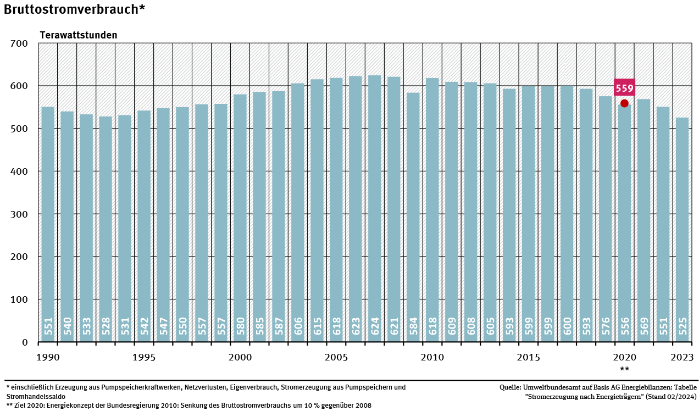

Deutschland hat in den letzten Jahrzehnten beeindruckende Fortschritte bei der
Energiewende gemacht. Doch wie steht es aktuell um die Stromversorgung, und wie
kann der Weg in eine klimaneutrale Zukunft gelingen?

Ich fokussiere mich in diesem Artikel auf die Stromversorgung in Deutschland.
Strom ist nur ein Teil der Energieversorgung. Die anderen Teile sind
nicht-elektrifizierte Wärme (Heizöl und Gas) sowie Verkehr (Benzin und Diesel).

## Stromverbrauch: Weniger, aber bald wieder mehr

Der Bruttostromverbrauch in Deutschland ist seit seinem Höchststand 2007
kontinuierlich gesunken. 2024 lag er bei rund 512 TWh ([Quelle](https://de.statista.com/statistik/daten/studie/256942/umfrage/bruttostromverbrauch-in-deutschland/)), was etwa 82 % des
Verbrauchs von 2007 entspricht. Allerdings wird der Strombedarf durch die
Elektrifizierung von Verkehr und Wärme in den kommenden Jahren wieder steigen.

Schon heute zeigt sich die Bedeutung der Effizienz: Der Nettostromverbrauch lag
2023 bei 467 TWh ([Quelle](https://de.statista.com/statistik/daten/studie/164149/umfrage/netto-stromverbrauch-in-deutschland-seit-1999/)) – etwa 11 % des erzeugten Stroms gehen durch Netzverluste
verloren. Diese Differenz unterstreicht die Notwendigkeit, unser Stromnetz zu
optimieren und den Verbrauch gezielt zu steuern.

## Erzeugung: Erneuerbare Energien auf dem Vormarsch

<figure class="wp-caption aligncenter img-thumbnail">
    
    <figcaption class="text-center">Strommix 2024: Man sieht, dass Windkraft+Kohle+Erdgas+PV fast alles decken. Biomasse und Wasserkraft spielt noch eine gewisse Rolle. Komplett unwichtig sind Öl, Müll, und Geothermie (<a href="https://www.energy-charts.info/charts/energy_pie/chart.htm?l=de&c=DE&interval=year&show_labels=1&legendItems=0wh&year=2024">Datenquelle</a>)</figcaption>
</figure>

Im zeitlichen Verlauf sieht man:

* Atomkraft wird immer unwichtiger, weil das
  [Kabinett Merkel II](https://de.wikipedia.org/wiki/Kabinett_Merkel_II)
  (CDU/CSU) 2011 den [Atomausstieg](https://de.wikipedia.org/wiki/Atomkonsens)
  beschlossen hat.
* Die Erneuerbaren Energien steigen stark an, die fossilen Energieträger
  sinken.
* Wasserkraft und Biomasse (Hackschnitzel, Biogas) sind relativ konstant auf
  niedrigem Niveau. Geothermie spielt keine Rolle.

Das Fraunhofer Institut für Solare Energiesysteme (ISE) hat eine [Live-Visualisierung](https://www.energy-charts.info/charts/energy/chart.htm?l=de&c=DE&stacking=stacked_absolute&timeslider=1&year=-1&interval=year&legendItems=lz0zczk) der Stromerzeugung in Deutschland

<figure class="wp-caption aligncenter img-thumbnail">
    
    <figcaption class="text-center"><a href="https://www.energy-charts.info/charts/energy/chart.htm?l=de&c=DE&stacking=stacked_absolute&timeslider=1&year=-1&interval=year&legendItems=lz0zczk">Datenquelle</a></figcaption>
</figure>

## Abhängigkeiten minimieren

Die Abhängigkeit von Energieimporten bleibt eine Herausforderung. Besonders bei
Kohle und Erdgas sind wir weiterhin auf Lieferungen aus dem Ausland angewiesen.
Der Umstieg auf erneuerbare Energien reduziert diese Abhängigkeit drastisch.
Jede neue Solaranlage und jedes neue Windrad bedeutet ein Stück mehr
Unabhängigkeit – ökonomisch wie geopolitisch.

* Kernkraft: Wir mussten Uran importieren. [Großteils aus Russland](https://www.tagesschau.de/inland/regional/niedersachsen/ndr-deutlich-mehr-uran-aus-russland-nach-lingen-geliefert-100.html)
* Kohle: Deutschland hat 2023 [102 Millionen Tonnen Braunkohle](https://www.destatis.de/Europa/DE/Thema/Umwelt-Energie/Braunkohle.html) abgebaut. Wir haben [27 Millionen Tonnen Steinkohle importiert](https://www.destatis.de/DE/Themen/Branchen-Unternehmen/Energie/Verwendung/Tabellen/einfuhr-steinkohle-zeitreihe.html). Die größten Massengutfrachter können rund 400.000 Tonnen Ladung befördern ([Quelle](https://www.machmeer.de/infos-fuer-azubis/schiffe/massengutfrachter)), also ca. 70 große Frachter. Wir sind seit 2018 mit der [Schließung vom Bergwerk Prosper-Haniel](https://de.wikipedia.org/wiki/Bergwerk_Prosper-Haniel) von Importen abhängig. Der Grund ist, dass die deutsche Steinkohle nicht mehr wirtschaftlich abgebaut werden kann. Es ist einfach günstiger die Kohle in Australien abzubauen und nach Deutschland zu transportieren. Verrückt.
* Erdgas: Deutschland hat 2023 [2 Millionen Terajoule Erdgas importiert](https://www.destatis.de/DE/Themen/Wirtschaft/Aussenhandel/Tabellen/erdgas-jaehrlich.html). Seit 2023 kommt ein Großteil aus Norwegen, Niederlande, und Belgien ([Quelle](https://de.statista.com/infografik/30706/taegliche-gasimporte-nach-deutschland-nach-herkunft/))

 Mehr Infografiken finden Sie bei <a href="https://de.statista.com/infografik/">Statista</a>

## Strompreise: Stabilisierung nach der Krise

Die Strompreise für Haushalte und Industrie haben sich nach dem Höhepunkt der
[globalen Energiekrise
2022/2023](https://chatgpt.com/c/67824ea0-cb38-8006-827a-c865803b238f) wieder
normalisiert. Deutschland hat bewiesen, dass es resilient ist. Mit gezielten
Investitionen in die Energiewende können langfristig die Kosten weiter gesenkt
werden – durch den Wegfall fossiler Brennstoffimporte und effizientere
Technologien.

Das kann man in den Daten sehen, allerdings muss man einiges an Kontext
beachten. Es gibt leider nicht "den" Verbraucherstrompreis. Wie viel man pro
Kilowattstunde bezahlt ist abhängig vom Wohnort, dem Anbieter, und dem
Jahresverbrauch, da die Grundgebühr eingerechnet werden muss.

Die Grundversorger sind meist deutlich teurer als die günstigsten Anbieter.
Dennoch wechseln viele Menschen nicht den Anbieter. Ich kann nicht
nachvollziehen warum.

[Laut Verivox](https://www.ndr.de/nachrichten/info/Strompreis-aktuell-So-viel-kosten-die-Kilowattstunden,strompreis182.html) haben Neukunden folgenden preis pro Kilowattstunde im durchschnitt
zu den foglenden Stichtagen bezahlt:

* 31.12.2021: 47.5 ct/kWh
* 01.02.2022: 41.4 ct/kWh
* 03.03.2022: 38.2 ct/kWh
* 16.03.2022 - 27.06.2022: von 49.0 ct/kWh auf 36.1 ct/kWh
* 29.06.2022 - 29.09.2022: von 36.1 ct/kWh auf 70.1 ct/kWh
* 30.09.2022 - 19.05.2023: von 70.1 ct/kWh auf 23.1 ct/kWh
* 20.05.2023 - heute: 23.1 ct/kWh - 30.0 ct/kWh

Also im großen und ganzen kann man sagen, dass der Ukraine-Krieg die Strompreise
in die Höhe getrieben hat, aber dass die Strompreise inzwischen wieder auf dem
Niveau von 2021 sind. Die Kriese wurde also überwunden.

Die aktuelle [Zusammensetzung des Strompreises](https://www.verivox.de/strom/themen/strompreiszusammensetzung/) sieht wie folgt aus:

* 42.5% Beschaffung, Vertrieb, Marge
* 28% [Netznutzungsentgelt](https://de.wikipedia.org/wiki/Netznutzungsentgelt): +11,62 ct/kWh
* 16% [Umsatzsteuer](https://de.wikipedia.org/wiki/Umsatzsteuergesetz_(Deutschland)#Umsatzsteuers%C3%A4tze): +19%
* 5.5% [Stromsteuer](https://de.wikipedia.org/wiki/Stromsteuer): +2,05 ct/kWh
* 4.5% [Konzessionsabgabe](https://de.wikipedia.org/wiki/Konzessionsabgabe#Konzessionsabgaben_f%C3%BCr_Strom): +1,32 ct/kWh

## Mythen

### Deutschland hat zu wenig Strom und muss ihn importieren

Wir importieren Strom, wenn es günster ist als ihn selbst zu erzeugen. So
funktioniert Marktwirtschaft. Wenn man sich über Abhängigkeiten sorgen macht,
dann sollte man möglichst schnell auf erneuerbare Energien umsteigen. Bei fossilen
Energieträgern sowie Kernkraft werden wir immer auf Importe angewiesen sein.

[Wir haben 2022 Strom nach Frankreich exportiert](https://www.br.de/nachrichten/deutschland-welt/faktenfuchs-deutschland-bettelte-2022-nicht-um-atomstrom,UWArHgh).

2024 haben wir im ersten Halbjar gleichzeitig aus Frankreich / Norwegen / Dänemark
Strom importiert und nach Polen / Luxemburg / Tschechien exportiert (siehe [Stromaustauschsaldo](https://de.statista.com/statistik/daten/studie/180862/umfrage/stromaustauschsaldo-deutschlands-nach-partnerlaendern/)).

### Das Stromnetz ist nicht stabil

> "2023 mussten Haushalte in Deutschland im Durchschnitt knapp 13 Minuten Minuten ohne Strom auskommen. Das ist etwa so viel wie im Schnitt der vergangenen zehn Jahre. Auch im Vergleich mit den Nachbarländern gehört das deutsche Stromnetz damit der Bundesnetzagentur zufolge [zu den zuverlässigsten](https://www.bundesnetzagentur.de/SharedDocs/Pressemitteilungen/DE/2024/20241111_SAIDI_Strom.html?nn=659670). "

Siehe auch:

* bundesregierung.de: [Stromausfall – eine Risikoanalyse](https://www.bundesregierung.de/breg-de/aktuelles/stromausfall-blackout-2129818), 03.01.2025
* Wikipedia: [System Average Interruption Duration Index](https://de.wikipedia.org/wiki/System_Average_Interruption_Duration_Index)
* Wikipedia: [Liste historischer Stromausfälle](https://de.wikipedia.org/wiki/Liste_historischer_Stromausf%C3%A4lle)
* Statista: [Länge der Versorgungsunterbrechung je Stromverbraucher in Deutschland in den Jahren 2006 bis 2023](https://de.statista.com/statistik/daten/studie/241414/umfrage/stromversorgungsunterbrechungen-in-deutschland/)

### Mit Atomkraft wäre es günstiger

Atomkraftwerke haben enorme Baukosten sowie sehr hohe Kosten für die Entsorgung
des radioaktiven Mülls. Wenn man diese Kosten ignoriert sieht der Atom-Strom
günstig aus.

Die großen [AKWs in Deutschland](https://de.wikipedia.org/wiki/Liste_der_Kernreaktoren_in_Deutschland)
haben in ihrer Lebensdauer von etwa 35 Jahren etwa 350 TWh Strom erzeugt. Schaut man sich in Europa mal neue AKWs an, kann man mal ausrechnen wie hoch der Strompreis nur wegen der Baukosten sein müsste (ohne Betrieb, ohne Wartung, ohne Entsorgungskosten, ohne Personal, ohne Brennstoffkosten, ohne Rückbaukosten, ohne Steuern, ohne Netzabgaben, ohne Gewinnmarge):

* [Hinkley Point C (Großbritannien)](https://de.wikipedia.org/wiki/Kernkraftwerk_Hinkley_Point): 51.3 Mrd (geplant waren 21.5 Mrd EUR), Bauzeit von 16 Jahren und noch ist es nicht fertig  ➜ 14.7 ct/kWh
* [Flamanville 3 (Frankreich)](https://de.wikipedia.org/wiki/Kernkraftwerk_Flamanville): 12 Mrd EUR (geplant waren 3.3 Mrd EUR), Bauzeit von 20 Jahren ([Quelle](https://www.fr.de/panorama/frankreich-nimmt-neues-atomkraftwerk-in-betrieb-fuer-12-milliarden-euro-zr-92920756.html)) ➜ 3.4 ct/kWh
* [Olkiluoto 3 (Finnland)](https://de.wikipedia.org/wiki/Kernkraftwerk_Olkiluoto): 11 Mrd EUR (geplant waren 3 Mrd EUR), Bauzeit von 18 Jahren ➜ 3.1 ct/kWh

Siehe auch:

* BMUV: [Bericht über Kosten und Finanzierung der Entsorgung bestrahlter Brennelemente und radioaktiver Abfälle](https://www.bmuv.de/fileadmin/Daten_BMU/Download_PDF/Nukleare_Sicherheit/abfallentsorgung_kosten_finanzierung_bf.pdf), 2015.
* Matthias Janson: [Folgekosten von Atomstrom am höchsten](https://de.statista.com/infografik/27231/kosten-der-stromerzeugung-in-deutschland-nach-energietraeger/) auf statista.com, 2022.
* BUND: [Die wahren Kosten von Atomkraft](https://www.bund-sh.de/energie/atomkraft/hintergrund/die-wahren-kosten-von-atomkraft/)
* IG Metall: [Das Märchen vom billigen Atomstrom](https://www.igmetall.de/politik-und-gesellschaft/umwelt-und-energie/das-maerchen-vom-billigen-atomstrom), 2011.

#### Deutscher Strom ist der teuerste Europas

Das stimmt so nicht ([Liste der Länder nach Strompreis](https://de.wikipedia.org/wiki/Liste_der_L%C3%A4nder_nach_Strompreis)):

* 2023 war Deutschland mit 41ct/kWh auf Platz 5, hinter Italien (56ct/kWh),
  Großbritannien (46ct/kWh), Irland (43ct/kWh), und Belgien (42ct/kWh).
* 2024 war Deutschland für Industriekunden auf Platz 5 mit 19.76ct/kWh nach Irland (25.43ct/kWh), Kroatien (21.69ct/kWh), Ungarn (20.55ct/kWh), und Luxemburg (20.41ct/kWh).  ([Quelle](https://ec.europa.eu/eurostat/databrowser/view/ten00117/default/table?lang=de))

Wo es stimmt:

* 2024 bei Haushalten mittlerer größe waren wir bei 39.51ct/kWh, gefolgt von Irland (37.36ct/kWh), Dänemark (37.08ct/kWh), Tschechien (33.81ct/kWh), Belgien (33.54ct/kWh) ([Quelle](https://ec.europa.eu/eurostat/databrowser/view/ten00117/default/table?lang=de))

## Wie gehts weiter?

Deutschland hat sich im Juli 2021 ([Kabinett Merkel IV](https://de.wikipedia.org/wiki/Kabinett_Merkel_IV), also CDU/CSU und SPD) im [Fit for 55](https://de.wikipedia.org/wiki/Fit_for_55)-Paket
verpflichtet bis 2050 klimaneutral zu sein. Wenn wir weltweit als verlässlicher
Partner wahrgenommen werden wollen, dann müssen wir das auch schaffen. Es ist
außerdem eine riesige Chance für die deutsche Wirtschaft: Wir könnten einen
großen Teil der Wertschöpfungskette nach Deutschland holen. Aktuell geben wir
jährlich Milliarden für Öl (Heizöl, Benzin, Diesel), Gas, und Kohle aus dem
Ausland aus. Bis vor kurzem haben wir auch noch Uran importiert. In Zukunft
könnten wir die Windräder, Solarzellen, Batterien, und Elektroautos in Deutschland
herstellen. Zumindest aber sind diese Anlagen einmalige Investitionen, die
dann über Jahrzehnte Strom produzieren. In Deutschland. Unabhängig von Regimen
wie dem Russischen oder dem Saudi-Arabischen.

Um dieses Ziel zu erreichen, müssen wir:

* **Elektrifizierung vorantreiben**: Wärmepumpen und Elektrofahrzeuge sind
  effizienter und umweltfreundlicher als fossile Alternativen. Ein schneller
  Ausbau dieser Technologien ist essenziell.
* **Erneuerbare Energien massiv ausbauen**: Vor allem Windkraft benötigt
  weiteren Schub, insbesondere durch schnellere Genehmigungsverfahren.
* **Speicherlösungen etablieren:**: Es werden gerade [sehr viele Genehmigungsanträge für Großspeicher](https://www.spiegel.de/wissenschaft/mensch/energiewende-riesige-speicher-fuers-stromnetz-ein-batterietsunami-rollt-heran-a-59e79edc-91a7-421b-a1b8-8c3b5e39645b) gestellt.
* **Stromnetze modernisieren**: Wir brauchen mehr Leitungen, um den Strom von
  Norddeutschland nach Süddeutschland zu transportieren ([Quelle](https://www.sueddeutsche.de/projekte/artikel/politik/deutschland-stromnetz-paradox-ausbau-e410878/?reduced=true)). [Es geht voran](https://www.bundesregierung.de/breg-de/aktuelles/netzausbau-suedlink-2222762). Eines der
  Kernprojekte ist [Suedlink](https://de.wikipedia.org/wiki/Suedlink).
* **Flexibilität fördern**: Wir brauchen regelbare
  Verbraucher, die z.B. dann laufen, wenn viel Wind weht. Das können
  Wärmepumpen, Elektroautos, oder auch Industrieanlagen sein. So kann man z.B.
  einen Warmwassertank aufheizen, wenn gerade viel Energie im Netz ist.
  Das E-Auto muss in der Früh einen gewissen Ladestand haben, aber wann genau
  es geladen wird, ist egal.
* [**Power-to-X**](https://de.wikipedia.org/wiki/Power-to-X): Wir können nicht
  nur Strom speichern, sondern auch Wasserstoff für die Stahlproduktion oder
  [E-Fuels für Flugzeuge](https://www.br.de/nachrichten/wissen/gruenes-fliegen-wie-luftfahrt-klimafreundlicher-werden-kann,TqUWv6Q) und
  [Methanol für Schiffe](https://www.faz.net/aktuell/wirtschaft/klima-nachhaltigkeit/gruene-schifffahrt-methanol-schiff-ane-maersk-erstmals-in-hamburg-19616628.html) herstellen.

<!-- <figure class="wp-caption aligncenter img-thumbnail">
    
    <figcaption class="text-center">Genehmigte Windenergieleistung (<a href="https://www.threads.net/@die_gruenen/post/DEiLX9BNVA5">Bildquelle</a>)</figcaption>
</figure> -->
