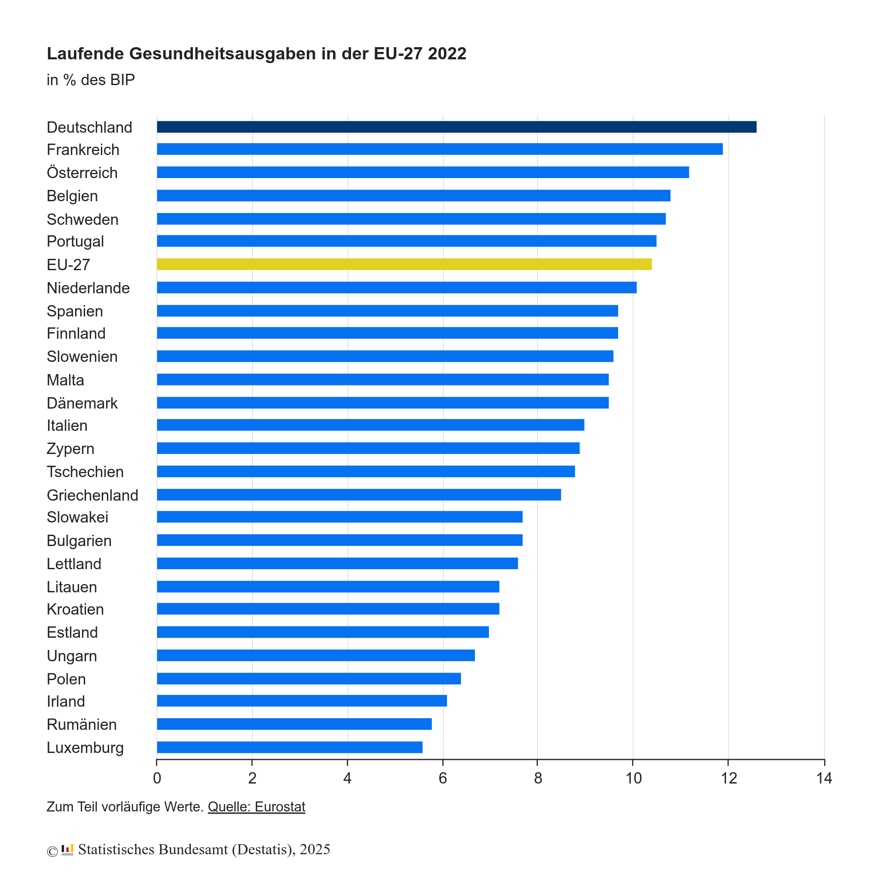

Aktuell erhöhen sehr viele Krankenkassen ihre Beiträge. Das wird aufgrund des
steigenden Durchschnittsalters der Bevölkerung und dem kleiner werdenden Anteil
der Arbeitenden an der Bevölkerung auch in Zukunft so weiter gehen, wenn wir
nichts machen.

Wir haben noch andere Probleme in der Krankenversorgung, wie z.B. die
Verfügbarkeit von Apotheken und Hausärzten auf dem Land. Aber in diesem Artikel
möchte ich mich auf die Kosten konzentrieren.

## Aktuelle Krankenversorgung in Deutschland

### Deutschland im Vergleich

Wenn wir beurteilen wollen wie teuer das deutsche Gesundheitssystem ist, müssten
wir im Ländervergleich auf [kaufkraftbereinigte Kosten pro Kopf](https://www.statistik-bw.de/Service/Veroeff/Monatshefte/PDF/Beitrag15_01_03.pdf) schauen. 2012 war Deutschland
ein gutes Stück günstiger als Norwegen, die Schweiz, und die Niederlande.
Die kaufkraftbereinigten Gesundheitsausgaben pro Kopf waren vergleichbar mit
Österreich, Dänemark und Belgien. Ein gutes Stück günstiger waren Finnland,
Island, Italien, Ungarn und Polen.

Schauen wir uns Zahlen von 2022 an und betrachten die Gesundheitsausgaben in %
vom BIP, sehen wir, dass Deutschland mit 12.61% stark über dem Durchschnitt
liegt.

<figure class="wp-caption aligncenter img-thumbnail">
    
    <figcaption class="text-center">Gesundheitsausgaben in der EU, 2022 (<a href="https://ec.europa.eu/eurostat/databrowser/view/hlth_sha11_hc__custom_13673948/bookmark/table?lang=de&bookmarkId=8cec15e6-717d-448f-b59c-d23bb0c52f1c">Datenquelle</a>)</figcaption>
</figure>

Diese 12.61% des BIP sind [488.7 Milliarden Euro](https://www.destatis.de/DE/Themen/Gesellschaft-Umwelt/Gesundheit/Gesundheitsausgaben/_inhalt.html). Davon waren 4.1 Mrd EUR für Corona.
In der Corona-Pandemie kaufte der Bund 5.7 Milliarden Corona-Masken für 5.9 Milliarden Euro. [...] Mehr als die Hälfte wurde nicht gebraucht und daher vernichtet. ([Quelle](https://www.deutschlandfunk.de/spahn-corona-masken-beschaffung-kosten-100.html)). 13.1 Milliarden Euro wurden
für Impfdosen ausgegeben ([Quelle](https://www.tagesschau.de/investigativ/ndr-wdr/corona-impfstoff-kosten-101.html)).

Im Jahr 2021 beliefen sich die Kosten deutscher Krankenhäuser auf insgesamt rund
109.3 Milliarden Euro ([Quelle](https://de.statista.com/statistik/daten/studie/3182/umfrage/kosten-deutscher-krankenhaeuser-seit-1996/)).

### Privat vs Gesetzlich

Es gibt [95 Gesetzliche Krankenversicherung](https://de.wikipedia.org/wiki/Gesetzliche_Krankenversicherung) ([Quelle](https://www.gkv-spitzenverband.de/krankenversicherung/kv_grundprinzipien/alle_gesetzlichen_krankenkassen/alle_gesetzlichen_krankenkassen.jsp), Stand: 1. Januar 2024). Über die Jahre werden es weniger. Aktuell ist die [Techniker Krankenkasse](https://de.wikipedia.org/wiki/Techniker_Krankenkasse) mit 11.8 Millionen Versicherten die größte gesetzliche Krankenkasse, die [Barmer Ersatzkasse](https://de.wikipedia.org/wiki/Barmer_Ersatzkasse) ist mit 8.5 Millionen Versicherten die zweitgrößte.

Insgesamt sind 75 Millionen Menschen in Deutschland gesetzlich krankenversichert
([Quelle](https://www.gkv-spitzenverband.de/krankenversicherung/kv_grundprinzipien/alle_gesetzlichen_krankenkassen/alle_gesetzlichen_krankenkassen.jsp)). Privat
versichert sind:

* 3 Millionen Beamte ([Quelle](https://www.bertelsmann-stiftung.de/de/themen/aktuelle-meldungen/2017/januar/gesetzliche-krankenversicherung-fuer-beamte-wuerde-bund-und-laender-um-60-milliarden-euro-entlasten))
* 1 Millionen Selbständige ([Quelle](https://www.bertelsmann-stiftung.de/de/unsere-projekte/integrierte-krankenversicherung/projektnachrichten/krankenversicherungspflicht-fuer-selbststaendige))
* 8 Millionen Arbeitnehmer ([Quelle](https://www.bertelsmann-stiftung.de/de/unsere-projekte/integrierte-krankenversicherung/projektnachrichten/krankenversicherungspflicht-fuer-selbststaendige))

### Ausgaben der Krankenkassen

[Krankheitskosten laut Robert Koch Institut (RKI)](https://www.rki.de/DE/Content/Gesundheitsmonitoring/Gesundheitsberichterstattung/Themenhefte/Krankheitskosten_inhalt.html) (Stand 2006):

* Im Jahr 2006 wurden in Deutschland für den Erhalt der Gesundheit und die
  Linderung von Krankheitsfolgen [...] 236 Milliarden Euro [ausgegeben].
* Die höchsten Kosten entstanden durch **Krankheiten des Kreislaufsystems** mit
  insgesamt **35.2 Milliarden Euro**
* An zweiter Stelle mit **32.7 Milliarden Euro** stehen die Kosten für
  **Krankheiten des Verdauungssystems** (insbesondere Zahnkaries).
* Den dritten Rang bei den Kosten für Krankheitsklassen nehmen **psychische und
  Verhaltensstörungen** mit **26.7 Milliarden Euro** ein. Fast gleichhoch waren
  die Ausgaben für **Krankheiten des Muskel-Skelett-Systems**.
* Ein Zehntel der Krankheitskosten entstanden in Pflegeeinrichtungen

[Krankheitskosten laut Statistischen Bundesamt](https://www.destatis.de/DE/Themen/Gesellschaft-Umwelt/Gesundheit/Krankheitskosten/_inhalt.html) (Stand 2022): Gesamt: 432 Mrd EUR

* 13% Krankheiten des Kreislaufsystems: [Koronare Herzkrankheit](https://de.wikipedia.org/wiki/Koronare_Herzkrankheit#Epidemiologie), [Herzinsuffizienz](https://de.wikipedia.org/wiki/Herzinsuffizienz), [Schlaganfall](https://de.wikipedia.org/wiki/Schlaganfall)
* 13% Psychische Krankheiten und Verhaltensstörungen: [Depressionen](https://de.wikipedia.org/wiki/Depression), [Suchtkrankheiten](https://de.wikipedia.org/wiki/Abh%C3%A4ngigkeit_(Medizin)) wie [Alkoholabhängigkeit](https://de.wikipedia.org/wiki/Alkoholkrankheit), [Demenzen](https://de.wikipedia.org/wiki/Demenz)
* 11% Krankheiten des Verdauungssystems: Lebererkrankungen, Entzündliche Darmerkrankungen, [Gastroösophagealer Reflux](https://de.wikipedia.org/wiki/Gastro%C3%B6sophagealer_Reflux), [Zahnkaries](https://de.wikipedia.org/wiki/Zahnkaries)
* 10% Neubildungen: Insbesondere Krebs

## Mögliche Politische Maßnahmen

Kurz und gut:

* **Einheitliche Krankenversicherung**: Mehr Menschen in der gesetzlichen
  Krankenversicherung führt zu größerer Solidarität und geringeren Kosten.
  Jeder sollte Zugang zu einer guten Krankenversorgung haben und jeder sollte
  Interesse daran haben, dass dieses System funktioniert.
* **Schädlichen Konsum reduzieren**: Alkohol, Tabak und Zucker sind schädlich und
  verursachen hohe Kosten. Wir sollten den Konsum senken.

### Gesetzliche Pflichtversicherung

Wenn alle Bundesbürger gesetzlich versichert wären, würde die Gesetzliche
Krankenversicherung jährlich ein finanzielles Plus in Höhe von rund **neun
Milliarden Euro** erzielen ([Quelle](https://www.bertelsmann-stiftung.de/de/themen/aktuelle-meldungen/2020/februar/duales-system-kostet-mitglieder-der-gesetzlichen-krankenversicherung-bis-zu-145-euro-pro-jahr)).

Man könnte [§ 6 SGB V](https://www.gesetze-im-internet.de/sgb_5/__6.html) Absatz 1 (nicht jedoch 1a), 2, 3, 4, 5, 6, 7 streichen. Damit müssten sehr viele Menschen in die gesetzliche
Krankenversicherung eintreten. Sie dürfen immer noch privat zusätzlich versichert
sein. Gleichzeitig müsste man die ggf. förderungen für Selbständige einführen,
weil der Schritt in die Selbständigkeit nicht sofort finanzielle Sorgen wegen
der Krankenversicherung verursachen soll. Als Gesellschaft liegt es in unserem
Interesse, dass Menschen Firmen aufbauen.

Man könnte sehr einfach die Jahresarbeitsentgeltgrenze (JAEG) abschaffen oder
drastisch erhöhen. Das würde dazu führen, dass alle Angestellten nicht mehr
aus der gesetzlichen Krankenversicherung austreten können.

Genauso könnte man für neue Beamte die Möglichkeit des Ausscheidens aus der
gesetzlichen Krankenversicherung abschaffen.

Praktisch gesehen würde ich die Menschen die bereits aus der gesetzlichen
Krankenversicherung ausgetreten sind, nicht zurückholen. Mir, als Laie, ist
nicht klar wie das gerecht umgesetzt werden sollte. Aber den Austritt weiterer
kann man sehr einfach verhindern.

### Alkohol- und Tabakkonsum senken

Der Staat muss einen Spagat machen: Einerseits muss der die Bürger schützen,
andererseits darf er nicht zu sehr in die Freiheit der Bürger eingreifen. Ich
bin kein Fan von absoluten Konsum- oder Produktionsverboten. Ich glaube nicht,
dass Prohibition funktioniert und ich bin davon überzeugt, dass sie andere
Probleme verursacht. Einschränkungen die den Erwerb erschweren und die
Verbreitung reduzieren, sie aber immer noch legal erlauben, halte ich daher für
sinnvoll.

> Die durch Alkoholkonsum verursachten volkswirtschaftlichen Kosten betragen rund **57 Milliarden Euro pro Jahr** ([Quelle](https://www.bundesgesundheitsministerium.de/service/begriffe-von-a-z/a/alkohol.html))

Der Volkswirtschaftliche Schaden sind allerdings nicht nur die Kosten für die
Krankenversorgung, sondern auch die Kosten für die Polizei, die Justiz und die
Ausfallzeiten. Dennoch sollte klar sein, dass es sich lohnt, den Alkoholkonsum
zu senken.

Zynikern sei an der Stelle gesagt: 2023 hat der Bund nur 2.2 Milliarden Euro
durch die Alkoholsteuer eingenommen ([Quelle](https://www.destatis.de/DE/Themen/Staat/Steuern/Verbrauchsteuern/alkoholsteuer.html)). Es lohnt sich also definitiv nicht.

Was könnten wir machen?

* **Regulierung von Verkauf und Verfügbarkeit**: Alkohol ist weit verbreitet und
  in Supermärkten, Tankstellen und Kiosken leicht zugänglich. Einschränkungen in
  der Verkaufszeit oder -mengen könnten Wirkung zeigen. In Norwegen wird Alkohl
  nur in staatlich kontrollierten Geschäften
  ([Vinmonopolet](https://de.wikipedia.org/wiki/Vinmonopolet) über 4.75%)
  verkauft, die eingeschränkte Öffnungszeiten haben. In Schweden gibt es ein
  Alkoholmonopol ([Systembolaget](https://de.wikipedia.org/wiki/Systembolaget)),
  das den Verkauf von Alkohol über 3.5% regelt. In Deutschland könnten wir
  zumindest den Verkauf von Alkohol an Tankstellen verbieten - wir wollen ja
  keine betrunkenen Fahrer. Auch der Verkauf von alkoholhaltigen Getränken über
  4.75% nach 20 Uhr könnte verboten werden um den Spontankauf zu erschweren.
* **Preispolitik**: Eine höhere Alkoholsteuer könnte den Volkswirtschaftlichen
  Netto-Schaden reduzieren indem die Einnahmen erhöht werden und der Konsum
  sinkt. In Deutschland ist Alkohl vergleichsweise günstig; in Skandinavien
  gibt es hohe Alkoholsteuern und ein [Mindestpreis für Alkohol wurde in Schottland eingeführt](https://www.spiegel.de/gesundheit/ernaehrung/schottland-fuehrt-gesetzlichen-mindestpreis-fuer-alkohol-ein-a-1205664.html).
* **Werbeverbot**: Weil der volkswirtschaftliche Schaden durch Alkohol so hoch
  ist, sollte es ein absolutes Werbeverbot für Alkohol geben. Keine Werbung im
  Fernsehen, Radio, Internet, Reklame auf Plakaten. Die Verpackungen und
  Flaschen sollten verpflichtend in schlichtem Design gehalten sein, z.B. eine
  braune Flasche mit Schwarz-Weißem Etikett. Warnhinweise auf den Verpackungen
  ähnliche wie bei Zigaretten sollten auf die Probleme übermäßigen
  Alkoholkonsums hinweisen. Das hätte auch einen Einfluss auf die Art wie wir
  Volksfeste, insbesondere das Oktoberfest, bewerben.

Für das Rauchen gilt ähnliches:

> Die gesamtwirtschaftlichen Kosten, die auf das Rauchen zurückgehen, belaufen
> sich in Deutschland jährlich auf **97,24 Milliarden Euro**. Die direkten Kosten
> (z.B. Kosten für die Behandlungen tabakbedingter Krankheiten, Arzneimittel
> etc.) des Tabakkonsums betrugen 30,32 Milliarden Euro. Auf die indirekten
> Kosten (z.B. Produktivitätsausfälle) entfielen 66,92 Milliarden Euro. ([Quelle](https://www.dhs.de/suechte/tabak/zahlen-daten-fakten), Stand: Januar 2024)

Und auch hier sei Zynikern gesagt: Der Bund hat 2023 nur 14.7 Milliarden Euro
über die Tabaksteuer eigenommen ([Quelle](https://de.statista.com/statistik/daten/studie/37837/umfrage/einnahmen-aus-der-tabaksteuer-in-deutschland/))

Bei den Maßnahmen sehe ich allerdings weniger Spielraum als bei Alkohol:

* **Regulierung von Verkauf und Verfügbarkeit**: Der Verkauf von Zigaretten
  würde ich an Automaten verbieten, da dort keine vernünftige Alterskontrolle
  stattfinden kann.
* **Preispolitik**: Die Steuern auf Tabak sind schon relativ hoch. Es ist jedem
  absolut klar, dass Rauchen teuer ist.
* **Werbeverbot**: Die Verpackungen sind bereits sehr schlicht und haben
  abschreckende Bilder. [Noch hat Deutschland kein Werbeverbot](https://de.wikipedia.org/wiki/Tabakwerbung#Entwicklung_in_Deutschland) und das müssen wir ändern.

Siehe auch:

* aerzteblatt.de: [Tabakwerbeverbot beginnt schrittweise ab 2021](https://www.aerzteblatt.de/nachrichten/114235/Tabakwerbeverbot-beginnt-schrittweise-ab-2021), 2020.

### Zuckerkonsum senken

In Deutschland sind [19%](https://www.rki.de/DE/Content/Gesundheitsmonitoring/Themen/Uebergewicht_Adipositas/Uebergewicht_Adipositas_node.html) von [Adipositas](https://de.wikipedia.org/wiki/Adipositas) betroffen. 2012 wurden [52.5 Millionen Zahnfüllungen](https://www.kariesvorbeugung.de/kariesprophylaxe-aktuell/weniger-fuellungen-und-gezogene-zaehne-deutschlands-zaehne-immer-gesuender/) durchgeführt. Beides kann man nicht ausschließlich auf den Zuckerkonsum zurückführen, aber er spielt eine Rolle.

Es ist schwer in Deutschland den Zuckerkonsum zu senken, weil Zucker in vielen
Lebensmitteln enthalten ist. Wir sollten die Rahmenbedingungen so gestalten, dass
es leichter ist, sich gesund zu ernähren. Lebensmittelhersteller sollten ein
Interesse daran haben, gesunde Lebensmittel zu produzieren.

Preispolitik könnte hier auch eine Rolle spielen:

> Die Zuckersteuer könnte für die Jahre 2023-2043 Einsparungen von 16 Mrd. Euro
> volkswirtschaftliche Kosten bringen, davon rund 4 Mrd. für das
> Gesundheitssystem ([Quelle](https://www.tagesschau.de/wirtschaft/verbraucher/zuckersteuer-softdrinks-uebergewicht-erkrankungen-gesundheitskosten-100.html))

Der Gedanke ist nicht, dass wir Süßigkeiten unbezahlbar machen oder verbieten.
Die Idee ist, dass Hersteller ihre Kosten senken wollen. Wenn es also Süßmacher
wie [Stevia](https://de.wikipedia.org/wiki/Stevia) oder [Erythrit](https://de.wikipedia.org/wiki/Erythrit) gibt, die dank einer Zuckersteuer günster sind, werden sie hoffentlich weniger
Zucker verwenden. Oder den Zusatz ggf. sogar komplett weglassen.
Insbesondere bei Softdrinks könnte das eine Rolle spielen.

Ein **Werbeverbot** für Süßigkeiten und Softdrinks könnte auch sinnvoll sein.
Wir sollten nicht dafür sorgen, das Eltern von ihren Kindern um Süßigkeiten
angebettelt werden.

Weiteres:

* [Mehrere Bundesländer fordern Softdrink-Steuer](https://www.tagesschau.de/inland/innenpolitik/softdrinks-steuer-zucker-100.html) auf tagesschau.de, 2024.
* [Zucker-/Fettsteuer: Die Positionen der Parteien](https://www.aerztezeitung.de/Politik/Die-Positionen-der-Parteien-293833.html) auf aerztezeitung.de, 2016.
