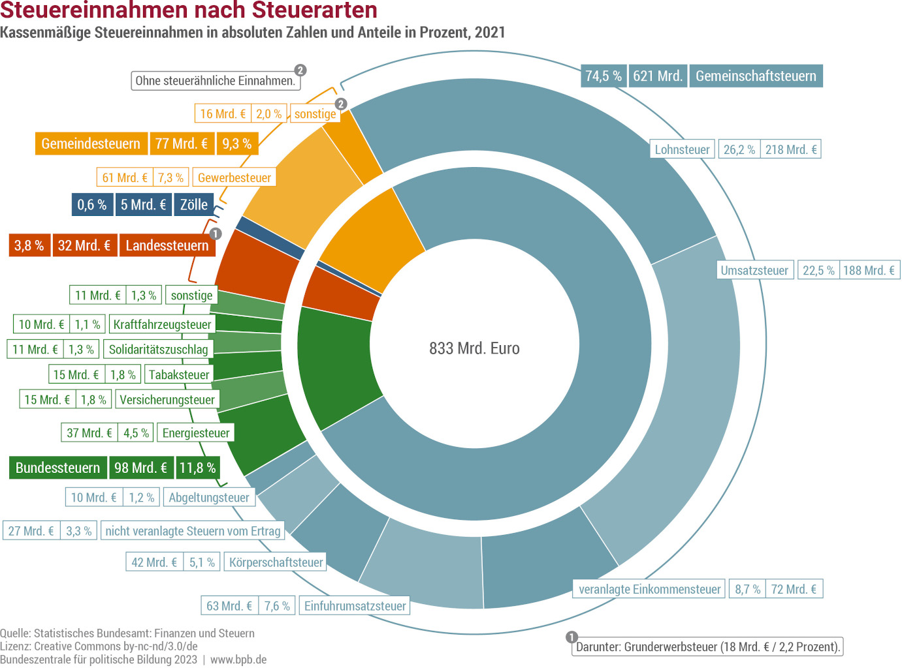
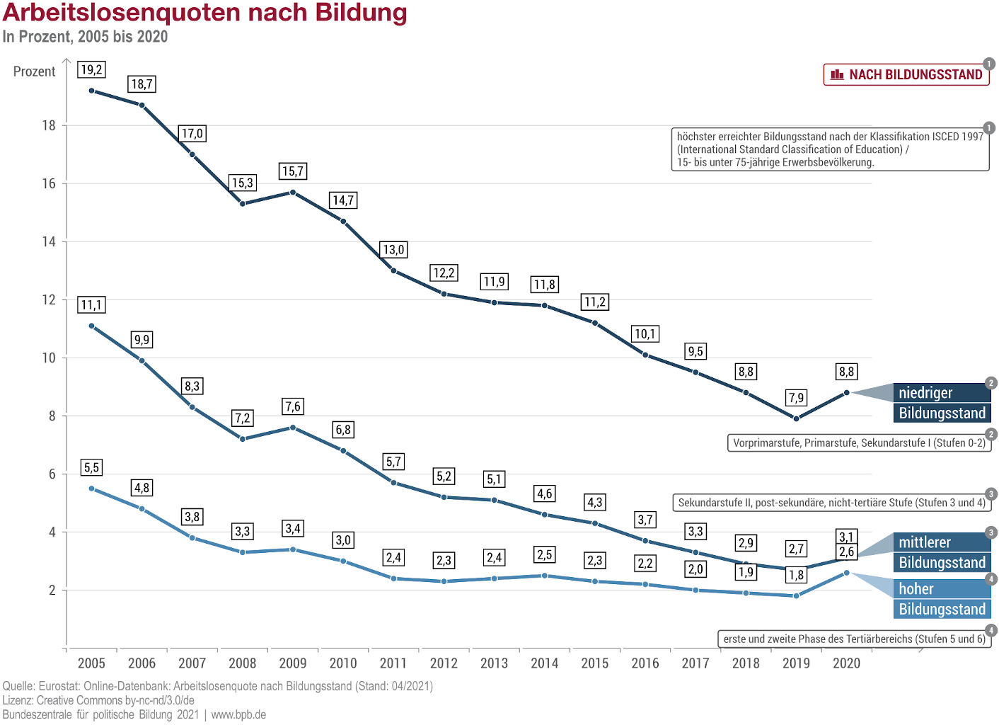

Die meisten Menschen in Deutschland und alle Parteien, die eine Chance haben in
die nächste Regierung zu kommen (CDU/CSU, SPD, und Grüne), sind sich einig:
Deutschland muss die Wirtschaft ankurblen, die Bundeswehr stärken, marode
Straßen/Brücken/Schulen sanieren und die Digitalisierung vorantreiben. Das
Rentenniveau soll stabil bleiben.

In diesem Artikel möchte ich ein paar Gedanken teilen, wie man das Geld dafür
bekommen könnte.

## Wie gehts unserer Wirtschaft?

Nach der Wiedervereinigung gab es in Deutschland folgende einschneidende
Ereignisse für die Wirtschaft:

* [Weltfinanzkrise](https://de.wikipedia.org/wiki/Weltfinanzkrise_2007%E2%80%932008): 2008
* [COVID-19-Pandemie](https://de.wikipedia.org/wiki/COVID-19-Pandemie): 2020
* [Globale Energiekrise](https://de.wikipedia.org/wiki/Globale_Energiekrise_2021%E2%80%932023): 2021-2023

Diese muss man berücksichtigen, wenn man die Wirtschaftsentwicklung betrachtet.
Der Effekt kann auch verzögert eintreten.

Die [Arbeitslosenquote](https://www.destatis.de/DE/Themen/Wirtschaft/Konjunkturindikatoren/Lange-Reihen/Arbeitsmarkt/lrarb003ga.html) ist mit 6.5% (2024) auf einem niedrigen Niveau.
Unter 6% hatten wir nur 2022, 2019, 2018, sowie vor 1980. Aktuell sind [650.000 Arbeitsstellen offen und beim BA gemeldet](https://de.statista.com/statistik/daten/studie/2900/umfrage/entwicklung-des-gemeldeten-offenen-arbeitsstellenbestands/).

Auch die [Unternehmensinsolvenzen](https://www.destatis.de/DE/Themen/Branchen-Unternehmen/Unternehmen/Gewerbemeldungen-Insolvenzen/Tabellen/lrins01.html#242428) sind mit 17.814 (2023)
auf einem niedrigen Niveau. Weniger gab es nur 2022, 2021, 2020, 1991, 1990, und
vor 1990.

Das [BIP ist auf einem historischem Höchststand](https://de.statista.com/statistik/daten/studie/1251/umfrage/entwicklung-des-bruttoinlandsprodukts-seit-dem-jahr-1991/) - nur 2009 und 2020
hatten wir einen Rückgang. Interessanter ist jedoch die [preisbereinigte
Entwicklung](https://www.destatis.de/DE/Themen/Wirtschaft/Volkswirtschaftliche-Gesamtrechnungen-Inlandsprodukt/BIP-Langfristig.html):

<figure class="wp-caption aligncenter img-thumbnail">
    
    <figcaption class="text-center">Das Preisbereinigte BIP von 1950 bis 2024 zeigt: 2009 nach der Finanzkrise, 2020 nach Corona, und deutlich schwäche 2023 und 2024 durch die Gaskrise ist das BIP zurück gegangen. Im langfristigen Trend sind das BIP seit 1950.</figcaption>
</figure>

Wenn wir uns die inflationsbereinigten Pro-Kopf-BIP-Werte anschauen, stehen wir
ziemlich gut da:

<iframe src="//www.gapminder.org/tools/?embedded=true#$model$markers$line$data$filter$dimensions$geo$/$or@$geo$/$in@=usa&=deu&=fra&=jpn&=che&=aut;;;;;;;;&encoding$y$scale$zoomed@=30000&=70000;;;&x$scale$zoomed@=1990&=2023;;;&color$scale$type:null&domain:null&zoomed:null;;;;;;&chart-type=linechart&url=v2" style="width: 100%; height: 500px; margin: 0 0 0 0; border: 1px solid grey;" allowfullscreen></iframe>

Ich sehe zwei Gründe, warum es sich für manche Menschen anders anfühlt:

1. Medien: Wir werden immer mehr mit Hiobsbotschaften bombardiert. Das erzeugt
   natürlich das Gefühl, dass es schlecht läuft. Selbst wenn es einem selbst
   objektiv gut geht, hat man das Gefühl, dass es anderen bzw. der Gesellschaft
    schlecht geht.
2. Ungleichverteilung: Das BIP misst die Wirtschaftsleistung, nicht die
   Verteilung. Wenn die Wirtschaft wächst, aber nur die oberen 10% davon
   profitieren, fühlt sich das für die unteren 90% nicht gut an.

Interessanterweise gibt es hier keine dramatischen verschlechterungen:

<iframe src="//www.gapminder.org/tools/?embedded=true#$model$markers$line$data$filter$dimensions$geo$/$or@$geo$/$in@=usa&=deu&=fra&=jpn&=che&=aut;;;;;;;;&encoding$y$scale$zoomed@=30000&=70000;;;&x$scale$zoomed@=1990&=2023;;;&color$scale$type:null&domain:null&zoomed:null;;;;;;&chart-type=linechart&url=v2" style="width: 100%; height: 500px; margin: 0 0 0 0; border: 1px solid grey;" allowfullscreen></iframe>

Auch weitere Daten wie die Armutsrate oder extreme Armut deuten nicht auf eine
wesentliche Änderung in den letzten 10 Jahren hin.

Eine Besonderheit ist die Inflation:

<iframe src="//www.gapminder.org/tools/?embedded=true#$model$markers$line$data$filter$dimensions$geo$/$or@$geo$/$in@=usa&=deu&=fra&=jpn;;;;;;;;&encoding$y$data$concept=fp_cpi_totl_zg&source=wdi&space@=geo&=time;;&scale$type:null&domain:null&zoomed@=-0.36&=8;;;&x$scale$zoomed@=1990&=2023;;;;;;;&chart-type=linechart&url=v2" style="width: 100%; height: 500px; margin: 0 0 0 0; border: 1px solid grey;" allowfullscreen></iframe>

## Wie kann der Staat den Haushalt finanzieren?

### Schulden machen

Wenn man investieren möchte, aber das Geld nicht auf der hohen Kante hat, kann
Kredite aufnehmen. Dafür müsste man die Schuldenbremse anpassen.

Die deutsche Schuldengrenze erlaubt dem Bund eine strukturelle Neuverschuldung
von höchstens 0,35 % des Bruttoinlandsprodukts (BIP) eingehen.

Der europäische [Stabilitäts- und
Wachstumspakt](https://de.wikipedia.org/wiki/Stabilit%C3%A4ts-_und_Wachstumspakt)
erlaubt eine jährliche Neuverschuldung (Staatsdefizit) von bis zu 3% des BIP.
Die
[Schuldenquote](https://de.wikipedia.org/wiki/Staatsverschuldung_Deutschlands)
darf 60% des BIPs nicht überschreiten. 2023 waren wir bei 62.9%.

Dennoch bin ich mir sicher, dass die nächste Regierung die Schuldenbremse
lockern wird und mehr Schulden aufnimmt.

### Steuern erhöhen

Der zweite leichte Weg um höhere Ausgaben zu finanzieren ist, die Einnahmen
durch Steuern zu erhöhen. 2021 war die Struktur der [Steuereinnahmen in
Deutschland](https://de.wikipedia.org/wiki/Steueraufkommen_(Deutschland)) wie
folgt:

<figure class="wp-caption aligncenter img-thumbnail">
    
    <figcaption class="text-center">Steuereinnahmen in Deutschland, 2021</figcaption>
</figure>

Obwohl das keine Partei will, hier mal ein paar offensichtliche Kandidaten:

* **Erhöhung der Umsatzsteuer**: Der regulären Satz beträgt 19%. Der ermäßigte
  Satz beträgt 7%. 2023 gab es 212,6 Mrd. € Einnahmen durch die Umsatzsteuer.
  Wenn das alles durch den regulären Satz gemacht würde, würde eine Erhöhung
  um 1% etwa 11 Mrd. € mehr einbringen.
* **Erhöhung der Lohnsteuer**: 2023 gab es 236.2 Mrd. € Einnahmen durch die
  Lohnsteuer und 73,4 Mrd EUR durch veranlagte Einkommensteuer, also 309.6 Mrd
  EUR durch Einkommen. Wenn man also dumpf für alle die Einkommenssteuer
  um 1% erhöht (nicht einen Prozentpunkt!), wäre das etwa 3.1 Mrd. € mehr.

Das sind die einzigen beiden bereits erhobenen Steuern, bei denen man relativ
schnell relevante Summen zusammenbekommen kann.

### Vermögenssteuer reaktivieren

Wenn man um aktuell nicht erhobene Steuern redet, könnte man mit einer
[Vermögenssteuer](https://de.wikipedia.org/wiki/Verm%C3%B6gensteuer) einiges
bekommen. In der
[Schweiz](https://de.wikipedia.org/wiki/Verm%C3%B6gensteuer#Schweiz), Italien,
und [Spanien](https://de.wikipedia.org/wiki/Verm%C3%B6gensteuer#Spanien) machen
Vermögenssteuern etwa 2-3% des BIP aus. Deutschland hatte eine Vermögenssteuer bis 1996.
Sie wurde ausgesetzt, weil das Bundesverfassungsgericht die Vermögenssteuer wegen
der Ungleichbehandlung von Immobilien und anderen Vermögensarten für verfassungswidrig
erklärte ([Quelle](https://www.zdf.de/nachrichten/wirtschaft/vermoegen-steuer-deutschland-100.html)).
Anstatt die Vermögenssteuer zu reformieren hat die Regierung Kohl sie ausgetzt.

Hier ein paar Schätzungen wie viel eine Vermögenssteuer einbringen könnte:

* [verdi](https://www.verdi.de/themen/politik-wirtschaft/++co++ee49a8ae-fed7-11ed-9c41-001a4a16012a):
  20 Milliarden Euro, wenn 1% ab einer Million Vermögen, bis zu 2% bei mehr als
  einer Milliarde Euro fällig würde. "Müssten alle Leute mit mehr als 4,6
  Millionen Euro nur 2 Prozent Vermögenssteuer zahlen und Multimilliardäre sich
  mit 5 Prozent an der Staatskasse beteiligen, kämen in Deutschland laut einer
  Oxfam-Studie von 2024 über 85 Milliarden Euro zusammen."
* [Friedrich-Ebert-Stiftung](https://www.fes.de/wissen/vermoegensteuer): 15 bis 25 Milliarden Euro
* [Focus](https://www.focus.de/finanzen/steuern/mehrheit-votiert-fuer-abgabe-koennte-bis-zu-120-milliarden-euro-einbringen-das-muessen-sie-zur-vermoegensteuer-wissen_id_260126181.html): Bis zu 120 Milliarden Euro

### Geltendes Recht effektiv durchsetzen

[Cum-Ex und Cum-Cum](https://de.wikipedia.org/wiki/Dividendenstripping), die
[Güterstandsschaukel](https://www.schafeld-partner.de/die-gueterstandsschaukel-ein-geeignetes-instrument-zur-steuerfreien-vermoegensuebertragung/),
[Share Deals](https://de.wikipedia.org/wiki/Anteilskauf#Immobilienwesen):
Steuerbetrug und vom Gesetzgeber unvorhergesehene Steuervermeidung sind ein
Problem.

Die [Panama Papers](https://de.wikipedia.org/wiki/Panama_Papers#Deutschland) und
die [Paradise Papers](https://de.wikipedia.org/wiki/Paradise_Papers) zeigen,
dass wir auch ein Problem mit Geldwäsche haben.

> Der geschätzte Schaden aus CumCum-Geschäften in Deutschland liegt bei über 28
> Milliarden Euro und damit mehr als doppelt so hoch wie bei den
> CumEx-Geschäften ([Quelle](https://www.finanzwende.de/themen/cumex/cumcum))

Also 42 Milliarden Euro Schaden nur durch Cum-Ex und Cum-Cum. Das müssen wir
ändern. [Anne Brorhilker](https://de.wikipedia.org/wiki/Anne_Brorhilker),
die  Oberstaatsanwältin welche die Cum-Ex Betrügereien untersucht hatte und nun
den Vorsitz der [Bürgerbewegung Finanzwende](https://de.wikipedia.org/wiki/B%C3%BCrgerbewegung_Finanzwende)
hat, [schlägt vor](https://youtu.be/fPR9BSnhpRw?si=7BrrGyHgISk4WiFr&t=1610):

* **Experten** für die Finanzämter ausbilden
* Eine **Zentrale Zuständigkeit auf Bundesebene** schaffen
* Moderne und einheitliche **IT-Infrastruktur**
* **Kontrollinstrumente nicht Abschaffen**: Unter dem Deckmantel des
  Bürokratieabbaus geschieht das gerne
* **Tranzparenz bei Nebenverdiensten**, insbesondere den obersten Bundesgerichten
* Strengere Regeln für den [**Drehtüreffekt**](https://de.wikipedia.org/wiki/Wechsel_zwischen_Politik_und_Wirtschaft)

In den USA gibt es die
[IRS](https://de.wikipedia.org/wiki/Internal_Revenue_Service) mit 80.000
Mitarbeitern. Davor zittern selbst große internationale Firmen. Wir haben das
das [Bundeszentralamt für
Steuern](https://de.wikipedia.org/wiki/Finanzverwaltung_(Deutschland)) mit etwa
2000 Mitarbeitern und [530 Finanzämter](https://www.bundesfinanzministerium.de/Content/DE/Standardartikel/Video-Textfassungen/Finanzisch/textfassung-finanzisch-fuer-anfaenger-finanzamt-oder-amt.html)
mit insgesamt etwa [97.603 Mitarbeiter in den Finanzämtern](https://www.sulzinger.info/wie-viele-menschen-arbeiten-beim-finanzamt/).

## Mythen

### Firmen brauchen Vermögen, um zu Investieren

Firmen investieren, wenn sie sich einen Profit versprechen. Dann kann man ggf.
auch Kredite aufnehmen. Wenn die Zinsen niedrig sind, ist das besonders
attraktiv.

Einfach gesagt: Wenn ein Bäcker merkt, dass er seine Semmeln nicht los wird,
wird er am nächsten Tag nicht mehr so viele backen. Wenn er jeden Tag um 7 Uhr
ausverkauft ist, wird er vielleicht eine zweite Filiale eröffnen.

[VW will drei Werke schließen](https://www.tagesschau.de/wirtschaft/unternehmen/vw-betriebsrat-werksschliessungen-100.html), weil sie die Autos nicht los werden.
VW hat 2023 so viel Eigenkapital wie nie zuvor - über 189 Milliarden Euro ([Quelle](https://de.statista.com/statistik/daten/studie/181509/umfrage/eigenkapital-der-volkswagen-ag/)).

Es mangelt nicht am Geld. Daher werden Steuersenkungen oder Zuschüsse für Firmen
auch nichts bringen.

### Wir sind die einzige Volkswirtschaft, die nicht wieder gewachsen ist

Wenn man sich die inflationsbereinigten Pro-Kopf BIP-Werte anschaut, sieht man:

<iframe src="https://www.gapminder.org/tools/?embedded=true#$model$markers$line$data$filter$dimensions$geo$/$or@$geo$/$in@=usa&=deu&=fra&=aut&=ita&=esp&=jpn;;;;;;;;&encoding$y$scale$zoomed@=40000&=70000;;;&x$scale$zoomed@=2016&=2023;;;;;;;&chart-type=linechart&url=v2" style="width: 100%; height: 500px; margin: 0 0 0 0; border: 1px solid grey;" allowfullscreen></iframe>

Die Entwicklungen in der EU sind also ähnlich. Und konkret hat Österreich
in den letzten Jahren eine schlechtere Entwicklung als Deutschland gehabt ([Quelle](https://www.handelsblatt.com/politik/international/oesterreich-wirtschaftsforscher-erwarten-auch-2024-rezession-in-oesterreich/100076000.html))

### Höheres BIP führt äquivalent zu größerem Haushalt

Die Schuldenbremse hat eine Konjugturkomponente. Wenn es der Wirtschaft schlecht
geht, darf der Staat mehr Schulden machen. Wenn man also Wirtschaftswachstum
erreicht hat man zwar mehr Einnahmen, darf aber gleichzeitig weniger Schulden
machen. Daher ändert sich der Haushalt nicht so stark wie man denken könnte.

## Wahlprogramme

### CDU/CSU

Die CDU/CSU will bei der nächsten Wahl den Bundeshaushalt mit 89 Milliarden
zusätzlich belasten ([Quelle](https://www.tagesschau.de/inland/bundestagswahl/wahlprogramm-steuern-auswertung-100.html)):

* Einkommensteuer (41 Mrd EUR): Spitzensteuersatz soll künftig erst ab 80.000 Euro greifen
* Körperschafts- und Gewerbesteuer (20 Mrd EUR): Die Körperschaftssteuer soll auf zehn Prozent reduziert werden
* Solidaritätszuschlag (13 Mrd EUR): Soll komplett abgeschafft werden. Dieser betrifft aktuell nur Einkommen über 148.000 EUR

Sie wollen keine neuen Schulden machen, keine Steuern erhöhen, und keine
zusätzlichen Steuern einführen. Sie wünschen sich, dass das durch Wachstum
finanziert wird.

Schauen wir mal wie gut das klappt:

* **Gesamt-BIP Deutschlands**: Das BIP Deutschlands lag 2023 bei etwa 4306 Mrd.
  EUR ([Quelle](https://www.destatis.de/DE/Themen/Wirtschaft/Volkswirtschaftliche-Gesamtrechnungen-Inlandsprodukt/Tabellen/bip-bubbles.html)). Jeder Prozentpunkt Wachstum wären also 43 Mrd. EUR zusätziches BIP.
* **Steuerquote**: Aktuell hat Deutschland eine Steuerquote von 23.1% ([Quelle](https://de.statista.com/statistik/daten/studie/18522/umfrage/deutschland-anteil-steuereinnahmen-am-bruttoinlandsprodukt/)). Nehmen wir mal fälschlicherweise an, dass sich das trotz der Steuersenkungen nicht ändert.
* **Steuereinnahmen**: 23.1% von 43 Mrd. EUR sind 9.9 Mrd EUR

Die CDU/CSU erwartet also ein Wachstum von 9%. Das ist illusorisch. Das hatten
nur in drei Jahren seit 1950: 1951, 1952, und 1955. Seit 1991 waren wir immer
unter 5%, meist unter 3%.

Selbst wenn man sehr optimistisch annimmt, dass die Ausgaben für das Bürgergeld
von 37.39 Mrd EUR (2023) auf 23.89 EUR (stand von 2014, ohne Inflation) sinken
würde, müsste man immer noch ein Wachstum von 7.6% erreichen. Die CDU/CSU
lügt, wenn sie behaupten, dass das erreichbar wäre.

Die CDU/CSU will bei der nächsten Wahl den Bundeshaushalt mit 89 Milliarden
zusätzlich belasten ([Quelle](https://www.tagesschau.de/inland/bundestagswahl/wahlprogramm-steuern-auswertung-100.html)):

* Einkommensteuer (41 Mrd EUR): Spitzensteuersatz soll künftig erst ab 80.000 Euro greifen
* Körperschafts- und Gewerbesteuer (20 Mrd EUR): Die Körperschaftssteuer soll auf zehn Prozent reduziert werden
* Solidaritätszuschlag (13 Mrd EUR): Soll komplett abgeschafft werden. Dieser betrifft aktuell nur Einkommen über 148.000 EUR

Sie wollen keine neuen Schulden machen, keine Steuern erhöhen, und keine
zusätzlichen Steuern einführen. Sie wünschen sich, dass das durch Wachstum
finanziert wird.

Schauen wir mal wie gut das klappt:

* **Gesamt-BIP Deutschlands**: Das BIP Deutschlands lag 2023 bei etwa 4306 Mrd.
  EUR ([Quelle](https://www.destatis.de/DE/Themen/Wirtschaft/Volkswirtschaftliche-Gesamtrechnungen-Inlandsprodukt/Tabellen/bip-bubbles.html)). Jeder Prozentpunkt Wachstum wären also 43 Mrd. EUR zusätziches BIP.
* **Steuerquote**: Aktuell hat Deutschland eine Steuerquote von 23.1% ([Quelle](https://de.statista.com/statistik/daten/studie/18522/umfrage/deutschland-anteil-steuereinnahmen-am-bruttoinlandsprodukt/)). Nehmen wir mal fälschlicherweise an, dass sich das trotz der Steuersenkungen nicht ändert.
* **Steuereinnahmen**: 23.1% von 43 Mrd. EUR sind 9.9 Mrd EUR

Die CDU/CSU erwartet also ein Wachstum von 9%. Das ist illusorisch. Das hatten
nur in drei Jahren seit 1950: 1951, 1952, und 1955. Seit 1991 waren wir immer
unter 5%, meist unter 3%.

Selbst wenn man sehr optimistisch annimmt, dass die Ausgaben für das Bürgergeld
von 37.39 Mrd EUR (2023) auf 23.89 EUR (stand von 2014, ohne Inflation) sinken
würde, müsste man immer noch ein Wachstum von 7.6% erreichen. Die CDU/CSU
lügt, wenn sie behaupten, dass das erreichbar wäre. Sogar mehr, wegen dem
Wegfall der Konjunturnkomponente sowie der Reduktion der Steuerquote.

Schlimmer ist jedoch, dass dieses Programm zu keinem Wachstum führen wird.
Es ist eine eklatante Fehlanalyse, dass es der Wirtschaft schlecht geht, weil
die Unternehmen kein Geld haben. VW hat so viel Eigenkapital wie nie zuvor -
und dennoch werden Werke geschlossen.

### SPD

Das [Wahlprogramm der SPD](https://www.spd.de/fileadmin/Dokumente/Beschluesse/Programm/2025_SPD_Regierungsprogramm.pdf) will den Bundeshaushalt mit 30 Milliarde Euro zusätzlich belasten ([Quelle](https://www.tagesschau.de/inland/bundestagswahl/wahlprogramm-steuern-auswertung-100.html)).
Die größten Posten sind:

* Investitionsprämie (20 Mrd EUR)
* Stromsteuer/Netzentgelte (10 Mrd EUR)
* Einkommensteuer (8 Mrd EUR)
* Umsatzsteuer (4 Mrd EUR)

Allerdings soll mit der Kapitalertragsteuer, Erbschaftsteuer, und Vermögensteuer
zusätzliches Geld reinkommen. Der Rest soll durch Schulden gedeckt werden.

## Politische Ideen

### Steuern abschaffen / tauschen

Es gibt Steuern mit geringem Effekt auf den Bundeshaushalt. Bei diesen Steuern
besteht die Gefahr, dass die Verwaltungskosten die Einnahmen auffressen:

* Alkohol: Eine Abschaffung der folgenden Steuern sowie eine Erhöhung der [Alkoholsteuer](https://de.wikipedia.org/wiki/Branntweinsteuer#Aufkommen_der_Branntweinsteuer). Eine [Erhöhung der Alkoholsteuer hat viele Vorteile](https://www.alkoholpolitik.de/konkret/verf%C3%BCgbarkeit/steuern/917-auswirkungen-einer-erh%C3%B6hung-der-alkoholsteuer-auf-die-steuereinnahmen-des-staates)
    * [Alkopopsteuer](https://de.wikipedia.org/wiki/Alkopopsteuergesetz_(Deutschland)): -5 Millionen EUR Steueraufkommen. Wir zahlen also aktiv drauf. Stattdessen sollten wir mit Werbeverboten, Verkaufsbeschränkungen, und Mindestpreisen arbeiten.
    * [Zwischenerzeugnissteuer](https://de.wikipedia.org/wiki/Zwischenerzeugnissteuer): 22 Millionen EUR Steueraufkommen
    * [Schaumweinsteuer](https://de.wikipedia.org/wiki/Schaumweinsteuer): 341 Millionen EUR Steueraufkommen
* [pauschalierte Eingangsabgaben](https://www.zoll.de/DE/Privatpersonen/Reisen/Rueckkehr-aus-einem-Nicht-EU-Staat/Zoll-und-Steuern/Ueberschreiten-Reisefreimengen/pauschalierte_abgabensaetze.html): 2 Milionen EUR
* [Luftverkehrsteuer](https://de.wikipedia.org/wiki/Luftverkehrabgabe#Deutschland): 566 Millionen EUR - stattdessen sollte [Kerosin](https://de.wikipedia.org/wiki/Kerosinsteuer) EU-weit besteuert werden

Die Abschaffung des
[Soli](https://de.wikipedia.org/wiki/Solidarit%C3%A4tszuschlag) finde ich
sinnvoll, aber hauptsächlich weil man den aufkommensneutral in die Lohnsteuer
überführen könnte. Das würde die dauernde Debatte darum beenden.

### Strom

Ein Grund warum in Norwegen so viele Elektroautos fahren und so viele
Wärmepumpen installiert sind ist der niedrige Strompreis. In Deutschland haben
wir mit der Stromsteuer und den Netzentgelten eine hohe Belastung. Dies schafft
einen Fehlanreiz sich für eine Gas- oder Ölheizung oder für einen Verbrenner zu
entscheiden. Das wird die Menschen in Zukunft teuer zu stehen kommen.

Um langfristig Wohlstand zu schaffen müssen wir die richtigen Anreize schaffen.
Wir müssen Strom günstig machen. Weg mit der Stromsteuer und den Netzentgelten.

### Beschäftigung erhöhen

Die [Erwerbstätigenquote in
Deutschland](https://www.destatis.de/DE/Themen/Arbeit/Arbeitsmarkt/Erwerbstaetigkeit/Tabellen/erwerbstaetigenquoten-gebietsstand-geschlecht-altergruppe-mikrozensus.html)
ist 2023 bei 77.2% und damit höher als je zuvor. Dennoch ist der Unterschied
zwischen Frauen (73.6%) und Männern (80.8%) immer noch groß. Einer der
wichtigsten Faktoren ist Care-Arbeit: Kinderbetreuung und Pflege.
Allein [in Bayern fehlen 70.100 Kita-Plätze](https://www.br.de/nachrichten/bayern/studie-in-bayern-fehlen-rund-70-000-kita-plaetze,TwsXEm6).

27% der Frauen in Teilzeit haben wegen Kinderbetreuung die Arbeit reduziert ([Quelle](https://www.destatis.de/DE/Presse/Pressemitteilungen/2024/04/PD24_N017_13.html)).

### Infrastruktur-Projekte

Der Bund kann durch Infrastruktur-Projekte direkt Arbeitsplätze schaffen.
Insbesondere wenn diese über einen langen Zeitraum verlässlich laufen und
die Projekte einen Mehrwert für uns alle haben ist das sinnvoll:

* [130.000 Brücken Sanieren](https://www.dw.com/de/deutschland-immer-mehr-autobahnbr%C3%BCcken-sind-kaputt/a-69409181)
* [5 Mrd. EUR pro Jahr für Schulsanierungen](https://www.ibp.fraunhofer.de/de/projekte-referenzen/begleitforschung-eneff-schule.html) für die nächsten 15 Jahre
* [74 Mrd. EUR pro Jahr für Straßen- und Schienensanierungen](https://www.tagesschau.de/wirtschaft/verbraucher/verkehrswege-kommunen-kosten-studie-100.html) für die nächsten 5 Jahre

Vieles davon ist nicht im Aufgabenbereich des Bundes, sondern in kommunaler
Verantwortung. Der Bund könnte jedoch die Kommunen finanziell unterstützen.

Wir brauchen auch mehr Wohnraum in Ballungsräumen. Mein Vorschlag wäre, dass
der Bund hier über 10 Jahre jedes Jahr jeder Kommune einen fixen Betrag pro
Einwohner unter 25 für den Bau von Wohnheimen für Azubis und Studenten gibt.
Diese Wohnheime sollten dauerhaft Sozialwohnungen in der Hand der Kommunen
bleiben. Kein Verkauf und keine Partnerschaften mit privaten Investoren.

### Bildung

Wer Vollbeschäftigung anstrebt muss für bessere Bildung sorgen:

<figure class="wp-caption aligncenter img-thumbnail">
    
    <figcaption class="text-center">Entwicklung der Arbeitslosenquote in Deutschland nach Bildungsstand</figcaption>
</figure>

Von [Vollbeschäftigung](https://de.wikipedia.org/wiki/Vollbesch%C3%A4ftigung)
spricht man bei einer Arbeitslosenquote 2-3.5%, da es immer Menschen gibt die
gerade den Job wechseln. Seit 2010 hatten Menschen mit <abbr title="Abschlüssen an (Fach-)
Hoch­schulen, Verwaltungs­fach­hoch­schulen, Berufs- und Fach­akademien,
Fach­schulen und Schulen des Gesundheits­wesens">hohem Bildungsstand</abbr> Vollbeschäftigung.

Mit höheren Lohnkosten wird der Grad der Automatisierung steigen. Das wird
Arbeitsplätze kosten. Daher ist es wichtig, dass wir in Bildung investieren.
Qualifizierung ist hier das Stichwort.

Wenn es um nicht-akademische Berufe geht, sehe ich hier Handlungsbedarf:

* **Energieeffiziente Häuser**: Handwerker für energetische Sanierung und moderne Heiztechnik ([Quelle](https://www.focus.de/finanzen/news/viertel-million-offene-stellen-handwerkermangel-in-deutschland-erreicht-rekordniveau_id_197286284.html))
* **Alternde Gesellschaft**: Augenoptiker, Hörgeräteakustiker, Orthopäden und Zahntechniker  ([Quelle](https://www.focus.de/finanzen/news/viertel-million-offene-stellen-handwerkermangel-in-deutschland-erreicht-rekordniveau_id_197286284.html))
* **Kinderbetreuung** ([Quelle](https://www.iwkoeln.de/presse/pressemitteilungen/jurek-tiedemann-gero-kunath-dirk-werner-in-welchen-berufen-die-meisten-fachkraefte-fehlen.html))

### Prozessverbesserungen

Es kann nicht sein, dass Investitionen monatelang blockiert werden, weil
Genehmigungsverfahren zu lange dauern. Exemplarisch sollte man hier den Bau
von Windkraftanlagen nennen: 2024 hat man es beschleunigt, und dennoch dauert
das Genehmigungverfahren im besten Fall 7 Monate in Bayern ([Quelle](https://www.br.de/nachrichten/bayern/bayern-kommt-bei-genehmigungen-fuer-windraeder-nicht-hinterher,UOGUEKW)). In
Mecklenburg-Vorpommern dauert es 33 Monate im Schnitt ([Quelle](https://www.agrarheute.com/management/recht/windkraft-unternehmen-verklagen-behoerden-7-monate-zeit-dauert-33-612991)) und damit am längsten ([Quelle](https://www.zeit.de/news/2024-04/25/studie-windrad-genehmigungen-dauern-in-mv-am-laengsten)).

Leider kenne ich mich hier nicht gut aus. Ich würde vermuten, dass Prozesse
standardisiert und verschlankt werden können. Vermutlich könnte man sie auch
digitalisieren.
