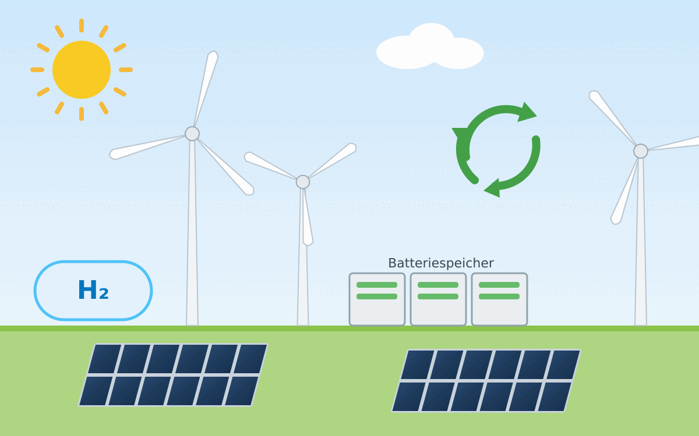

<figure class="ai-generated">
    
    <figcaption>Mit Claude AI generierte Illustration: Windkraft, Photovoltaik, Batteriespeicher, Wasserstoff und Recycling</figcaption>
</figure>

* Batteriespeicher

## Technologieführerschaft

Deutschland war in verschiedenen grünen Technologien führend. Noch könnten wir
das teilweise wieder werden.

### Wasserstoff

Für Stahlproduktion

Bei Förderung, Transport und Speicherung von Wasserstoff

### Recycling

* Batterien
* Solarzellen
* Windkraftanlagen

## Regulierung

* Selbstfahrende Busse und Shuttles
* Drohnen für Paketlieferungen

## Standardisierung

* Batterien in Heimspeichern
* Batterien in Elektroautos
* Aufbau Windkraftanlagen fürs Recycling
* Beantragung Windkraftanlagen
