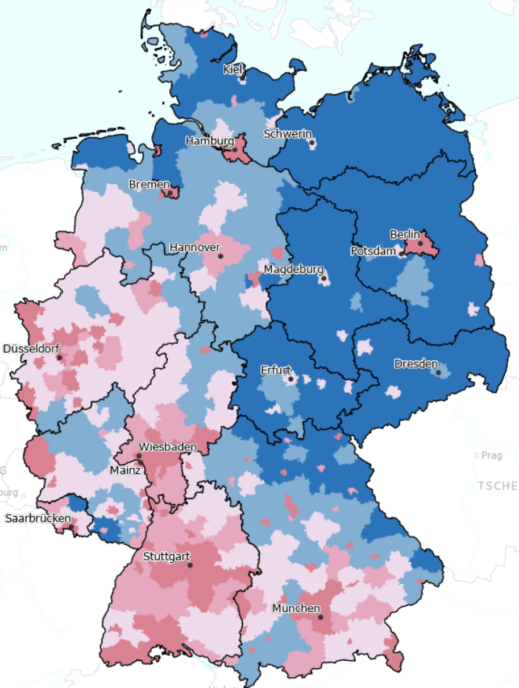

<figure class="wp-caption aligncenter img-thumbnail">
    
    <figcaption class="text-center"><a href="https://www.deutschlandatlas.bund.de/DE/Karten/Wer-wir-sind/Auslaendische-Bevoelkerung.html">Menschen ohne Deutsche Staatsangehörigkeit in Deutschland</a>: 12.3 Millionen Menschen oder 14.6% der Menschen in Deutschland</figcaption>
</figure>

Seit dem [Bürgerkrieg in Syrien 2011](https://de.wikipedia.org/wiki/B%C3%BCrgerkrieg_in_Syrien_seit_2011) und der damit verbundenen
[Flüchtlingskrise in Europa 2015/2016](https://de.wikipedia.org/wiki/Fl%C3%BCchtlingskrise_in_Europa_2015/2016)
sehe ich in Deutschland immer wieder sehr unstrukturierte und undifferenzierte
Diskussionen rund um Ausländer. Es gibt keine klare Problembenennung und als
Lösung sieht man unterschwellig kommuniziert nur "Ausländer raus", wie z.B.
an dem von der CDU eingebrachten Zustrombegrenzungsgesetz, welches den Fokus
auf die Begrenzung des Zuzugs von Ausländern legt, während wir in Deutschland
eine alternde Bevölkerung haben. Ohne Zuwanderung wird Deutschland schrumpfen.

## Über wen reden wir?

Aleksa Muncan, Auszubildender für Altenpflege, unterstützt seine Familie in
Deutschland:

<iframe width="560" height="315" src="https://www.youtube.com/embed/DI913gTxprU?si=NtyTut5Fj29ZQQ9X" title="YouTube video player" frameborder="0" allow="accelerometer; autoplay; clipboard-write; encrypted-media; gyroscope; picture-in-picture; web-share" referrerpolicy="strict-origin-when-cross-origin" allowfullscreen></iframe>

"Geduldete":

<iframe width="560" height="315" src="https://www.youtube.com/embed/kUQdzM6L6bc?si=cGgOu2K4mzKFltly" title="YouTube video player" frameborder="0" allow="accelerometer; autoplay; clipboard-write; encrypted-media; gyroscope; picture-in-picture; web-share" referrerpolicy="strict-origin-when-cross-origin" allowfullscreen></iframe>

Syrer, die ihre ganze Kindheit in Deutschland verbracht haben:

<iframe width="560" height="315" src="https://www.youtube.com/embed/pWAsYcqXdQQ?si=GjZoDf1sJYwmV26y" title="YouTube video player" frameborder="0" allow="accelerometer; autoplay; clipboard-write; encrypted-media; gyroscope; picture-in-picture; web-share" referrerpolicy="strict-origin-when-cross-origin" allowfullscreen></iframe>

Wir renden hier von hunderttausenden von Menschen, die in Deutschland leben,
arbeiten und steuern zahlen. Menschen, die in Deutschland geboren sind und
teilweise die deutsche Staatsbürgerschaft haben. Kinder, Auszubildende,
Kollegen. Menschen, denen wir mit
der Art wie wir über sie reden, das Gefühl geben, dass sie nicht willkommen
sind. Menschen, denen wir Angst um ihre Zukunft machen.

## Ausländer: Flüchtlinge, Migranten, Kinder

Politiker und Medien werfen zwei (ggf. drei) Gruppen von Menschen im
öffentlichen Diskurs in einen Topf:

* **Flüchtlinge** sind Menschen, die aus ihrem   Land fliehen, weil sie dort
  verfolgt werden. Dies kann aus politischen, religiösen, ethnischen oder
  geschlechtsspezifischen Gründen geschehen. Auch Kriege und bewaffnete
  Konflikte zwingen Menschen zur Flucht. Ihr Leben ist in ihrer Heimat in
  Gefahr. Sobald ein Flüchtling einen Antrag stellen will, wird er als
  Asylsuchender bezeichnet. Wenn der Antrag vom Bundesamt erfasst wurde, wird er
  als Asylantragstellender bezeichnet. Sobald der Asylantrag positiv beschieden
  wird, ist er ein anerkannter Flüchtling. [Subsidiär Schutzsuchende](https://de.wikipedia.org/wiki/Subsidi%C3%A4r_Schutzberechtigter) würde ich auch als Flüchtlinge bezeichnen,
  obwohl sie nicht die Genfer Flüchtlingskonvention erfüllen. Das sind Menschen,
  die z.B. wegen Blasphemie oder ihrer sexuellen Orientierung in ihrem Heimatland
  verfolgt werden. In Deutschland leben 3,48 Millionen Flüchtlinge,  ([Stand 2024](https://www.tagesschau.de/inland/zahl-gefluechtete-deutschland-100.html)) (4,1% der [Einwohner Deutschlands](https://de.wikipedia.org/wiki/Demografie_Deutschlands)), davon 1,18 Millionen aus der Ukraine.
* **Migranten** sind Menschen, die aus verschiedenen Gründen in ein anderes Land
  ziehen, z. B. wegen besserer wirtschaftlicher Perspektiven oder familiärer
  Bindungen. Flüchtlinge sind eine Untergruppe der Migranten. Der Begriff
  "Menschen mit Migrationshintergrund" umfasst sowohl Migranten selbst als auch
  deren Kinder und Enkel. 2023 lebten in Deutschland etwa 10&nbsp;Millionen
  Migranten ohne Fluchthintergrund.

Sowohl Flüchtlinge als auch Migranten bekommen natürlich **Kinder**. In
Deutschland kann seit 2000 in bestimmten Fällen das Geburtsortsprinzip angewandt
werden ([§ 4 Abs. 3 StAG](https://www.gesetze-im-internet.de/stag/__4.html)),
allerdings kann es auch passieren, dass Kinder in Deutschland geboren werden und
[staatenlos](https://de.wikipedia.org/wiki/Staatenloser) werden
([Quelle](https://verfassungsblog.de/staatenlos-ab-geburt/)).

Flüchtlinge werden durch die [Genfer Flüchtlingskonvention](https://de.wikipedia.org/wiki/Abkommen_%C3%BCber_die_Rechtsstellung_der_Fl%C3%BCchtlinge) geschützt.
Insbesondere beinhaltet es völkerrechtlich das [Verbot der Ausweisung und
Zurückweisung](https://de.wikipedia.org/wiki/Non-Refoulement) von Flüchtlingen.
Der Gedanke ist, dass man Menschen
nicht in den Tod schicken sollte.

Migration kann man regulieren und begrenzen. Hier hat man Gestaltungsspielraum.
Bei Flüchtlingen ist es wesentlich schwieriger, wenn man sich an geltendes
Völkerrecht halten möchte.

Eine im politischen Diskurs wichtige Gruppe sind irreguläre Migranten, also
Menschen die sich ohne legalen Aufenthaltsstatus in Deutschland befinden. 2022
gab es 56.000 dokumentierte Fälle. Hinzu kommen 304.308 ausreisepflichtige
Menschen in Deutschland, von denen aber 82% der "Ausreisepflichtigen" eine
Duldung besitzen; sie können also nicht abgeschoben werden
([Quelle](https://mediendienst-integration.de/migration/irregulaere.html)).
Geduldete fallen somit nicht unter die Kategorie der Papierlosen/ Irregulären.
Die Zahl der "unmittelbar Ausreisepflichtigen" – also Personen, die tatsächlich
irregulär sind – beläuft sich auf **56.163** (Stand: Dezember 2022).

## Was sind Deutschlands Probleme?

Meine Antwort darauf ist:

* **Wohlstandsverlust**: Steigende Mieten, Lebensmittelpreise, Energiepreise,
  Sozialabgaben für die Krankenversicherung und die Rente
  bei gleichzeitig nicht so stark steigenden Löhnen führen zu einem
  Reallohnverlust. Dies trifft insbesondere Geringverdiener hart. Der
  Wohlstandsverlust wurde in den letzten Jahren vor allem durch die
  [COVID-19 Pandemie 2020 - 2023](https://de.wikipedia.org/wiki/COVID-19-Pandemie_in_Deutschland)
  und den [Ukraine-Krieg 2022](https://de.wikipedia.org/wiki/Russisch-Ukrainischer_Krieg)
  verursacht. Die während der Merkel-Regierung geschaffene Abhängigkeit von
  russischem Erdgas, die [Hochwasserkatastrophen 2021](https://de.wikipedia.org/wiki/Hochwasser_in_West-_und_Mitteleuropa_2021),
  sowie die
  [Ever Given Blockade des Suezkanals 2021](https://de.wikipedia.org/wiki/Ever_Given#2021_im_Suezkanal)
  haben ihr Übriges getan. In Zukunft wird der Klimawandel durch Ernteverluste,
  Fluten, Dürren und Flucht von Menschen aus den Tropenländern zu weiteren
  Wohlstandsverlusten führen.
  Der [demographische Wandel in Deutschland](https://de.wikipedia.org/wiki/Demografischer_Wandel#Trends_in_Deutschland)
  wird dazu führen, dass immer weniger Arbeitnehmer immer mehr Rentner
  finanzieren müssen. Das führt zu höheren Sozialabgaben für Kranken-, Renten-,
  und Pflegeversicherung. Die nächsten Beitragserhöhungen sehen jetzt schon fest
  ([Quelle](https://www.br.de/nachrichten/deutschland-welt/studie-krankenversicherten-drohen-weitere-beitragserhoehungen,UaV6Iwc)).
* **Infrastruktur**: Straßen, Brücken, Schulen und Krankenhäuser sind in
  einem schlechten Zustand. [Ökonomen fordern 600&nbsp;Milliarden für die Infrastruktur](https://www.tagesschau.de/wirtschaft/konjunktur/infrastruktur-modernisierung-sondervermoegen-100.html),
  nachdem wir Jahre lang auf fiskalische Konsolidierung gesetzt, aber im selben
  Zeitraum Infrastruktur-Schulden gemacht haben. Ein Zeichen dafür ist der
  [Einsturz der Carolabrücke 2024](https://de.wikipedia.org/wiki/Carolabr%C3%BCcke_(Dresden)).
  Ich kann mich aber auch daran erinnern, dass es monatelang in meiner Schule
  durch die Decke getropft hatte.

Zur Erhöhung des Wohlstands gibt es viele Möglichkeiten, die man grob in zwei
Kategorien teilen kann: Umverteilung und Produktionssteigerungen (sowohl von
Gütern als auch von Dienstleistungen). Dabei muss man sehen, dass eine
Umverteilung von oben nach unten zu höherem Konsum und damit einer höheren
Wirtschaftsleistung führt. Eine Umverteilung von unten nach oben führt zu einer
geringeren Wirtschaftsleistung, da Menschen mit hohem Einkommen einen geringeren
Konsumanteil haben.

1. **Steuern für geringe Einkommen senken**: Eine Abschaffung des Solis hilft nur
   Menschen, die ihn auch zahlen. Das ist ab einem [Jahresbruttoeinkommen von
   96.820€](https://www.stuttgarter-zeitung.de/inhalt.wer-muss-soli-bezahlen-mhsd.a13c5bfe-323d-4817-9429-420d00e0f85a.html)
   der Fall. Den Soli abzuschaffen verteilt also Geld von Menschen mit geringen
   Einkommen zu Menschen mit hohen Einkommen. Ähnlich sieht es bei aktuell
   vorgeschlagenen Lohnsteuersenkungen aus. Bei Steuern, die zu einem hohen
   Anteil von Menschen mit geringen Einkommen bezahlt werden, profitieren
   Menschen mit geringen Einkommen bei einer Senkung. Das sind z.B.:
    * **Steuern auf Lebensmittel senken**
    * **Steuern auf Energie senken**
    * **Vermögensteuer wieder einführen**
    * **Millionen-Erbschaften und Schenkungen effektiv besteuern**
2. **Zuschüsse des Staates zur gesetzlichen Krankenversicherung erhöhen**: Ein
   Systemwechsel zum Beveridge-Modell erscheint mir wünschenswert.
   Jeder sollte für die gesetzliche Krankenversicherung zahlen und auch auf die
   Leistungen zugreifen können. Wenn man die Kosten progressiv z.B. mit der
   Lohnsteuer gestaltet, dann ist das auch eine Umverteilung von oben nach
   unten. Im Gegenzug könnte man die Beiträge zur Kranken- und
   Pflegeversicherung abschaffen. Wenn hingegen gesetzliche Krankenkassen die
   Kosten für Bürgergeldempfänger tragen müssen, ist das eine Umverteilung von
   Arm zu Reich.

Um Win-win-Situationen zu schaffen, muss man die Wirtschaftsleistung erhöhen.
Das passiert vor allem durch eine **planbar** erhöhte Nachfrage. Das kann man
durch **langfristige Investitionen** erreichen. Das können Investitionen in die
Infrastruktur sein - Straßen, Brücken, Schulen, Krankenhäuser. Um die
Infrastruktur zu verbessern ist vor allem Geld nötig. Man kann dafür die
Schuldenbremse lockern, Steuerbetrug bekämpfen, Steuern erhöhen oder Ausgaben in
der Verwaltung senken. Teilweise kann man die Wirtschaft auch durch
**Regulierung** und einen **sicheren Rechtsrahmen** ankurbeln. Oder umgekehrt
formuliert: Unsicherheit ist ein Investitionshemmnis. Wenn die Planungs- und
Genehmigungsverfahren für Windkraftanlagen so lange dauern, wird es teuer. Dann
wird es unattraktiv.

Wir benötigen eine Effizienzsteigerung in der Wirtschaft um dem demographischen
Wandel entgegenzuwirken. Eine **Erhöhung des Mindestlohns** sollte einige
Effekte haben: (1) Menschen in Teilzeit haben einen höheren Anreiz mehr zu
arbeiten (2) Ineffiziente Unternehmen gehen pleite und machen damit Platz für
effizientere Unternehmen oder Praktiken. Das sieht man z.B. daran, dass wir in
Deutschland keine Einpacker in Supermärkten haben. Wir nutzen auch so gut wie
immer einen Bankautomaten und keinen Schalter. Selbstbedienungskassen verbreiten
sich weiter, umso teurer die Arbeitskraft wird. Firmen wie
[Hilti](https://de.wikipedia.org/wiki/Hilti_(Unternehmen)) können ihre Produkte
nur so teuer verkaufen, weil sie den Bauarbeitern Zeit sparen - und die
Arbeitszeit teurer ist. Ein höherer Lohn führt also zu dem nötigen Druck um
bekannte Effizienzsteigerungen durchzusetzen. Im europäischen Vergleich sind wir
hinter Luxemburg, Irland, den Niederlanden und Belgien eines der Länder mit dem
höchsten Mindestlohn. Erhöhungen sollten hier vorsichtig durchgeführt werden.

**Günstigen Wohnraum** schafft man in Städten durch Wohnungsbau. Ein
kleiner Teil der Lösung kann auch Leerstands- und Fremdnutzungsbekämpfung sein,
z.B. durch erhöhte Steuern auf Leerstand und dem Verbot der Fremdnutzung von
Wohnraum (AirBnB). Wenn wir nicht alle paar Jahre wieder die gleiche Diskussion
um Mietpreise haben wollen, sollte der Staat über die Städte und Gemeinden genug
Wohnraum im Besitz haben, um den Markt zu regulieren. Wohnraum können wir
günstig durch [serielles](https://www.dw-systembau.de/serielles-bauen.html) und
[modulares Bauen](https://de.wikipedia.org/wiki/Modulares_Bauen) schaffen.

## Migrationsspezifische Probleme

Der Zuzug von Menschen kann Probleme verursachen, die gelöst werden müssen.
Es sind definitiv nicht die großen Probleme unserer Gesellschaft, aber wir
tun uns auch keinen Gefallen, wenn wir sie ignorieren. Ich würde mir wünschen,
dass wir die politische Energie angemessen verteilen: Wohlstand von finanziell
schwachen Menschen steigern sollte Priorität haben. Migration ist
ein Nebenschauplatz. Weil es aber nun so stark diskutiert wird, will ich die
auf die Probleme eingehen, die Migration verursachen kann.

Ein paar der Probleme sind tatsächlich schon gelöst ✅, andere haben Lösungsideen
⏳, aber leider gibt es auch offene Probleme ❌.

### ✅ Flüchtlings-Verteilung in Europa

**Wie verteilen wir Flüchtlinge und die finanzielle Belastung in Europa?**

Wir haben ein [Gemeinsames Europäisches
Asylsystem](https://de.wikipedia.org/wiki/Asylpolitik_der_Europ%C3%A4ischen_Union).
Das sollten wir nutzen um Folgendes zu erreichen: (1) Effektive Erfassung Einreisender an den
EU-Außengrenzen (2) Verteilung mit einem Fokus auf die Integration - wer die
Sprache spricht oder bereits Verwandte in einem Land hat, sollte dort hin (3)
Faire Verteilung aller Kosten - also Kosten für die Erfassung, Unterbringung,
und Integration.

Im Dezember 2023 lebten die meisten Geflüchteten laut Statista in Zypern, Tschechien,
Deutschland, Österreich und Estland. Sehr wenige Geflüchtete leben in
Rumänien, Portugal, Ungarn, Slowenien, Kroatien und Italien:

Das könnte daran liegen, dass der Verteilungsschlüssel sinnvollerweise nicht nur
nach Einwohnerzahl, sondern auch nach dem Steueraufkommen berechnet wird. Wenn
sich ein Land drücken will sollte man das Land europarechtlich zur Verantwortung
ziehen. So hat der [EuGH Ungarn 2024 zu 200 Millionen + täglich 1 Millionen Zwangsgeld verurteilt](https://www.tagesschau.de/ausland/eugh-asyl-ungarn-100.html), weil EU-Asylregeln
nicht umgesetzt wurden.

Das ist also ein gelöstes Problem ✅. Wenn es einzelne Staaten gibt die sich
nicht an die Absprachen halten, muss man vor den EuGH. Und wenn man existierende
Absprachen ändern will, muss man konkret benennen, was man ändern will und warum.

### ✅ Flüchtlings-Verteilung in Deutschland

Flüchtlinge werden in Deutschland mit dem
[EASY-System](https://www.bamf.de/DE/Themen/AsylFluechtlingsschutz/AblaufAsylverfahrens/Erstverteilung/erstverteilung-node.html)
verteilt. Im Grunde gibt es eine Quote die auf dem Königsteiner Schlüssel
basiert. Dabei spielt zu 2/3 das Steueraufkommen und zu 1/3 die Bevölkerungszahl
eine Rolle.

Wie es innerhalb eines Bundeslandes aufgeteilt wird ist Sache des Bundeslandes.
Bayern hat das beispielsweise in
[§ 3 der Asyldurchführungsverordnung](https://www.gesetze-bayern.de/Content/Document/BayDVAsyl-3)
geregelt.

Eine [interaktive Karte](https://www.destatis.de/DE/Presse/Pressemitteilungen/2023/03/PD23_125_125.html)
zeigt die tatsächliche Verteilung.

### ❌ Föderalismus: Sorgen und Lösungen für Kommunen

In Deutschland haben wir das bizarre System, dass der Bund und die Länder vieles
entscheiden können, was die Kommunen dann umsetzen müssen - und was sie auch
finanzieren müssen.

[23% der Kommunen geben an mit der **Unterbringung** überlastet zu
sein](https://www.mdr.de/wissen/psychologie-sozialwissenschaften/kommunen-weiter-am-limit-lage-im-osten-deutlich-entspannter-100.html),
bei 6% verursacht das keine Problem und 71% sehen es als machbare
Herausforderung.

Würden wir mit seriellem und modularem Bauen günstigen Gemeinschaftswohnraum
schaffen, könnten wir die Wirtschaft ankurbeln und diese Herausforderung
meistern. Es würde uns resilienter gegenüber künftigen Herausforderungen wie
z.B. Fluten, Kriegen, oder Pandemien machen.

57% der Ausländerbehörden geben an überlastet zu sein. Das liegt unter anderem
daran, dass sie sich mit Arbeitserlaubnissen auseinandersetzen müssen. Würden
wir pauschal allen anerkannten Flüchtlingen eine **Arbeitserlaubnis** geben,
wäre auf einen Schlag ein großer Teil der Arbeit weg. Es könnte [auch](https://www.migazin.de/2024/07/24/asylbewerber-koennen-nicht-einfach-in-die-arbeitsmigration-wechseln/)
[andere Probleme](https://www.focus.de/finanzen/news/nach-einem-jahr-arbeit-ahmad-wird-arbeitserlaubnis-entzogen-ex-chef-das-ist-menschenverachtend_id_259751497.html) verhindern. Im [November 2023](https://www.zdf.de/nachrichten/politik/bundesregierung-asyl-fluechtlinge-gesetz-100.html) hat man beschlossen, dass
Geflüchtete nur noch ein 6-monatiges Arbeitsverbot haben; zuvor waren es
9&nbsp;Monate.

Für die Kinderbetreuung könnte man sicherlich auch innerhalb der Geflüchteten
selbst Lösungen finden. So könnten ein paar einen Job bekommen und andere
arbeiten gehen.

### ⏳ Wie integrieren wir anerkannte Flüchtlinge effektiv?

Dabei geht es um Sprachkurse, die Anerkennung von Abschlüssen und die
Integration in das soziale Umfeld. Um das zu messen könnte man sich auf den Job
konzentrieren. Wer mindestens 2 Jahre in einem sozialversicherungspflichtigen
Job ist und mindestens
[B1-Sprachkentnisse](https://de.wikipedia.org/wiki/Gemeinsamer_europ%C3%A4ischer_Referenzrahmen_f%C3%BCr_Sprachen#Kompetenzniveaus)
hat, ist integriert.

### ⏳ Wie gehen wir mit arbeitslosen Migranten um?

Migranten ohne Fluchthintergrund sollten einen Mehrwert für die Gesellschaft
schaffen. Deutschland hat (befristete) Aufenthaltserlaubnisse (1) zum
[Zweck der Ausbildung](https://www.gesetze-im-internet.de/aufenthg_2004/BJNR195010004.html#BJNR195010004BJNG000502311), (2)
dem [Zweck der Erwerbstätigkeit](https://www.gesetze-im-internet.de/aufenthg_2004/BJNR195010004.html#BJNR195010004BJNG000601310) (inkl. [Blaue Karte EU](https://de.wikipedia.org/wiki/Blaue_Karte_EU)),
(3) für [humanitäre Zwecke](https://www.gesetze-im-internet.de/aufenthg_2004/BJNR195010004.html#BJNR195010004BJNG000701310),
und (4)
[Familiennachzug](https://www.gesetze-im-internet.de/aufenthg_2004/BJNR195010004.html#BJNR195010004BJNG000801310).

Wenn wir nun nur die arbeitslosen Migranten, welche eine Aufenthaltserlaubnis
zwecks Erwerbstätigkeit haben betrachten, dann sollten wir eine deutlich
geringere Arbeitslosenquote sehen. Bei einem Aufenthalt zwecks Ausbildung sogar
gar keine. Bei dem Aufenthalt zwecks humanitärer Zwecke (Flucht) oder
Familiennachzug reden wir häufiger über Menschen, welche keine Arbeitserlaubnis
bekommen oder die Sprache nicht sprechen. Hier ist als mit einer hohen
Arbeitslosigkeit zu rechnen.

### ✅ Kriminalität und Terrorismus

Schwere Straftaten wie Mord oder Vergewaltigung verursachen immer einen großen
medialen Aufschrei, insbesondere wenn sie von Ausländern begangen werden.
Zuletzt:

* 2024 [Anschlag auf den Magdeburger
  Weihnachtsmarkt](https://de.wikipedia.org/wiki/Anschlag_auf_den_Magdeburger_Weihnachtsmarkt):
  Der Täter ist mit einem Auto in die Menschenmenge gerast. Er wurde in
  Saudi-Arabien geboren, hat seit  2020 als Facharzt für Psychiatrie und
  Psychotherapie gearbeitet. Er war ein anerkannter Flüchtling, Islam-Kritiker,
  und Anhänger der AfD. Der Täter war den Behörden bekannt.
* 2024 [Messeranschlag in
  Solingen](https://de.wikipedia.org/wiki/Messeranschlag_in_Solingen):
  mutmaßlich islamistischer Terroranschlag eines syrischen Asylsuchenden. Sein
  Asylantrag wurde abgelehnt, da Bulgarien zuständig war. Die Abschiebung wurde
  dann jedoch nicht durchgeführt.

Insgesamt muss man sagen: [Deutschland ist sicher](https://www.n-tv.de/panorama/Gefuehlte-Kriminalitaet-Wird-es-wirklich-immer-schlimmer-article25529779.html).
Natürlich existiert [Ausländerkriminalität](https://de.wikipedia.org/wiki/Ausl%C3%A4nderkriminalit%C3%A4t). Und selbstverständlich sollte man dagegen
vorgehen - genau wie gegen Kriminalität, welche von Deutschen begangen wurde.

Ein guter Artikel von der Bundeszentrale für Politische Bildung (BPB) dazu:

Christian Walburg: [Migration und Kriminalität – Erfahrungen und neuere Entwicklungen](https://www.bpb.de/themen/innere-sicherheit/dossier-innere-sicherheit/301624/migration-und-kriminalitaet-erfahrungen-und-neuere-entwicklungen/), 2020.

Wenn wir nun über die oben genannten Anschläge reden, muss klar sein, dass
zumindest bei dem Fall in Magdeburg der Täter offensichtlich psychisch krank
war. Wir haben hier als Gesellschaft versagt, weil wir einem Kranken nicht die
nötige Behandlung haben zukommen lassen - notfalls auch mit Zwang.

Das passiert nicht nur mit Ausländern. In der [Liste der Terroranschläge seit 1945](https://de.wikipedia.org/wiki/Liste_von_Terroranschl%C3%A4gen_in_Deutschland_seit_1945) sehe
ich 84 neonazistische, 68 rechtsextremistische, 22 linksextremistische und 13
antisemitische Anschläge.

[§ 53 Aufenthaltsgesetz Abs. (1)](https://www.gesetze-im-internet.de/aufenthg_2004/__53.html) lautet:

> Ein Ausländer, dessen Aufenthalt die öffentliche Sicherheit und Ordnung, die
> freiheitliche demokratische Grundordnung oder sonstige erhebliche Interessen
> der Bundesrepublik Deutschland gefährdet, wird ausgewiesen, wenn die unter
> Berücksichtigung aller Umstände des Einzelfalles vorzunehmende Abwägung der
> Interessen an der Ausreise mit den Interessen an einem weiteren Verbleib des
> Ausländers im Bundesgebiet ergibt, dass das öffentliche Interesse an der
> Ausreise überwiegt.

Diese Fassung des [Aufenthaltsgesetzes](https://de.wikipedia.org/wiki/Aufenthaltsgesetz)
ist seit 2005 in Kraft. Wir haben also die rechtlichen Mittel. Und wir schieben
auch ab - wenn auch nicht immer nur wegen Kriminalität. [2024 gab es 18.400 Abschiebungen](https://www.tagesschau.de/inland/innenpolitik/deutschland-abschiebungen-2024-100.html).

Ich markiere das mit ✅ als gelöstes Problem, weil wir einen funktionierenden
Rechtsstaat haben. Ja, es gibt Kriminalität und Terrorismus. Auch von
Ausländern. Aber es spielt für den Staat keine Rolle, ob es ein Ausländer verübt
hat oder nicht. Vor dem Gesetz sollten alle gleich sein.

### ❌ Durchführung von Abschiebungen

Sobald rechtlich sicher entschieden wurde, dass jemand abgeschoben werden soll,
gibt es ein paar praktische Probleme, weshalb [62 Prozent geplanter
Abschiebungen
scheitern](https://www.zdf.de/nachrichten/politik/deutschland/abschiebungen-gescheitert-asylbewerber-ampel-100.html):

1. **Person nicht auffindbar**: Die Person muss ja gar nicht auf der Flucht
   sein. Im Fall des Solinger Messeranschlags hat man es wohl einmal versucht
   den Mann zu Hause anzutreffen und es dann nicht mehr versucht.
2. **Rückführungsflüge fallen aus**
3. **Annahmeverweigerung des Zielstaats**: Hierunter würde ich es auch zählen,
   wenn der Zielstaat die Zustellungsbedingungen unnötig kompliziert macht.
4. **Medizinische Probleme des Betroffenen**

Im Januar 2024 hatte der Bundestag mit den Stimmen der Ampel-Fraktionen ein
Gesetz für mehr und schnellere Abschiebungen abgelehnter Asylbewerber
beschlossen. Es sieht insbesondere verlängerte Haftmöglichkeiten für
Abschiebepflichtige und mehr Rechte der Polizei bei Durchsuchungen von
Unterkünften vor.

Bevor man das Thema erneut aufgreift würde ich mir wünschen, dass man zuerst die
genauen Gründe für die gescheiterten Abschiebungen analysiert. Nur mit einer
vernünftigen Problemanalyse kann zuverlässig funktionierende Lösungen finden.

## Fehlerhafte Problemanalyse

<figure class="wp-caption aligncenter img-thumbnail">
    
    <figcaption class="text-center">Abegwandelte Karrikatur; ursprünglich von <a href="https://www.instagram.com/d.lushch.art/">Denis Lushch</a></figcaption>
</figure>

Im aktuellen CDU-Wahlprogramm steht: "Großangelegter Sozialleistungsmissbrauch,
im Inland und von im Ausland lebenden Menschen, muss beendet werden".
2022 wurde der Schaden auf 273 Millionen Euro geschätzt ([Quelle](https://www.zdf.de/nachrichten/wirtschaft/sozialbetrug-clans-ausmass-100.html)). Für Cum-Cum/Cum-Ex beträgt das Volumen hingegen [mindestens 35 Milliarden in
Deutschland](https://www.zdf.de/nachrichten/politik/deutschland/cum-ex-skandal-backgroundcheck-100.html) - also 128x so viel.
Die ehemalige Staatsanwältin [Anne Brohiker klärt auf dem 38C3
auf](https://www.youtube.com/watch?v=fPR9BSnhpRw&t=2257s) und bringt konkrete
Vorschläge. Nichts davon findet sich im CDU-Wahlprogramm. Natürlich sollte beides
bekämpft werden. Die Priorität sollte aber klar sein. Und letzteres wird zumindest
nicht explizit erwähnt. Auch von Share-Deals und andere "Steuergestaltungsmöglichkeiten"
fasst man nicht an.

Eine ähnlich fehlerhafte Problemanalyse bzw. Lösungsfindung sieht man häufiger
nach Anschlägen. Da macht ein jahrelang in Deutschland ansässiger Arzt einen
Anschlag und die Lösung ist dann, dass die Grenzen kontrolliert werden sollen.
Das nennt man [Security-Theater](https://en.wikipedia.org/wiki/Security_theater):
Maßnahmen, die nur gemacht werden, um den Eindruck von Sicherheit zu erwecken.

Man kann die fehlende Effektivität auch anders betrachten: Wir hatten 2024
etwa [2760 Verkehrstote und 2.510.000 Unfälle in Deutschland](https://www.adac.de/news/bilanz-verkehrstote/). [Geschwindigkeitsbegrenzungen halbierten die Unfallzahlen](https://www.mdr.de/nachrichten/deutschland/panorama/tempolimit-autobahn-hundert-unfaelle-halbiert-100.html)
auf der A4 bei Dresden. Wenn wir so einfach ohne nennenswerte Kosten hunderte
von Menschen retten könnten, geht es Merz offensichtlich nicht um Menschenleben.
Sonst müsste er ein generelles Tempolimit fordern.

Und wenn es um psychisch kranke Menschen geht:

* In Deutschland sitzen derzeit etwa 45.000 Personen in Justizvollzuganstalten
  ein. Schätzungen zu Folge leiden bis zu 88 % dieser Personen unter einer oder
  mehreren psychischen Erkrankungen ([Quelle](https://www.dgppn.de/presse/pressemitteilungen/pressemitteilungen-2022/psychisch-erkrankte-straftaeter.html)).
* Gerade auf dem Land fehlen Therapeuten, es gibt Wartezeit von bis zu einem Jahr ([Quelle](https://www.tagesschau.de/inland/gesellschaft/psychotherapie-platz-101.html))
* Es ist unbekannt wie viele Menschen eine Therapie benötigen, aber keine
  bekommen. Oder sich nicht trauen überhaupt danach zu suchen, weil
  [Linnemann ein Zwangsregister für psychisch kranke will](https://www.zdf.de/nachrichten/politik/deutschland/linnemann-register-psychisch-kranke-gewalttaeter-cdu-kommentar-100.html)
  und [Berufsverbote drohen](https://www.aerztezeitung.de/Wirtschaft/Psychische-Krankheit-kann-zu-Berufsverbot-fuehren-218005.html).

## 2 Wortbrüche = 1 Dammbruch?

In der letzten Woche gab es zwei Abstimmungen, die mich dazu bewogen haben,
diesen Artikel zu schreiben:

* [Merz 5-Punkte-Plan zur Verschärfung der Migrationspolitik](https://www.tagesschau.de/inland/innenpolitik/merz-antraege-100.html) am Mittwoch ([Ergebnisse](https://www.swr.de/swraktuell/baden-wuerttemberg/migration-verschaerfung-merz-bundestag-reaktionen-landtag-bw-100.html)). Die 5-Punkte des Antrags sind:
    * <b>Dauerhafte Grenzkontrollen</b> zu allen Nachbarstaaten: Das ist europarechtlich
      nicht möglich. Deutschland ist Mitglied des [Schengen-Raums](https://de.wikipedia.org/wiki/Schengen-Raum). Das bedeutet,
      dass es keine Grenzkontrollen zu anderen Schengen-Staaten gibt ([Verordnung (EU) 2016/399, Artikel 22](https://eur-lex.europa.eu/legal-content/DE/ALL/?uri=celex%3A32016R0399)). Es gibt
      nur Kontrollen an den Außengrenzen. Das ist auch gut so, denn das
      erleichtert den Handel und den Tourismus. Deutschland hat außerdem
      [3876&nbsp;km Außengrenzen](https://www.destatis.de/DE/Themen/Laender-Regionen/Regionales/Tabellen/gemeinsame-grenzen-deutschlands.html). Die Grenze zwischen
      den USA und Mexiko ist nur [3145&nbsp;km](https://de.wikipedia.org/wiki/Grenze_zwischen_den_Vereinigten_Staaten_und_Mexiko) lang und kann schon
      nicht effektiv kontrolliert werden. Will Merz wie Trump eine Mauer bauen?
      Oder will er Tausende von zusätzlichen Polizisten dafür einstellen?
      Welche Steuern will er dafür erhöhen?
    * <b>Einreiseverbot</b> für alle Personen, die
      keine gültigen Einreisedokumente besitzen, unabhängig davon, ob sie ein
      Schutzgesuch äußern oder nicht - die europäischen Nachbarstaaten seien
      bereits sichere Staaten für Verfolgte. Das würde massive Kosten
      verursachen, selbst wenn man es nur temporär über Kontrollen machen will.
      Und was hindert die Personen einfach sofort wieder am nächsten Tag
      einzureisen? Wollen wir wegen 56.163 irregulärer Migranten, welche
      vermutlich keine Sozialleistungen beziehen und uns daher nichts kosten,
      die Europäische Union gefährden? Wer das leichtfertig mit "ja" beantwortet,
      der sollte mal einen Blick auf den [Brexit](https://de.wikipedia.org/wiki/EU-Austritt_des_Vereinigten_K%C3%B6nigreichs)
      werfen.
    * <b>Inhaftierung vollziehbar
      Ausreisepflichtigen</b>, auch in leerstehende Kasernen und
      Containerbauten. Abschiebungen müssten "täglich stattfinden", regelmäßig
      auch nach Afghanistan und Syrien. Kasernen und Containerbauten sind
      keine Gefängnisse, man müsste also für teures Geld Umbaumaßnahmen
      durchführen. Ob und wann Abschiebungen stattfinden ist nicht nur von
      Deutschland abhängig, sondern auch vom Zielland. Nehmen wir mal optimistisch
      an, dass es im Schnitt 20 Tage wären. Seit 2014 haben wir im Schnitt etwa
      [20.000 Menschen pro Jahr](https://de.statista.com/statistik/daten/studie/451861/umfrage/abschiebungen-aus-deutschland/) abgeschoben. Ein Tag im Gefängnis kostet
      im Schnitt [110€/Tag](https://fragdenstaat.de/anfrage/inhaftierungskosten-in-justizvollzugsanstalten/), also würden wir jährlich
      2.2&nbsp;Millionen EUR nur dafür ausgeben. Zusätzlich muss man sagen, dass in
      [Afghanistan](https://de.wikipedia.org/wiki/Afghanistan) die Taliban
      herrschen und [in Syrien ist der IS stark](https://www.auswaertiges-amt.de/de/service/laender/syrien-node/syriensicherheit-204278). Menschenrechte verbieten, dass wir
      Menschen in solche Länder abschieben - auch wenn sie dort geboren sind
      und auch wenn sie hier straffällig geworden sind.
    * Unterstützung für die Länder beim <b>Vollzug der Ausreisepflicht</b>. Die
      Bundespolizei soll Haftbefehle für Abschiebehaft oder Ausreisegewahrsam
      beantragen können. Hier bin ich mir unsicher, was das bedeuten würde. Hört sich für mich erst mal sinnvoll an. Vielleicht kann mir jemand mehr dazu schreiben.
    * Ausreisepflichtige Straftäter und Gefährder sollen in einem <b>zeitlich
      unbefristeten Ausreisearrest</b> bleiben, bis sie freiwillig in ihr Heimatland
      zurückkehren oder die Abschiebung vollzogen werden könne.. Einze
      zeitlich unbegrenzte Inhaftierung hört sich nicht legal an. Insbesondere
      scheint man hier keinen Unterschied zwischen Geflüchteten und Migranten
      ohne Fluchtursache zu machen. Und solange das Schwarzfahren eine Straftat
      ist, wegen der Menschen tatsächlich inhaftiert werden, sehe ich solche
      allgemeinen Aussagen kritisch.
* [Zustrombegrenzungsgesetz](https://www.tagesschau.de/inland/bundestagswahl/migrationsgesetz-abgelehnt-100.html) am Freitag ([Ergebnisse](https://www.abgeordnetenwatch.de/bundestag/20/abstimmungen/zustrombegrenzungsgesetz)), mit folgenden Kernpunkten ([Quelle](https://www.tagesschau.de/inland/innenpolitik/faq-abstimmung-bundestag-merz-gesetzentwurf-100.html)):
    * Im Aufenthaltsgesetz soll nicht nur die Steuerung, sondern auch die
      "Begrenzung" des Zuzugs von Ausländern erneut als übergeordnetes Ziel
      festgeschrieben werden. Das Wort "Begrenzung" war 2023 gestrichen worden. Hat das mehr als Symbolwirkung?
    * Der Familiennachzug für subsidiär
      Schutzbedürftige soll eingestellt werden. Gemeint sind Menschen, die kein
      Asyl bekommen, aber aus anderen Gründen vorerst in Deutschland bleiben
      können. Der subsidiäre Schutz war bereits zwischen 2016 und 2018
      ausgesetzt worden. Seit 2018 dürfen aus humanitären Gründen pro Monat
      1.000 Angehörige von subsidiär Schutzberechtigten nach Deutschland
      kommen. Man will also nicht mal mehr 1000 Härtefälle pro Monat
      erlauben? Wie viel von diesem Kontingent wird aktuell genutzt? Ich stelle
      mir hier minderjährige Kinder vor die nachziehen. Ist diese Vorstellung
      richtig?
    * Die Bundespolizei soll eine eigene Zuständigkeit
      für "aufenthaltsbeendende Maßnahmen" an den deutschlandweit 5.700
      Bahnhöfen erhalten, für die sie mit zuständig ist. Die Beamtinnen und
      Beamten sollen künftig auch selbst Anträge auf Haft und Gewahrsam stellen
      können, um die Abschiebung nicht aufenthaltsberechtigter Ausländer zu
      gewährleisten. Bisher müssen sich die Bundespolizisten dafür an die
      jeweilige Landespolizei wenden. Das kann ich nicht einordnen.
      Bedeutet das mehr Arbeit für die Polizei oder weniger Bürokratie?

Meine Gedanken zu dem Thema werden recht gut durch folgendes Video repräsentiert:

<iframe width="560" height="315" src="https://www.youtube.com/embed/bnHoheqszKE?si=13iDrj8eS7SLjmNl" title="YouTube video player" frameborder="0" allow="accelerometer; autoplay; clipboard-write; encrypted-media; gyroscope; picture-in-picture; web-share" referrerpolicy="strict-origin-when-cross-origin" allowfullscreen></iframe>

Obwohl ich den 5-Punkte Plan sehr kritisch sehe und bei dem
Zustrombegrenzungsgesetz zumindest unsicher bin, was das bringen soll, ist der
eigentliche Skandal der Wortbruch bzgl. folgender zwei Aussagen:

* Friedrich Merz, 23.12.2021: "Wenn irgendjemand von uns die Hand hebt, um
  mit der AfD zusammenzuarbeiten, dann steht am nächsten Tag ein
  Parteiausschlussverfahren an."
* Friedrich Merz, 12.11.2024: "Ich möchte, dass wir jetzt nur noch die Dinge auf
  die Tagesordnung setzen, die wir vorher im Konsens zwischen Opposition und
  restlicher Regierung vereinbart haben um uns alle - die Regierung und uns -
  davor zu Bewahren, dass wir plötzlich Zufallsmehrheiten im Saal mit der AfD
  oder den Linken haben. Ich will das nicht." (Quelle: Phoenix vor Ort, auf
  [YouTube](https://www.youtube.com/watch?v=xBAFj4Bp4aY)).
* [Thorsten Frei](https://de.wikipedia.org/wiki/Thorsten_Frei), 16.12.2024: "Wir werden deshalb nach der Vertrauensfrage in
  keine großen Verhandlungen einsteigen, sondern mit Rot-Grün nur über Vorhaben
  sprechen, die dringlich und zwingend geregelt werden müssen"
  ([Quelle](https://www.tagesschau.de/inland/union-gesetze-nach-vertrauensfrage-100.html)).
  Mit der Begründung wurde das [Kraftwerkssicherheitsgesetz von der Union blockiert](https://www.youtube.com/watch?v=Bz2g6G8uck4),
  mit dem wasserstofffähige Gaskraftwerke ausgeschrieben werden sollten ([Quelle](https://www.bmwk.de/Redaktion/DE/Meldung/2024/20240911-kraftwerkssicherheitsgesetz.html)).

Die Ampel hat keine Showanträge eingebracht, um die Union nicht vorzuführen
([Video](https://youtu.be/bnHoheqszKE?si=irXsfvf3E3RK5541&t=904)). Man hat sich
seit dieser Aussage auf einige Gesetzesvorhaben gemeinsam geeinigt:

* [Finanzierung des Deutschlandtickets](https://www.tagesschau.de/inland/gesellschaft/deutschlandticket-finanzierung-104.html)
* [Schutz des Bundesverfassungsgerichts](https://www.zdf.de/nachrichten/heute-19-uhr/bundesverfassungsgericht-schutz-bundestag-100.html)
* [Kalte Progression bekämpfen und mehr Kindergeld](https://www.tagesschau.de/inland/innenpolitik/kalte-progression-kindergeld-100.html)

Dass die Union den Antrag zur Migrationspolitik unabgestimmt eingebracht hat,
deutet auf eine Bereitschaft der Zusammenarbeit mit der AfD hin. Entgegen der
versprochenen Absprachen vor der nächsten Bundestagswahl, testet man jetzt die
Reaktionen aus - um ggf. dann mit Duldung der AfD eine Minderheitsregierung zu
führen. Oder im schlimmsten Fall sogar eine Koalition mit der AfD einzugehen.
So viel zur Brandmauer.

Die CDU entgegnet [wenn die Ampel dem Antrag zugestimmt hätte, hätten wir die
Stimmen der AfD nicht
gebraucht](https://youtu.be/XZYbFHr2me8?si=eZF8dHySAuMlV2Xy&t=120) zeigt damit:
Wenn es der CDU in den Kram passt, arbeitet sie mit der
AfD zusammen und bricht gleichzeitig ihr Wort.

## Was gewinnt Merz?

Man kann bei geplanten Abstimmungen wohl ausschließen, dass die Vorgänge spontan
oder unüberlegt waren. Dass ehrliche Sorge um Deutschland der Grund für sie ist,
ist wohl ausgeschlossen, weil man sonst ja mit der SPD und den Grünen eine
gemeinsame Lösung gesucht hätte, die dann auch umgesetzt wird. Warum hat man
 also den Antrag eingebracht? Ich sehe folgende Gründe:

1. **Wahlkampf um Rechte Stimmen**: Die AfD hat bei dem Antrag am Mittwoch und
  dem Zustrombegrenzungsgesetz am Freitag gejubelt. Bei den Wählern sieht es
  sicher ähnlich aus. Um Julia Klöckner zu zitieren: [Für das, was Ihr wollt, müsst Ihr nicht AfD wählen. Dafür gibt es eine demokratische Alternative: die CDU.](https://www.tagesschau.de/inland/regional/rheinlandpfalz/swr-wirbel-um-aussagen-von-julia-kloeckner-cdu-zur-afd-102.html).
2. **Vorbereitung auf Minderheitsregierung**: Die CDU/CSU könnte aus machtpolitischen
   Gründen eine [Minderheitsregierung](https://de.wikipedia.org/wiki/Minderheitsregierung#Deutschland) unter Duldung der AfD anstreben. Mit den Grünen will Söder nicht zusammenarbeiten
   und auch die SPD mit Scholz schließt Söder aus ([Quelle](https://www.tagesschau.de/inland/innenpolitik/soeder-union-koalition-spd-100.html)). Da wirds schon eng.
3. **Vorbereitung auf Koalition mit der AfD**: Im Prinzip ein ähnlicher Gedanke
   wie der vorherige. Das hängt sehr von der Stimmung im Land und von der
   Stärke der AfD ab. Aktuell halte ich das für unwahrscheinlich. Noch, am
   [2. Februar 2025](https://youtu.be/FXSAAttjI2s?si=UDngwRkeSSWn9gbX&t=49), schließt
   Merz eine Zusamenarbeit mit der AfD aus. Allerdings behauptet er auch noch, dass
   die CDU nie mit ihr zusammengearbeitet hat.
4. **Vorbereitung auf AfD-Verbot**: Die AfD könnte nach der Wahl verboten werden
   ([Quelle](https://netzpolitik.org/2025/verdachtsfall-rechtsextremismus-wir-veroeffentlichen-das-1-000-seitige-verfassungsschutz-gutachten-zur-afd/)).
   Das [Parteiverbot](https://de.wikipedia.org/wiki/Parteiverbot) führt zu einem
   sofortigem Mandatsverlust. Das bedeutet, dass sich die Mehrheitsverhältnisse
   ändern. Hätte die Union bei der Wahl 37% der Sitze und die AfD 27% durch die
   5%-Hürde, so würde ein Verbot der AfD bedeuten, dass die Union bei 51% wäre.

## Psychologische Aspekte

Wir haben Millionen Ausländer in Deutschland, die unsere Pflegeheime am laufen
halten, unsere Kranken versorgen, unsere Kinder betreuen, an den Kassen im Aldi
sitzen und unsere Pakete ausliefern. Millionen Menschen, die gute und wichtige
Arbeit leisten. Menschen die unsere Sozialsysteme stützen. Und viele Tausend die
mit extrem guten Qualifikationen z.B. als Software-Entwickler nach Deutschland
gekommen sind und vielleicht das nächste Google gründen.

Zitate wie die folgenden und Diskussionen wie die oben genannten schaden dem
Bild von Deutschland in der Welt:

* Friedrich Merz, 27.09.2022: Wirft ukrainischen Flüchtlingen "Sozialtourismus"
  vor ([Videoquelle auf YouTube](https://www.youtube.com/watch?v=hG0LDtljwm4)
  der "Welt"); am 30.01.2024 hat er behauptet, dass die Einwanderung "fast außschließlich in die sozialen Sicherungssysteme erfolgt" und damit das Narrativ das faulen
  Ausländers bedient ([Quelle](https://www.youtube.com/watch?v=bzgg9erfNaU)).
* Friedrich Merz, 11.01.2023: Nennt 8-jährige Kinder aus dem arabischen Raum
  "kleine Paschas" und will diese abschieben, wenn sie sich in der Schule
  daneben benehmen ([Videoquelle auf
  YouTube](https://www.youtube.com/watch?v=mhImgqj_HL4))

Das ist bereits im Osten ein Problem
([1](https://www.mdr.de/nachrichten/sachsen/dresden/dresden-radebeul/familie-westen-osten-alltag-rassismus-wegzug-fachkraefte-100.html),
[2](https://www.zdf.de/nachrichten/politik/deutschland/landtagswahlen-herbst-afd-diskriminierung-100.html),
[3](https://www.rnd.de/wirtschaft/warum-rassismus-fuer-ostdeutschlands-wirtschaft-zum-problem-wird-ULFEZGPHDBAVDIQVIIUFOHIPYA.html),
[4](https://www.mdr.de/nachrichten/podcast/mdr-investigativ/podcast-ost-rassismus-investigativ100.html),
[5](https://www.tiktok.com/@vylogs7/video/7465427595769826582)). Und jetzt
wird es verschärft. [Deutsche Kinder mit Migrationshintergrund bekommen Angst](https://vm.tiktok.com/ZNeojTASp/).

Wer will in ein solches Land kommen? Wenn wir uns weiter entscheiden Ausländer
prinzipiell als Problem zu diskutieren, bekommen die Rechten
irgendwann was sie wollen: Ein Land, in das niemand mehr kommen will.

## Siehe auch

* BPB: [Demografie von Asylsuchenden in Deutschland](https://www.bpb.de/themen/migration-integration/zahlen-zu-asyl/265710/demografie-von-asylsuchenden-in-deutschland/#node-content-title-2), 10.01.2024.
* Tagesschau.de: [Asylbewerber, Flüchtlinge, Migranten - was sind die Unterschiede?](https://www.tagesschau.de/inland/fluechtlinge-531.html), 07.08.2015.
