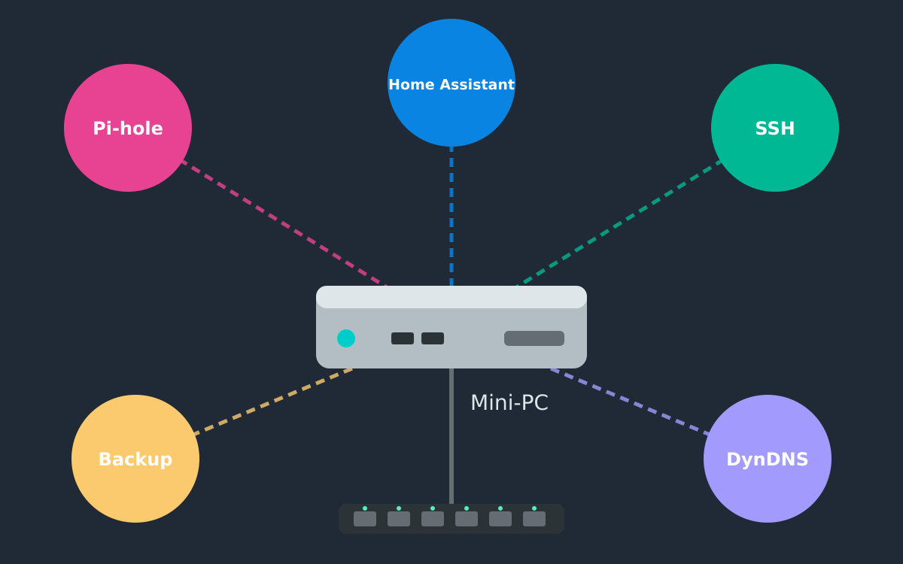
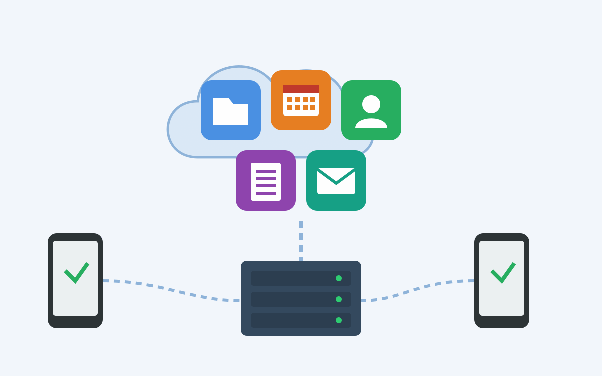

<figure class="ai-generated">
    <a href="../images/2025/06/homeserver.png"></a>
    <figcaption>Illustration generated with Claude AI: A mini PC running Pi-hole, Home Assistant, SSH, backups and dynamic DNS</figcaption>
</figure>

## Hardware

I use a Mini PC with the following specifications:

* **CPU**: [Specific model to be added]
* **RAM**: 16 GB
* **Storage**: [Capacity and type to be added]
* **Network**:
    * Gigabit Ethernet
    * Wake on LAN (WoL) support
    * Wi-Fi 6 or better

Most thin clients or mini PCs would work well for this purpose.

**Note**: A Raspberry Pi was too slow for my needs.

## Operating System

I run Ubuntu MATE on my homeserver.

## Software

### Currently Running

Services I currently run on my homeserver:

* **SSH / vim**: Remote access and administration
* **[Pi-hole](https://pi-hole.net/)**: Network-wide ad blocking
* **[Home Assistant](https://www.home-assistant.io/)** (Docker): Home automation platform
* **DuckDNS.org**: Dynamic DNS service for external access to my homeserver

### Ideas for Future Implementation

* **Operating System**: Unraid
* **Media Management**: [Immich](https://immich.app/) - Image and video management
* **Knowledge Base**: [Kiwix](https://kiwix.org/en/applications/) - Offline Wikipedia
* **Password Management**: [vaultwarden](https://vaultwarden.com/) - Bitwarden-compatible server
* **Network**: OPNsense - Firewall and router
* **Calendar/Contacts**: Baikal server
* **File Storage**: ownCloud / Nextcloud / OpenCloud (see [Self-Hosted Cloud Solutions](#self-hosted-cloud-solutions)) / [Seafile](https://www.seafile.com/en/home/) with Samba
* **Media Server**: Jellyfin / Emby / Plex
* **VPN**: WireGuard / OpenVPN
* **DNS Server**: Unbound
* **Reverse Proxy**: Nginx / Traefik
* **Monitoring**: Prometheus / Grafana
* **Backup**: Borg / Restic
* **Containerization**: Docker / Podman
* **Virtualization**: Proxmox / KVM

## Self-Hosted Cloud Solutions

<figure class="ai-generated">
    <a href="../images/2025/06/self-hosted-cloud-solutions.png"></a>
    <figcaption>Illustration generated with Claude AI: A self-hosted cloud with files, calendar, contacts, notes and e-mail on a home server</figcaption>
</figure>

### Features

* **File Administration**: Similar to Google Drive or Dropbox
    * Full-text search capabilities
* **Calendar**: Scheduling and event management
* **Contacts**: Contact management system
* **Notes**: Note-taking and organization
* **Office Suite**:
    * OnlyOffice or Collabora integration
    * Built-in spellchecker
* **Email**:
    * IMAP client support (e.g., for mailbox.org or Posteo)
* **Backups**: Data backup and restoration

### ownCloud Infinite Scale

[ownCloud](https://en.wikipedia.org/wiki/OwnCloud) is a free and open-source
software platform for file synchronization and sharing. It allows users to store
files on a private server and access them from various devices, providing a
secure alternative to public cloud services.

* **License**: AGPL-3.0-or-later
* **History**:
    * Founded in 2010 by Frank Karlitschek
    * Developed by ownCloud GmbH and the open-source community
    * Major rewrite in 2020 to create ownCloud Infinite Scale
* **Technology Stack**:
    * Backend: Go
    * Frontend: Vue.js (ownCloud Web)
    * Database: none; metadata is stored on the file system

### NextCloud

[Nextcloud](https://en.wikipedia.org/wiki/Nextcloud) is a free and open-source software suite for file hosting, similar to ownCloud. It is designed to provide a secure and private cloud storage solution, allowing users to store and share files, calendars, contacts, and more.

* **License**: AGPL-3.0
* **History**:
    * Forked from ownCloud in 2016
    * Developed by Nextcloud GmbH and the Nextcloud community
* **Technology Stack**:
    * Backend: PHP running on Apache or Nginx
    * Frontend: JavaScript with Vue.js
    * Database: MySQL/MariaDB/PostgreSQL/SQLite
* **Security Features**:
    * TOTP (Time-based One-Time Password) two-factor authentication

### OpenCloud

[OpenCloud](https://github.com/opencloud-eu/opencloud/tree/main) is a free and open-source software platform
for cloud computing, designed to provide secure and scalable infrastructure
for hosting applications and services. It aims to offer a flexible and
customizable cloud environment, allowing users to deploy and manage their own
cloud solutions.

* **Technology Stack**: Go backend, Vue.js frontend, no database

* **License**: Apache-2.0

## Configuration

### Automatic Updates

Install and configure `unattended-upgrades`:

```bash
sudo apt install unattended-upgrades
sudo dpkg-reconfigure --priority=low unattended-upgrades
```


### SSH Hardening

```bash
# Allow SSH access via public key authentication:
ssh-copy-id username@your-server-ip

# Disable password authentication for improved security:
sudo vim /etc/ssh/sshd_config
# Set the following options:
#    PasswordAuthentication no
#    PubkeyAuthentication yes
sudo systemctl reload sshd
```
