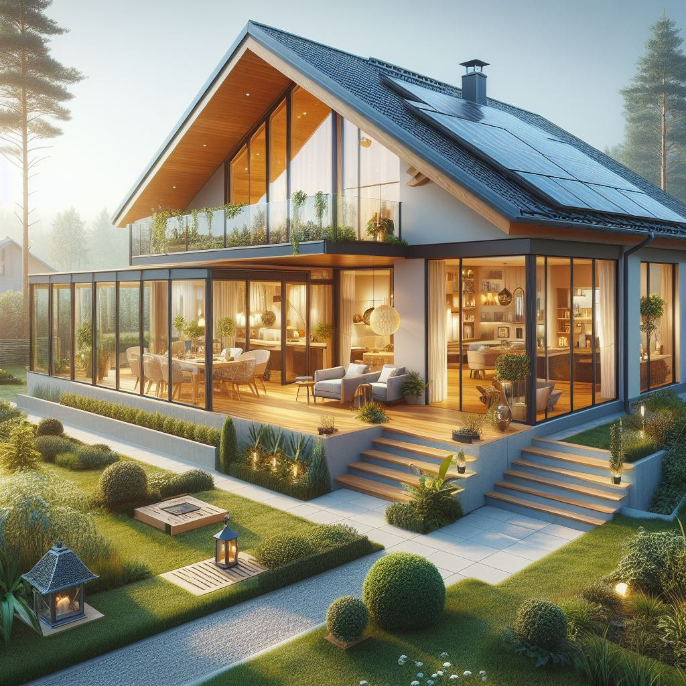

Der Traum vom Eigenheim fühlt sich inzwischen für die meisten Menschen
unerreichbar an. Die Immobilienpreise sind in den letzten Jahren stark
gestiegen, und viele fragen sich, wie sie sich ihr
[Traumhaus](../perfekter-neubau/) überhaupt
noch leisten können. In diesem Artikel will ich einige Möglichkeiten aufzeigen,
wie wir den Immobilienkauf in Deutschland günstiger machen könnten.

<figure class="ai-generated">
    
    <figcaption>Ein modernes Einfamilienhaus</figcaption>
</figure>

## Baukosten

Wenn man halbwegs günstig und modern bauen will, dann meist:

* Ohne Keller, weil eine Bodenplatte deutlich günstiger ist
* **Grundstücksfläche**: ca. 600 m²
* **Wohnfläche**: ca. 140 m², also nicht zu groß
* **Energiestandard**: KfW-55-Niveau
* **Standort**: Ich nehme Bayern für das Beispiel

Dann muss man mit folgenden Kosten rechnen:

Grundstück ca. 105.000 €

<ul>
<li><strong>min. 90.000 €</strong> (unter 150 €/m² findet man kaum Grundstücke; in München ist man bei über 2.200 €/m²).[^1]</li>
<li><strong>+3,5 %</strong> Grunderwerbsteuer[^2]</li>
<li><strong>+2 %</strong> Notar &amp; Grundbuch[^3]</li>
<li><strong>+3,57 %</strong> Maklerprovision[^4]</li>
<li>bis zu <strong>5.000 €</strong> Vermessungskosten</li>
<li>bis zu <strong>2.500 €</strong> Bodengutachten</li>
<li>bis zu <strong>20.000 €</strong> Erschließungskosten</li>
</ul>

Baukosten ca. 455.000 €

Richtwert: ca. 3.500 € pro Quadratmeter Wohnfläche

Erdarbeiten &amp; Bodenplatte ca. 10.000 €

Hinweis: Bei einem Keller müsste man eher mit 100.000 € rechnen.

<ul>
<li><strong>Aushub:</strong> 2.050 € = 50 €/m³ · 9m · 9m · 0,5m</li>
<li><strong>Bodenplatte mit Dämmung:</strong> 7.700 €
<ul>
<li><strong>5.500 € für Beton:</strong> 250 €/m³ Beton mit 8,5 m · 8,5 m · 0,3 m = 22 m³</li>
<li><strong>2.145 € für Dämmung + Folie:</strong> 30 €/m² mit 8,5 m · 8,5 m</li>
</ul>
</li>
</ul>

Rohbau ca. 150.000 €

Massive Bauweise mit Ziegeln.

<ul>
<li><strong>50% Mauerwerk (Außen+Innenwände):</strong> Ziegel für Außenwände, Innenwände aus Kalksandstein/Poroton, inkl. Arbeitslohn</li>
<li><strong>20% Decken:</strong> EG → OG, OG → Dach; Stahlbetondecken, Arbeitslohn, Schalung, Bewehrung</li>
<li><strong>30% Dachstuhl und Dachdeckung:</strong> Holzdachstuhl, Sparren, Latten, Pfetten, Eindeckung (Ziegel/Beton), ggf. Abdichtung / Unterspannbahn</li>
</ul>

Hausanschlüsse ca. 15.000 €

<ul>
<li><strong>35% Wasser:</strong> Anschluss an Trinkwassernetz, Hausanschlussleitung, Zähler</li>
<li><strong>30% Abwasser:</strong> Anschluss an Kanal, Rohrleitung, ggf. Schacht oder Revisionsöffnung</li>
<li><strong>25% Strom:</strong> Anschluss an Netz, Zählerkasten, Kabel verlegen</li>
<li><strong>10% Telekommunikation / Internet:</strong> Leerrohre, Hausanschlusskasten, Vorbereitung für Glasfaser</li>
</ul>

Fassade &amp; Fenster ca. 40.000 €

<ul>
<li><strong>30% Außenputz:</strong> Putzsystem (mineralisch oder Silikat), Arbeitslohn, ggf. Gerüst</li>
<li><strong>30% Dämmung:</strong> Wärmedämmverbundsystem (Dämmplatten, Kleber, Armierung, Armierungsschicht)</li>
<li>30% Fenster</li>
<li>5 % Rollläden</li>
<li>5 % Haustür (ca. 2.000 €)</li>
</ul>

Innenausbau ca. 75.000 €

<ul>
<li>Trockenbau und Innenputz</li>
<li>Estrich</li>
<li>Malerarbeiten</li>
<li>Bodenbeläge (z.B. Fliesen)</li>
<li>Innentüren</li>
</ul>

Haustechnik ca. 105.000 €

<ul>
<li>Heizung (z.B. Wärmepumpe)</li>
<li>Sanitär</li>
<li>Elektroinstallation</li>
<li>Lüftung</li>
</ul>

Garage ca. 30.000 €

Massiv aus Ziegeln.

Außenanlagen ca. 30.000 €

<ul>
<li>Zufahrt</li>
<li>Garten</li>
<li>Terrasse</li>
<li>Zaun</li>
</ul>

Baunebenkosten 47.000 €

Ca. 10–15 % der Baukosten

<ul>
<li><strong>Planung &amp; Betreuung:</strong> Architekt, Statiker, Energieberater, Bauleiter</li>
<li><strong>Gutachten &amp; Prüfungen:</strong> Bodengutachten, Prüfstatiker, Vermessung</li>
<li><strong>Behördliche Gebühren:</strong> Baugenehmigung, Hausanschlussbeiträge (Abwasser/Wasser), Prüfgebühren</li>
<li><strong>Finanzierungskosten:</strong> Notar, Grundbuch, Bankgebühren (manchmal extra gerechnet)</li>
<li><strong>Versicherungen:</strong> Bauherrenhaftpflicht, Bauleistungsversicherung</li>
<li><strong>Baustelleneinrichtung:</strong> Baustrom, Bauwasser</li>
</ul>

### Rechenbeispiel als Zwischensumme

Damit klar ist, wie die Zahlen zusammenlaufen, hier einmal dieselben Annahmen
als kompakte Rechnung:

* **Grundstück gesamt**: 105.000 € + 9,07 % (Steuer + Notar/Grundbuch + Makler)
  + 27.500 € (Vermessung, Bodengutachten, Erschließung) ≈ **142.000 €**
* **Baukosten**: **455.000 €**
* **Baunebenkosten**: **47.000 €**
* **Zwischensumme**: ca. **644.000 €**
* **+ Sicherheitsaufschlag 10 %** für Preissteigerungen/Nachträge:
  ca. **64.000 €**
* **Orientierungswert gesamt**: ca. **708.000 €**

Hinweis: Das ist eine grobe Beispielrechnung. Je nach Region, Bauweise,
Eigenleistung und Finanzierungsstruktur können einzelne Positionen deutlich
abweichen.

Für Baukostenkennwerte (z.B. €/m²) nutze ich hier bewusst eine konservative
Daumenregel. Diese sollte man immer mit mehreren regionalen Angeboten
(schlüsselfertig, Ausbauhaus, Architektenhaus) gegenprüfen.

## Politische Maßnahmen

Bauvorschriften harmonisieren

<ul>
<li><strong>Ziel:</strong> weniger Planungsvarianten je Bundesland, mehr Standardisierung.</li>
<li><strong>Effekt:</strong> geringere Planungs- und Genehmigungskosten, mehr serielle Bauweisen.</li>
</ul>

Baustoff-Wiederverwendung fördern

<ul>
<li><strong>Ziel:</strong> wiederverwendbare Komponenten leichter zulassen.</li>
<li><strong>Ansatz:</strong> Standards für rückbaubare Bauteile (z.B. modulare Wand- und Fassadenelemente, Klick-Systeme im Innenausbau).</li>
<li><strong>Effekt:</strong> langfristig geringere Materialkosten und weniger Bauabfall.</li>
</ul>

### Baunebenkosten senken

Notarkosten

<ul>
<li><strong>Vorschlag:</strong> rechtssichere Standardverträge mit pauschaler Gebühr statt rein prozentualer Abrechnung.</li>
<li><strong>Erwarteter Effekt:</strong> geringere Kaufnebenkosten bei Standardfällen.</li>
</ul>

Maklerkosten

<ul>
<li><strong>Vorschlag:</strong> konsequentes Bestellerprinzip.</li>
<li><strong>Erwarteter Effekt:</strong> Entlastung von Käufern, wenn Verkäufer die Beauftragung auslösen.</li>
</ul>

## Bauherren-Entscheidungen

* Eigenleistung einbringen

### Was spart typischerweise am meisten?

* **Hoher Hebel**: Grundstückspreis, Verzicht auf Keller, einfacher Baukörper
  (rechteckiger Grundriss, wenig Vor-/Rücksprünge, keine Gauben).
* **Mittlerer Hebel**: Material- und Ausstattungsniveau im Innenausbau,
  Umfang der Außenanlagen, Grad der Eigenleistung.
* **Kleiner Hebel**: Einzelne Produktentscheidungen (z.B. einzelne
  Design-Elemente), wenn die großen Kostentreiber unverändert bleiben.

Die Faustregel lautet: Erst die großen Hebel entscheiden, dann Details
optimieren.

### Extras/Schnickschnack reduzieren

* Bodenplatte statt Keller
* Glatte Wände: Keine Tapete.
* Satteldach ohne Gauben sowie möglichst wenige Dachfenster: Mehr PV kann aufs Dach
* Keine Balkone
* Keine aufwendigen Fensterformen

### Günstigere Ausführungen

* Aluverbundplatten im Badezimmer statt aufwendiger Fliesenlösungen

### Weitere Maßnahmen

* Heizsystem als Gesamtkonzept planen (Investition + Betrieb + Komfort)
* Luft-Luft-Systeme (Klimageräte) + Brauchwasser-Wärmepumpe können im
  Einzelfall günstiger in der Installation sein als klassische wassergeführte
  Systeme.
* Diese Lösung ist nicht pauschal besser: Effizienz im Winter,
  Schallentwicklung, Luftverteilung und Komfort müssen zum Gebäude und zur
  Region passen.

### Für langfristige Haltbarkeit (um Kosten in der Zukunft zu sparen)

* Lüftungsanlage, um Schimmel zu vermeiden
* Dreifachverglasung für bessere Isolierung
* Photovoltaikanlage für eigene Stromproduktion. Keine Solarthermie, da man dafür weitere Leitungen braucht.
* Regenwasserspeicher für sauberes Brauchwasser für Garten und Toilettenspülung

## Einzelnachweise

[^1]: [Grundstücke in Bayern](https://www.immobilienscout24.de/Suche/de/bayern/grundstueck-kaufen) via ImmoScout24, abgerufen am 12.04.2026.
[^2]: [§ 11 GrEStG: Steuersatz, Abrundung](https://www.gesetze-im-internet.de/grestg_1983/__11.html) via gesetze-im-internet.de, abgerufen am 12.04.2026.
[^3]: [GNotKG (Gebührenrahmen für Gerichte und Notare)](https://www.gesetze-im-internet.de/gnotkg/) via gesetze-im-internet.de, abgerufen am 12.04.2026.
[^4]: [§ 656c BGB](https://www.gesetze-im-internet.de/bgb/__656c.html) und [§ 656d BGB](https://www.gesetze-im-internet.de/bgb/__656d.html) via gesetze-im-internet.de, abgerufen am 12.04.2026.
