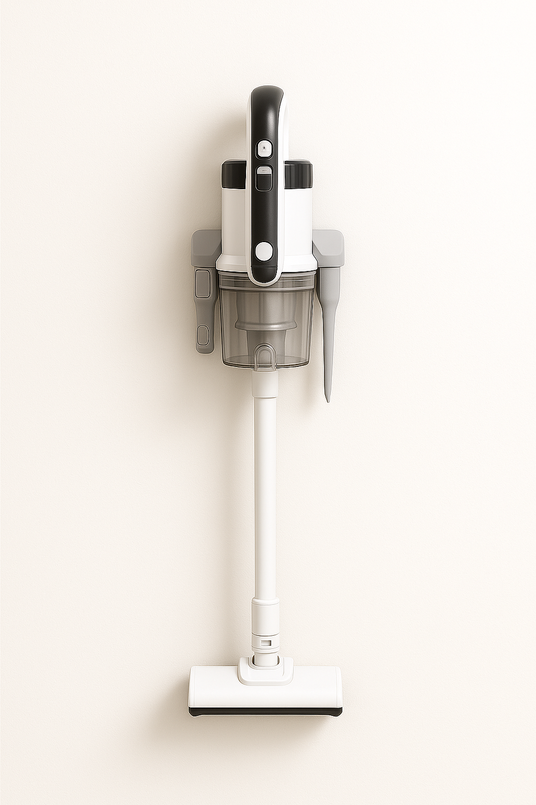

Es stört mich, dass es so viele Geräte mit schlechtem Design gibt.
Wer will soll sich das hier für Handstaubsauger nehmen. Wenn das wirklich jemand
baut will ich aber ein Exemplar davon haben 😉

<figure class="wp-caption aligncenter img-thumbnail">
    
    <figcaption class="text-center">ChatGPT rendering eines Akku-Handstaubsaugers</figcaption>
</figure>

## Use Case

Ein Handsaubsauger ist für das schnelle Saugen zwischendrin gedacht. Man sieht
ein bisschen trockenen Dreck wie Krümmel, Haare, Staubflusen in der Wohnung und
will es weg machen. Man saugt maximal 15 Minuten am Stück. Dann legt man den
Handstaubsauger wieder weg.

## Anforderungen

- Der Handstaubsauger muss batteriebetrieben sein.
- Der Handstaubsager ist an der Wand montiert. Er hängt in der Ladestation und
  man kann ihn mit einem Handgriff leicht entnehmen.
- Er muss vollständig einhändig bedienbar sein ohne ihn abzusetzen: Greifen,
saugen, zurücklegen.
- Der Handstaubsauger hat einen Aufsatz für Hartböden, welcher vorne LED-Lichter
  hat um den Boden besser auszuleuchten.
- Aufsätze: Er hat eine Fugendüse und eine Polsterdüse.
- Das Kabel zur Ladestation ist abnehmbar und kann bei Bedarf ersetzt werden.
- Ein klar beschriebener Anschluss für Düsen mit Stromversorgung, damit man
  defekte Düsen austauschen kann oder bessere Düsen kaufen kann.
- Der Power-Knopf soll direkt am Handgriff sein, sodass man den Staubsauger mit
  einer Hand bedienen kann.
- Modularer Aufbau, damit man bei Bedarf Teile austauschen oder upgraden kann.

## Design

Aufbau:

* Batterie
    * Austauschbar
    * Kompatibel mit anderen Systemen (Boschs 18V "Power for All", Einhells 18V "Power X-Change", [Cordless Alliance System](https://www.cordless-alliance-system.com/))
* Korpus
    * Anschluss für Batterie
    * Integriertes Ladegerät
    * Klick-Anschluss für Düse
    * Entfernbarer Staubbehälter
    * LED-Anzeige für den Ladestand
* Düsen:
    * Aufbau:
        * Der Anschluss der Düsen sollte auch für andere Staubsauger kompatibel sein.
        * Innendurchmesser: 32mm
    * Typen:
        * Fugendüse
        * Polsterdüse
        * Hartbodendüse mit LED-Lichtern und Rohr
* Ladestation
    * Befestigung mit 2 Schrauben / Dübeln an der Wand
    * Stromkabel mittig, damit es keine Rolle spielt wo die Steckdose ist. Es
      soll unten sein, damit das Stromkabel möglichst vom Rohr des
      Handstaubsaugers verdeckt wird.
    * 2x Klick-Anschluss für Düsen, damit man die Düsen nicht suchen muss
    * Der Korpus soll von oben in die Ladestation eingehangen werden und
      automatisch zu laden beginnen.
    * Primärseite (Hausnetz zur Ladestation): „Kleingerätekupplung“ ([IEC-60320 C7/C8](https://de.wikipedia.org/wiki/Ger%C3%A4testecker#%E2%80%9EKleinger%C3%A4tekupplung%E2%80%9C_(IEC-60320_C7/C8)))

## Unklar

1. Ladestation: Sollte der Anschluss für das Stromkabel oben oder unten sein?
