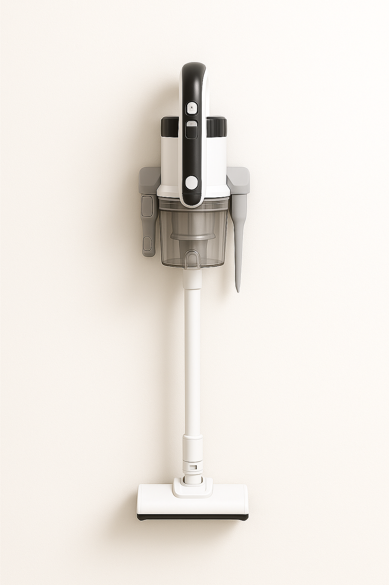
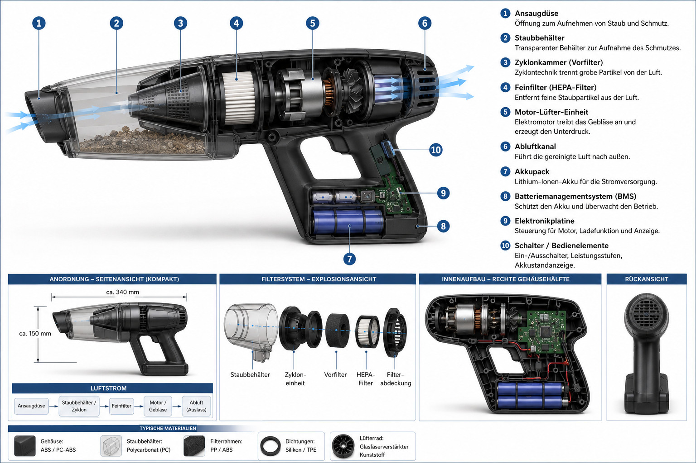
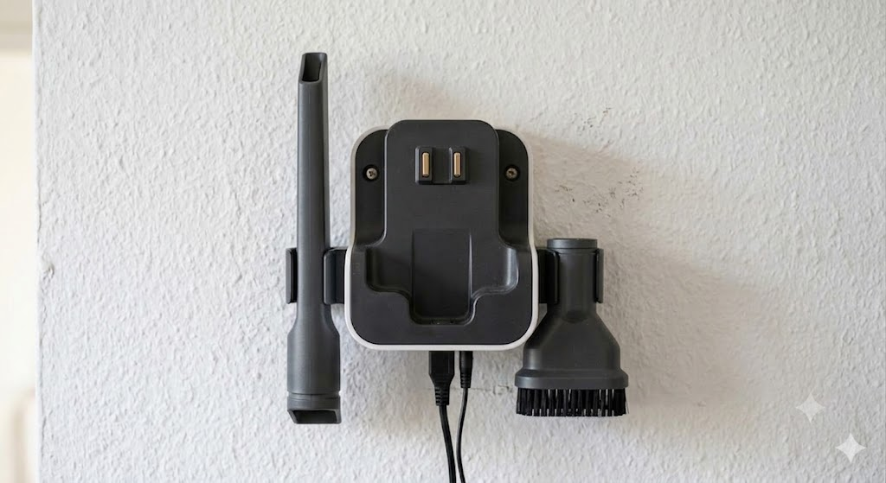
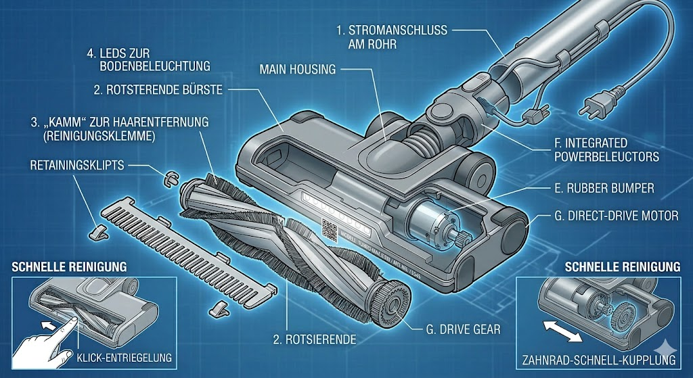
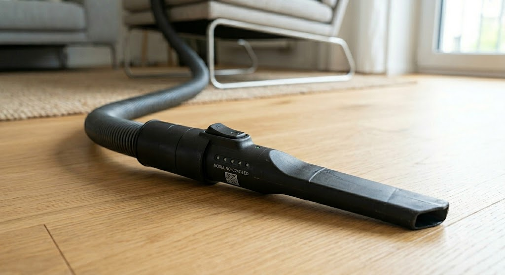

Es stört mich, dass es so viele Geräte mit schlechtem Design gibt.
Wer will soll sich das hier für Handstaubsauger nehmen. Wenn das wirklich jemand
baut will ich aber ein Exemplar davon haben 😉

<figure class="wp-caption aligncenter img-thumbnail">
    
    <figcaption class="text-center">ChatGPT rendering eines Akku-Handstaubsaugers</figcaption>
</figure>

## Use Case

Ein Handsaubsauger ist für das schnelle Saugen zwischendrin gedacht. Man sieht
ein bisschen trockenen Dreck wie Krümmel, Haare, Staubflusen in der Wohnung und
will es weg machen. Man saugt maximal 15 Minuten am Stück. Dann legt man den
Handstaubsauger wieder weg.

## Anforderungen

- Das System besteht aus einem Akku-Staubsauger, einer Ladestation und Aufsätzen.
- Der Staubsauger:
    - Muss batteriebetrieben sein
    - Muss modular aufgebaut sein, damit man bei Bedarf Teile austauschen oder
      upgraden kann.
    - Muss vollständig einhändig bedienbar sein ohne ihn abzusetzen: Greifen,
      saugen, zurücklegen.
    - Ein klar spezifizierter Anschluss für Düsen mit Stromversorgung, damit man
      defekte Düsen austauschen kann oder bessere Düsen kaufen kann.
    - Der Power-Knopf soll direkt am Handgriff sein, sodass man den Staubsauger
      mit einer Hand bedienen kann.
- Die Ladestation:
    - ist an der Wand montiert
    - Der Staubsauger hängt in der Ladestation und man kann ihn mit einem
        Handgriff leicht entnehmen.
    - Das Kabel zur Ladestation ist abnehmbar und kann bei Bedarf ersetzt
      werden.
    - die Station kann erweitert werden, sodass die Aufsätze an der Station
      aufbewahrt werden können.
- Die Aufsätze:
    - Der Handstaubsauger hat einen Aufsatz für Hartböden, welcher vorne
      LED-Lichter hat um den Boden besser auszuleuchten.
    - Eine Fugendüse und eine Polsterdüse.

## Design

Aufbau:

* Batterie
    * Austauschbar
    * Kompatibel mit anderen Systemen (Boschs 18V "Power for All", Einhells 18V "Power X-Change", [Cordless Alliance System](https://www.cordless-alliance-system.com/))
* Korpus
    * Anschluss für Batterie
    * Integriertes Ladegerät
    * Klick-Anschluss für Düse
    * Entfernbarer Staubbehälter
    * LED-Anzeige für den Ladestand
* Düsen:
    * Aufbau:
        * Der Anschluss der Düsen sollte auch für andere Staubsauger kompatibel sein.
        * Innendurchmesser: 32mm
    * Typen:
        * Fugendüse
        * Polsterdüse
        * Hartbodendüse mit LED-Lichtern und Rohr
* Ladestation
    * Befestigung mit 2 Schrauben / Dübeln an der Wand
    * Stromkabel mittig, damit es keine Rolle spielt wo die Steckdose ist. Es
      soll unten sein, damit das Stromkabel möglichst vom Rohr des
      Handstaubsaugers verdeckt wird. Der Anschluss sollte unten sein, weil die Steckdose meistens unten ist.
    * 2x Klick-Anschluss für Düsen, damit man die Düsen nicht suchen muss
    * Der Korpus soll von oben in die Ladestation eingehangen werden und
      automatisch zu laden beginnen.
    * Primärseite (Hausnetz zur Ladestation): „Kleingerätekupplung“ ([IEC-60320 C7/C8](https://de.wikipedia.org/wiki/Ger%C3%A4testecker#%E2%80%9EKleinger%C3%A4tekupplung%E2%80%9C_(IEC-60320_C7/C8)))

## Korpus

<figure class="wp-caption aligncenter img-thumbnail">
    
    <figcaption class="text-center">ChatGPT rendering eines Akku-Handstaubsauger-Korpus.</figcaption>
</figure>

## Ladestation

<figure class="wp-caption aligncenter img-thumbnail">
    
    <figcaption class="text-center">Gemini rendering einer Ladestation für einen Akku-Handstaubsauger. Das ist nicht ganz so geworden wie ich es mir vorstelle - die beiden Aufsätze sollten von unten in die Station eingeclipst werden, damit man sie für das Anbringen am Rohr nicht umdrehen muss. außerdem sollte keine Mulde in der Station sein, damit sich dort kein Staub sammeln kann. Es sollte Dreiecksförmig sein, damit man es hineingleiten lassen kann.</figcaption>
</figure>

## Aufsätze

### Teppichbürste

<figure class="wp-caption aligncenter img-thumbnail">
    
    <figcaption class="text-center">Gemini rendering einer Staubsauger-Teppichbürste. Das ist nicht ganz so geworden wie ich es mir vorstelle - </figcaption>
</figure>

Die Teppichbürste ist vermutlich der wichtigste Aufsatz für einen Staubsauger. Sie sollte folgende Eigenschaften haben:

* Klick-Anschluss an das Rohr, damit sie sicher befestigt ist. Außen am Rohr ist dann auch der Stromanschluss, der gleichzeitig verbunden wird
* LED-Lichter vorne, damit man den Staub und Dreck besser sieht
* Im Inneren des Aufsatzes ist eine rotierende Bürste, die den Dreck von Teppichen löst. Sie wird von einem kleinen Motor angetrieben, der über den Stromanschluss mit Energie versorgt wird.
* Die Bürste sollte so konstruiert sein, dass sie leicht zu reinigen ist. Dies kann beispielsweise durch eine abnehmbaren Clip am Boden des Aufsatzes erreicht werden, der die Bürste freigibt
* Am Boden des Aufsatzes sollten Gummilippen angebracht sein, damit der Aufsatz auch auf glatten Böden gut saugt und nicht zu viel Luft durchlässt.
* Am Boden des Aufsatzes sollte eine Modellnummer sein. Optimalerweise mit Link auf eine Website, welche mehr Informationen zu diesem Aufsatz bereitstellt, damit man z.B. Ersatzteile oder einen vollständig neuen Aufsatz kaufen kann.
* Die Obserseite des Aufsatzes über der Bürste sollte transparent sein, damit man sehen kann, ob die Bürste verstopft ist oder ob sich Haare um die Bürste gewickelt haben.

### Fugendüse

<figure class="wp-caption aligncenter img-thumbnail">
    
    <figcaption class="text-center">ChatGPT rendering einer Fugendüse. Das ist nicht ganz so geworden wie ich es mir vorstelle - es wäre cool, wenn etwas nach hinten versetzt noch eine LED-Beleuchtung nach vorne zeigen würde. Und der Flexi-Clip sollte vorne und nicht an der Seite sein</figcaption>
</figure>

* Klick-Anschluss an das Rohr, damit sie sicher befestigt ist. Außen am Rohr ist dann auch der Stromanschluss, der gleichzeitig verbunden wird
* LED Lichter vorne
* Auf der gegenüberliegenden Seite des Clip-Anschlusses des Aufsatzes sollte eine Modellnummer sein. Optimalerweise mit Link auf eine Website, welche mehr Informationen zu diesem Aufsatz bereitstellt, damit man z.B. Ersatzteile oder einen vollständig neuen Aufsatz kaufen kann.
