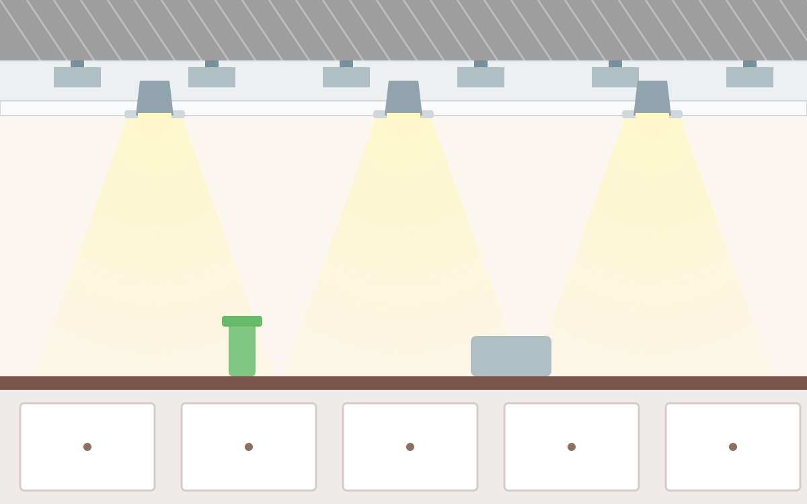

Ich werde hoffentlich noch dieses Jahr meine Küche renovieren und dabei einige
Einbau-Spots installieren. Jetzt ist die Frage, welche Spots genau am meisten Sinn machen.

<figure class="wp-caption aligncenter img-thumbnail">
    
    <figcaption class="text-center">Mit Claude AI generierte Illustration: Einbau-Spots in einer abgehängten Küchendecke</figcaption>
</figure>

<table>
    <thead>
    <tr>
      <th>Rahmen</th>
      <th>Leuchtmittel</th>
      <th>Fassung</th>
      <th>Volt</th>
      <th>Preis Leuchtmittel</th>
      <th>Lumen</th>
      <th>Watt</th>
      <th>Lumen/Watt</th>
      <th>Bemerkungen</th>
    </tr>
    </thead>
    <tbody>
    <tr>
      <td><a href="https://www.amazon.de/ledscom-Deckeneinbaurahmen-Einbaurahmen-Halogen-PAR16-wei%C3%9F-matt/dp/B07KB34D3H/">2.89€</a>: 51mm Lochdurchmesser, 81mm Rahmendurchmesser, 65mm Einbautiefe</td>
      <td><a href="https://www.amazon.de/Amazon-Basics-LED-Leuchtmittel-MR16-Spots-35-W-Gl%C3%BChbirne/dp/B071RMD93K/">Amazon Basics LED MR16</a></td>
      <td>MR16 (GU5.3)</td>
      <td>12V</td>
      <td>2.09€/Stück</td>
      <td>345 Lumen</td>
      <td>4.5 Watt</td>
      <td>77 Lumen/Watt</td>
      <td>15.000 Stunden Lebenszeit, 4cm hoch (mit Fassung wohl 5cm)</td>
    </tr>
    <tr>
      <td><a href="https://www.amazon.de/ledscom-Deckeneinbaurahmen-Einbaurahmen-Halogen-PAR16-wei%C3%9F-matt/dp/B07KB34D3H/">2.89€</a>: 51mm Lochdurchmesser, 81mm Rahmendurchmesser, 65mm Einbautiefe</td>
      <td><a href="https://www.amazon.de/Amazon-Basics-ersetzt-warmwei%C3%9F-dimmbar/dp/B0716CJ5RZ/">Amazon Basics LED GU10</a></td>
      <td>GU10</td>
      <td>230V</td>
      <td>2.09€/Stück</td>
      <td>345 Lumen</td>
      <td>5.5 Watt</td>
      <td>63 Lumen/Watt</td>
      <td>15.000 Stunden Lebenszeit, 5cm hoch (mit Fassung wohl 6cm)</td>
    </tr>
    <tr>
      <td><a href="https://www.amazon.de/ledscom-Einbaurahmen-flach-107mm-Lochkreis-10-Leuchten-ohne-Leuchtmittel/dp/B07H8LP99M/">3€: 87mm Lochdurchmesser, 107mm Rahmendurchmesser, 40mm Einbautiefe</a></td>
      <td><a href="https://www.amazon.de/ledscom-St%C3%BCck-Leuchtmittel-warmwei%C3%9F-509lm/dp/B082PXY3DT/">ledscom 509lm</a></td>
      <td>GX53</td>
      <td>230V</td>
      <td>4.49€/Stück</td>
      <td>509 Lumen</td>
      <td>6.2 Watt</td>
      <td>82 Lumen/Watt</td>
      <td>15.000 Stunden Lebenszeit, 2.8cm hoch</td>
    </tr>
    <tr>
      <td><a href="https://www.amazon.de/Paulmann-Einbauleuchte-schwenkbar-3-Stufen-Dimmbar-spr%C3%BChwassergesch%C3%BCtzt/dp/B07TTP52R9/">23€</a>: 84mm Lochdurchmesser, 45mm Einbautiefe</td>
      <td><a href="https://www.amazon.de/Paulmann-94306-Einbauleuchte-Einzel-Coin-Deckeneinbaustrahler/dp/B0866MKS36/">Paulmann 94306</a></td>
      <td>-</td>
      <td>230V</td>
      <td>13.59€/Stück</td>
      <td>?</td>
      <td>4 Watt</td>
      <td>?</td>
      <td>45mm Einbautiefe, keine Ahnung wie hell das ist</td>
    </tr>
  </tbody>
</table>

## Deckenhöhe

* 50mm Abstand zur Rohdecke (27mm hohes CD-Profil plus Abstand durch die Direktabhänger)
* 12.5mm für die Gipskartonplatte
* 3mm für die Spachtelmasse

⇒ 50mm + 12.5mm + 3mm = 65.5mm

## GX53

Für GX53 spricht:

* Mit einem Handgriff ohne Werkzeug zu wechseln
* Kein Trafo nötig - wenn also was kaputtgeht, muss nur das Leuchtmittel gewechselt werden
* Sehr geringe Einbautiefe
* Mit 87mm Durchmesser vom Loch (107mm Durchmesser vom Rahmen) kann man ggf. auch leichter die Kabel verlegen

## GU10

GU10 ist hingegen weiter verbreitet. Die Leuchtmittel sind günstiger und
einfacher zu finden. Auch die Rahmen sind günstiger.

* Durchmesser Leuchtmittel: 50mm
* Höhe des Leuchtmittels von der Oberkante des Glases bis zum Ende der Stifte: 54mm
* Länge der Stifte, die in der Fassung verschwinden: ca. 7mm
* Höhe der Fassung: typischerweise 16mm (+ ca. 3mm für die Kabel)

⇒ 54mm + 16mm - 7mm + 3mm = 66mm

Man benötigt dann einen 51mm-Lochsägen-Aufsatz für den Bohrer.

## GU5.3 / MR16

Für GU5.3 spricht eigentlich nichts, außer man ist in Feuchträumen.
