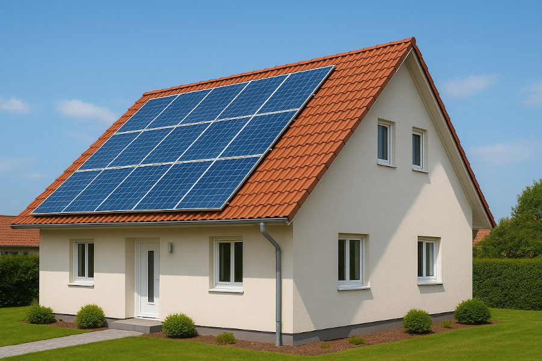

Ich besitze seit rund zwei Jahren ein eigenes Haus und habe im Mai 2025 eine
Wärmepumpe installieren lassen. Besonders spannend wird diese in Kombination mit
einer Photovoltaikanlage (PV-Anlage): Sie reduziert die Abhängigkeit von
steigenden Strompreisen, schont die Umwelt und kann im Idealfall sogar eine
gewisse Absicherung gegen kurzfristige Stromausfälle bieten.

In diesem Artikel gehe ich der Frage nach, ab welchem Preis sich eine PV-Anlage
für mich wirtschaftlich lohnt.

## Strompreis

Ich habe aktuell zwei Stromzähler und zwei Tarife:

* Hausstrom: 0.2505€/kWh + 126.43 €/Jahr
* Wärmepumpen-Tarif: 0.205€/kWh + 93.88 €/Jahr

Ich gehe von ca. 2% jährlichen Preissteigerungen aus.

## Dachfläche

<figure class="wp-caption aligncenter img-thumbnail">
    
    <figcaption class="text-center">ChatGPT rendering eines Einfamilienhauses mit Solaranlage. Die Dachneigung könnte bei 45° sein.</figcaption>
</figure>

Ich habe ein Satteldach mit Betondachsteinen (Braas Taunus Pfanne):

* **Dachneigung**: 30° (0° = flach, mehr als 60° ist ungewöhnlich, [Tool](https://solar.red/photovoltaik-neigungswinkel/))
* **Ausrichtung**: Süd-West (ca. 50°, also etwas westlicher als Süd, [Tool](https://www.rechnerphotovoltaik.de/rechner/dachausrichtung))
* **Dachfläche: ca 6m x 12m** (72m² pro Seite)
    * 10m x 10m Korpus, d.h. 10m x 5m für das rechtwinklige Dreieck
    * Dachüberstand von ca. 1m
    * Hypothenuse = 6m / cos(30°) = 6.93m

## Ertragsschätzung

Mit [solarserver.de](https://www.solarserver.de/pv-anlage-online-berechnen/)
kann man berechnen, wie viel Strom eine PV-Anlage an einem bestimmten Ort,
mit einer bestimmten Ausrichtung und Neigung erzeugt.

<table>
    <thead>
        <tr>
            <th>Monat</th>
            <th>kWh/kWp</th>
        </tr>
    </thead>
    <tbody>
        <tr>
            <td>Januar</td>
            <td style="text-align: right;">40 kWh/kWp</td>
        </tr>
        <tr>
            <td>Februar</td>
            <td style="text-align: right;">60 kWh/kWp</td>
        </tr>
        <tr>
            <td>März</td>
            <td style="text-align: right;">100 kWh/kWp</td>
        </tr>
        <tr>
            <td>April</td>
            <td style="text-align: right;">125 kWh/kWp</td>
        </tr>
        <tr>
            <td>Mai</td>
            <td style="text-align: right;">130 kWh/kWp</td>
        </tr>
        <tr>
            <td>Juni</td>
            <td style="text-align: right;">135 kWh/kWp</td>
        </tr>
        <tr>
            <td>Juli</td>
            <td style="text-align: right;">138 kWh/kWp</td>
        </tr>
        <tr>
            <td>August</td>
            <td style="text-align: right;">124 kWh/kWp</td>
        </tr>
        <tr>
            <td>September</td>
            <td style="text-align: right;">98 kWh/kWp</td>
        </tr>
        <tr>
            <td>Oktober</td>
            <td style="text-align: right;">70 kWh/kWp</td>
        </tr>
        <tr>
            <td>November</td>
            <td style="text-align: right;">45 kWh/kWp</td>
        </tr>
        <tr>
            <td>Dezember</td>
            <td style="text-align: right;">30 kWh/kWp</td>
        </tr>
        <tr>
            <td><strong>Summe</strong></td>
            <td style="text-align: right;"><strong>1.080 kWh/kWp</strong></td>
        </tr>
    </tbody>
</table>

Auch interessant:

* [Zusammenhang zwischen Neigung, Ausrichtung und Ertrag](https://www.rechnerphotovoltaik.de/photovoltaik/voraussetzungen/dachneigung)

## Stromverbrauch und Kosten

Für den Stromverbrauch im Haushalt spielen folgende Faktoren eine zentrale Rolle:

1. **Heizung**: Der größte Anteil am Energiebedarf entfällt auf das Heizen –
   insbesondere in älteren Gebäuden. Relevant für den Stromverbrauch ist das
   jedoch nur, wenn eine Wärmepumpe, Infrarotheizung oder ein Nachtspeicherofen
   eingesetzt wird. Typische Großverbraucher sind außerdem:
    * Herd und Backofen
    * Waschmaschine und Trockner
    * Heizlüfter
2. **Warmwasser**: Auch die Warmwasserbereitung kann einen erheblichen
   Strombedarf verursachen.
3. **Haushalt**: Wieder Wärme (Kühl- und Gefrierschrank, heißes Wasser für
   Spülmaschine und Waschmaschine, Herd und Ofen). Die Beleuchtung spielt nur
   dann eine Rolle wenn man noch alte
   Glühbirngen/Halogenlampen/Energiesparlampen hat. Oder wenn man viele LEDs hat
   die man lange brennen lässt. Laptops und Smartphones spielen keine Rolle.
4. **Personen** im Haushalt: Je mehr Personen, desto höher der Verbrauch.
   Hauptsächlich wegen Warmwasser und häufigerem Waschen/Spülen/Trocknen.

Es gibt Tabellen mit typischen Verbrauchswerten. Einen Teil meiner Daten habe
ich selbst gemessen, die in Klammern angegebenen Werte sind dagegen Schätzungen.
Die Angaben beziehen sich auf ein Haus mit rund 200&nbsp;m² beheizter Fläche,
2&nbsp;Personen (plus gelegentlich 2&nbsp;Gäste) sowie 2&nbsp;Katzen.

<table>
    <thead>
        <tr>
            <th class="border-right">Monat</th>
            <th>Haushalt</th>
            <th>Warmwasser</th>
            <th class="border-right">Heizung</th>
            <th>Kosten Haushalt im Monat</th>
            <th>Kosten Warmwasser im Monat</th>
            <th>Kosten Heizung im Monat</th>
        </tr>
    </thead>
    <tbody>
        <tr>
            <td class="border-right">Januar</td>
            <td style="text-align: right;">8.7 kWh/Tag</td>
            <td style="text-align: right;">(2.4 kWh/Tag)</td>
            <td style="text-align: right;" class="border-right">(38 kWh/Tag)</td>
            <td style="text-align: right; background-color: #ffdd22;">67.56 €</td>
            <td style="text-align: right;">15.25 €</td>
            <td style="text-align: right; background-color: #ff0000;">241.49 €</td>
        </tr>
        <tr>
            <td class="border-right">Februar</td>
            <td style="text-align: right;">8.5 kWh/Tag</td>
            <td style="text-align: right;">(2.0 kWh/Tag)</td>
            <td style="text-align: right;" class="border-right">(30 kWh/Tag)</td>
            <td style="text-align: right; background-color: #ffdd22;">59.62 €</td>
            <td style="text-align: right;">11.48 €</td>
            <td style="text-align: right; background-color: #ff0000;"">172.20 €</td>
        </tr>
        <tr>
            <td class="border-right">März</td>
            <td style="text-align: right;">10.3 kWh/Tag</td>
            <td style="text-align: right;">(1.8 kWh/Tag)</td>
            <td style="text-align: right;" class="border-right">(11 kWh/Tag)</td>
            <td style="text-align: right; background-color: #ffdd22;">79.98 €</td>
            <td style="text-align: right;">11.44 €</td>
            <td style="text-align: right; background-color: #ffdd22;">69.91 €</td>
        </tr>
        <tr>
            <td class="border-right">April</td>
            <td style="text-align: right;">8.5 kWh/Tag</td>
            <td style="text-align: right;">(1.5 kWh/Tag)</td>
            <td style="text-align: right;" class="border-right">(4 kWh/Tag)</td>
            <td style="text-align: right; background-color: #ffdd22;">63.88 €</td>
            <td style="text-align: right;">9.23 €</td>
            <td style="text-align: right;">24.60 €</td>
        </tr>
        <tr>
            <td class="border-right">Mai</td>
            <td style="text-align: right;">8.5 kWh/Tag</td>
            <td style="text-align: right;">1.2 kWh/Tag</td>
            <td style="text-align: right;" class="border-right">(3 kWh/Tag)</td>
            <td style="text-align: right; background-color: #ffdd22;">66.00 €</td>
            <td style="text-align: right;">7.63 €</td>
            <td style="text-align: right;">19.07 €</td>
        </tr>
        <tr>
            <td class="border-right">Juni</td>
            <td style="text-align: right;">6.1 kWh/Tag</td>
            <td style="text-align: right;">1.2 kWh/Tag</td>
            <td style="text-align: right;" class="border-right">1.0 kWh/Tag</td>
            <td style="text-align: right;">45.84 €</td>
            <td style="text-align: right;">7.38 €</td>
            <td style="text-align: right;">6.15 €</td>
        </tr>
        <tr>
            <td class="border-right">Juli</td>
            <td style="text-align: right;">5.9 kWh/Tag</td>
            <td style="text-align: right;">1.1 kWh/Tag</td>
            <td style="text-align: right;" class="border-right">0.3 kWh/Tag</td>
            <td style="text-align: right;">47.37 €</td>
            <td style="text-align: right;">6.99 €</td>
            <td style="text-align: right;">1.91 €</td>
        </tr>
        <tr>
            <td class="border-right">August</td>
            <td style="text-align: right;">6.8 kWh/Tag</td>
            <td style="text-align: right;">1.2 kWh/Tag</td>
            <td style="text-align: right;" class="border-right">0.3 kWh/Tag</td>
            <td style="text-align: right; background-color: #ffdd22;">52.80 €</td>
            <td style="text-align: right;">7.63 €</td>
            <td style="text-align: right;">1.91 €</td>
        </tr>
        <tr>
            <td class="border-right">September</td>
            <td style="text-align: right;">7.7 kWh/Tag</td>
            <td style="text-align: right;">(1.2 kWh/Tag)</td>
            <td style="text-align: right;" class="border-right">(2.7 kWh/Tag)</td>
            <td style="text-align: right; background-color: #ffdd22;">57.87 €</td>
            <td style="text-align: right;">7.38 €</td>
            <td style="text-align: right;">16.61 €</td>
        </tr>
        <tr>
            <td class="border-right">Oktober</td>
            <td style="text-align: right;">7.5 kWh/Tag</td>
            <td style="text-align: right;">(1.8 kWh/Tag)</td>
            <td style="text-align: right;" class="border-right">(9 kWh/Tag)</td>
            <td style="text-align: right; background-color: #ffdd22;">58.24 €</td>
            <td style="text-align: right;">11.44 €</td>
            <td style="text-align: right; background-color: #ffdd22;">57.20 €</td>
        </tr>
        <tr>
            <td class="border-right">November</td>
            <td style="text-align: right;">10.3 kWh/Tag</td>
            <td style="text-align: right;">(2.0 kWh/Tag)</td>
            <td style="text-align: right;" class="border-right">(25 kWh/Tag)</td>
            <td style="text-align: right; background-color: #ffdd22;">77.40 €</td>
            <td style="text-align: right;">12.30 €</td>
            <td style="text-align: right; background-color: #ff0000;">153.75 €</td>
        </tr>
        <tr>
            <td class="border-right">Dezember</td>
            <td style="text-align: right;">10.0 kWh/Tag</td>
            <td style="text-align: right;">(2.4 kWh/Tag)</td>
            <td style="text-align: right;" class="border-right">(40 kWh/Tag)</td>
            <td style="text-align: right; background-color: #ffdd22;">77.66 €</td>
            <td style="text-align: right;">15.25 €</td>
            <td style="text-align: right; background-color: #ff0000;">254.20 €</td>
        </tr>
        <tr>
            <td><strong>Summe</strong></td>
            <td style="text-align: right;"><strong>3.005 kWh</strong></td>
            <td style="text-align: right;"><strong>ca. 602 kWh</strong></td>
            <td style="text-align: right;" class="border-right"><strong>ca. 4.971 kWh</strong></td>
            <td style="text-align: right;"><strong>754.22 €</strong></td>
            <td style="text-align: right;"><strong>123.40 €</strong></td>
            <td style="text-align: right;"><strong>1019.00 €</strong></td>
        </tr>
        <tr>
            <td><strong>Durchschnitt</strong></td>
            <td style="text-align: right;"><strong>8.2 kWh/Tag</strong></td>
            <td style="text-align: right;"><strong>1.6 kWh/Tag</strong></td>
            <td style="text-align: right;"><strong>13.6 kWh/Tag</strong></td>
            <td style="text-align: right;"><strong>2.06€/Tag</strong></td>
            <td style="text-align: right;"><strong>0.34€/Tag</strong></td>
            <td style="text-align: right;"><strong>2.79€/Tag</strong></td>
        </tr>
    </tbody>
</table>

Ich bezahle also aktuell vermutlich:

* Haushaltsstrom: 879.18 €/Jahr
* Wärmepumpenstrom: 1236.34 €/Jahr
* Erster Stromzähler (Bezug/Einspeisung): 30 €/Jahr
* Zweiter Stromzähler (HT/NT): 30 €/Jahr

Insgesamt zahle ich für Strom also ca. 2&thinsp;175.52 €/Jahr.

## Einspeisevergütung

[Laut Bundesnetzagentur](https://www.bundesnetzagentur.de/DE/Fachthemen/ElektrizitaetundGas/ErneuerbareEnergien/EEG_Foerderung/start.html) gibt es im September 2025 für
Teileinspeisung bei Anlagen zwischen 10 und 40 kWp eine Vergütung von 0.068 €/kWh.

Der Vergütungsanspruch nach dem EEG besteht für die Dauer von 20 Jahren. Die
20-Jahre-Frist beginnt ab der Inbetriebnahme zu laufen.

## Wirtschaftlichkeits&shy;berechnung

### Worst-Case: Volleinspeisung

* Vergütung:  0.068 €/kWh
* Ertrag: 1000 kWh/kWp/Jahr

⇒ 68 €/kWp pro Jahr an Einnahmen. Bei Zählerzusammenlegung sogar höhere Ausgaben.

### Best-Case: Volleigenverbrauch mit Einspeise&shy;vergütung

Ich gehe hier von einer Zählerzusammenlegung aus, d.h. der Strom kostet dann
0.2505 €/kWh + 126.43 €/Jahr.

Ich gehe von einer 10kWp Anlage aus.

<table>
    <thead>
        <tr>
            <th class="border-right">Monat</th>
            <th>Strombedarf</th>
            <th class="border-right">PV-Ertrag</th>
            <th>Einspeisung</th>
            <th class="border-right">Netzbezug</th>
            <th>Vergütung</th>
            <th>Kosten Strom</th>
        </tr>
    </thead>
    <tbody>
        <tr>
            <td class="border-right">Januar</td>
            <td style="text-align: right;">1522 kWh</td>
            <td style="text-align: right;" class="border-right;">400 kWh</td>
            <td style="text-align: right;">0 kWh</td>
            <td style="text-align: right;" class="border-right;">1122 kWh</td>
            <td style="text-align: right;">0 €</td>
            <td style="text-align: right; background-color: #ff0000;">281.06 €</td>
        </tr>
        <tr>
            <td class="border-right">Februar</td>
            <td style="text-align: right;">1134 kWh</td>
            <td style="text-align: right;" class="border-right;">600 kWh</td>
            <td style="text-align: right;">0 kWh</td>
            <td style="text-align: right;" class="border-right;">534 kWh</td>
            <td style="text-align: right;">0 €</td>
            <td style="text-align: right; background-color: #ff0000;">133.77 €</td>
        </tr>
        <tr>
            <td class="border-right">März</td>
            <td style="text-align: right;">716 kWh</td>
            <td style="text-align: right;" class="border-right;">1000 kWh</td>
            <td style="text-align: right;">284 kWh</td>
            <td style="text-align: right;" class="border-right;">0 kWh</td>
            <td style="text-align: right;">19.31 €</td>
            <td style="text-align: right;">0 €</td>
        </tr>
        <tr>
            <td class="border-right">April</td>
            <td style="text-align: right;">420 kWh</td>
            <td style="text-align: right;" class="border-right;">1250 kWh</td>
            <td style="text-align: right;">830 kWh</td>
            <td style="text-align: right;" class="border-right;">0 kWh</td>
            <td style="text-align: right;">54.44 €</td>
            <td style="text-align: right;">0 €</td>
        </tr>
        <tr>
            <td class="border-right">Mai</td>
            <td style="text-align: right;">394 kWh</td>
            <td style="text-align: right;" class="border-right;">1300 kWh</td>
            <td style="text-align: right;">906 kWh</td>
            <td style="text-align: right;" class="border-right;">0 kWh</td>
            <td style="text-align: right;">61.61 €</td>
            <td style="text-align: right;">0 €</td>
        </tr>
        <tr>
            <td class="border-right">Juni</td>
            <td style="text-align: right;">249 kWh</td>
            <td style="text-align: right;" class="border-right;">1350 kWh</td>
            <td style="text-align: right;">1101 kWh</td>
            <td style="text-align: right;" class="border-right;">0 kWh</td>
            <td style="text-align: right;">74.87 €</td>
            <td style="text-align: right;">0 €</td>
        </tr>
        <tr>
            <td class="border-right">Juli</td>
            <td style="text-align: right;">226 kWh</td>
            <td style="text-align: right;" class="border-right;">1380 kWh</td>
            <td style="text-align: right;">1154 kWh</td>
            <td style="text-align: right;" class="border-right;">0 kWh</td>
            <td style="text-align: right;">78.47 €</td>
            <td style="text-align: right;">0 €</td>
        </tr>
        <tr>
            <td class="border-right">August</td>
            <td style="text-align: right;">257 kWh</td>
            <td style="text-align: right;" class="border-right;">1240 kWh</td>
            <td style="text-align: right;">983 kWh</td>
            <td style="text-align: right;" class="border-right;">0 kWh</td>
            <td style="text-align: right;">66.84 €</td>
            <td style="text-align: right;">0 €</td>
        </tr>
        <tr>
            <td class="border-right">September</td>
            <td style="text-align: right;">348 kWh</td>
            <td style="text-align: right;" class="border-right;">980 kWh</td>
            <td style="text-align: right;">632 kWh</td>
            <td style="text-align: right;" class="border-right;">0 kWh</td>
            <td style="text-align: right;">42.98 €</td>
            <td style="text-align: right;">0 €</td>
        </tr>
        <tr>
            <td class="border-right">Oktober</td>
            <td style="text-align: right;">568 kWh</td>
            <td style="text-align: right;" class="border-right;">700 kWh</td>
            <td style="text-align: right;">132 kWh</td>
            <td style="text-align: right;" class="border-right;">0 kWh</td>
            <td style="text-align: right;">9.98 €</td>
            <td style="text-align: right;">0 €</td>
        </tr>
        <tr>
            <td class="border-right">November</td>
            <td style="text-align: right;">1119 kWh</td>
            <td style="text-align: right;" class="border-right;">450 kWh</td>
            <td style="text-align: right;">0 kWh</td>
            <td style="text-align: right;" class="border-right;">669 kWh</td>
            <td style="text-align: right;">0 €</td>
            <td style="text-align: right; background-color: #ff0000;">167.59 €</td>
        </tr>
        <tr>
            <td class="border-right">Dezember</td>
            <td style="text-align: right;">1625 kWh</td>
            <td style="text-align: right;" class="border-right;">300 kWh</td>
            <td style="text-align: right;">0 kWh</td>
            <td style="text-align: right;" class="border-right;">1325 kWh</td>
            <td style="text-align: right;">0 €</td>
            <td style="text-align: right; background-color: #ff0000;">331.92 €</td>
        </tr>
        <tr>
            <td><strong>Summe</strong></td>
            <td style="text-align: right;"><strong>8&thinsp;578 kWh</strong></td>
            <td style="text-align: right;" class="border-right;"><strong>10&thinsp;800 kWh</strong></td>
            <td style="text-align: right;"><strong>6&thinsp;022 kWh</strong></td>
            <td style="text-align: right;" class="border-right;"><strong>3&thinsp;650 kWh</strong></td>
            <td style="text-align: right;"><strong>408.50 €</strong></td>
            <td style="text-align: right;"><strong>914.34 €</strong></td>
        </tr>
    </tbody>
</table>

Die Kosten wären also:

* Strombezug: -1040.77 €/Jahr
* Vergütung: +408.50 €/Jahr
* Zählerkosten: -30 €/Jahr

Also würde ich 662.27 €/Jahr zahlen. Oder mir 1513.25 €/Jahr sparen.
Wenn man mit 20 Jahren lebensdauer rechnet wären das 30&thinsp;265 €.

Was die wirtschaftlichkeit reduziert:

* Es wird auch im Sommer Tage geben, an denen ich Strom zukaufen muss. Eine Batterie
  mildert das ab.
* Die Panele können durch Alterung oder Verschmutzung an Leistung verlieren.
* Teile der Anlage können kaputt gehen oder Wartung benötigen.

Was die Wirtschaftlichkeit erhöht:

* Die Strompreise werden sicher steigen.
* Die Anlage hält ggf. länger als 20 Jahre.

## Weiteres

Neben den kWp der Module und der Kapazität des Speichers spielen weitere
Faktoren eine Rolle:

* **Lebensdauer**: Garantien auf die verschiedenen Komponenten variieren stark:
    * Solarmodule: 25 Jahre auf Leistung, 10 Jahre auf Produkt
    * Wechselrichter: 5 bis 12 Jahre
    * Speicher: 10 Jahre auf Leistung, 2 bis 5 Jahre auf Produkt
* **Wechselrichter**: Der Wechselrichter wandelt den von den Solarmodulen
  erzeugten Gleichstrom in Wechselstrom um, der im Haushalt genutzt werden kann.
  * Effizienz
  * Inselfähigkeit: Kann der Wechselrichter auch bei Stromausfall Strom
    liefern? Hier ist zwischen Notstrombetrieb (nur wenige Steckdosen),
    Ersatzstrombetrieb (gesamter Haushalt) und Inselbetrieb (getrenntes Netz) zu
    unterscheiden. Die Schwarzstartfähigkeit ist eine Notwendige, aber keine Hinreichende Bedingung für den Ersatzstrombetrieb und Inselbetrieb.
    Für den Notstrombetrieb ist sie nicht notwendig.
