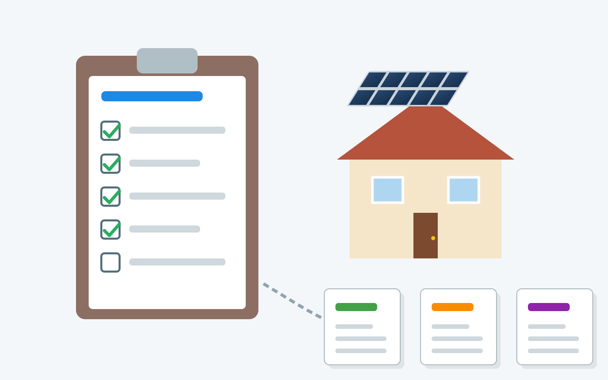

Wir schimpfen oft über Bürokratie und fordern ihren Abbau. Dabei wird häufig übersehen, dass Bürokratie auch viele Vorteile und wichtige Funktionen hat.

<figure class="wp-caption aligncenter img-thumbnail">
    
    <figcaption class="text-center">Mit Claude AI generierte Illustration: Ein standardisiertes Formular für PV-Angebote, das an mehrere Anbieter geht</figcaption>
</figure>

Vor Kurzem ist mir ein Beispiel begegnet, das zeigt, wie zusätzliche Bürokratie sogar zu mehr gesamtwirtschaftlicher Effizienz führen kann.

Aktuell plane ich eine Photovoltaikanlage (PV-Anlage) auf meinem Dach und lasse mir dazu Angebote von verschiedenen Firmen geben.

Seriöse Anbieter gehen dabei alle ähnlich vor: Sie kommen persönlich vorbei, begutachten die Situation und erfassen relevante Informationen:

1. Bedarf:
    - Wie hoch ist der jährliche Stromverbrauch?
    - Gibt es Besonderheiten beim Verbrauchsprofil (z. B. Wärmepumpe,
      Elektroauto)?
    - Wie viele Stromzähler sind vorhanden und welche Tarife (Grundgebühr,
      Arbeitspreis) gelten?
2. Gegebenheiten:
    - Wie groß ist die Dachfläche, wie ist sie ausgerichtet und geneigt? Gibt es
      Verschattung?
    - Gibt es bauliche Besonderheiten wie Dachfenster, Gauben oder Schornsteine?
    - Wie sieht die elektrische Infrastruktur aus (Zählerplatz, Einspeisepunkt,
      Erdung)?
    - Welche Dachziegel sind verbaut und in welchem Zustand befinden sie sich?
3. Wünsche:
    - Wie groß soll die Anlage werden (kWp)?
    - Ist ein Batteriespeicher gewünscht? Falls ja, wie groß?
    - Soll ein Hybrid-Wechselrichter (für PV und Speicher) oder ein reiner
      PV-Wechselrichter installiert werden?
    - Ist Monitoring gewünscht? Falls ja, wie (App, Website)?

Am Ende werde ich jedoch nur ein Angebot annehmen. Die anderen Anbieter haben ihre Zeit und Ressourcen investiert, ohne dass daraus ein Auftrag entsteht.

Effizienter wäre es, wenn es ein standardisiertes Formular gäbe, in das ich alle
relevanten Informationen eintragen könnte. So könnten die Anbieter Angebote
erstellen, ohne jedes Mal einen Vor-Ort-Termin zu vereinbaren. Das würde Zeit
und Kosten für alle Beteiligten sparen.

Der Staat könnte hier unterstützend eingreifen, indem er:

1. Ein standardisiertes Formular für PV-Angebote entwickelt.
2. Anbieter dazu verpflichtet, dieses Formular zu verwenden und dem Kunden als
   Protokoll auszuhändigen.
3. Einen angemessenen Mindestpreis für die fachgerechte Erstellung der
   Anforderungen festlegt.

Dadurch könnte der Kunde nach dem ersten Angebot (inklusive
Anforderungsprotokoll) mit diesem Protokoll zu weiteren Anbietern gehen und dort
unkompliziert weitere Angebote einholen.

Das erinnert an den [Aufmaßservice von Ikea](https://www.ikea.com/de/de/customer-service/services/kitchen-planning/)
bei Küchenplanungen: Die Planung selbst ist kostenlos, für das Ausmessen der Küche
vor Ort wird aber eine Gebühr verlangt. Dafür erhält der Kunde ein dokumentiertes
Aufmaß, mit dem er auch zu anderen Anbietern gehen kann.
