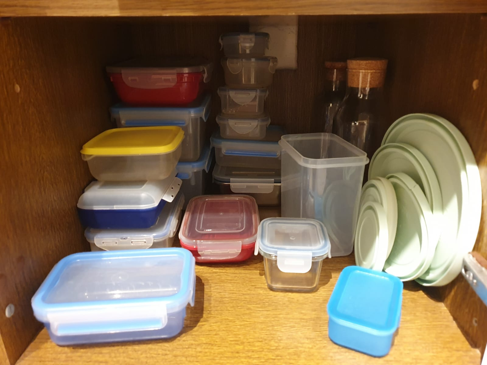
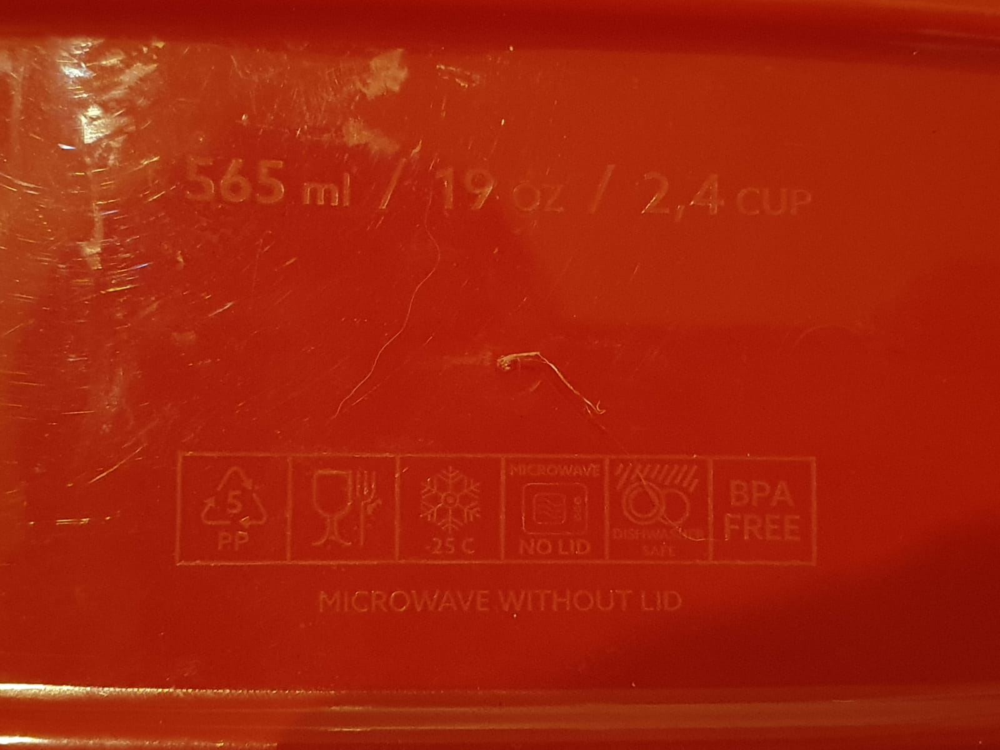

Ich habe gerade das Gefühl, dass es keine guten Frischhaltedosen gibt.

<figure class="wp-caption aligncenter img-thumbnail">
    
    <figcaption class="text-center">Mein Frischhaltedosen-Chaos</figcaption>
</figure>

Ich will ein Set von Frischhaltedosen, welche folgende Eigenschaften haben:

1. Sie haben Deckel, welche einrasten. Ich will die Dosen auch mal in der Tasche
   transportieren, ohne dass sie auslaufen. Die Frischhaltedosen sollen also einen
   Rand haben, in welchen der Deckel einrastet.
2. Sie sind mit Deckel stapelbar, ohne dass sie verrutschen. Der Deckel hat also
   eine Vertiefung, in welche der Boden der Dose darüber passt.
3. Sie sind ohne Deckel platzsparend stapelbar. Sie müssen also nach unten
   verjüngt sein.
4. Sie sind auslaufsicher. Die Deckel müssen also eine Dichtung haben.
5. Es gibt sie in verschiedenen Materialien:
    - Glas: Für Zuhause. Für den Ofen, die Mikrowelle, Spülmaschine, und
      Gefrierschrank geeignet. Transparent.
    - Kunststoff: Für unterwegs. Für die Mikrowelle, Spülmaschine, und
      Gefrierschrank geeignet. BPA-frei. Transparent.
6. Es gibt verschiedene Größen, die jedoch den gleichen Deckel nutzen.
7. Sie sind innen und außen glatt, damit sie leicht zu reinigen sind.
8. Sie sind eckig, damit sie im Kühlschrank und in der Tasche wenig Platz
   verschwenden.
9. Es gibt eine mit 500ml, 1l, und 5l Volumen. Sie nutzen jedoch alle den
   gleichen Deckel.
10. In die Frischhaltedosen sind 4 kleine Füße integriert, damit sie nicht
    direkt auf der Tischplatte stehen. So kann Luft zirkulieren.
11. Auf dem Boden sollte eine Beschriftung sein, die angibt, ob die Dose für
    Gefrierschrank, Mikrowelle, Spülmaschine, und Ofen geeignet ist. Die
    Marke/das Modell der Dose sowie deren Volumen sollten auch auf dem Boden
    stehen. Außen. Nicht innen. Damit man sie immer noch leicht reinigen kann.

<figure class="wp-caption aligncenter img-thumbnail">
    
    <figcaption class="text-center">Beschriftung auf einer Frischhaltedose</figcaption>
</figure>

## Die Perfekten Maße

<figure class="wp-caption aligncenter img-thumbnail">
    
    <figcaption class="text-center">ChatGPT rendering einer guten Frischhaltedose</figcaption>
</figure>

Ich denke eine Deckelfläche von 11x16cm ist ideal. Der Deckel soll einen 1cm
breiten Rand haben, in welchen der Boden der Dose darüber passt. Daher müssen die
Dosen die Form eines rechtwinkligen Pyramidenstumpfs haben. Damit ergibt sich für das
Volumen folgende Formel:

$$V = \frac{h}{3} \cdot (A_1 + A_2 + \sqrt{A_1 \cdot A_2})$$

Mit $A_1 = 9cm \cdot 14cm = 126cm^2$ und $A_2 = 11cm \cdot 16cm = 176cm^2$
ergibt sich:

$$V(h) = 150.37cm^2 \cdot h$$

* 500ml: h=3.3cm
* 1l: h=6.6cm
* 2l: h=13.3cm

## Kandidaten

* [Ikea 365+](https://www.ikea.com/de/de/p/ikea-365-vorratsbehaelter-mit-deckel-rechteckig-glas-kunststoff-s89269071/): Warum gibt es die nur in 1l? Der wäre nahezu perfekt.
* [Lock&Lock](https://www.locknlock.de/index.php/top-class): Mal wieder zu viele Deckel und die Größen passen nicht - nur 380ml ist zu klein, aber 630ml ist zu groß.
* [Emsa](https://www.emsa.com/produkt/clip-close-frischhaltedose-glas-3er-set-18l-45l-13l): Das selbe Problem wie bei Lock&Lock. Die [0.55L Dose](https://www.emsa.com/produkt/clip-close-frischhaltedosen-rechteckig) ist perfekt für vieles, aber der Deckel passt halt nur auf diese Größe.
* [OXO](https://www.oxo.de.com/lebensmittelaufbewahrung/) scheint auch nichts zu haben.

Wenn ihr noch gute Kandidaten kennt, schreibt mir gerne eine E-Mail an
info@martin-thoma.de. Vielleicht gibts ja ein paar Meal-Prep-Enthusiasten, die
eine gute Lösung gefunden haben 😉
