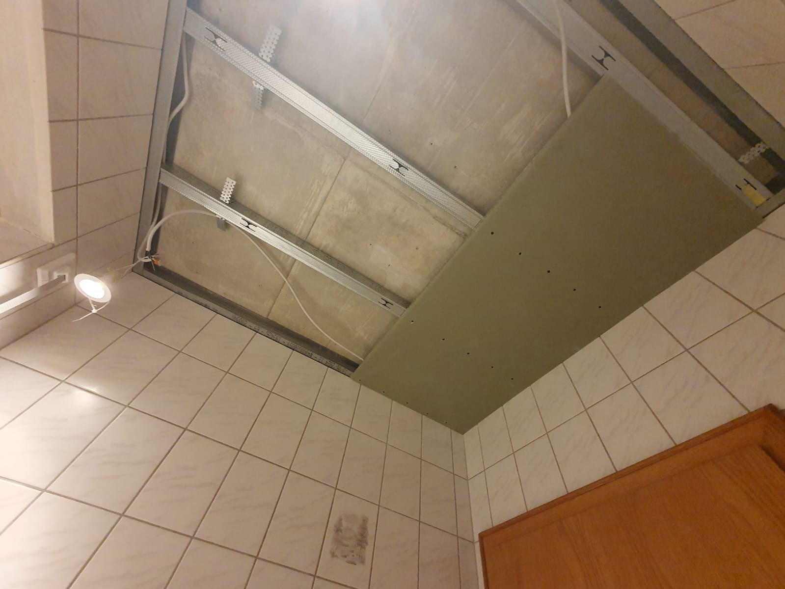
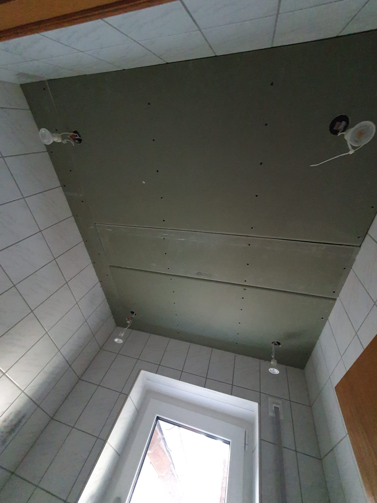
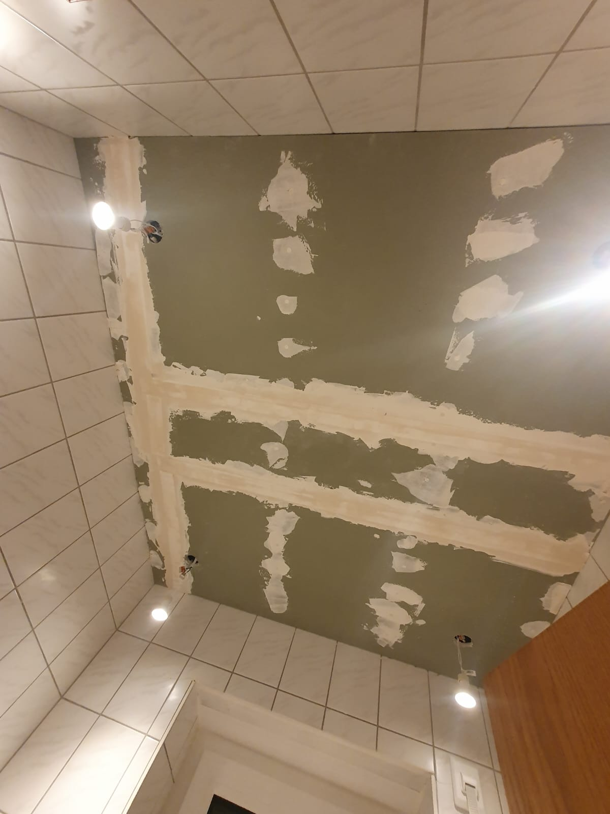

Das Abhängen einer Decke ist ein beliebtes DIY-Projekt, um unschöne Altbauten
zu modernisieren, Installationen zu verbergen oder die Raumhöhe zu reduzieren.
Diese Anleitung führt Sie Schritt für Schritt durch den gesamten Prozess.

## ⚠️ Sicherheitshinweise

**Vor Beginn der Arbeiten unbedingt beachten:**

* **Elektroinstallationen**: Stromzufuhr vor Beginn abschalten! Professionelle
  Elektroarbeiten gehören in Fachhand. Überlegt euch vor Projektbeginn, wo die
  Lampen platziert werden sollen und wo die Leitungen verlaufen.
* **Schutzausrüstung**: Schutzbrille und Staubmaske beim Bohren/Schleifen tragen.

## Unterkonstruktion bauen

<figure class="wp-caption aligncenter img-thumbnail">
    
    <figcaption class="text-center">Decke mit Profil</figcaption>
</figure>

**Material**:

<table>
  <thead>
      <tr>
          <th>Bezeichnung</th>
          <th>Preis pro Einheit</th>
          <th>Benötigte Menge</th>
          <th>Gesamtpreis</th>
      </tr>
   </thead>
   <tbody>
      <tr>
          <td><a href="https://www.globus-baumarkt.de/p/knauf-ud-wandanschlussprofil-3000-x-28-x-27-mm-0779250252/">UD-Profile</a> <abbr title="Das U steht für die Form, das D für Decke. UW-Profile sind für Wände">ℹ️</abbr></td>
          <td>7.20€ für 3m</td>
          <td>1m pro Meter Raumumfang</td>
          <td>2.40€ pro Meter Raumumfang</td>
      </tr>
      <tr>
          <td><a href="https://www.globus-baumarkt.de/p/knauf-dichtungsband-30-m-rolle-3-cm-breit-anthrazit-0779250819/">Dichtungsband</a></td>
          <td>7.85€ für 30m</td>
          <td>1m pro Meter Raumumfang</td>
          <td>0.26€ pro Meter Raumumfang</td>
      </tr>
      <tr>
            <td><a href="https://www.amazon.de/dp/B08RJZWCPP
">Schlagdübel</a> für Wandbefestigung</td>
            <td>7.94€ für 200 Stück</td>
            <td>2 Stück pro Meter Raumumfang</td>
            <td>0.08€ pro Meter Raumumfang</td>
      </tr>
      <tr>
          <td><a href="https://www.globus-baumarkt.de/p/knauf-cd-deckenprofil-2600-x-60-x-27-mm-0779250249/">CD-Profile</a> <abbr title="Das C steht für die Form, das D für Decke. CW-Profile sind für Wände.">ℹ️</abbr></td>
          <td>7.65€ für 2.6m</td>
          <td>ca. 1m pro m² Decke; bei kleinen Decken gibt es viel Verschnitt</td>
          <td>2.94€/m² Decke</td>
      </tr>
      <tr>
          <td><a href="https://www.globus-baumarkt.de/p/knauf-direktabhaenger-125-mm-fuer-cd-profil-60-27-100-stueck-0779250804/">Direktabhänger</a></td>
          <td>40.95€ für 100 Stück</td>
          <td>1 Stück/m² Decke</td>
          <td>0.41€/m² Decke</td>
      </tr>
      <tr>
          <td><a href="https://www.globus-baumarkt.de/p/knauf-blechschrauben-3-5-x-9-mm-100-stk-0763020154/">Blechschrauben</a></td>
            <td>8.20€ für 100 Stück</td>
            <td>2 Stück/m² Decke</td>
            <td>0.16€/m² Decke</td>
      </tr>
   </tbody>
   <tfoot>
      <tr>
          <th colspan="3">Gesamt:</th>
          <th>ca. 3.51€/m² Decke + 2.74€ pro Meter Raumumfang</th>
      </tr>
   </tfoot>
</table>

**Werkzeuge**: Linienlaser, Akkuschrauber, Blechschere (eine Metallsäge oder Winkelschleifer funktionieren auch), Schlagbohrmaschine, Maßband, Bleistift, Wasserwaage, Cuttermesser, Bausauger, Arbeitsleuchte, stabile Leiter/Gerüst

Vorgehen:

1. Mit dem Linienlaser wird eine Hilfslinie an der Wand eingezeichnet, um die
   Höhe der Decke zu bestimmen.
2. Dann schneidet man die UD-Profile auf die benötigte Länge zu.
3. Das Dichtungsband wird auf die UD-Profile geklebt, um Schallbrücken zu
   vermeiden.
4. Die UD-Profile werden mit Schlagdübeln an der Wand befestigt. Der Abstand
   zwischen den Dübeln sollte ca. 50 cm betragen.
5. Die CD-Profile werden auf die gewünschte Länge zugeschnitten.
6. Die Direktabhänger werden an der Decke befestigt. Der Abstand zwischen den
   Abhängern sollte ebenfalls ca. 50 cm betragen.
7. Die CD-Profile werden in die Direktabhänger eingehängt und mit Blechschrauben
   befestigt.

## Decke beplanken

<figure class="wp-caption aligncenter img-thumbnail">
    
    <figcaption class="text-center">Decke mit Gipskartonplatten</figcaption>
</figure>

**Material**:

* [Gipskartonplatten](https://www.globus-baumarkt.de/p/knauf-gipskarton-ausbauplatte-gkb-200-x-60-cm-12-5-mm-0779250155/) (12,5 mm stark): ca. 4€/m²
* [Trockenbauschrauben](https://www.globus-baumarkt.de/p/knauf-schnellbauschrauben-3-5-x-45-mm-ph-1-1000-stueck-0763031516/): ca. 0.01€/Stück
* [Trennfix](https://www.globus-baumarkt.de/p/knauf-trenn-fix-50-m-x-65-mm-0779250890/): ca. 0.21€/m

**Werkzeuge**: Akkuschrauber, Gipskartonmesser, Metalllineal, Plattenheber (oder 2. Person), Bleistift

**Hilfsmittel**: Atemschutzmaske bei staubigen Arbeiten, Schutzbrille

**Vorgehen**:

1. Zunächst wird unter den Wandprofilen das Trennband an die Wand geklebt.
   Dies verhindert Risse, falls sich die Decke anders bewegt als die Wand.
2. Die Gipskartonplatten werden mit Trockenbauschrauben an der Decke befestigt.
   Die Schrauben müssen versenkt werden, damit sie später vollständig mit
   Spachtelmasse bedeckt werden können.
3. Bei der Beplankung ist zu beachten:
    * Die Kanten zur Wand hin müssen einen 90° Winkel haben. Die
      Gipskartonplatten sollten daher exakt passend zugeschnitten werden.
    * Kreuzfugen sind zu vermeiden: Die Fugen der Gipskartonplatten
      dürfen nicht aufeinander treffen.
    * Die Gipskartonplatten müssen versetzt angebracht werden, um
      durchgehende Fugenlinien zu vermeiden.
    * Wandanschluss: 2-3 mm Abstand zur Wand lassen, wird später gespachtelt.

## Q1 Spachteln

<figure class="wp-caption aligncenter img-thumbnail">
    
    <figcaption class="text-center">Decke mit Q1 Spachtelung</figcaption>
</figure>

Die Q1-Spachtelung ist die Grundbehandlung der Fugen und Schraubenlöcher.
Hierbei werden alle Fugen mit Spachtelmasse gefüllt und mit Fugendeckband
armiert, um Risse zu vermeiden. Diese Qualitätsstufe ist für Bereiche
ausreichend, die später gefliest oder mit grobstrukturierten Tapeten beklebt
werden.

**Material**:

* [Uniflott Spachtelmasse](https://www.globus-baumarkt.de/p/knauf-uniflott-fertigspachtel-20-kg-0779250675/): 40.99€ für 25kg Pulver
* [Papier Fugendeckstreifen](https://www.globus-baumarkt.de/p/decotric-papier-fugendeckstreifen-ole-75-m-x-53-mm-0779251377/): 6.29€ für 75 m x 53 mm

**Werkzeuge**: Spachtelkelle (18-25 cm), Japanspachtel (8-10 cm), Eimer, Schwamm/Pinsel für Anfeuchten

Vorgehen:

1. Die Uniflott-Spachtelmasse wird mit Wasser angerührt. Die Masse sollte
   geschmeidig und nicht zu flüssig sein.
2. Selbst angefaste Kanten werden mit Wasser angefeuchtet, damit die
   Spachtelmasse besser haftet und später keine Risse entstehen.
3. Die Fugen zwischen den Gipskartonplatten werden mit der Spachtelmasse gefüllt.
   Die Masse muss dabei in die Fuge hineingedrückt werden - nicht entlang der
   Fuge streichen, sondern quer zur Fuge arbeiten.
4. Alle Schrauben werden mit Spachtelmasse überdeckt. Falls die Schrauben nicht
   vollständig bedeckt werden können, müssen sie tiefer versenkt werden.
5. Nachdem die Fugen mit Spachtelmasse gefüllt sind, wird ein Fugendeckband
   (Glasfasergewebe oder Papier) in die noch feuchte Spachtelmasse eingedrückt.
   Anschließend wird nochmals mit Spachtelmasse über das Band gestrichen, damit
   es vollständig bedeckt ist.

**Tipp**: Bei der Verwendung von Gipskartonplatten sollte der Abstand zwischen
den CD-Profilen maximal 50 cm betragen, um eine stabile Konstruktion zu
gewährleisten.

Wer es als Video sehen möchte:

<iframe width="560" height="315" src="https://www.youtube.com/embed/3TPXAaTwtjQ?si=46NmBSwUdZOnwB_C" title="YouTube video player" frameborder="0" allow="accelerometer; autoplay; clipboard-write; encrypted-media; gyroscope; picture-in-picture; web-share" referrerpolicy="strict-origin-when-cross-origin" allowfullscreen></iframe>

## Q2 Spachteln

Die Q2-Spachtelung baut auf Q1 auf und umfasst zusätzlich das Glätten der
gespachtelten Bereiche. Die Oberfläche wird feiner und ist geeignet für
mittelstrukturierte Tapeten oder Anstriche mit grobkörnigen Strukturputzen.

**Vorgehen**:

Nach der vollständigen Trocknung der Q1-Spachtelung wird eine zweite Schicht
Spachtelmasse aufgetragen. Diese wird breiter als beim ersten Durchgang
aufgetragen und anschließend geglättet, um Übergänge und Unebenheiten zu
beseitigen.

## Q3 Spachteln

Die Q3-Spachtelung ist eine hochwertige Oberflächenbehandlung für feine
Tapeten oder Anstriche. Zusätzlich zu Q2 werden alle gespachtelten Bereiche
geschliffen und eine dritte, sehr dünne Spachtelschicht aufgetragen.

**Vorgehen**:

1. Nach der Trocknung der Q2-Spachtelung werden alle gespachtelten Bereiche
   mit feinem Schleifpapier (220er Körnung) angeschliffen.
2. Der Schleifstaub wird gründlich entfernt.
3. Eine dritte, sehr dünne Schicht Fertigspachtelmasse wird großflächig
   aufgetragen und geglättet.
4. Nach der Trocknung wird erneut fein geschliffen.

## Q4 Spachteln

Die Q4-Spachtelung ist die höchste Qualitätsstufe und für hochwertige,
glänzende Anstriche oder sehr feine Tapeten erforderlich. Die gesamte
Oberfläche wird vollflächig gespachtelt und mehrfach geschliffen.

**Vorgehen**:

1. Aufbauend auf Q3 wird die gesamte Fläche mit Fertigspachtelmasse
   vollflächig gespachtelt.
2. Nach der Trocknung wird die Oberfläche mit feinem Schleifpapier (240er
   Körnung) geschliffen.
3. Bei Bedarf wird eine weitere dünne Spachtelschicht aufgetragen.
4. Abschließendes Schleifen mit sehr feinem Schleifpapier (320er Körnung)
   für eine perfekt glatte Oberfläche.

## Streichen

**Material**:

* Grundierung (z.B. Tiefgrund): ca. 15€ für 5 Liter
* Deckenfarbe (z.B. Dispersionsfarbe): ca. 25€ für 10 Liter
* Farbroller mit Teleskopstange: ca. 20€
* Pinsel für Ecken und Kanten: ca. 8€
* Abdeckfolie und Malerkrepp: ca. 10€

**Vorgehen**:

1. **Vorbereitung**: Den Raum abdecken und alle Kanten mit Malerkrepp
   abkleben. Besonders wichtig sind die Übergänge zu den Wänden.
2. **Grundierung auftragen**: Die gespachtelte Decke wird zunächst mit
   Tiefgrund grundiert. Dies sorgt für gleichmäßige Saugfähigkeit und
   bessere Haftung der Farbe.
3. **Streichen**:
   - Zuerst werden die Ecken und Kanten mit dem Pinsel vorgestrichen
   - Anschließend wird die Fläche mit dem Farbroller in gleichmäßigen
     Bahnen gestrichen
   - Für ein gleichmäßiges Ergebnis sollte "nass in nass" gearbeitet werden
   - Bei Bedarf einen zweiten Anstrich auftragen
4. **Nachbearbeitung**: Nach dem Trocknen das Malerkrepp vorsichtig entfernen
   und eventuelle Nachbesserungen vornehmen.
