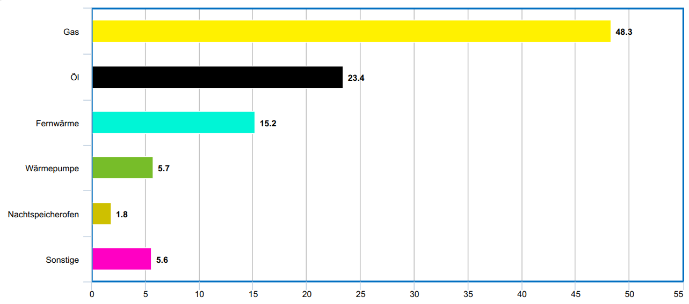
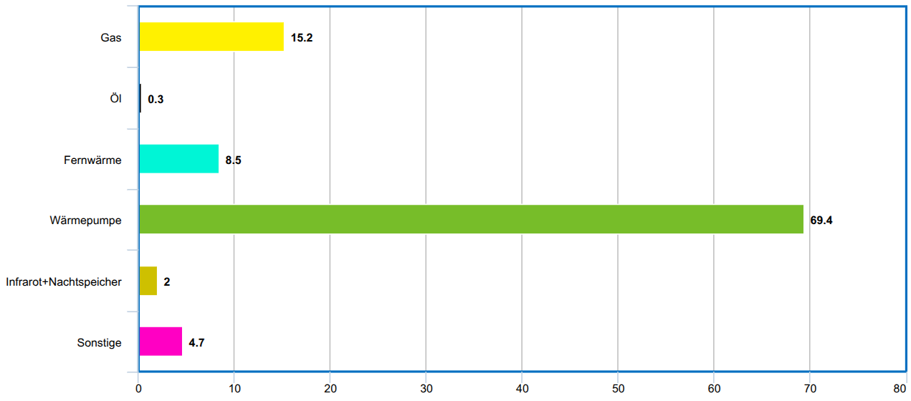

Schlechte Bildungspolitik kann uns Volkswirtschaftlich teuer zu stehen kommen.
Das ist mir klar geworden, als ich mir das Video vom Akku Doktor über
[die exorbitanten Preise von Wärmepumpen in Deutschland](https://www.youtube.com/watch?v=Cvt7cjIIat8)
angesehen habe.

## Das Problem

<figure class="wp-caption aligncenter img-thumbnail">
    
    <figcaption class="text-center">Wie wir 2024 in Deutschland heizen</figcaption>
</figure>

Aktuell sind [über 70% der verbauten Heizungen Verbrenner](https://de.statista.com/infografik/27327/anteil-der-energietraeger-beim-heizen-des-wohnungsbestandes-in-deutschland/) (Stand: Febrauar 2024).

<figure class="wp-caption aligncenter img-thumbnail">
    
    <figcaption class="text-center">Wie wir 2025 in Deutschland in Neubauten heizen (Quelle: <a href="https://www.bdew.de/energie/heizung-neubau-statistik/">bdew.de</a>)</figcaption>
</figure>

[70% der Neubauten in Deutschland werden mit Wärmepumpen beheizt](https://www.tagesschau.de/wirtschaft/energie/waermepumpen-anteil-wohngebaeude-erneuerbare-100.html) (Stand: Juni 2025).

Dieser Trend wird sich noch verstärken: Umso weniger Haushalte Gas und Fernwärme
nutzen, desto teurer wird es für die verbleibenden Nutzer das Leitungsnetz zu
unterhalten.

Umso mehr Leute Wärmepumpen nutzen, desto günstiger/effizienter werden die
Wärmepumpen durch Skaleneffekte. Auch der Einbau wird günstiger, weil mehr
Installateure Erfahrung mit Wärmepumpen sammeln.

Allerdings heißt es kurzfristig, dass wir einen Engpass an Installateuren für
Wärmepumpen haben werden.

Der Effekt ist, dass die Preise für den Einbau von Wärmepumpen in die Höhe
schießen, weil die Nachfrage das Angebot übersteigt.

## Was man machen könnte

1. **Gesellen-Ausbildung anpassen**: Anlagenmechaniker für Sanitär‑, Heizungs‑
   und Klimatechnik sollten als verpflichtenden Teil ihrer Ausbildung den
   kleinen Kältemittel-Schein machen müssen. Damit dürften Gesellen bestehende
   Anlagen kontrollieren. Das sind 1-3 Tage extra in der Ausbildung. Dafür
   könnte man die Ausbildung mit Öl-Brennwertkesseln nicht mehr als
   verpflichtenden Teil der Ausbildung machen, sondern einen optionalen Schein
   einführen.
2. **Meister-Ausbildung anpassen**: Den großen Kältemittel-Schein verpflichtend machen (1-2 Wochen). Wurde auch in [der Handwerks-Zeitung](https://www.deutsche-handwerks-zeitung.de/dhz-rubrik-tacheles-waermepumpe-nur-mit-kaelteschein-355990/) im Januar 2025 gefordert. Auch hier könnte man Teile der Ausbildung über Öl-Brennwertkessel optional machen.
3. **Bezuschussung der Ausbildung**: Betriebe müssen mehr Ausbilden. Aktuell ist
   es aber wohl wesentlich rentabler neue WP einzubauen.
