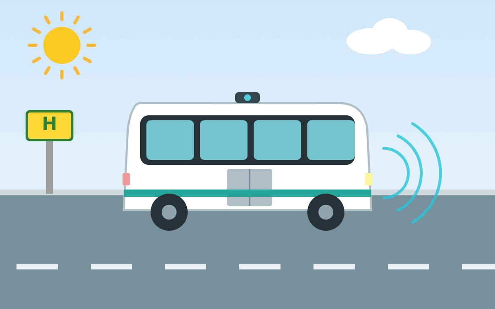

Autonome Shuttle-Busse sind Kleinbusse, die ohne Fahrer fahren können. Sie sind
meist elektrisch betrieben, häufig für 6-12 Personen ausgelegt und fahren mit
einer sehr niedrigen Geschwindigkeit. Sie werden häufig als Ride-Pooling-Systeme
eingesetzt, bei denen mehrere Fahrgäste mit ähnlichen Routen gemeinsam befördert
werden.

<figure class="ai-generated">
    
    <figcaption>Ein autonomer elektrischer Shuttle-Bus mit Sensoren. Mit Claude AI generierte Illustration.</figcaption>
</figure>

## Vergangene Projekte

* 2017 - 2021 in Marly bei Freiburg im Üechtland (Schweiz)[^1]
* 2020 - 2024 "Shuttle-Modellregion" in Hof, Kronach, Rehau und Bad Steben. Max. 18&nbsp;km/h, Shuttle-Operator an Bord; Leitstelle zur Koordination[^2]
* 2021 - 2023 in Kelheim: KelRide
* Seit 2023 in Karlsruhe[^3]
* Ab 2026 in Hamburg[^4] AHOI und ALIKE[^5]
* Ulm prüft es für 2030[^6]
* 2025 waren in München (Hadern) elektrische Mini-Busse für 6 Wochen unterwegs.[^7] Ab 2026 sollen sie in Freiham und Neuaubing fahren. Ab 2027-2028 sollen die ersten autonomen Mini-Busse mit bis zu 10 Passagieren und Midi-Busse mit bis zu 30 Passagieren fahren. Ab 2030 sollen die ersten autonomen Busse mit 60 oder mehr Passagieren fahren.

## Experten

* [Prof. Richard Göbel](https://www.iisys.de/profile/richard-goebel/)
* Jörg Schrepfer (Valeo)

## Videos

* [Driverless Mini-Buses in Service in Eastern Chinese City](https://www.youtube.com/watch?v=6q8fiRuC4ds), 30.07.2024.

## Einzelnachweise

[^1]: Regula Saner: [Selbstfahrende Busse liefern wichtige Erkenntnisse für die Zukunft](https://freiburger-nachrichten.ch/story/169930/selbstfahrende-busse-liefern-wichtige-erkenntnisse-f%C3%BCr-die%C2%A0zukunft) via Freiburger Nachrichten, 08.02.2022.
[^2]: Annerose Zuber: ["Autonomes Fahren nach vorne gebracht" – Forschungsprojekt endet](https://www.br.de/nachrichten/bayern/autonomes-fahren-nach-vorne-gebracht-forschungsprojekt-endet,UPf73s5) via BR24, 30.09.2024.
[^3]: [Autonomes Fahren im ÖPNV](https://www.kvv.de/mobilitaet/eva-shuttle.html) via KVV, abgerufen am 27.09.2026.
[^4]: [Projekt ALIKE: Autonome On-Demand-Shuttles](https://www.hamburg.de/verkehr/e-mobilitaet/alike-autonome-shuttle-955526) via hamburg.de, abgerufen am 27.09.2026.
[^5]: Carla Westerheide: [Hamburg: autonomous shuttles delayed until 2026](https://www.electrive.com/2025/06/28/hamburg-autonomous-shuttles-delayed-until-2026/) via electrive, 28.06.2025.
[^6]: Paolo Percoco: [Autonomes Fahren in Ulm: SWU testet Shuttlebusse für die Zukunft](https://www.donau3fm.de/autonomes-fahren-in-ulm-swu-testet-shuttlebusse-fuer-die-zukunft-1012459/) via DONAU 3 FM, 07.04.2025.
[^7]: [Automation in public transport](https://www.mvg.de/projekte/zukunftsprojekte/automatisierung.html?lang=en) via MVG, 15.11.2023.
