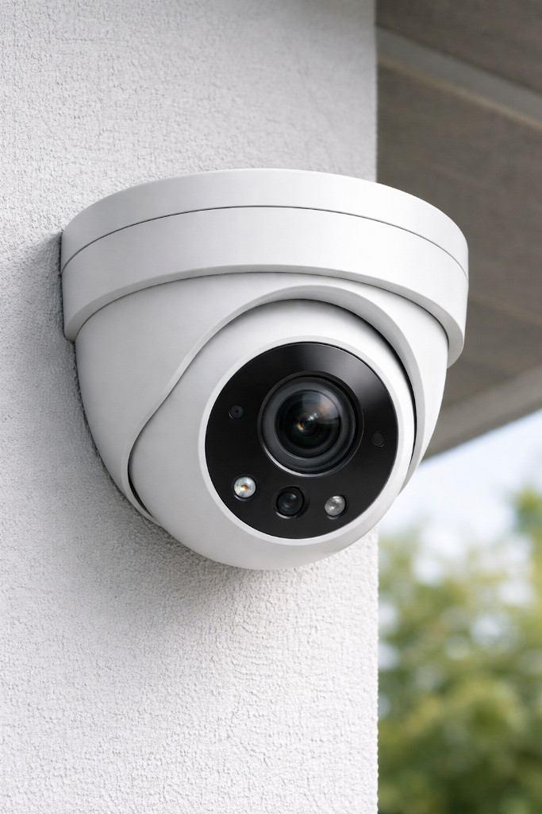

I love thinking about perfect designs for everyday objects. Here is my idea for
a perfect security camera.

The core principle which all security cameras I know violate is a local-first approach. The camera should still work, even if you have no internet connection. That is possible if you're in the same network as the camera.

<figure class="wp-caption aligncenter img-thumbnail">
    
    <figcaption class="text-center">A security camera</figcaption>
</figure>

## Hardware

* Form factor:
    * Turret style for easy camera angle adjustment (in contrast to bullet cameras) and better image quality than bullet cameras
    * Mounting: Adjustable mount for wall or ceiling installation
* Camera:
    * High-resolution sensor
    * Wide-angle lens
    * Infrared night vision
* Microphone and speaker for two-way audio
* Power:
    * Built-in battery for power outages
    * Power-over-Ethernet (PoE) support
    * USB-C power input as an alternative, with the option to use solar panels
* Storage: microSD card slot for local storage
* Connectivity:
    * Wi-Fi
    * Ethernet with Power-over-Ethernet (PoE) support
    * Bluetooth for initial setup
* Miscellaneous:
    * LED to illuminate the area (both infrared and visible light)
    * Status LED (configurable to be off during operation)
    * Physical privacy shutter
    * Weatherproof casing (IP65 or higher)
    * Tamper-detection sensor
    * On-device clock

## Software

### On-Device Software

* Detects motion and faces locally
* Includes a built-in security key to authenticate itself to the central server
* Supports Bluetooth for initial setup
* Synchronizes the on-device clock with a time server
* Supports over-the-air (OTA) firmware updates from the central server
* Setting up privacy modes (e.g., disable recording at certain times) and zones (e.g. masking out certain areas in the camera view) locally on the device
* Setting up

### Central Server Software

Authentication:

* Allow multiple users with different roles
    * Admin: Full access to all cameras and settings; allow adding new users;
      allow adding and removing cameras
    * Home-User: Access to all cameras of a household; allow changing the angle
      of cameras; allow receiving alerts; allow enabling lights or using two-way
      audio
* Allow setting up two-factor authentication (2FA)

Security:

* Audit log of all access and changes. This log cannot be changed, even by admins.

Storage:

* device metadata (online/offline timestamps and installed firmware versions)
* recorded videos with timestamps and associated camera

### End-User Application

This could be a native mobile app, but for a start a web application would be sufficient. This web application can run on the central server.

Frontend:

* **Overview page:** All cameras with the latest snapshot
* **Camera detail page:**
    * Live view
    * Recorded videos:
        * Playback
        * Download
    * Camera settings
    * Firmware update
    * Alert history

### Camera ↔ Server Communication Protocol

* Open and publicly documented
* Cryptographic authentication of the camera
* Encrypted communication channel
* Camera can push alerts to the server
* Camera can...

### End-User App ↔ Server Communication Protocol

* Open and publicly documented
* User authentication
* Encrypted communication channel
