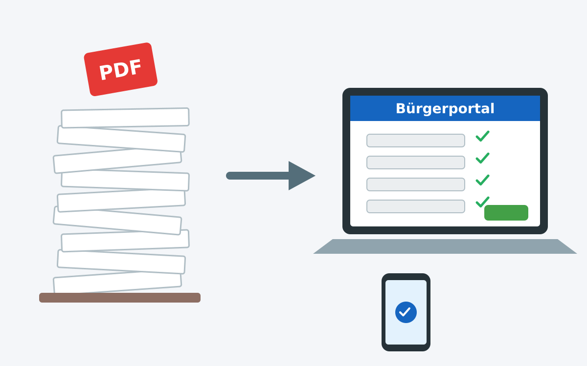

Der Bürokratieabbau in Deutschland ist seit Jahren ein häufig diskutiertes
Thema, allerdings bleiben wir meist bei allgemeinen Aussagen stehen. In diesem
Beitrag möchte ich konkrete Maßnahmen vorschlagen, die meiner Meinung nach
helfen könnten, die Bürokratie in Deutschland zu reduzieren und die Effizienz zu
steigern.

<figure class="wp-caption aligncenter img-thumbnail">
    
    <figcaption class="text-center">Mit Claude AI generierte Illustration: Vom Papierstapel zum digitalen Bürgerportal</figcaption>
</figure>

## Konkrete Beispiele

Um ineffiziente Bürokratie zu verdeutlichen, möchte ich konkrete Beispiele
aus meinem eigenen Leben anführen.

### Beantragung eines Besuchervisums

Meine indonesischen Schwiegereltern sollen dieses Jahr zu Besuch kommen. Dafür
müssen wir Folgendes machen:

1. **Verpflichtungserklärung**: Ich muss über Gehaltsnachweise belegen, dass ich
   für die Kosten ihres Aufenthalts aufkommen kann. Dazu muss ich...
   * ein PDF-Formular ausfüllen, ausdrucken, unterschreiben, einscannen, per
     E-Mail verschicken und die Verwaltungsbeamtin tippt das dann wieder ein,
   * einen Scan der Ausweisdokumente von mir, meiner Frau und ihren Eltern
     mitschicken,
   * Gehaltsnachweise per E-Mail schicken,
   * persönlich bei der Ausländerbehörde vorbeigehen, um die Verpflichtungserklärung
     zu unterschreiben.
2. **Krankenversicherung** abschließen
3. **Dokumente bei der Deutschen Botschaft in Jakarta** (bzw. deren Visadienstleister) einreichen:

...

## Effizienter Datenaustausch

Ein großes Ärgernis in Deutschland sind Mängel im Datenaustausch. Konkret gibt
es hier drei Kategorien:

1. **Zwischen Bürgern und Behörden**:
   * **Bürgerportal**: Es sollte **ein** zentrales Bürgerportal geben, über das
     Bürger mit allen Behörden kommunizieren und Dokumente austauschen können.
     Dieses Portal muss den Bürger authentifizieren und eine sichere Verbindung
     gewährleisten. Der Bürger sollte dort mit allen Ebenen der Verwaltung
     (kommunal, landesweit, bundesweit) interagieren können. Also eben nicht
     Elster + BayernPortal + diverse andere Portale, sondern **ein** Portal.
   * **Formulare**: Jedes Formular, welches Bürger ausfüllen müssen, sollte es in
     digitaler Form geben - sowohl als ausfüllbares PDF als auch als Webformular.
     Das Web-Formular sollte grundlegende Datenvalidierung beinhalten, um Fehler zu
     minimieren.
2. **Zwischen Behörden und Firmen**: Viele Informationen, welche Behörden und
    Ämter von mir als Bürger benötigen, kommen ursprünglich von Firmen. Beispiele
    sind Gehaltsnachweise von Arbeitgebern, Versicherungsnachweise,
    Mietverträge, usw. Diese Daten sollten **direkt** von den Firmen an die
    Behörden übermittelt werden müssen. Dafür sollten standardisierte
    Schnittstellen (APIs) geschaffen werden, die es Firmen ermöglichen, diese
    Daten sicher und effizient an die Behörden zu übermitteln.

Kernprinzipien für den Datenaustausch sollten sein:

* **Komplett online**: Der gesamte Prozess sollte online ablaufen, ohne dass
  physische Dokumente eingereicht/ausgedruckt/gescannt/abgetippt werden müssen
  oder der Bürger persönlich erscheinen muss.
* **Einmalige Dateneingabe**: Bürger sollten Daten nur einmal eingeben müssen.
  Danach sollten diese Daten für zukünftige Anträge gespeichert und
  wiederverwendet werden können.
*

### Zwischen Behörden
