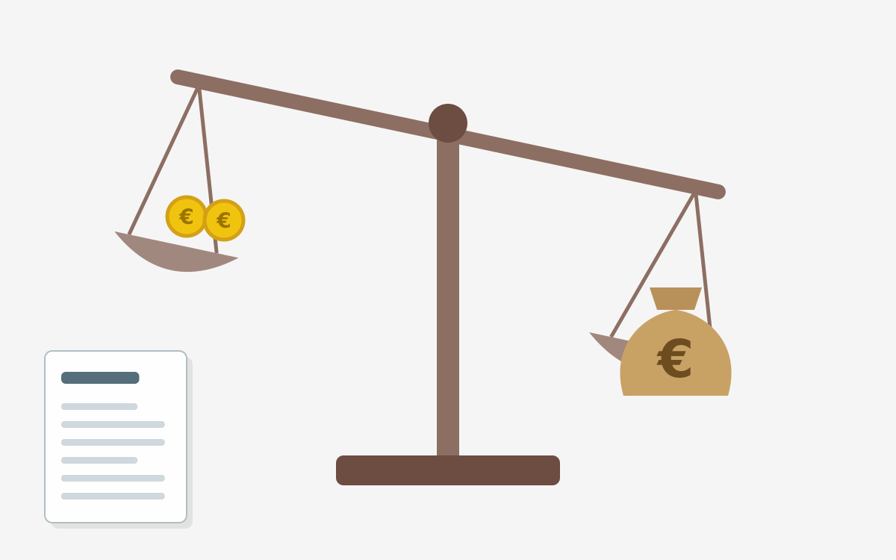

<figure class="wp-caption aligncenter img-thumbnail">
    
    <figcaption class="text-center">Mit Claude AI generierte Illustration: Eine Waage mit wenigen Münzen auf der einen und einem Geldsack auf der anderen Seite</figcaption>
</figure>

## Wahlprogramm der AfD

Die Pläne der AfD würden vor allem ärmere Menschen benachteiligen: Sie will die
Erbschaftssteuer abschaffen, keine Vermögenssteuer einführen, die Lohnsteuer bei
Spitzenverdienern senken und lehnt eine Erhöhung des Mindestlohns ab. 2024 wurden [8,5
Milliarden Euro Erbschaftsteuer](https://www.destatis.de/DE/Presse/Pressemitteilungen/2025/08/PD25_320_736.html) festgesetzt (plus 4,8 Milliarden Euro Schenkungsteuer). Wenn die wegfallen, muss man woanders sparen. In
den letzten Jahren haben wir immer wieder gemerkt, dass im Zweifelsfall bei
Sozialleistungen versucht wird zu sparen.
