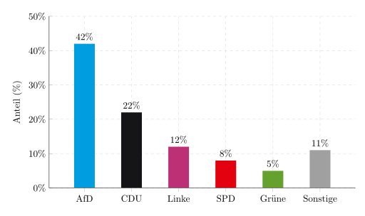
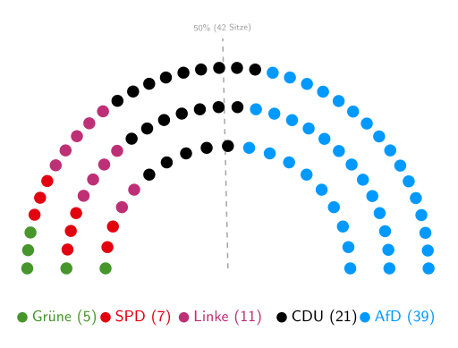

Am Sonntag den 6. September 2026 (übermorgen!) wird in Sachsen-Anhalt ein neuer
Landtag gewählt. Ich will die Gelegenheit als Fingerübung nutzen um mal wieder
ein paar Prognosen zu machen.

## Die Umfragen

Ich habe keinerlei Wissen über Sachsen-Anhalt, daher muss ich mich auf Umfragen
verlassen. Auf
[wahlrecht.de](https://www.wahlrecht.de/umfragen/landtage/sachsen-anhalt.htm)
kann man die aktuellen Umfragen einsehen. Betrachtet man nur die 4 Umfragen der
letzten 2 Wochen, so ergibt sich folgendes Bild:

* AfD: 40-43%
* CDU: 22-23%
* Linke: 11-13%
* SPD: 7-9%
* Grüne: 5-6%
* BSW: 3-4%
* Sonstige: 6-7%

Der [Landtag von Sachsen-Anhalt](https://de.wikipedia.org/wiki/Landtag_von_Sachsen-Anhalt)
hat 83 Sitze, aber durch
[Überhang- und Ausgleichsmandate](https://wahlen.sachsen-anhalt.de/zu-den-wahlen/allgemeine-informationen-zur-landtagswahl/wahlsystem)
ist die Zahl der Sitze bereits in der aktuellen Legislaturperiode auf 97
angestiegen.

## Prognose 1: Die Grünen verhindern eine AfD-Alleinregierung

Ich gehe davon aus, dass es die SPD und Grünen in den Landtag von Sachsen-Anhalt
schaffen werden, BSW jedoch nicht.

Das Ergebnis könnte in etwa so aussehen:

Die **5% Hürde** besagt, dass Parteien nur dann in den Landtag einziehen, wenn sie
mindestens 5% der Stimmen erhalten. Das würde folgende Sitzverteilung ergeben:

Das hätte einige Konsequenzen:

1. Der AfD würden 3 Sitze zur absoluten Mehrheit fehlen - bei 83 Sitzen würden
   Sie 42 Sitze benötigen.
2. Da die AfD keine Koalitionspartner hat/will, würde sie keine Regierung bilden können.
3. Nur alle anderen Parteien zusammen könnten eine Regierung bilden. Das wurde allerdings bereits von der CDU auf Bundesebene ausgeschlossen ([Unvereinbarkeitsbeschluss](https://www.tagesschau.de/inland/innenpolitik/cdu-linke-unvereinbarkeitsbeschluss-100.html)). Auch der amtierende Ministerpräsident und Spitzenkandidat der CDU, Sven Schulze, hat eine Zusammenarbeit mit der Linken bereits ausgeschlossen ([Markus Lanz, 7. Juli 2026](https://www.zdfheute.de/politik/deutschland/lanz-schulze-landtagswahl-sachsen-anhalt-afd-linke-100.html))

## Prognose 2: Es wird eine CDU Minderheitsregierung geben

Typischerweise bilden Parteien Koalitionen um eine Regierung zu bilden, welche
im Parlament eine Mehrheit hat. Das hat den Vorteil, dass die Regierungsparteien
im Parlament Gesetze alleine durchbringen können.

Der Ministerpräsident wird von den Abgeordneten des Landtags gewählt und
bestimmt sein Kabinett. Das Kabinett ist die Regierung. Typischerweise klärt die
größte Partei vor der Wahl zum Ministerpräsidenten mit welchen Partner(n) sie
eine Koalition bilden will und wer welche Ministerposten bekommt. Das ist in
Sachsen-Anhalt aller Voraussicht nach nicht möglich.

Es gibt allerdings auch das Modell einer Minderheitsregierung. Das bedeutet,
dass die Regierungsparteien im Parlament keine Mehrheit haben. Dafür gibt es
aktuell bereits einige Beispiele:

Dabei gibt es zwei Modelle wie eine Minderheitsregierung funktionieren kann:

1. **Feste Tolerierung**: Das ist schon fast wie eine Koalition. Hierbei unterstützt immer die gleiche Oppositionspartei die Regierung. Das war in Sachsen-Anhalt von 1994 bis 2002 der Fall, als die SPD von der PDS toleriert wurde ([Magdeburger Modell](https://de.wikipedia.org/wiki/Magdeburger_Modell)).
2. **Wechselnde Mehrheiten**: Die Regierung kann sich auch für jedes einzelne
   Vorhaben immer neue Mehrheiten suchen. Das setzt eine grundsätzliche
   Tolerierung mehrerer Oppositionsparteien voraus. Obwohl es dabei keine
   formelle Zusammenarbeit zwischen der Regierung und der Opposition gibt, kann
   es einen
   [Konsultationsmechanismus](https://www.tagesschau.de/inland/innenpolitik/thueringen-sachsen-minderheitsregierung-100.html)
   geben. Im Grunde fragt man also die Opposition ob ein Gesetzesentwurf für sie
   akzeptabel ist. Man sucht also zusammen nach einer Mehrheit - für jede
   einzelne Gesetzesvorlage.
   * Das [Kabinett Kretschmer III](https://de.wikipedia.org/wiki/Kabinett_Kretschmer_III) (CDU und SPD) in Sachsen hat im [Sächsischen Landtag](https://de.wikipedia.org/wiki/Landtagswahl_in_Sachsen_2024) nur 51 von 120 Sitzen. Die fehlenden 10 Stimmen können sie von BSW (15), Grüne (7), Linke (6), oder FW (1) erhalten. Dafür wurde eine [Konsultations- und Informationsvereinbarung](https://www.revosax.sachsen.de/vorschrift/21181-Saechsische-Konsultations-und-Informationsvereinbarung#romI) eingeführt.
   * Das [Kabinett Voigt](https://de.wikipedia.org/wiki/Kabinett_Voigt_(Th%C3%BCringen)) (CDU, SPD, BSW) in Thüringen hat im [Thüringer Landtag](https://de.wikipedia.org/wiki/Landtagswahl_in_Th%C3%BCringen_2024) 44 von 88 Sitzen ([Brombeerkoalition](https://de.wikipedia.org/wiki/Brombeerkoalition)). Wegen [BSW-Austritten](https://www.tagesschau.de/inland/thueringen-wie-geht-es-weiter-100.html) haben sie selbst diese 50% nicht mehr.

Das heißt, es wird voraussichtlich 2-3 Wahlgänge für den Ministerpräsidenten geben:

1. Wahlgang: Der Ulrich Siegmund (AfD) wird alle AfD-Stimmen erhalten, aber
   keine weiteren. Sven Schulze (CDU) wird wohl alle CDU-Stimmen erhalten und
   eventuell ein paar weitere. Ob Linke/SPD/Grüne überhaupt einen Kandidaten
   aufstellen ist fraglich. Es wird vermutlich keine absolute Mehrheit geben.
2. Wahlgang: Nochmals ähnlich. Es wird spannend, ob es abweichler gibt.
3. Wahlgang: Hier genügt eine relative Mehrheit. Das heißt, wenn sich die
   anderen Parteien nicht auf Sven Schulze einigen können, wird es einen
   AfD-Ministerpräsidenten geben.

Allerdings gehe ich davon aus, dass Linke/SPD/Grüne und auch die CDU das unbedingt verhindern wollen.

**Prognose 2**: Es wird schlussendlich eine CDU-Minderheitsregierung aus CDU und
SPD geben, aber in jedem Fall mit einem Konsultationsmechanismus.

## Wie beeinflusst das den Bund?

In jedem Fall ist eine Minderheitsregierung aufwendig. Es ist sehr viel
wahrscheinlicher, dass es keine größeren Änderungen geben wird.

Aktuelle große Themen in Sachsen-Anhalt:

* Im August 2026 gibt es in Sachsen-Anhalt eine **Arbeitslosenquote** von 8.5% und
  eine **Unterbeschäftigungsquote** von 10.2%
  ([statistik.arbeitsagentur.de](https://statistik.arbeitsagentur.de/Auswahl/raeumlicher-Geltungsbereich/Politische-Gebietsstruktur/Bundeslaender/Sachsen-Anhalt.html))
* Im Juli 2026 teilte das statistische Landesamt Sachsen-Anhalts eine
  [**Verschuldung der Kernhaushalte der Kommunen** von 3711 Mio. EUR](https://statistik.sachsen-anhalt.de/daten-und-veroeffentlichungen/pressemitteilungen/2026/07/178/2026-2025-anstieg-kommunaler-schulden-in-sachsen-anhalt-um-2643-mio-eur) mit.
  Wenn den Kommunen das Geld ausgeht spüren die Menschen das direkt in höheren
  Kita/Kindergarten-Gebühren, teureren Schwimmbad-Besuchen oder sogar
  Schließungen, verringertem ÖPNV-Angebot.
* **Demographie**: Die **Altersstruktur** in Sachsen-Anhalt ist besonders
   ungünstig. [Sachsen-Anhalt hat das höchste Durchschnittsalter in
   Deutschland](https://www.tagesschau.de/inland/gesellschaft/sachsen-anhalt-wahl-demografie-wirtschaft-106.html).
   Das könnte zu einem [verschärften
   Lehrermangel](https://www.mdr.de/nachrichten/sachsen-anhalt/lehrer-ruhestand-massnahmen-lehrermangel-100.html)
   führen. Auch weitere Fachkräfte, insbesondere im Gesundheitswesen (Hausärzte und Pfleger), werden
   fehlen. Eine starke AfD macht es für Fachkräfte auch unattraktiver nach
   Sachsen-Anhalt zu ziehen.
* **Strukturwandel**: Braunkohle war wichtig für die Wirtschaft in Sachsen-Anhalt
   und das muss sich ändern. Da steckt man bereits viel Geld rein ([Quelle](https://www.mdr.de/nachrichten/sachsen-anhalt/kohle-strukturwandel-gelder-faq-104.html)).

Insbesondere an der Demographie kann man kaum etwas ändern - schon gar nicht
kurzfristig und mit unklaren Mehrheiten. Die Probleme werden also eher größer.
Vermutlich wird die AfD dann gestärkt.

Nur ein deutlicher Impuls aus dem Bund könnte hier etwas bewegen, indem sich die
gefühlte wirtschaftliche Lage der Menschen verbessert. Ein echtes Investitionspaket,
so wie wir Grüne es mit dem [500 Milliarden Sondervermögen](https://www.tagesschau.de/inland/innenpolitik/gruene-finanzpaket-100.html) ([Sondervermögen Infrastruktur und Klimaneutralität](https://de.wikipedia.org/wiki/Sonderverm%C3%B6gen_Infrastruktur_und_Klimaneutralit%C3%A4t)) anstoßen wollten.
Es ist ein Skandal und politisch dumm, dass [die CDU das Sondervermögen zweckentfremdet](https://www.tagesschau.de/wirtschaft/konjunktur/sondervermoegen-zweckentfremdung-studien-100.html) hat.

Solange das [Gruselkabinett Merz](https://de.wikipedia.org/wiki/Kabinett_Merz) bestehen bleibt wird sich daran wohl nichts ändern. Dann werden wir die Union wohl noch unter 20% in den Umfragen sehen ([aktuell: 21%](https://www.wahlrecht.de/umfragen/)).

## Was könnte schief gehen?

1. **Anschläge**: Die AfD und die CDU profitieren von Anschlägen, die vor der Wahl passieren, weil die Wähler diesen Parteien [Kompetenz in der Verbrechensbekämpfung](https://www.tagesschau.de/wahl/archiv/2025-02-23-BT-DE/charts/umfrage-kompetenzen/chart_1844413.shtml) zuschreiben. Beispiele für solche Ereignisse sind:
    * [Messerangriff in Mannheim am 31. Mai 2024](https://de.wikipedia.org/wiki/Messerangriff_in_Mannheim_am_31._Mai_2024) vor der [Europawahl im Juni 2024](https://de.wikipedia.org/wiki/Europawahl_2024)
    * [Messeranschlag in Solingen am 23. August 2024](https://de.wikipedia.org/wiki/Messeranschlag_in_Solingen) vor der [Landtagswahl in Sachsen 2024 im September 2024](https://de.wikipedia.org/wiki/Landtagswahl_in_Sachsen_2024) und der [Landtagswahl in Thüringen im September 2024](https://de.wikipedia.org/wiki/Landtagswahl_in_Th%C3%BCringen_2024)
    * [Auto-Anschlag in München am 13.02.2025](https://de.wikipedia.org/wiki/Anschlag_in_M%C3%BCnchen_2025) und am [23.02.2025 die Bundestagswahl](https://de.wikipedia.org/wiki/Bundestagswahl_2025)
2. **Umweltkatastrophen**: Die [Umweltkompetenz der Grünen](https://www.tagesschau.de/wahl/archiv/2025-02-23-BT-DE/charts/umfrage-kompetenzen/chart_1844419.shtml) erfüllt eine ähnliche Rolle. Das hat man an dem Reaktorunfall in Fukushima 2011 gesehen, der die Grünen in der Bundestagswahl 2013 gestärkt hat.
3. **Kiss of Death**: Wenn eine extrem polarisierende oder in einer bestimmten
   Wählerschaft unbeliebte Person (wie z. B. Donald Trump) eine Wahlempfehlung
   oder ein Lob ausspricht, schadet dies dem Gelobten oft mehr, als es ihm
   hilft. Das Lob macht den Kandidaten für die gegnerische Seite oder
   Wechselwähler angreifbar und "kontaminiert" sein Image. [Merz ist
   unbeliebt](https://www.br.de/nachrichten/deutschland-welt/ard-deutschlandtrend-grosse-unzufriedenheit-mit-merz,VU973Wu).
4. **Wählermobilisierung**: Kommen die Grünen nicht in den Landtag oder das BSW
   überraschend doch, dann ändert sich die Situation komplett. Dann könnte die
   AfD eine absolute Mehrheit haben und eine Regierung bilden oder mit dem BSW
   eine Koalition bilden. Gruselig.
5. **CDU in Sachsen-Anhalt**: Die CDU könnte sich weigern in
   Regierungsverantwortung zu gehen oder mit der AfD zusammen eine Regierung
   bilden. Beides würde mich überraschen.
