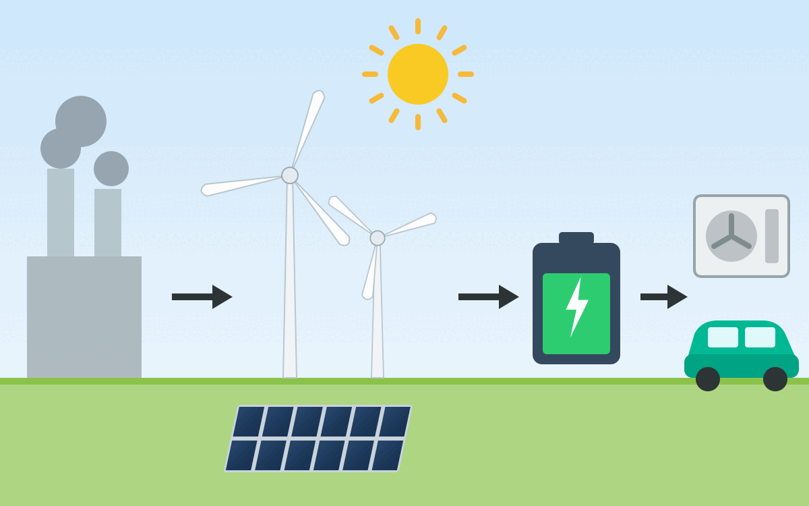
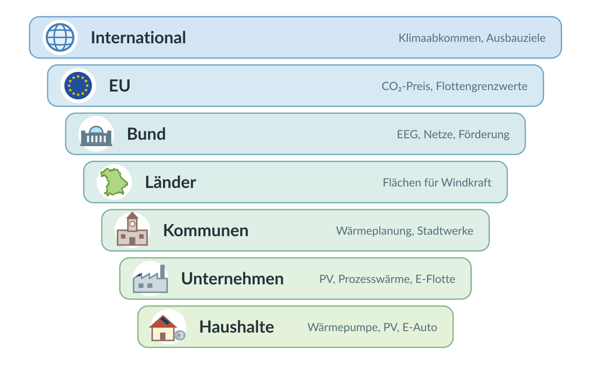
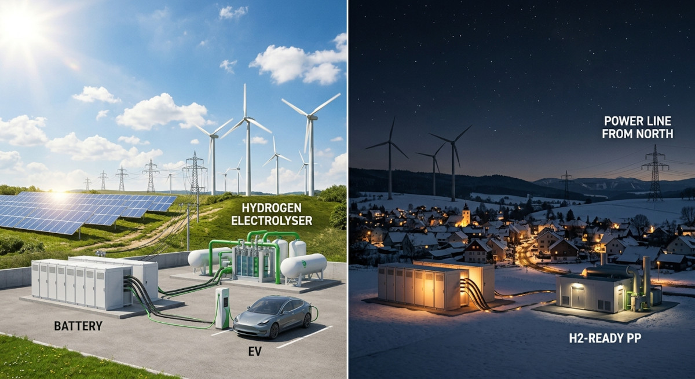
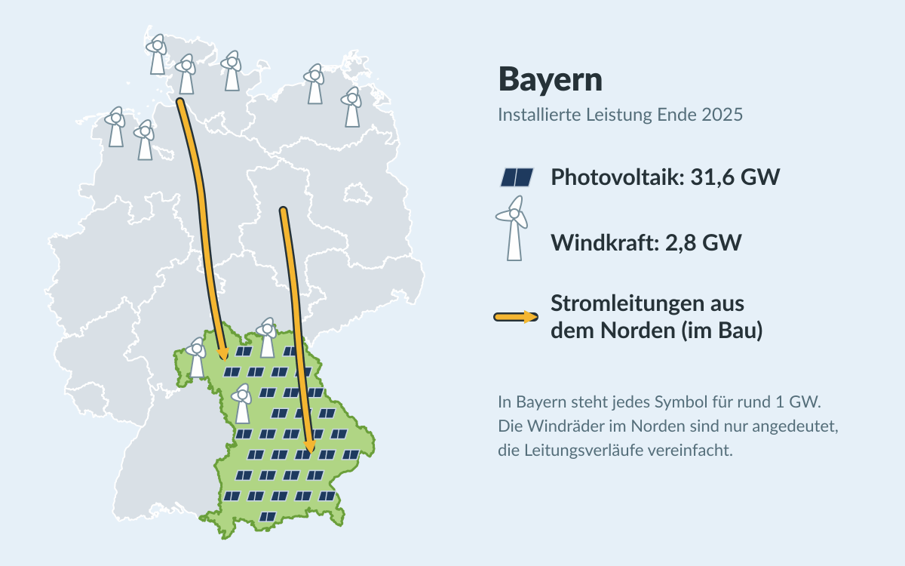
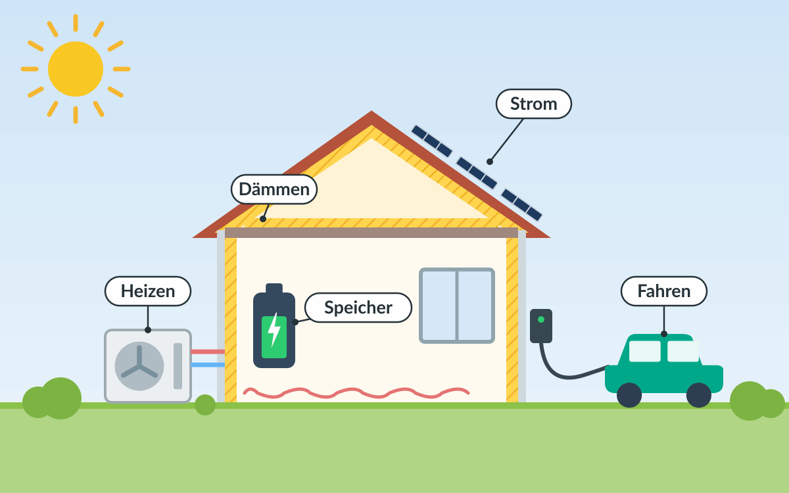

Die Energiewende ist das wohl wichtigste internationale Projekt. Es bezeichnet
den strukturellen und nachhaltigen Wandel weg von fossilen Energieträgern hin zu
erneuerbaren Energien.

<figure class="ai-generated">
    
    <figcaption>Mit Claude AI generierte Illustration: Von fossilen Kraftwerken zu Wind, Solar, Batteriespeichern, Wärmepumpen und E-Autos</figcaption>
</figure>

Die Energiewende hat folgende essenziellen Bausteine:

1. **Elektrifizierung**: Insbesondere Verkehr und das private Heizen müssen weg
   von Diesel, Benzin, Heizöl und Erdgas hin zu Strom aus erneuerbaren Quellen.
2. **Erneuerbare Energien**: Die nahezu vollständige Umstellung der
   Energiegewinnung auf erneuerbare Quellen wie Wind, Solar, Wasserkraft und
   Umweltwärme.
3. **Flexibilisierung**: Einerseits physische Energiespeicher wie Batterien,
   Pumpspeicherkraftwerke und Power-to-X (z.B. Wasserstoff aus Überschussstrom),
   andererseits flexible Lasten, die den Verbrauch
   dynamisch an das Angebot anpassen. Hinzu kommt ein leistungsfähiges
   Stromnetz, um Energie über große Distanzen zu transportieren und regionale
   Unterschiede in Erzeugung und Verbrauch auszugleichen.
4. **Energieeffizienz**: Die Reduzierung des Energieverbrauchs, z.B. durch
   effizientere Technologien (Glühbirne → LED; Heizöl → Wärmepumpe;
   Verbrennungsmotor → Elektroantrieb) und durch bessere Dämmung von Gebäuden.

Dieses Gesamtpaket umzusetzen ist eine enorme Herausforderung auf allen
politischen Ebenen. Im Folgenden schaue ich mir an, was auf welcher Ebene
bereits passiert ist und was noch fehlt. Stand: September 2026.

**Legende:**

* ✅ Umgesetzt bzw. in Kraft
* ⏳ Beschlossen oder in Arbeit, aber das Ziel ist noch nicht erreicht
* ❌ Fehlt
* ↩️ Rückschritt: Etwas Beschlossenes wurde abgeschwächt oder zurückgenommen

## Überblick: Wer ist wofür zuständig?

<figure class="wp-caption aligncenter img-thumbnail">
    
    <figcaption class="text-center">Mit Claude AI generierte Illustration: Die Ebenen der Energiewende, von der internationalen Politik bis zum eigenen Haus</figcaption>
</figure>

<table>
    <thead>
        <tr>
            <th>Ebene</th>
            <th>Elektrifizierung <small>(Verkehr, Wärme)</small></th>
            <th>Erneuerbare Energien <small>(Wind, Solar, Wasserkraft, Umweltwärme)</small></th>
            <th>Flexibilisierung <small>(Speicher, Lastmanagement, Netze)</small></th>
            <th>Energieeffizienz <small>(Technologien, Gebäude)</small></th>
        </tr>
    </thead>
    <tbody>
        <tr>
            <td><strong>International</strong></td>
            <td>-</td>
            <td>Ausbauziele</td>
            <td>-</td>
            <td>Effizienzziele</td>
        </tr>
        <tr>
            <td><strong>EU</strong></td>
            <td>CO₂-Flottengrenzwerte, CO₂-Preis</td>
            <td>Ausbauziele, Strommarktdesign</td>
            <td>Strommarkt, grenzüberschreitende Netze</td>
            <td>Effizienz- und Gebäuderichtlinie</td>
        </tr>
        <tr>
            <td><strong>Bund</strong></td>
            <td>Förderung, Steuern, Heizungsregeln</td>
            <td>EEG, Flächenziele, Genehmigungsrecht</td>
            <td>Netzausbau, Kraftwerke, Speicher, Wasserstoff, Smart Meter</td>
            <td>Gebäuderecht, Förderung</td>
        </tr>
        <tr>
            <td><strong>Länder</strong></td>
            <td>-</td>
            <td>Flächen für Windkraft, Solarpflicht</td>
            <td>-</td>
            <td>Landesbauordnung</td>
        </tr>
        <tr>
            <td><strong>Kommunen</strong></td>
            <td>Ladesäulen, ÖPNV</td>
            <td>Bebauungspläne, eigene Dächer</td>
            <td>Stadtwerke, Wärmenetze</td>
            <td>Wärmeplanung, eigene Gebäude</td>
        </tr>
        <tr>
            <td><strong>Unternehmen</strong></td>
            <td>Prozesswärme, Fuhrpark</td>
            <td>Eigene PV, Stromabnahmeverträge</td>
            <td>Lastmanagement</td>
            <td>Effizientere Prozesse</td>
        </tr>
        <tr>
            <td><strong>Haushalte</strong></td>
            <td>Wärmepumpe, E-Auto</td>
            <td>PV-Anlage, Balkonkraftwerk</td>
            <td>Dynamischer Tarif, Heimspeicher</td>
            <td>Dämmung, sparsame Geräte</td>
        </tr>
    </tbody>
</table>

## International

<table>
    <thead>
        <tr>
            <th>Maßnahme</th>
            <th>Stand</th>
            <th>Anmerkung</th>
        </tr>
    </thead>
    <tbody>
        <tr>
            <td><a href="https://de.wikipedia.org/wiki/%C3%9Cbereinkommen_von_Paris">Pariser Klimaabkommen</a> (2015): Erwärmung deutlich unter 2 °C, möglichst 1,5 °C</td>
            <td>⏳</td>
            <td>In Kraft seit 2016. Die 1,5-°C-Grenze wird voraussichtlich überschritten.</td>
        </tr>
        <tr>
            <td>Austritt der USA aus dem Pariser Klimaabkommen</td>
            <td>↩️</td>
            <td>Wirksam seit dem 27. Januar 2026<small><a href="#ref1" name="anchor1">[1]</a></small></td>
        </tr>
        <tr>
            <td><a href="https://de.wikipedia.org/wiki/UN-Klimakonferenz_in_Dubai_2023">COP28</a> (Dubai, 2023): Abkehr von fossilen Energieträgern, Verdreifachung der erneuerbaren Kapazität und Verdopplung der Effizienzsteigerung bis 2030</td>
            <td>⏳</td>
            <td>Beschlossen, aber nicht verbindlich</td>
        </tr>
    </tbody>
</table>

## Europäische Union

<table>
    <thead>
        <tr>
            <th>Maßnahme</th>
            <th>Baustein</th>
            <th>Stand</th>
            <th>Anmerkung</th>
        </tr>
    </thead>
    <tbody>
        <tr>
            <td><a href="https://de.wikipedia.org/wiki/Europ%C3%A4isches_Klimagesetz">Europäisches Klimagesetz</a>: −55 % Treibhausgase bis 2030, klimaneutral bis 2050<small><a href="#ref2" name="anchor2">[2]</a></small></td>
            <td>Alle</td>
            <td>✅</td>
            <td>Seit 2021 in Kraft</td>
        </tr>
        <tr>
            <td>Klimaziel 2040: −90 % gegenüber 1990</td>
            <td>Alle</td>
            <td>✅</td>
            <td>Bis zu 5 Prozentpunkte dürfen über internationale Zertifikate erreicht werden<small><a href="#ref3" name="anchor3">[3]</a></small></td>
        </tr>
        <tr>
            <td><a href="https://de.wikipedia.org/wiki/EU-Emissionshandel">Emissionshandel ETS 1</a> für Strom und Industrie</td>
            <td>Erneuerbare</td>
            <td>✅</td>
            <td>Seit 2005</td>
        </tr>
        <tr>
            <td>ETS 2: CO₂-Preis für Gebäude und Verkehr</td>
            <td>Elektrifizierung</td>
            <td>⏳</td>
            <td>Von 2027 auf 2028 verschoben</td>
        </tr>
        <tr>
            <td><a href="https://de.wikipedia.org/wiki/CO2-Grenzausgleichssystem">CO₂-Grenzausgleich (CBAM)</a></td>
            <td>Alle</td>
            <td>✅</td>
            <td>Seit 2026 müssen Importeure für die CO₂-Emissionen z.B. von Stahl und Zement bezahlen</td>
        </tr>
        <tr>
            <td>Erneuerbare-Energien-Richtlinie (RED III): 42,5 % Erneuerbare am Endenergieverbrauch bis 2030</td>
            <td>Erneuerbare</td>
            <td>⏳</td>
            <td>Beschlossen 2023</td>
        </tr>
        <tr>
            <td>Energieeffizienz-Richtlinie: −11,7 % Endenergieverbrauch bis 2030</td>
            <td>Effizienz</td>
            <td>⏳</td>
            <td>Beschlossen 2023</td>
        </tr>
        <tr>
            <td>Gebäuderichtlinie (EPBD): Neubauten ab 2030 emissionsfrei</td>
            <td>Effizienz</td>
            <td>⏳</td>
            <td>Beschlossen 2024, muss national umgesetzt werden</td>
        </tr>
        <tr>
            <td>CO₂-Flottengrenzwerte: ab 2035 nur noch emissionsfreie Neuwagen</td>
            <td>Elektrifizierung</td>
            <td>↩️</td>
            <td>Die EU-Kommission hat im Dezember 2025 vorgeschlagen, das Ziel für 2035 auf −90 % abzuschwächen<small><a href="#ref4" name="anchor4">[4]</a></small>. Damit dürften z.B. Plug-in-Hybride weiter verkauft werden.</td>
        </tr>
        <tr>
            <td>Reform des Strommarktdesigns (Differenzverträge)</td>
            <td>Erneuerbare, Flexibilisierung</td>
            <td>✅</td>
            <td>Beschlossen 2024</td>
        </tr>
        <tr>
            <td><a href="https://de.wikipedia.org/wiki/ReFuelEU_Aviation">ReFuelEU Aviation</a>: Mindestanteil synthetischer Kraftstoffe (E-Kerosin) im Flugverkehr</td>
            <td>Power-to-X</td>
            <td>⏳</td>
            <td>In Kraft seit 2024: 1,2 % ab 2030, 5 % ab 2035. Bisher gibt es in Europa nur Pilotanlagen.</td>
        </tr>
    </tbody>
</table>

## Bund

### Ziele

<table>
    <thead>
        <tr>
            <th>Maßnahme</th>
            <th>Stand</th>
            <th>Anmerkung</th>
        </tr>
    </thead>
    <tbody>
        <tr>
            <td><a href="https://de.wikipedia.org/wiki/Bundes-Klimaschutzgesetz">Klimaschutzgesetz</a>: klimaneutral bis 2045</td>
            <td>⏳</td>
            <td>Seit 2021. Die Novelle 2024 hat die verbindlichen Jahresziele für einzelne Sektoren abgeschafft.</td>
        </tr>
        <tr>
            <td><a href="https://de.wikipedia.org/wiki/Atomausstieg">Atomausstieg</a></td>
            <td>✅</td>
            <td>Die letzten drei Kernkraftwerke gingen im April 2023 vom Netz.</td>
        </tr>
        <tr>
            <td><a href="https://de.wikipedia.org/wiki/Kohleausstieg_in_Deutschland">Kohleausstieg</a> spätestens 2038</td>
            <td>⏳</td>
            <td>Gesetzlich festgelegt</td>
        </tr>
        <tr>
            <td>80 % erneuerbarer Strom bis 2030</td>
            <td>⏳</td>
            <td>2025 waren es knapp 56 %<small><a href="#ref5" name="anchor5">[5]</a></small> des Bruttostromverbrauchs.</td>
        </tr>
    </tbody>
</table>

### Erneuerbare Energien

<table>
    <thead>
        <tr>
            <th>Maßnahme</th>
            <th>Stand</th>
            <th>Anmerkung</th>
        </tr>
    </thead>
    <tbody>
        <tr>
            <td><a href="https://de.wikipedia.org/wiki/Windenergief%C3%A4chenbedarfsgesetz">Wind-an-Land-Gesetz</a>: 2 % der Bundesfläche für Windkraft bis 2032</td>
            <td>⏳</td>
            <td>Zwischenziel 1,4 % bis 2027</td>
        </tr>
        <tr>
            <td>Solarpaket I: einfachere Balkonkraftwerke (bis 800 W), Mieterstrom</td>
            <td>✅</td>
            <td>Seit 2024</td>
        </tr>
        <tr>
            <td>EEG-Novelle: Ende der festen Einspeisevergütung für neue PV-Anlagen unter 25 kW ab 2027</td>
            <td>⏳</td>
            <td>Vom Kabinett am 29. Juli 2026 beschlossen<small><a href="#ref10" name="anchor10">[10]</a></small>, noch nicht vom Bundestag. Die Solarbranche warnt vor einem Einbruch beim Zubau.</td>
        </tr>
    </tbody>
</table>

### Flexibilisierung

<figure class="ai-generated">
    
    <figcaption>Mit Gemini generierte Illustration, kein echtes Foto: Überschuss bei Sonne und Wind, Versorgung in der Dunkelflaute</figcaption>
</figure>

Sonne und Wind liefern nicht immer dann Strom, wenn er gebraucht wird. Eine
Dunkelflaute ist eine Phase mit wenig Wind und wenig Sonne, im Winter oft über
mehrere Tage. Dann braucht es Speicher, steuerbare Kraftwerke, Stromimporte und
Verbraucher, die ihren Verbrauch verschieben können. Außerdem muss der Strom vom
Erzeugungsort zum Verbrauchsort kommen.

<table>
    <thead>
        <tr>
            <th>Maßnahme</th>
            <th>Stand</th>
            <th>Anmerkung</th>
        </tr>
    </thead>
    <tbody>
        <tr>
            <td>Stromnetzausbau, z.B. <a href="https://de.wikipedia.org/wiki/Suedlink">SuedLink</a></td>
            <td>⏳</td>
            <td>Der Strom aus dem windreichen Norden muss in den Süden.</td>
        </tr>
        <tr>
            <td>Kraftwerksstrategie: wasserstofffähige Gaskraftwerke für Dunkelflauten</td>
            <td>⏳</td>
            <td><a href="https://www.pv-magazine.de/2026/05/13/kraftwerksstrategie-passiert-bundeskabinett/">Vom Kabinett im Mai 2026 beschlossen</a>; erste Ausschreibungen für September und Dezember 2026 geplant</td>
        </tr>
        <tr>
            <td>Steuerbare Verbrauchseinrichtungen (<a href="https://www.gesetze-im-internet.de/enwg_2005/__14a.html">§ 14a EnWG</a>) und dynamische Stromtarife</td>
            <td>✅</td>
            <td>Seit 2024 bzw. 2025</td>
        </tr>
        <tr>
            <td>Smart-Meter-Rollout</td>
            <td>⏳</td>
            <td>Pflicht-Einbau für Haushalte mit mehr als 6.000 kWh/Jahr, PV-Anlagen ab 7 kW oder steuerbaren Verbrauchern wie Wärmepumpen und Wallboxen. Er läuft, aber langsam.</td>
        </tr>
        <tr>
            <td>„Smart Meter light“: günstiger Zähler für alle anderen Haushalte, damit auch sie dynamische Stromtarife nutzen können</td>
            <td>⏳</td>
            <td><a href="https://ms-aktuell.de/welt/13072026-smart-meter-light-bundesregierung-stromzaehler/">Am 1. Juli 2026 vom Koalitionsausschuss beschlossen</a>, bisher nur ein Konzept. Er soll Verbrauchsdaten übertragen, aber keine Geräte steuern können. <a href="https://www.pv-magazine.de/2026/07/13/vde-fnn-und-dke-gegen-smart-meter-light/">VDE FNN und DKE lehnen das Konzept ab</a>.</td>
        </tr>
    </tbody>
</table>

### Power-to-X und Wasserstoff

Mit Power-to-X wird Strom in andere Energieträger umgewandelt, z.B. per
Elektrolyse in Wasserstoff oder weiter in synthetische Kraftstoffe (E-Fuels).
Das ist ineffizienter als die direkte Nutzung von Strom, aber wichtig für
Bereiche, die sich schwer elektrifizieren lassen (Stahl, Chemie, Flug- und
Schiffsverkehr), und als Langzeitspeicher für Dunkelflauten.

<table>
    <thead>
        <tr>
            <th>Maßnahme</th>
            <th>Stand</th>
            <th>Anmerkung</th>
        </tr>
    </thead>
    <tbody>
        <tr>
            <td>Nationale Wasserstoffstrategie: 10 GW Elektrolyseleistung bis 2030</td>
            <td>⏳</td>
            <td>Installiert sind erst <a href="https://www.pv-magazine.de/2026/01/20/deutschland-wird-ziel-von-zehn-gigawatt-elektrolyseleistung-bis-2030-wohl-verfehlen/">rund 0,18 GW, weitere 1,3 GW sind beschlossen oder im Bau</a>. Das EWI erwartet, dass das Ziel verfehlt wird.</td>
        </tr>
        <tr>
            <td><a href="https://de.wikipedia.org/wiki/Wasserstoff-Kernnetz">Wasserstoff-Kernnetz</a></td>
            <td>⏳</td>
            <td>2024 genehmigt, im Bau</td>
        </tr>
        <tr>
            <td>Nationale Quote für E-Kerosin (PtL) im Flugverkehr ab 2026</td>
            <td>↩️</td>
            <td><a href="https://www.airliners.de/bundesverkehrsminister-unterzeichnet-erklaerung-esaf-foerderung/84747">Abgeschafft</a>, stattdessen gilt nur die EU-Quote ab 2030. Die Förderung für erste industrielle PtL-Anlagen wurde von über 2 Mrd. € auf rund 100 Mio. € gekürzt.</td>
        </tr>
    </tbody>
</table>

### Elektrifizierung und Energieeffizienz

<table>
    <thead>
        <tr>
            <th>Maßnahme</th>
            <th>Stand</th>
            <th>Anmerkung</th>
        </tr>
    </thead>
    <tbody>
        <tr>
            <td>Heizungsgesetz: neue Heizungen müssen zu 65 % mit erneuerbaren Energien betrieben werden</td>
            <td>↩️</td>
            <td><a href="https://www.bundestag.de/dokumente/textarchiv/2026/kw28-de-heizungsgesetz-1194534">Mit dem Gebäudemodernisierungsgesetz am 10. Juli 2026 abgeschafft</a>. Neue Öl- und Gasheizungen bleiben erlaubt; ab 2029 soll ein steigender Bioanteil beigemischt werden.</td>
        </tr>
        <tr>
            <td>Kommunale Wärmeplanung (<a href="https://de.wikipedia.org/wiki/W%C3%A4rmeplanungsgesetz">Wärmeplanungsgesetz</a>)</td>
            <td>⏳</td>
            <td>Siehe Kommunen</td>
        </tr>
        <tr>
            <td>Förderprogramm für E-Autos (bis zu 6.000 €, einkommensabhängig)</td>
            <td>✅</td>
            <td>Seit Mai 2026<small><a href="#ref18" name="anchor18">[18]</a></small></td>
        </tr>
        <tr>
            <td>Kfz-Steuerbefreiung für E-Autos</td>
            <td>✅</td>
            <td>Für Neuzulassungen bis Ende 2030 verlängert<small><a href="#ref19" name="anchor19">[19]</a></small>, längstens bis 2035</td>
        </tr>
        <tr>
            <td>Strompreise senken: Bundeszuschuss zu den Netzentgelten, Gasspeicherumlage abgeschafft</td>
            <td>✅</td>
            <td>Seit 2026</td>
        </tr>
        <tr>
            <td>Stromsteuer für private Haushalte senken</td>
            <td>❌</td>
            <td>Nur für produzierende Unternehmen und Landwirte gesenkt. Solange Strom teuer ist, lohnen sich Wärmepumpe und E-Auto weniger.</td>
        </tr>
        <tr>
            <td>Deutschlandticket</td>
            <td>✅</td>
            <td>Seit 2023; 2026 auf 63 € pro Monat verteuert</td>
        </tr>
        <tr>
            <td>Tempolimit auf Autobahnen</td>
            <td>❌</td>
            <td></td>
        </tr>
        <tr>
            <td><a href="https://de.wikipedia.org/wiki/Sonderverm%C3%B6gen_Infrastruktur_und_Klimaneutralit%C3%A4t">Sondervermögen Infrastruktur und Klimaneutralität</a> (davon 100 Mrd. € für den Klima- und Transformationsfonds)</td>
            <td>⏳</td>
            <td>2025 beschlossen. Es gibt Kritik, dass das Geld zweckentfremdet wird.</td>
        </tr>
    </tbody>
</table>

## Länder am Beispiel Bayern

<table>
    <thead>
        <tr>
            <th>Maßnahme</th>
            <th>Baustein</th>
            <th>Stand</th>
            <th>Anmerkung</th>
        </tr>
    </thead>
    <tbody>
        <tr>
            <td>Bayerisches Klimaschutzgesetz: klimaneutral bis 2040</td>
            <td>Alle</td>
            <td>⏳</td>
            <td>Fünf Jahre früher als der Bund (2045). Das Ziel ist gesetzlich festgeschrieben, die Umsetzung hängt an den Einzelmaßnahmen unten.</td>
        </tr>
        <tr>
            <td>Lockerung der 10H-Regel für Windräder</td>
            <td>Erneuerbare</td>
            <td>✅</td>
            <td>Seit 2022 gilt in Wäldern, an Autobahnen und Bahnlinien, in Gewerbegebieten und in Vorranggebieten nur noch ein Abstand von 1.000 m. Sonst gilt 10H weiterhin.</td>
        </tr>
        <tr>
            <td>Flächen für Windkraft: 1,1 % bis 2027, 1,8 % bis 2032</td>
            <td>Erneuerbare</td>
            <td>⏳</td>
            <td>Aktuell sind rund 1 % der Landesfläche<small><a href="#ref20" name="anchor20">[20]</a></small> ausgewiesen.</td>
        </tr>
        <tr>
            <td>Windkraft ausbauen: 1.000 neue Windräder bis 2030 auf den Weg bringen</td>
            <td>Erneuerbare</td>
            <td>⏳</td>
            <td>2025 gab es rund 770 Genehmigungsanträge<small><a href="#ref21" name="anchor21">[21]</a></small>, aber nur 29 neue Windräder mit 82 MW<small><a href="#ref20">[20]</a></small> gingen in Betrieb. Insgesamt sind es 2,8 GW.</td>
        </tr>
        <tr>
            <td>Photovoltaik: 40 GW bis 2030</td>
            <td>Erneuerbare</td>
            <td>⏳</td>
            <td>2025 Rekordzubau von 4,7 GW auf insgesamt 31,6 GW<small><a href="#ref20">[20]</a></small>. Bayern ist beim Solarausbau Spitzenreiter.</td>
        </tr>
        <tr>
            <td>Solarpflicht</td>
            <td>Erneuerbare</td>
            <td>⏳</td>
            <td>Für neue Gewerbe- und Industriegebäude seit 2023; für neue Wohngebäude nur eine Soll-Vorschrift</td>
        </tr>
    </tbody>
</table>

<figure class="ai-generated">
    
    <figcaption>Mit Claude AI erstellte Grafik: Bayern hat viel Photovoltaik, wenig Windkraft und braucht Strom aus dem Norden. In Bayern steht jedes Symbol für rund 1 GW installierte Leistung (Ende 2025)<small><a href="#ref20">[20]</a></small>. Die Windräder im Norden sind nur angedeutet, die Verläufe von SuedLink und SuedOstLink vereinfacht.</figcaption>
</figure>

### Was könnte Bayern besser machen?

Bayern ist bei der Photovoltaik stark, bei der Windkraft und beim Netzausbau
aber seit Jahren hinten dran. Meine Vorschläge:

<table>
    <thead>
        <tr>
            <th>Vorschlag</th>
            <th>Baustein</th>
            <th>Begründung</th>
        </tr>
    </thead>
    <tbody>
        <tr>
            <td><strong>10H-Regel komplett abschaffen</strong></td>
            <td>Erneuerbare</td>
            <td>Die Lockerung von 2022 hat geholfen, aber außerhalb der Ausnahmegebiete gilt 10H weiterhin. Die Flächenziele des Bundes sind ohnehin verbindlich.</td>
        </tr>
        <tr>
            <td><strong>Genehmigte Windräder schneller bauen</strong></td>
            <td>Erneuerbare</td>
            <td>Anträge und Genehmigungen sind auf Rekordniveau, gebaut wurde 2025 aber nur ein Bruchteil. Die Bayerischen Staatsforsten wollen <a href="https://www.stmwi.bayern.de/fileadmin/user_upload/stmwi/Energie/Energiedaten/2026-06-01_L%C3%A4nderbericht-BY-2026.pdf">bis 2030 rund 500 Windräder</a> im Staatswald ermöglichen – das ist ein guter Hebel, den man beschleunigen sollte.</td>
        </tr>
        <tr>
            <td><strong>Solarpflicht für alle Neubauten und Dachsanierungen</strong></td>
            <td>Erneuerbare</td>
            <td>Für neue Wohngebäude gibt es bisher nur eine Soll-Vorschrift. Wer ohnehin ein Dach neu deckt, sollte PV direkt mitdenken müssen.</td>
        </tr>
        <tr>
            <td><strong>Netzausbau nicht mehr bremsen</strong></td>
            <td>Flexibilisierung</td>
            <td>Bayern hat 2015 durchgesetzt, dass <a href="https://de.wikipedia.org/wiki/Suedlink">SuedLink</a> als Erdkabel gebaut wird. Das hat die Leitung teurer und später gemacht. Gerade Bayern braucht den Windstrom aus dem Norden, weil die Kernkraftwerke abgeschaltet sind.</td>
        </tr>
        <tr>
            <td><strong>Netzanschlüsse beschleunigen</strong></td>
            <td>Flexibilisierung</td>
            <td>Laut dem <a href="https://www.stmwi.bayern.de/fileadmin/user_upload/stmwi/Energie/Energiedaten/2026-06-01_L%C3%A4nderbericht-BY-2026.pdf">bayerischen Länderbericht</a> werden Netzanschlüsse zunehmend zum knappen Gut. Batteriespeicher direkt an PV-Parks können die Netze entlasten.</td>
        </tr>
        <tr>
            <td><strong>Industrie ans Wasserstoffnetz anbinden</strong></td>
            <td>Power-to-X</td>
            <td>Das Chemiedreieck um Burghausen braucht große Mengen Wasserstoff. Ohne rechtzeitige Anbindung an das Kernnetz droht Abwanderung.</td>
        </tr>
        <tr>
            <td><strong>Kleine Gemeinden bei der Wärmeplanung unterstützen</strong></td>
            <td>Elektrifizierung, Effizienz</td>
            <td>Die meisten bayerischen Gemeinden müssen bis 2028 einen Wärmeplan haben. Viele haben dafür kein Personal. Landesweite Musterpläne, Beratung und Förderung für Wärmenetze würden helfen.</td>
        </tr>
        <tr>
            <td><strong>ÖPNV im ländlichen Raum stärken</strong></td>
            <td>Elektrifizierung, Effizienz</td>
            <td>Auf dem Land ist man ohne Auto aufgeschmissen. Ein dichterer Takt bei Bus und Bahn sowie Rufbusse würden viele Autofahrten ersetzen.</td>
        </tr>
    </tbody>
</table>

## Kommunen

<table>
    <thead>
        <tr>
            <th>Maßnahme</th>
            <th>Baustein</th>
            <th>Stand</th>
            <th>Anmerkung</th>
        </tr>
    </thead>
    <tbody>
        <tr>
            <td>Kommunale Wärmeplanung: Großstädte bis 30.06.2026, alle anderen bis 30.06.2028</td>
            <td>Elektrifizierung, Effizienz</td>
            <td>⏳</td>
            <td><a href="https://www.zfk.de/energie/waermewende/kommunale-waermeplanung-frist-grossstaedte-juni-2026">72 von 83 Großstädten</a> sind fristgerecht fertig geworden.</td>
        </tr>
        <tr>
            <td>Flächen für Wind- und Solarparks ausweisen</td>
            <td>Erneuerbare</td>
            <td>⏳</td>
            <td>Über Flächennutzungs- und Bebauungspläne entscheidet die Kommune, ob Projekte überhaupt möglich sind.</td>
        </tr>
        <tr>
            <td>PV auf kommunalen Dächern (Schulen, Rathäuser, Bauhöfe)</td>
            <td>Erneuerbare</td>
            <td>⏳</td>
            <td></td>
        </tr>
        <tr>
            <td>Fernwärme ausbauen (Stadtwerke)</td>
            <td>Elektrifizierung, Flexibilisierung</td>
            <td>⏳</td>
            <td></td>
        </tr>
        <tr>
            <td>Ladesäulen, ÖPNV, Radwege, Carsharing</td>
            <td>Elektrifizierung</td>
            <td>⏳</td>
            <td>Beispiel: <a href="../verkehrsausschuss-plattling-november-2025/">Carsharing-Diskussion im Verkehrsausschuss Plattling</a></td>
        </tr>
    </tbody>
</table>

### Beispiel Plattling

Plattling ist eine Stadt mit rund 13.000 Einwohnern im Landkreis Deggendorf.
Hier ist bereits einiges passiert:

<table>
    <thead>
        <tr>
            <th>Maßnahme</th>
            <th>Baustein</th>
            <th>Stand</th>
            <th>Anmerkung</th>
        </tr>
    </thead>
    <tbody>
        <tr>
            <td><a href="https://www.plattling.de/wirtschaft/waermeplanung-in-der-stadt-plattling/">Kommunale Wärmeplanung</a></td>
            <td>Elektrifizierung, Effizienz</td>
            <td>⏳</td>
            <td>Im November 2024 an die Energie Südbayern (ESB) vergeben, zu 90 % vom Bund gefördert. Die Ergebnisse wurden am 18.03.2026 öffentlich vorgestellt. Gesetzliche Frist: 30.06.2028.</td>
        </tr>
        <tr>
            <td><a href="https://www.esb.de/ueber-uns/presse/2024/sonnenstrom-fuer-plattling">Solarpark Pielweichs II</a></td>
            <td>Erneuerbare</td>
            <td>✅</td>
            <td>5 MWp auf 4,4 ha, rund 5,7 Mio. kWh pro Jahr. Das entspricht rechnerisch dem Verbrauch von etwa 1.600 Haushalten.</td>
        </tr>
        <tr>
            <td>PV-Anlagen auf Gebäuden der <a href="https://www.stadtwerke-plattling.de/erneuerbare_energien.aspx">Stadtwerke Plattling</a></td>
            <td>Erneuerbare</td>
            <td>✅</td>
            <td></td>
        </tr>
        <tr>
            <td>Windkraft</td>
            <td>Erneuerbare</td>
            <td>❌</td>
            <td>Im <a href="https://www.region-donau-wald.de/fileadmin/user_upload/pdfs/Regionalplan/laufende_Fortschreibungen/Windenergie/Beteiligungsverfahren/2025_07_21_Unterlagen.pdf">Regionalplan-Entwurf Donau-Wald</a> liegen die Vorranggebiete im Landkreis Deggendorf u.a. in Grafling, Deggendorf, Schaufling und Lalling – nicht in Plattling.</td>
        </tr>
        <tr>
            <td>Carsharing</td>
            <td>Elektrifizierung</td>
            <td>⏳</td>
            <td>Im November 2025 im <a href="../verkehrsausschuss-plattling-november-2025/">Verkehrsausschuss</a> vorgestellt</td>
        </tr>
    </tbody>
</table>

### Was könnte Plattling besser machen?

<table>
    <thead>
        <tr>
            <th>Vorschlag</th>
            <th>Baustein</th>
            <th>Begründung</th>
        </tr>
    </thead>
    <tbody>
        <tr>
            <td><strong>Wärmeplan in konkrete Projekte umsetzen</strong></td>
            <td>Elektrifizierung, Effizienz</td>
            <td>Ein Wärmeplan allein spart keine Tonne CO₂. Der Stadtrat sollte für die Eignungsgebiete einen Zeitplan beschließen, und die Stadtwerke könnten Wärmenetze betreiben. Die Ergebnisse sollten außerdem auf der Website der Stadt stehen, damit Hausbesitzer planen können.</td>
        </tr>
        <tr>
            <td><strong>PV auf alle städtischen Dächer und Parkplätze</strong></td>
            <td>Erneuerbare</td>
            <td>Schulen, Bürgerspital, Bauhof, Kläranlage und große Parkplätze bieten viel Fläche. Mit Eigenverbrauch rechnet sich das meist schnell.</td>
        </tr>
        <tr>
            <td><strong>PV-Pflicht in neuen Bebauungsplänen</strong></td>
            <td>Erneuerbare</td>
            <td>Kommunen können im Bebauungsplan festsetzen, dass neue Gebäude PV-Anlagen bekommen (<a href="https://www.gesetze-im-internet.de/bbaug/__9.html">§ 9 Abs. 1 Nr. 23b BauGB</a>). Das geht weiter als die bayerische Soll-Vorschrift.</td>
        </tr>
        <tr>
            <td><strong>Weitere Solarparks mit Bürgerbeteiligung</strong></td>
            <td>Erneuerbare</td>
            <td>Pielweichs II ist ein guter Anfang. Agri-PV oder PV entlang von Bahnlinie und Autobahn könnten folgen – idealerweise mit einer Energiegenossenschaft, damit die Einnahmen in der Region bleiben.</td>
        </tr>
        <tr>
            <td><strong>Batteriespeicher an Solarparks</strong></td>
            <td>Flexibilisierung</td>
            <td>Ein Speicher verschiebt den Mittagsstrom in den Abend und entlastet das Netz.</td>
        </tr>
        <tr>
            <td><strong>Bei Windparks im Landkreis mitmachen</strong></td>
            <td>Erneuerbare</td>
            <td>Wenn es in Plattling selbst keine Windflächen gibt, könnten sich Stadt, Stadtwerke oder Bürger an Windparks in den Nachbargemeinden beteiligen.</td>
        </tr>
        <tr>
            <td><strong>Carsharing mit E-Autos und mehr Ladesäulen</strong></td>
            <td>Elektrifizierung</td>
            <td>Im Verkehrsausschuss wurde für den 9-Sitzer ein Diesel empfohlen. Für die meist kurzen Strecken in und um Plattling reicht ein E-Auto. Dazu gehören Ladesäulen, z.B. am Bahnhof und am Rathaus.</td>
        </tr>
        <tr>
            <td><strong>Dynamische Stromtarife über die Stadtwerke</strong></td>
            <td>Flexibilisierung</td>
            <td>Falls noch nicht vorhanden: Ein Tarif, der günstigen Strom bei viel Sonne und Wind weitergibt, macht Wärmepumpen und E-Autos für Bürger attraktiver.</td>
        </tr>
        <tr>
            <td><strong>Radwege mitplanen</strong></td>
            <td>Effizienz</td>
            <td>Wenn z.B. die Dr.-Zacher-Straße verbreitert wird, sollte der Radweg von Anfang an Teil der Planung sein.</td>
        </tr>
    </tbody>
</table>

## Unternehmen

<table>
    <thead>
        <tr>
            <th>Maßnahme</th>
            <th>Baustein</th>
            <th>Stand</th>
            <th>Anmerkung</th>
        </tr>
    </thead>
    <tbody>
        <tr>
            <td>Klimaschutzverträge: Der Staat gleicht die Mehrkosten klimafreundlicher Produktion aus</td>
            <td>Elektrifizierung</td>
            <td>✅</td>
            <td>Erste Gebotsrunde 2024</td>
        </tr>
        <tr>
            <td>Grüner Stahl</td>
            <td>Elektrifizierung</td>
            <td>❌</td>
            <td>ArcelorMittal hat die <a href="https://www.butenunbinnen.de/nachrichten/gruener-stahl-stahlwerk-bremen-100.html">Umstellung in Bremen und Eisenhüttenstadt 2025 gestoppt</a> - trotz zugesagter Förderung von 1,3 Mrd. €.</td>
        </tr>
        <tr>
            <td>Großbatteriespeicher</td>
            <td>Flexibilisierung</td>
            <td>⏳</td>
            <td>Es werden sehr viele Anschlussanfragen gestellt; siehe <a href="../strom-in-deutschland/">Strom in Deutschland</a></td>
        </tr>
    </tbody>
</table>

## Private Haushalte

<table>
    <thead>
        <tr>
            <th>Maßnahme</th>
            <th>Baustein</th>
            <th>Stand</th>
            <th>Anmerkung</th>
        </tr>
    </thead>
    <tbody>
        <tr>
            <td>Wärmepumpe statt Öl- und Gasheizung</td>
            <td>Elektrifizierung</td>
            <td>⏳</td>
            <td>2025 waren Wärmepumpen <a href="https://www.waermepumpe.de/presse/news/details/ueber-50-prozent-im-plus-waermepumpen-absatz-steigt-2025-deutlich/">mit 47,7 % erstmals die meistverkaufte Heizung</a>. Siehe auch <a href="../bildungspolitik-ein-grund-fuer-teure-waermepumpen/">Bildungspolitik: Ein Grund für teure Wärmepumpen</a>.</td>
        </tr>
        <tr>
            <td>E-Auto statt Verbrenner</td>
            <td>Elektrifizierung</td>
            <td>⏳</td>
            <td>2025 waren <a href="https://www.electrive.net/2026/01/06/bilanz-2025-neuzulassungen-von-elektroautos-2025-auf-rekordhoch/">19,1 % der neu zugelassenen Pkw reine E-Autos</a>.</td>
        </tr>
        <tr>
            <td>PV-Anlage oder Balkonkraftwerk</td>
            <td>Erneuerbare</td>
            <td>⏳</td>
            <td>Siehe <a href="../wirtschaftlichkeitsberechnung-pv-anlage/">Wirtschaftlichkeitsberechnung einer PV-Anlage</a> und <a href="../steckersolar-batterien-2025/">Steckersolar-Batterien</a></td>
        </tr>
        <tr>
            <td>Flexibel verbrauchen: dynamischer Stromtarif, Heimspeicher, E-Auto bei Überschuss laden</td>
            <td>Flexibilisierung</td>
            <td>⏳</td>
            <td></td>
        </tr>
        <tr>
            <td>Dämmen und sparsame Geräte</td>
            <td>Effizienz</td>
            <td>⏳</td>
            <td></td>
        </tr>
    </tbody>
</table>

### Was kann ich selbst tun?

<figure class="ai-generated">
    
    <figcaption>Mit Claude AI generierte Illustration: Heizen, Strom, Speicher, Fahren und Dämmen am eigenen Haus</figcaption>
</figure>

* **Heizen:** Öl- oder Gasheizung durch eine Wärmepumpe ersetzen: [Wärmepumpen](../waermepumpen/)
* **Strom erzeugen:** Balkonkraftwerk ([Steckersolar](../steckersolar/)) oder Dach-PV ([Wirtschaftlichkeit](../wirtschaftlichkeitsberechnung-pv-anlage/), [Angebotsvergleich](../pv-angebotsvergleich/))
* **Strom speichern und flexibel nutzen:** [Steckersolar-Batterien](../steckersolar-batterien-2025/), [Stromtarife](../stromtarife/)
* **Pendeln:** Homeoffice-Tage nutzen, sonst Fahrrad, Pedelec oder ÖPNV. Ein Pkw verursacht laut UBA<small><a href="#ref36">[36]</a></small> im Schnitt 164 g Treibhausgase pro Personenkilometer, ein Pedelec 3 g
* **Fahren:** Wenn es ein Auto sein muss, dann ein [E-Auto](../e-autos/) (70 g pro Personenkilometer, mit dem heutigen Strommix)
* **Sparen:** [Dämmstoffe](../daemstoffe/)
* **Essen:** weniger Fleisch und Käse. Laut Umweltbundesamt<small><a href="#ref59">[59]</a></small> senkt eine vegetarische Ernährung die ernährungsbedingten Treibhausgase um bis zu 46 %, eine vegane um bis zu 49 %

## Fazit

Auf internationaler und europäischer Ebene sind die Ziele gesetzt. Allerdings
werden sie gerade eher abgeschwächt als verschärft: Die USA sind aus dem
Pariser Klimaabkommen ausgetreten, der CO₂-Preis für Gebäude und Verkehr kommt
später und das Verbrenner-Aus wird aufgeweicht.

In Deutschland kommt der Ausbau der erneuerbaren Stromerzeugung gut voran. Bei
der Elektrifizierung von Wärme und Verkehr bremst die Politik dagegen: Das
Heizungsgesetz wurde abgeschafft und die Stromsteuer für Haushalte nicht
gesenkt. Die größten Baustellen sind die Flexibilisierung (Netze, Speicher,
Kraftwerke für Dunkelflauten, Wasserstoff) und die Umsetzung vor Ort in den
Kommunen. Beim Wasserstoff sind wir weit hinter den eigenen Zielen.

## Einzelnachweise

* 1<a name="ref1" href="#anchor1">&uarr;</a> Tagesspiegel: [Klimaschutz: Austritt der USA aus Pariser Klimaabkommen tritt in Kraft](https://www.tagesspiegel.de/internationales/klimaschutz-austritt-der-usa-aus-pariser-klimaabkommen-tritt-in-kraft-15185325.html), 27.01.2026.
* 2<a name="ref2" href="#anchor2">&uarr;</a> Umweltbundesamt: [Treibhausgasminderungsziele Deutschlands](https://www.umweltbundesamt.de/daten/klima/treibhausgasminderungsziele-deutschlands), abgerufen am 24.09.2026.
* 3<a name="ref3" href="#anchor3">&uarr;</a> Deutscher Naturschutzring: [EU-Parlament bestätigt schwaches 2040-Klimaziel und ETS2-Verschiebung](https://www.dnr.de/aktuelles-termine/aktuelles/eu-parlament-bestaetigt-schwaches-2040-klimaziel-und-ets2-verschiebung), abgerufen am 24.09.2026.
* 4<a name="ref4" href="#anchor4">&uarr;</a> Tagesschau: [EU-Kommission will Verbrenner-Aus zurücknehmen](https://www.tagesschau.de/wirtschaft/verbrenner-aus-eu-106.html), 16.12.2025.
* 5<a name="ref5" href="#anchor5">&uarr;</a> BDEW: [Erneuerbare deckten 2025 fast 56 Prozent des Stromverbrauchs](https://www.bdew.de/presse/presseinformation-von-zentrum-fuer-sonnenenergie-und-wasserstoff-forschung-baden-wuerttemberg-zsw-und-bundesverbands-der-energie-und-wasserwirtschaft-bdew/), abgerufen am 24.09.2026.
* 6<a name="ref6" href="#anchor6">&uarr;</a> Umweltbundesamt: [Treibhausgas-Emissionen in Deutschland](https://www.umweltbundesamt.de/daten/umweltzustand-trends/klima/treibhausgas-emissionen-in-deutschland), abgerufen am 24.09.2026.
* 7<a name="ref7" href="#anchor7">&uarr;</a> Volker Quaschning: [CO₂-Emissionen in Deutschland 2025](https://www.volker-quaschning.de/datserv/CO2-D/index.php), abgerufen am 24.09.2026.
* 8<a name="ref8" href="#anchor8">&uarr;</a> Umweltbundesamt: [Emissionsdaten 2025 & Projektionsdaten 2026](https://www.umweltbundesamt.de/system/files/document/UBA%20Emissionsdaten%202025_Projektionsdaten%202026_Hintergrundpapier_2026_03_14.pdf), Hintergrundpapier (PDF), 14.03.2026.
* 9<a name="ref9" href="#anchor9">&uarr;</a> gesetze-im-internet.de: [§ 3 KSG: Nationale Klimaschutzziele](https://www.gesetze-im-internet.de/ksg/__3.html), abgerufen am 24.09.2026.
* 10<a name="ref10" href="#anchor10">&uarr;</a> EMA Energiewelt: [EEG-Novelle: Das Ende der festen Einspeisevergütung](https://ema-energiewelt.de/wissen/eeg-novelle-2027-kabinettsbeschluss-einspeiseverguetung-endet), 31.07.2026.
* 11<a name="ref11" href="#anchor11">&uarr;</a> pv magazine: [Kraftwerksstrategie passiert Bundeskabinett](https://www.pv-magazine.de/2026/05/13/kraftwerksstrategie-passiert-bundeskabinett/), 13.05.2026.
* 12<a name="ref12" href="#anchor12">&uarr;</a> gesetze-im-internet.de: [§ 14a EnWG](https://www.gesetze-im-internet.de/enwg_2005/__14a.html), abgerufen am 24.09.2026.
* 13<a name="ref13" href="#anchor13">&uarr;</a> MS-Aktuell: [Smart Meter Light soll Millionen Haushalte erreichen](https://ms-aktuell.de/welt/13072026-smart-meter-light-bundesregierung-stromzaehler/), 13.07.2026.
* 14<a name="ref14" href="#anchor14">&uarr;</a> pv magazine: [VDE FNN und DKE gegen „Smart Meter light“](https://www.pv-magazine.de/2026/07/13/vde-fnn-und-dke-gegen-smart-meter-light/), 13.07.2026.
* 15<a name="ref15" href="#anchor15">&uarr;</a> pv magazine: [Deutschland wird Ziel von zehn Gigawatt Elektrolyseleistung bis 2030 wohl verfehlen](https://www.pv-magazine.de/2026/01/20/deutschland-wird-ziel-von-zehn-gigawatt-elektrolyseleistung-bis-2030-wohl-verfehlen/), 20.01.2026.
* 16<a name="ref16" href="#anchor16">&uarr;</a> airliners.de: [Deutschland beendet nationale PTL-Quote und beteiligt sich an EU-Initiative](https://www.airliners.de/bundesverkehrsminister-unterzeichnet-erklaerung-esaf-foerderung/84747), abgerufen am 24.09.2026.
* 17<a name="ref17" href="#anchor17">&uarr;</a> Deutscher Bundestag: [Bundestag beschließt Heizungsgesetz-Novelle](https://www.bundestag.de/dokumente/textarchiv/2026/kw28-de-heizungsgesetz-1194534), abgerufen am 24.09.2026.
* 18<a name="ref18" href="#anchor18">&uarr;</a> Bundesregierung: [E-Auto Förderung 2026: bis zu 6000 Euro Prämie](https://www.bundesregierung.de/breg-de/aktuelles/e-auto-foerderportal-2403088), abgerufen am 24.09.2026.
* 19<a name="ref19" href="#anchor19">&uarr;</a> Deutscher Bundestag: [Bundestag verlängert Kfz-Steuerbefreiung für Elektroautos](https://www.bundestag.de/dokumente/textarchiv/2025/kw49-de-kfz-steuer-1128200), abgerufen am 24.09.2026.
* 20<a name="ref20" href="#anchor20">&uarr;</a> Freistaat Bayern: [Bericht 2026 zum Stand des Ausbaus der erneuerbaren Energien sowie zu Flächen, Planungen und Genehmigungen für die Windenergienutzung](https://www.stmwi.bayern.de/fileadmin/user_upload/stmwi/Energie/Energiedaten/2026-06-01_L%C3%A4nderbericht-BY-2026.pdf), PDF, 01.06.2026.
* 21<a name="ref21" href="#anchor21">&uarr;</a> Bayern Innovativ: [Windenergie in Bayern legt zu](https://www.bayern-innovativ.de/emagazin/detail/windenergie-in-bayern-legt-zu), abgerufen am 24.09.2026.
* 22<a name="ref22" href="#anchor22">&uarr;</a> ZfK: [Fristende für Wärmeplanung: Wo die Großstädte stehen](https://www.zfk.de/energie/waermewende/kommunale-waermeplanung-frist-grossstaedte-juni-2026), 10.06.2026.
* 23<a name="ref23" href="#anchor23">&uarr;</a> Stadt Plattling: [Wärmeplanung in der Stadt Plattling](https://www.plattling.de/wirtschaft/waermeplanung-in-der-stadt-plattling/), abgerufen am 24.09.2026.
* 24<a name="ref24" href="#anchor24">&uarr;</a> Energie Südbayern (ESB): [Solarpark in Plattling](https://www.esb.de/ueber-uns/presse/2024/sonnenstrom-fuer-plattling), 06.11.2024.
* 25<a name="ref25" href="#anchor25">&uarr;</a> Stadtwerke Plattling: [Erneuerbare Energien](https://www.stadtwerke-plattling.de/erneuerbare_energien.aspx), abgerufen am 24.09.2026.
* 26<a name="ref26" href="#anchor26">&uarr;</a> Regionaler Planungsverband Donau-Wald: [Regionalplan, Kapitel B III 1.1 Windenergie: Unterlagen für das Beteiligungsverfahren](https://www.region-donau-wald.de/fileadmin/user_upload/pdfs/Regionalplan/laufende_Fortschreibungen/Windenergie/Beteiligungsverfahren/2025_07_21_Unterlagen.pdf), PDF, 21.07.2025.
* 27<a name="ref27" href="#anchor27">&uarr;</a> gesetze-im-internet.de: [§ 9 BauGB](https://www.gesetze-im-internet.de/bbaug/__9.html), abgerufen am 24.09.2026.
* 28<a name="ref28" href="#anchor28">&uarr;</a> buten un binnen: [Kein grüner Stahl aus Bremen: ArcelorMittal kippt Umbau-Pläne](https://www.butenunbinnen.de/nachrichten/gruener-stahl-stahlwerk-bremen-100.html), 19.06.2025.
* 29<a name="ref29" href="#anchor29">&uarr;</a> gesetze-im-internet.de: [§ 8 EnEfG](https://www.gesetze-im-internet.de/enefg/__8.html), abgerufen am 24.09.2026.
* 30<a name="ref30" href="#anchor30">&uarr;</a> gesetze-im-internet.de: [§ 9 EnEfG](https://www.gesetze-im-internet.de/enefg/__9.html), abgerufen am 24.09.2026.
* 31<a name="ref31" href="#anchor31">&uarr;</a> IHK Hannover: [Energieeffizienzgesetz: Kabinett beschließt Novelle](https://www.ihk.de/hannover/hauptnavigation/innovation/energie/energiemanagement/enefg-7160782), abgerufen am 24.09.2026.
* 32<a name="ref32" href="#anchor32">&uarr;</a> Agora Verkehrswende: [Car Policy für eine klimafreundliche Dienstwagenflotte](https://www.agora-verkehrswende.de/veroeffentlichungen/car-policy-fuer-eine-klimafreundliche-dienstwagenflotte), abgerufen am 24.09.2026.
* 33<a name="ref33" href="#anchor33">&uarr;</a> hrmony: [Jobticket Arbeitgeber: Deutschlandticket steuerfrei 2026](https://www.hrmony.de/wissen/jobticket), abgerufen am 24.09.2026.
* 34<a name="ref34" href="#anchor34">&uarr;</a> Agora Verkehrswende: [Pendlerverkehr: mehr Rad und ÖPNV, weniger Auto](https://www.agora-verkehrswende.de/veroeffentlichungen/pendlerverkehr-mehr-rad-und-oepnv-weniger-auto), 12.10.2021.
* 35<a name="ref35" href="#anchor35">&uarr;</a> Öko-Institut: [Homeoffice trägt zum Klimaschutz bei](https://www.oeko.de/news/pressemeldungen/homeoffice-traegt-zum-klimaschutz-bei/), 23.02.2022.
* 36<a name="ref36" href="#anchor36">&uarr;</a> Umweltbundesamt: [Emissionsdaten](https://www.umweltbundesamt.de/themen/verkehr/emissionsdaten), Tabelle „Vergleich der durchschnittlichen Emissionen einzelner Verkehrsmittel im Personenverkehr“, abgerufen am 24.09.2026.
* 37<a name="ref37" href="#anchor37">&uarr;</a> Garnett, Balmford, Sandbrook, Pilling, Marteau: [Impact of increasing vegetarian availability on meal selection and sales in cafeterias](https://doi.org/10.1073/pnas.1907207116), PNAS 116 (42), S. 20923–20929, 2019.
* 38<a name="ref38" href="#anchor38">&uarr;</a> CDP: [Corporates’ supply chain scope 3 emissions are 26 times higher than their operational emissions](https://www.cdp.net/en/press-releases/corporates-supply-chain-scope-3-emissions-are-26-times-higher-than-their-operational-emissions), 25.06.2024.
* 39<a name="ref39" href="#anchor39">&uarr;</a> Verve Ventures: [Interview with Philip Kessler: “With climate change, we face a momentous problem”](https://www.verve.vc/blog/with-climate-change-we-face-a-momentous-problem/), 28.06.2023.
* 40<a name="ref40" href="#anchor40">&uarr;</a> TURN2X: [Making Green Energy Transportable](https://turn2x.com/), abgerufen am 24.09.2026.
* 41<a name="ref41" href="#anchor41">&uarr;</a> INERATEC: [About us - From idea to market](https://www.ineratec.de/en/history), abgerufen am 24.09.2026.
* 42<a name="ref42" href="#anchor42">&uarr;</a> chemie.de: [Europas größte Produktionsanlage für e-Fuels geht in Frankfurt in Betrieb](https://www.chemie.de/news/1186442/europas-groesste-produktionsanlage-fuer-e-fuels-geht-in-frankfurt-in-betrieb.html), abgerufen am 24.09.2026.
* 43<a name="ref43" href="#anchor43">&uarr;</a> Oiger: [Sunfire Dresden will Elektrolyseur-Kosten halbieren](https://oiger.de/2026/04/14/sunfire-dresden-will-elektrolyseur-kosten-halbieren/197179), 14.04.2026.
* 44<a name="ref44" href="#anchor44">&uarr;</a> CleanThinking: [Theion entwickelt Kristall-Batterie für dreifache Reichweite](https://www.cleanthinking.de/kristall-batterie-theion-enpal-reichweite/), 11.09.2023.
* 45<a name="ref45" href="#anchor45">&uarr;</a> cylib: [cylib secures €63.4M grant funding to build LFP battery recycling facility](https://www.cylib.de/post/cylib-secures-eu63-4m-grant-funding-to-build-lfp-battery-recycling-facility), 19.12.2025.
* 46<a name="ref46" href="#anchor46">&uarr;</a> Latitude Media: [Form’s first 100-hour batteries are hitting the grid](https://www.latitudemedia.com/news/forms-first-100-hour-batteries-are-hitting-the-grid/), Oktober 2025.
* 47<a name="ref47" href="#anchor47">&uarr;</a> chemie.de: [Szenarien für eine neue „Eisenzeit“: Eisen ergänzt Wasserstoff als Energieträger](https://www.chemie.de/news/1189142/szenarien-fuer-eine-neue-eisenzeit-eisen-ergaenzt-wasserstoff-als-energietraeger.html), 06.07.2026.
* 48<a name="ref48" href="#anchor48">&uarr;</a> TU Eindhoven: [RIFT raises €114 million for the world’s first commercial iron fuel project](https://www.tue.nl/en/news-and-events/news-overview/09-03-2026-rift-raises-eur114-million-for-the-worlds-first-commercial-iron-fuel-project), 09.03.2026.
* 49<a name="ref49" href="#anchor49">&uarr;</a> TU Darmstadt: [Modellbasierter Kraftwerk-Retrofit von Kohle auf klimaneutrales Eisen als Brennstoff](https://www.tu-darmstadt.de/clean-circles/news_details_cc_223616.de.jsp), 24.04.2022.
* 50<a name="ref50" href="#anchor50">&uarr;</a> Solarserver: [Stahlhersteller Tata Steel nutzt Hochtemperatur-Wärmespeicher aus Deutschland](https://www.solarserver.de/2026/03/06/stahlhersteller-tata-steel-nutzt-hochtemperatur-waermespeicher-aus-deutschland), 06.03.2026.
* 51<a name="ref51" href="#anchor51">&uarr;</a> CleanThinking: [DeepDrive: Serienproduktion des Radnabenmotors ab 2028](https://www.cleanthinking.de/deepdrive-radnabenmotor-elektromobilitaet/), 24.09.2024.
* 52<a name="ref52" href="#anchor52">&uarr;</a> Fraunhofer IPM: [Qurie, a Freiburg-based startup, is entering the market with caloric cooling technology](https://www.ipm.fraunhofer.de/en/press-publications/press-releases/Qurie-GmbH-founding-electrocaloric-cooling.html), abgerufen am 24.09.2026.
* 53<a name="ref53" href="#anchor53">&uarr;</a> Technologieland Hessen: [Magnetokalorische Kühlung: Erste europäische Pilotanlage für LH2 in Betrieb](https://www.technologieland-hessen.de/news/Magnetokalorische-Kuehlung-Erste-europaeische-Pilotanlage-fuer-LH2-in-Betrieb-2025), 10.09.2025.
* 54<a name="ref54" href="#anchor54">&uarr;</a> MAGNOTHERM: [Kühlung ohne Kältemittel](https://www.magnotherm.com/), abgerufen am 24.09.2026.
* 55<a name="ref55" href="#anchor55">&uarr;</a> Trending Topics: [ecop: Österreichs Rotationswärmepumpe startet 2026 in den Industrieeinsatz](https://www.trendingtopics.eu/ecop-waermepumpen-2026/), 10.02.2026.
* 56<a name="ref56" href="#anchor56">&uarr;</a> Informationsportal Tiefe Geothermie: [Eavor nimmt Stromproduktion am Standort Geretsried auf](https://www.tiefegeothermie.de/news/eavor-nimmt-stromproduktion-am-standort-geretsried-auf), abgerufen am 24.09.2026.
* 57<a name="ref57" href="#anchor57">&uarr;</a> Bundesverband Wärmepumpe: [Über 50 Prozent im Plus: Wärmepumpen-Absatz steigt 2025 deutlich](https://www.waermepumpe.de/presse/news/details/ueber-50-prozent-im-plus-waermepumpen-absatz-steigt-2025-deutlich/), 27.01.2026.
* 58<a name="ref58" href="#anchor58">&uarr;</a> electrive: [Bilanz 2025: Elektroauto-Neuzulassungen auf Rekordhoch](https://www.electrive.net/2026/01/06/bilanz-2025-neuzulassungen-von-elektroautos-2025-auf-rekordhoch/), 06.01.2026.
* 59<a name="ref59" href="#anchor59">&uarr;</a> Umweltbundesamt: [Klimafreundliche Ernährung: fleischreduziert, vegetarisch oder vegan](https://www.umweltbundesamt.de/umwelttipps-fuer-den-alltag/essen-trinken/klima-umweltfreundliche-ernaehrung), abgerufen am 24.09.2026.
