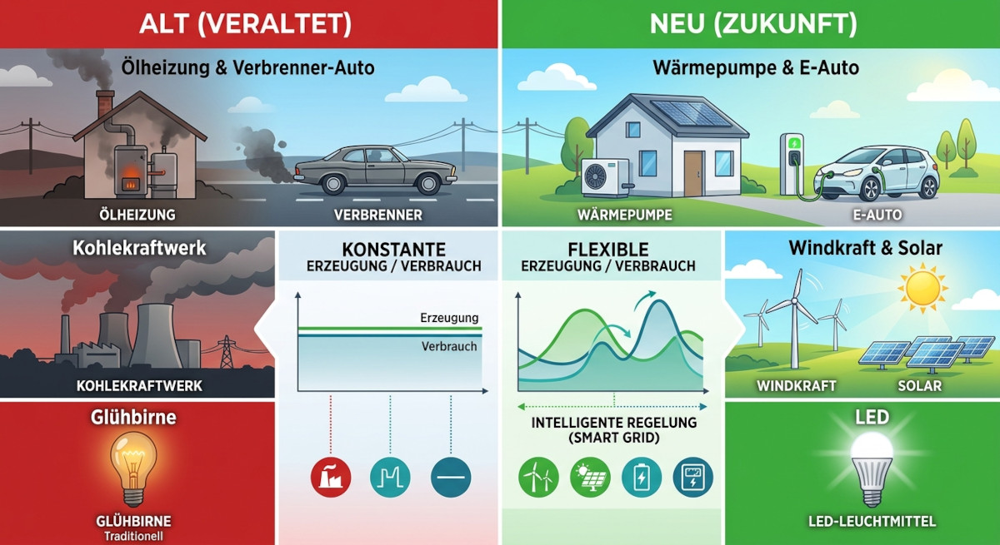
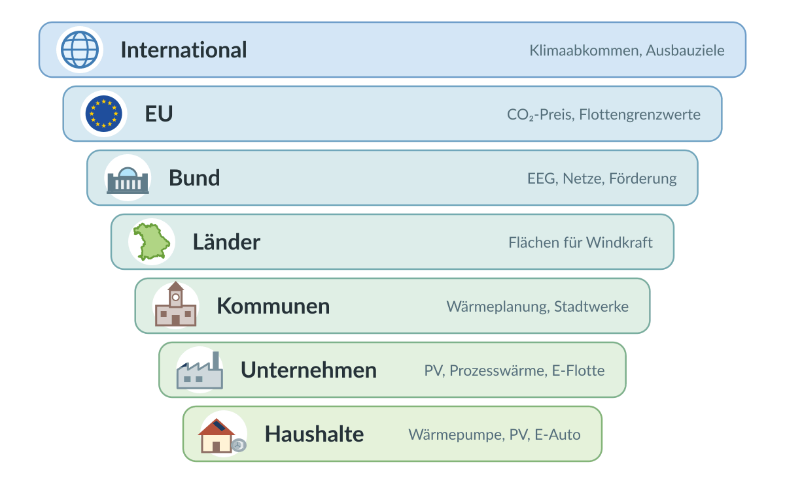
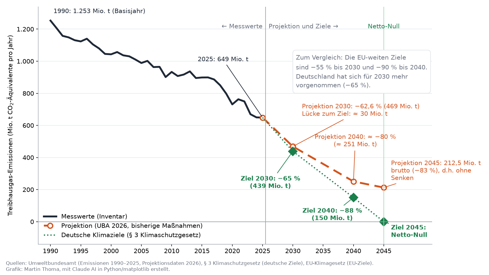
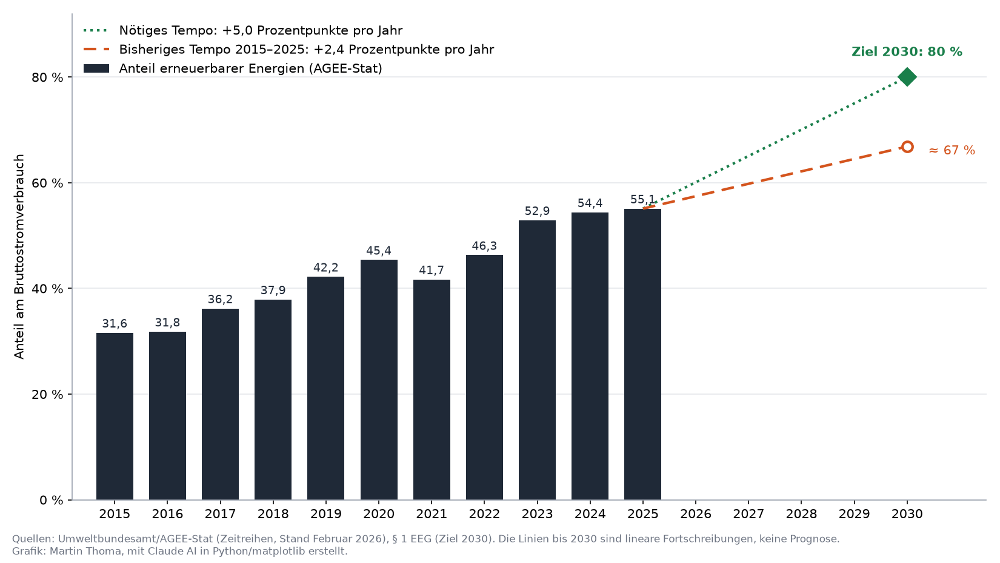
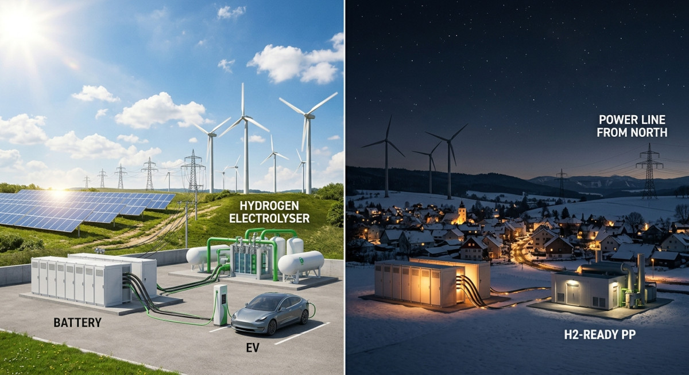
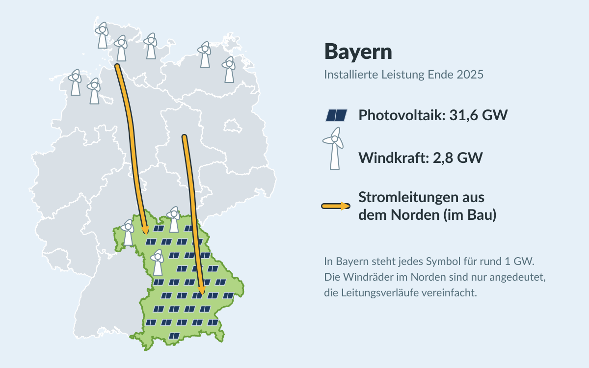
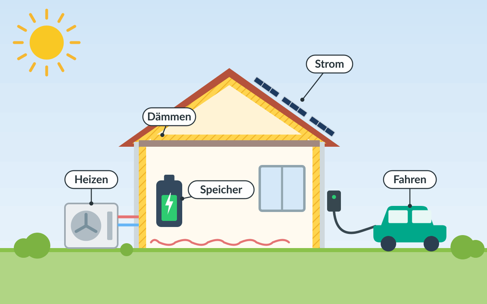

Die Energiewende ist das wohl wichtigste internationale Projekt. Es bezeichnet
den strukturellen und nachhaltigen Wandel weg von fossilen Energieträgern hin zu
erneuerbaren Energien.

<figure class="ai-generated">
    
    <figcaption>Von fossilen Kraftwerken zu Wind, Solar, Batteriespeichern, Wärmepumpen und E-Autos</figcaption>
</figure>

Die Energiewende hat folgende essenziellen Bausteine. Ihre Symbole tauchen später
bei den Vorschlägen wieder auf:

⚡Elektrifizierung

Insbesondere Verkehr und das private Heizen müssen weg von Diesel, Benzin, Heizöl und Erdgas hin zu Strom aus erneuerbaren Quellen.

Die letzten Jahre haben mit dem russischen Angriff auf die Ukraine und dem damit verbundenen Ausfall von günstigem Gas[^1], mit dem Angriff der USA auf den Iran und dem damit verbundenen Ausfall von günstigem Öl, dem Angriff des Irak auf die Öl-Pipelines von Saudi-Arabien und weiteren geopolitischen Krisen gezeigt, wie anfällig die fossile Energieversorgung ist.[^2]

☀️Erneuerbare Energien

Die nahezu vollständige Umstellung der Energiegewinnung auf erneuerbare Quellen wie Wind, Solar, Wasserkraft und Umweltwärme.

2025 nutzte Deutschland zu etwa 21% Kohle und 13% Gas für die Stromerzeugung.[^3]

🔀Flexibilisierung

Einerseits physische Energiespeicher wie Batterien, Pumpspeicherkraftwerke und Power-to-X (z.B. Wasserstoff aus Überschussstrom), andererseits flexible Lasten, die den Verbrauch dynamisch an das Angebot anpassen. Hinzu kommt ein leistungsfähiges Stromnetz, um Energie über große Distanzen zu transportieren und regionale Unterschiede in Erzeugung und Verbrauch auszugleichen.

💡Energieeffizienz

Die Reduzierung des Energieverbrauchs, z.B. durch effizientere Technologien (Glühbirne → LED; Heizöl → Wärmepumpe; Verbrennungsmotor → Elektroantrieb) und durch bessere Dämmung von Gebäuden.

Dieses Gesamtpaket umzusetzen ist eine enorme Herausforderung auf allen
politischen Ebenen. Deshalb gehe ich die Ebenen von oben nach unten durch:
international, EU, Bund, Länder (am Beispiel Bayern), Kommunen (am Beispiel
Plattling), Unternehmen und private Haushalte. Auf jeder Ebene schaue ich, was
bereits passiert ist und was noch fehlt. Für Bayern, Plattling, Unternehmen und
Haushalte ergänze ich Vorschläge, was besser laufen könnte. Stand: September
2026.

**So liest sich der Artikel:** Jeder Eintrag lässt sich aufklappen und zeigt
dann Details und Quellen. Die farbige Pille rechts zeigt den Stand:

* ✅ Umgesetzt bzw. in Kraft
* ⏳ Beschlossen oder in Arbeit, aber das Ziel ist noch nicht erreicht
* ❌ Fehlt
* ↩️ Rückschritt: Etwas Beschlossenes wurde abgeschwächt oder zurückgenommen

## Überblick: Wer ist wofür zuständig?

Die Grafik und die Tabelle zeigen, wo welche Ebene ansetzt. Die folgenden
Abschnitte gehen die Ebenen in derselben Reihenfolge durch.

<figure>
    
    <figcaption>Mit Claude AI generierte Illustration: Die Ebenen der Energiewende, von der internationalen Politik bis zum eigenen Haus</figcaption>
</figure>

<table>
    <thead>
        <tr>
            <th>Ebene</th>
            <th>Elektrifizierung <small>(Verkehr, Wärme)</small></th>
            <th>Erneuerbare Energien <small>(Wind, Solar, Wasserkraft, Umweltwärme)</small></th>
            <th>Flexibilisierung <small>(Speicher, Lastmanagement, Netze)</small></th>
            <th>Energieeffizienz <small>(Technologien, Gebäude)</small></th>
        </tr>
    </thead>
    <tbody>
        <tr>
            <td><strong>International</strong></td>
            <td>-</td>
            <td>Ausbauziele</td>
            <td>-</td>
            <td>Effizienzziele</td>
        </tr>
        <tr>
            <td><strong>EU</strong></td>
            <td>CO₂-Flottengrenzwerte, CO₂-Preis</td>
            <td>Ausbauziele, Strommarktdesign</td>
            <td>Strommarkt, grenzüberschreitende Netze</td>
            <td>Effizienz- und Gebäuderichtlinie</td>
        </tr>
        <tr>
            <td><strong>Bund</strong></td>
            <td>Förderung, Steuern, Heizungsregeln</td>
            <td>EEG, Flächenziele, Genehmigungsrecht</td>
            <td>Netzausbau, Kraftwerke, Speicher, Wasserstoff, Smart Meter</td>
            <td>Gebäuderecht, Förderung</td>
        </tr>
        <tr>
            <td><strong>Länder</strong></td>
            <td>-</td>
            <td>Flächen für Windkraft, Solarpflicht</td>
            <td>-</td>
            <td>Landesbauordnung</td>
        </tr>
        <tr>
            <td><strong>Kommunen</strong></td>
            <td>Ladesäulen, ÖPNV</td>
            <td>Bebauungspläne, eigene Dächer</td>
            <td>Stadtwerke, Wärmenetze</td>
            <td>Wärmeplanung, eigene Gebäude</td>
        </tr>
        <tr>
            <td><strong>Unternehmen</strong></td>
            <td>Prozesswärme, Fuhrpark</td>
            <td>Eigene PV, Stromabnahmeverträge</td>
            <td>Lastmanagement</td>
            <td>Effizientere Prozesse</td>
        </tr>
        <tr>
            <td><strong>Haushalte</strong></td>
            <td>Wärmepumpe, E-Auto</td>
            <td>PV-Anlage, Balkonkraftwerk</td>
            <td>Dynamischer Tarif, Heimspeicher</td>
            <td>Dämmung, sparsame Geräte</td>
        </tr>
    </tbody>
</table>

## International

Auf internationaler Ebene geht es vor allem um Ausbau- und Effizienzziele. Sie
sind der Rahmen für alles Weitere.

Erwärmung deutlich unter 2 °C, möglichst 1,5 °C ⏳

<a href="https://de.wikipedia.org/wiki/%C3%9Cbereinkommen_von_Paris">Pariser Klimaabkommen</a> (2015)

In Kraft seit 2016. Die 1,5-°C-Grenze wird voraussichtlich überschritten.

Austritt der USA aus dem Pariser Klimaabkommen ↩️

Wirksam seit dem 27. Januar 2026[^4]

<a href="https://de.wikipedia.org/wiki/UN-Klimakonferenz_in_Dubai_2023">COP28</a> ⏳

Weltklimakonferenz in Dubai 2023: Abkehr von fossilen Energieträgern, Verdreifachung der erneuerbaren Kapazität und Verdopplung der Effizienzsteigerung bis 2030.

Beschlossen, aber nicht verbindlich

## Europäische Union

Die EU setzt mit CO₂-Preisen, Flottengrenzwerten, Ausbau- und Effizienzzielen
und dem Strommarktdesign den Rahmen für die Mitgliedstaaten.

−55 % Treibhausgase bis 2030, klimaneutral bis 2050 ✅

<a href="https://de.wikipedia.org/wiki/Europ%C3%A4isches_Klimagesetz">Europäisches Klimagesetz</a>[^5] · Baustein: Alle

Seit 2021 in Kraft

Klimaziel 2040: −90 % gegenüber 1990 ✅

Baustein: Alle

Bis zu 5 Prozentpunkte dürfen über internationale Zertifikate erreicht werden[^6]

<a href="https://de.wikipedia.org/wiki/EU-Emissionshandel">Emissionshandel ETS 1</a> für Strom und Industrie ✅

Baustein: Erneuerbare

Seit 2005

ETS 2: CO₂-Preis für Gebäude und Verkehr ⏳

Baustein: Elektrifizierung

Von 2027 auf 2028 verschoben

<a href="https://de.wikipedia.org/wiki/CO2-Grenzausgleichssystem">CO₂-Grenzausgleich (CBAM)</a> ✅

Baustein: Alle

Seit 2026 müssen Importeure für die CO₂-Emissionen z.B. von Stahl und Zement bezahlen

42,5 % Erneuerbare am Endenergieverbrauch bis 2030 ⏳

Erneuerbare-Energien-Richtlinie (RED III) · Baustein: Erneuerbare

Beschlossen 2023

−11,7 % Endenergieverbrauch bis 2030 ⏳

Energieeffizienz-Richtlinie · Baustein: Effizienz

Beschlossen 2023

Neubauten ab 2030 emissionsfrei ⏳

Gebäuderichtlinie (<a href="https://de.wikipedia.org/wiki/Richtlinie_(EU)_2024/1275_(Gesamtenergieeffizienz_von_Geb%C3%A4uden)" title="Energy performance of buildings directive">EPBD</a>) · Baustein: Effizienz

Beschlossen 2024, muss national umgesetzt werden

Ab 2035 nur noch emissionsfreie Neuwagen ↩️

CO₂-Flottengrenzwerte · Baustein: Elektrifizierung

Die EU-Kommission hat im Dezember 2025 vorgeschlagen, das Ziel für 2035 auf −90 % abzuschwächen[^7]. Damit dürften z.B. Plug-in-Hybride weiter verkauft werden. Parlament und Rat haben noch nicht entschieden; der Berichterstatter des Parlaments hat im April 2026 weitere Abschwächungen vorgeschlagen[^8].

Reform des Strommarktdesigns (Differenzverträge) ✅

Baustein: Erneuerbare, Flexibilisierung

Beschlossen 2024

<a href="https://de.wikipedia.org/wiki/Verordnung_(EU)_2023/2405_gleiche_Wettbewerbsbedingungen_f%C3%BCr_nachhaltigen_Luftverkehr_(Initiative_%E2%80%9EReFuelEU_Aviation%E2%80%9C)">ReFuelEU Aviation</a> ⏳

Baustein: Power-to-X

Mindestanteil synthetischer Kraftstoffe (E-Kerosin) im Flugverkehr.

In Kraft seit 2024: 1,2 % ab 2030, 5 % ab 2035. Bisher gibt es in Europa nur Pilotanlagen.

## Bund

Der Bund ist für die meisten Gesetze und Förderungen zuständig: EEG,
Flächenziele, Netzausbau, Kraftwerke, Gebäuderecht und Heizungsregeln.

### Ziele

Klimaneutral bis 2045 ⏳

<a href="https://de.wikipedia.org/wiki/Bundes-Klimaschutzgesetz">Klimaschutzgesetz</a>

Seit 2021. Die Novelle 2024 hat die verbindlichen Jahresziele für einzelne Sektoren abgeschafft.

<a href="https://de.wikipedia.org/wiki/Atomausstieg">Atomausstieg</a> ✅

Die letzten drei Kernkraftwerke gingen im April 2023 vom Netz.

<a href="https://de.wikipedia.org/wiki/Kohleausstieg_in_Deutschland">Kohleausstieg</a> spätestens 2038 ⏳

Gesetzlich festgelegt

80 % erneuerbarer Strom bis 2030 ⏳

2025 waren es 55,1 %[^9] des Bruttostromverbrauchs.

Wie weit der Weg noch ist, zeigt der Verlauf der Emissionen: Seit 1990 sind sie
um knapp die Hälfte gesunken[^10]. Bis 2045 müssen sie auf netto null fallen. Das
sind noch rund 20 Jahre, in denen die Emissionen um etwas mehr sinken müssen
(649 Mio. t) als in den 35 Jahren davor (604 Mio. t)[^10].

<figure>
    
    <figcaption>Jährliche Treibhausgas-Emissionen Deutschlands (ohne Landnutzung) in Mio. t CO₂-Äquivalenten. Durchgezogen: Messwerte, gestrichelt: Projektion mit den bisher beschlossenen Maßnahmen, Rauten: Ziele des deutschen Klimaschutzgesetzes. Zwischen den Stützjahren sind die Linien nur geradlinig verbunden. Quellen: Umweltbundesamt (1990-2025)[^10], UBA-Projektionsdaten 2026 (Stand der Beschlüsse: November 2025)[^11], § 3 Klimaschutzgesetz (deutsche Ziele)[^12], Umweltbundesamt und Deutscher Naturschutzring (EU-Ziele)[^5][^6]</figcaption>
</figure>

Wichtig beim Lesen der Grafik:

* Die **Ziele** (grün) sind die deutschen Ziele aus dem Bundes-Klimaschutzgesetz: −65 % bis 2030, −88 % bis 2040 und Netto-Treibhausgasneutralität bis 2045[^12].
* Nicht verwechseln mit den **EU-Zielen**: Für die EU insgesamt gelten −55 % bis 2030[^5] und −90 % bis 2040[^6]. Deutschland hat sich für 2030 also mehr vorgenommen als die EU. Das deutsche Ziel für 2040 (−88 %) liegt dagegen knapp unter dem EU-weiten. Werden für die EU-Ziele höhere nationale Ziele nötig, muss die Bundesregierung sie anheben; senken darf sie sie nicht[^12].
* Die **Projektion** (orange) ist keine Vorhersage, sondern zeigt, was mit den bis November 2025 beschlossenen Maßnahmen passiert[^11]. Später abgeschwächte Regeln wie das Heizungsgesetz sind darin noch nicht berücksichtigt.
* Das Ziel für 2030 verfehlt die Projektion laut UBA um rund 30 Mio. t[^11]. Für 2040 sind es rund 100 Mio. t, weil die Projektion dort nur etwa −80 % statt −88 % erreicht[^11].
* „Netto-Null" heißt nicht, dass gar nichts mehr ausgestoßen wird: Restemissionen (z.B. aus der Landwirtschaft) müssen durch natürliche und technische Senken ausgeglichen werden. Die Projektion für 2045 (212,5 Mio. t) ist der Bruttowert ohne diese Senken[^11].

### Erneuerbare Energien

Beim Strom ist Deutschland schon weit: 2025 kamen 55,1 % des
Bruttostromverbrauchs aus erneuerbaren Energien[^9]. Für das Ziel von 80 %
bis 2030 muss der Anteil aber jedes Jahr um rund 5 Prozentpunkte steigen. Das
ist doppelt so schnell wie im Schnitt der letzten zehn Jahre (2,4 Prozentpunkte
pro Jahr).

<figure>
    
    <figcaption>Mit Claude AI in Python/matplotlib erstelltes Diagramm: Anteil erneuerbarer Energien am Bruttostromverbrauch. Die Linien bis 2030 schreiben das nötige und das bisherige Tempo linear fort, sie sind keine Prognose. Quelle: Umweltbundesamt/AGEE-Stat[^9], Ziel nach § 1 EEG.</figcaption>
</figure>

<a href="https://www.gesetze-im-internet.de/windbg/">Wind-an-Land-Gesetz</a> ⏳

2 % der Bundesfläche für Windkraft bis 2032.

Zwischenziel 1,4 % bis 2027

Solarpaket I ✅

Einfachere Balkonkraftwerke (bis 800 W) und Mieterstrom.

Seit 2024

EEG-Novelle ⏳

Ende der festen Einspeisevergütung für neue PV-Anlagen unter 25 kW ab 2027.

Vom Kabinett am 29. Juli 2026 beschlossen[^13], erste Lesung im Bundestag am 24. September 2026[^14]. Es soll am 1. Januar 2027 in Kraft treten. Die Solarbranche warnt vor einem Einbruch beim Zubau.

### Flexibilisierung

<figure class="ai-generated">
    
    <figcaption>Mit Gemini generierte Illustration, kein echtes Foto: Überschuss bei Sonne und Wind, Versorgung in der Dunkelflaute</figcaption>
</figure>

Sonne und Wind liefern nicht immer dann Strom, wenn er gebraucht wird. Eine
Dunkelflaute ist eine Phase mit wenig Wind und wenig Sonne, im Winter oft über
mehrere Tage. Dann braucht es Speicher, steuerbare Kraftwerke, Stromimporte und
Verbraucher, die ihren Verbrauch verschieben können. Außerdem muss der Strom vom
Erzeugungsort zum Verbrauchsort kommen.

Stromnetzausbau ⏳

Zum Beispiel <a href="https://de.wikipedia.org/wiki/Suedlink">SuedLink</a>.

Der Strom aus dem windreichen Norden muss in den Süden.

Wasserstofffähige Gaskraftwerke für Dunkelflauten ⏳

Kraftwerksstrategie

Vom Kabinett im Mai 2026 beschlossen[^15]. Die erste Ausschreibung über 4,5 GW (Gebotstermin 8. September 2026) war deutlich überzeichnet, die Zuschläge folgen bis zum 3. November 2026. Eine weitere Runde soll noch 2026 folgen[^16].

Steuerbare Verbrauchseinrichtungen und dynamische Stromtarife ✅

§ 14a EnWG[^17]

Seit 2024 bzw. 2025

Smart-Meter-Rollout ⏳

Pflicht-Einbau für Haushalte mit mehr als 6.000 kWh/Jahr, PV-Anlagen ab 7 kW oder steuerbaren Verbrauchern wie Wärmepumpen und Wallboxen. Er läuft, aber langsam.

Smart Meter light ⏳

Günstiger Zähler für alle anderen Haushalte, damit auch sie dynamische Stromtarife nutzen können.

Am 1. Juli 2026 vom Koalitionsausschuss beschlossen[^18], bisher nur ein Konzept ohne Gesetzentwurf[^19]. Er soll Verbrauchsdaten übertragen, aber keine Geräte steuern können. VDE FNN und DKE lehnen das Konzept ab[^20].

### Power-to-X und Wasserstoff

Mit Power-to-X wird Strom in andere Energieträger umgewandelt, z.B. per
Elektrolyse in Wasserstoff oder weiter in synthetische Kraftstoffe (E-Fuels).
Das ist ineffizienter als die direkte Nutzung von Strom, aber wichtig für
Bereiche, die sich schwer elektrifizieren lassen (Stahl, Chemie, Flug- und
Schiffsverkehr), und als Langzeitspeicher für Dunkelflauten.

10 GW Elektrolyseleistung bis 2030 ⏳

Nationale Wasserstoffstrategie

Installiert sind erst rund 0,18 GW, weitere 1,3 GW sind beschlossen oder im Bau[^21]. Das EWI erwartet, dass das Ziel verfehlt wird.

<a href="https://de.wikipedia.org/wiki/Wasserstoff-Kernnetz">Wasserstoff-Kernnetz</a> ⏳

2024 genehmigt, im Bau

Nationale E-Kerosin-Quote ab 2026 ↩️

Quote für E-Kerosin (PtL) im Flugverkehr

Abgeschafft[^22], stattdessen gilt nur die EU-Quote ab 2030. Im September 2026 haben Deutschland (bis zu 2 Mrd. €), Österreich und Luxemburg (je bis zu 60 Mio. €) eine gemeinsame Förderung für E-Kerosin auf den Weg gebracht: In einer Doppelauktion gleicht der Staat die Preislücke zwischen Herstellern und Abnehmern aus[^23].

### Elektrifizierung und Energieeffizienz

Heizungsgesetz ↩️

Regel: Neue Heizungen müssen zu 65 % mit erneuerbaren Energien betrieben werden.

Mit dem Gebäudemodernisierungsgesetz am 10. Juli 2026 abgeschafft[^24]. Neue Öl- und Gasheizungen bleiben erlaubt; ab 2029 soll ein steigender Bioanteil beigemischt werden.

Kommunale Wärmeplanung (<a href="https://www.gesetze-im-internet.de/wpg/">Wärmeplanungsgesetz</a>) ⏳

Siehe Kommunen

Förderprogramm für E-Autos ✅

Bis zu 6.000 €, einkommensabhängig.

Seit Mai 2026[^25]

Kfz-Steuerbefreiung für E-Autos ✅

Für Neuzulassungen bis Ende 2030 verlängert[^26], längstens bis 2035

Strompreise senken ✅

Bundeszuschuss zu den Netzentgelten, Gasspeicherumlage abgeschafft.

Seit 2026

Stromsteuer für private Haushalte senken ❌

Nur für produzierende Unternehmen und Landwirte gesenkt. Solange Strom teuer ist, lohnen sich Wärmepumpe und E-Auto weniger.

Deutschlandticket ✅

Seit 2023; 2026 auf 63 € pro Monat verteuert

Tempolimit auf Autobahnen ❌

<a href="https://de.wikipedia.org/wiki/Sonderverm%C3%B6gen_Infrastruktur_und_Klimaneutralit%C3%A4t">Sondervermögen Infrastruktur und Klimaneutralität</a> ⏳

Davon 100 Mrd. € für den Klima- und Transformationsfonds.

2025 beschlossen. Es gibt Kritik, dass das Geld zweckentfremdet wird.

## Länder

Die Länder entscheiden über Flächen für Windkraft, Solarpflichten und die
Landesbauordnung.

### Bayern

Bayern hat sich ein früheres Klimaziel gesetzt als der Bund und ist bei der
Photovoltaik stark.

Klimaneutral bis 2040 ⏳

Bayerisches Klimaschutzgesetz · Baustein: Alle

Fünf Jahre früher als der Bund (2045). Das Ziel ist gesetzlich festgeschrieben, die Umsetzung hängt an den Einzelmaßnahmen unten.

Lockerung der 10H-Regel für Windräder ✅

Baustein: Erneuerbare

Seit 2022 gilt in Wäldern, an Autobahnen und Bahnlinien, in Gewerbegebieten und in Vorranggebieten nur noch ein Abstand von 1.000 m. Sonst gilt 10H weiterhin.

Flächen für Windkraft: 1,1 % bis 2027, 1,8 % bis 2032 ⏳

Baustein: Erneuerbare

Aktuell sind rund 1 % der Landesfläche[^27] ausgewiesen.

1.000 neue Windräder bis 2030 auf den Weg bringen ⏳

Windkraft ausbauen · Baustein: Erneuerbare

2025 gab es rund 770 Genehmigungsanträge[^28], aber nur 29 neue Windräder mit 82 MW[^27] gingen in Betrieb. Insgesamt sind es 2,8 GW.

Photovoltaik: 40 GW bis 2030 ⏳

Baustein: Erneuerbare

2025 Rekordzubau von 4,7 GW auf insgesamt 31,6 GW[^27]. Bayern ist beim Solarausbau Spitzenreiter.

Solarpflicht ⏳

Baustein: Erneuerbare

Für neue Gewerbe- und Industriegebäude seit 2023; für neue Wohngebäude nur eine Soll-Vorschrift

<figure class="ai-generated">
    
    <figcaption>Mit Claude AI erstellte Grafik: Bayern hat viel Photovoltaik, wenig Windkraft und braucht Strom aus dem Norden. In Bayern steht jedes Symbol für rund 1 GW installierte Leistung (Ende 2025)[^27]. Die Windräder im Norden sind nur angedeutet, die Verläufe von SuedLink und SuedOstLink vereinfacht.</figcaption>
</figure>

### Was könnte Bayern besser machen?

Bayern ist bei der Photovoltaik stark, bei der Windkraft und beim Netzausbau
aber seit Jahren hinten dran. Meine Vorschläge:

<strong>10H-Regel komplett abschaffen</strong> ☀️

Die Lockerung von 2022 hat geholfen: Die Zahl der Windkraft-Genehmigungen in Bayern stieg von 8 im Jahr 2022 auf 17 im Jahr 2023 und auf 72 bis Anfang Dezember 2024[^29]. Aber außerhalb der Ausnahmegebiete gilt 10H weiterhin. Die Flächenziele des Bundes sind ohnehin verbindlich.

<strong>Genehmigte Windräder schneller bauen</strong> ☀️

Anträge und Genehmigungen sind auf Rekordniveau, gebaut wurde 2025 aber nur ein Bruchteil. Die Bayerischen Staatsforsten wollen bis 2030 rund 500 Windräder[^27] im Staatswald ermöglichen – das ist ein guter Hebel, den man beschleunigen sollte.

<strong>Solarpflicht für alle Neubauten und Dachsanierungen</strong> ☀️

Für neue Wohngebäude gibt es bisher nur eine Soll-Vorschrift (Art. 44a BayBO[^30]). Wer ohnehin ein Dach neu deckt, sollte PV direkt mitdenken müssen. Andere Länder zeigen, dass das geht: Baden-Württemberg verlangt PV auf neuen Wohngebäuden seit 2022 und bei grundlegenden Dachsanierungen seit 2023, Hamburg bei Neubauten seit 2023 und bei wesentlichen Dachumbauten seit 2024, Berlin seit 2023 bei Neubauten und wesentlichen Dachumbauten[^31].

<strong>Netzausbau nicht mehr bremsen</strong> 🔀

Bayern hat 2015 durchgesetzt, dass <a href="https://de.wikipedia.org/wiki/Suedlink">SuedLink</a> als Erdkabel gebaut wird. Das hat die Leitung teurer und verzögert. Gerade Bayern braucht den Windstrom aus dem Norden, weil die Kernkraftwerke abgeschaltet sind.

<strong>Netzanschlüsse beschleunigen</strong> 🔀

Laut dem bayerischen Länderbericht[^27] werden Netzanschlüsse zunehmend zum knappen Gut. Batteriespeicher direkt an PV-Parks können die Netze entlasten.

<strong>Industrie ans Wasserstoffnetz anbinden</strong> 🔀

Das Chemiedreieck um Burghausen braucht große Mengen Wasserstoff. Ohne rechtzeitige Anbindung an das Kernnetz droht Abwanderung.

<strong>Kleine Gemeinden bei der Wärmeplanung unterstützen</strong> ⚡💡

Die meisten bayerischen Gemeinden müssen bis 2028 einen Wärmeplan haben. Viele haben dafür kein Personal. Landesweite Musterpläne, Beratung und Förderung für Wärmenetze würden helfen.

<strong>ÖPNV im ländlichen Raum stärken</strong> ⚡💡

Auf dem Land ist man ohne Auto aufgeschmissen. Ein dichterer Takt bei Bus und Bahn sowie Rufbusse würden viele Autofahrten ersetzen.

### Zum Vergleich: Schleswig-Holstein und Hamburg

Die Voraussetzungen der Länder sind sehr unterschiedlich. Ein windreiches
Flächenland und ein Stadtstaat im Vergleich mit Bayern:

<table>
    <thead>
        <tr>
            <th></th>
            <th>Bayern</th>
            <th>Schleswig-Holstein</th>
            <th>Hamburg</th>
        </tr>
    </thead>
    <tbody>
        <tr>
            <th>Klimaneutral bis</th>
            <td>2040</td>
            <td>2040, seit 2025 im Landesgesetz[^32]</td>
            <td>2040, per Volksentscheid im Oktober 2025[^33]</td>
        </tr>
        <tr>
            <th>Windkraft an Land</th>
            <td>2,8 GW (Ende 2025)[^27]</td>
            <td>9,6 GW (Ende 2025)[^34]</td>
            <td>121 MW (2025)[^35]</td>
        </tr>
        <tr>
            <th>Photovoltaik</th>
            <td>31,6 GW (Ende 2025)[^27]</td>
            <td>4,6 GW (Ende 2025)[^34]</td>
            <td>129 MW (Ende 2023)[^35]</td>
        </tr>
        <tr>
            <th>Flächen für Windkraft</th>
            <td>1,1 % bis 2027, 1,8 % bis 2032</td>
            <td>Die Entwürfe der Regionalpläne weisen rund 3,4 % aus, Ziel: 15 GW bis 2030[^36]</td>
            <td>0,5 % bis 2032[^35]</td>
        </tr>
        <tr>
            <th>Solarpflicht</th>
            <td>Neue Gewerbe- und Industriegebäude; für neue Wohngebäude nur eine Soll-Vorschrift</td>
            <td>Neue Wohngebäude, Dachsanierungen bei Gewerbegebäuden, Parkplätze ab 70 Stellplätzen[^32]</td>
            <td>Neubauten und Dachsanierungen, Parkplätze ab 35 Stellplätzen[^35]</td>
        </tr>
        <tr>
            <th>Größter Hebel</th>
            <td>Photovoltaik; Windstrom kommt aus dem Norden</td>
            <td>Windkraft</td>
            <td>Fernwärme: Das Kohle-Heizkraftwerk Tiefstack soll bis 2030 durch Flusswärmepumpen und Industrieabwärme ersetzt werden[^37], ein festes Datum nennt der Senat aber nicht[^38].</td>
        </tr>
    </tbody>
</table>

## Kommunen

Vor Ort entscheiden die Kommunen über Bebauungspläne, Wärmeplanung,
Ladesäulen, ÖPNV und ihre eigenen Dächer.

Kommunale Wärmeplanung ⏳

Baustein: Elektrifizierung, Effizienz

Großstädte bis 30.06.2026, alle anderen bis 30.06.2028.

72 von 83 Großstädten[^39] sind fristgerecht fertig geworden.

Flächen für Wind- und Solarparks ausweisen ⏳

Baustein: Erneuerbare

Über Flächennutzungs- und Bebauungspläne entscheidet die Kommune, ob Projekte überhaupt möglich sind.

PV auf kommunalen Dächern ⏳

Baustein: Erneuerbare

Schulen, Rathäuser, Bauhöfe.

Eigenverbrauch senkt die Stromkosten der Kommune. Der Ausbau ist Entscheidung des Stadt- bzw. Gemeinderats.

Fernwärme ausbauen (Stadtwerke) ⏳

Baustein: Elektrifizierung, Flexibilisierung

Wo Wärmenetze wirtschaftlich sind, zeigt die kommunale Wärmeplanung.

Ladesäulen, ÖPNV, Radwege, Carsharing ⏳

Baustein: Elektrifizierung

Beispiel: <a href="../verkehrsausschuss-plattling-november-2025/">Carsharing-Diskussion im Verkehrsausschuss Plattling</a>

### Beispiel Plattling

Plattling ist eine Stadt mit rund 13.000 Einwohnern im Landkreis Deggendorf.
Hier ist bereits einiges passiert:

Kommunale Wärmeplanung  ✅

Baustein: Elektrifizierung, Effizienz

Im November 2024 an die Energie Südbayern (ESB) vergeben, zu 90 % vom Bund gefördert. Die Ergebnisse wurden am 18.03.2026 öffentlich vorgestellt. Die gesetzliche Frist war der 30.06.2028.[^40]

Solarpark Pielweichs II ✅

Baustein: Erneuerbare

5 MWp auf 4,4 ha, rund 5,7 Mio. kWh pro Jahr. Das entspricht rechnerisch dem Verbrauch von etwa 1.600 Haushalten.[^41]

PV-Anlagen auf Gebäuden der Stadtwerke[^42] ✅

Baustein: Erneuerbare

Windkraft ✅

Baustein: Erneuerbare

Im Regionalplan-Entwurf Donau-Wald[^43] liegen die Vorranggebiete im Landkreis Deggendorf u.a. in Grafling, Deggendorf, Schaufling und Lalling – nicht in Plattling.

In Plattling selbst gibt es keine Windkraftanlagen, da diese wegen geringer Windgeschwindigkeiten nicht wirtschaftlich betreibbar sind.[^44]

Carsharing ⏳

Baustein: Elektrifizierung

Im November 2025 im <a href="../verkehrsausschuss-plattling-november-2025/">Verkehrsausschuss</a> vorgestellt. Der Carsharingbus von Mikar soll ab 2026 in Plattling verfügbar sein.[^45] Ich hätte mir einen Elektrobus gewünscht, aber ich sehe den Schritt trotzdem als positiv an. Es ist besser einen Kleinbus auf der Straße zu haben als viele Einzelautos. Da die Akkus immer besser werden sehe ich in Zukunft auch Elektrobusse als realistische Option.

### Was könnte Plattling besser machen?

Wärmeplan in konkrete Projekte umsetzen ⚡💡

Ein Wärmeplan allein spart keine Tonne CO₂. Der Stadtrat sollte für die Eignungsgebiete einen Zeitplan beschließen, und die Stadtwerke könnten Wärmenetze betreiben. Die Ergebnisse sollten außerdem auf der Website der Stadt stehen, damit Hausbesitzer planen können.

PV auf alle städtischen Dächer und Parkplätze ☀️

Schulen, Bürgerspital, Bauhof, Kläranlage und große Parkplätze bieten viel Fläche. Mit Eigenverbrauch rechnet sich das meist schnell.

PV-Pflicht in neuen Bebauungsplänen ☀️

Kommunen können im Bebauungsplan festsetzen, dass neue Gebäude PV-Anlagen bekommen (§ 9 Abs. 1 Nr. 23b BauGB[^46]). Das geht weiter als die bayerische Soll-Vorschrift.

Weitere Solarparks mit Bürgerbeteiligung ☀️

Pielweichs II ist ein guter Anfang. Agri-PV oder PV entlang von Bahnlinie und Autobahn könnten folgen – idealerweise mit einer Energiegenossenschaft, damit die Einnahmen in der Region bleiben.

Batteriespeicher an Solarparks 🔀

Ein Speicher verschiebt den Mittagsstrom in den Abend und entlastet das Netz.

Carsharing mit E-Autos und mehr Ladesäulen ⚡

Im Verkehrsausschuss wurde für den 9-Sitzer ein Diesel empfohlen. Für die meist kurzen Strecken in und um Plattling reicht ein E-Auto. Dazu gehören Ladesäulen, z.B. am Bahnhof und am Rathaus. Ich hoffe, dass wir diese Möglichkeit in den kommenden Jahren anbieten können.

<strong>Mehr ÖPNV</strong> ⚡💡

Aktuell gibt es in Plattling nur begrenzte Busverbindungen, insbesondere abends und am Wochenende. Ein dichteres Netz und häufigere Takte würden den Umstieg vom Auto erleichtern. Weil das eine Finanzierungsfrage ist, könnte man mit dem Ausbau von bedarfsgesteuerten Angeboten beginnen: Ein Anruf-Sammel-Taxi (AST) fährt ohne festen Fahrplan nur auf Bestellung, ein Anruf-Linien-Taxi (ALT) fährt nach Fahrplan, bedient aber nur die Haltestellen, an denen jemand ein- oder aussteigen will.

<strong>Bessere Haltestellen</strong> ⚡💡

Konkret denke ich an Sitzbänke mit Rückenlehne an allen Haltestellen. Besser sind natürlich Wartehäuschen mit Wetterschutz und Beleuchtung. Das macht das Warten angenehmer und den Bus attraktiver.

## Unternehmen

Unternehmen können Prozesswärme und Fuhrpark elektrifizieren, eigenen Strom
erzeugen, Lasten flexibel steuern und Prozesse effizienter machen.

Klimaschutzverträge ✅

Baustein: Elektrifizierung

Der Staat gleicht die Mehrkosten klimafreundlicher Produktion aus.

Erste Gebotsrunde 2024. Die zweite Runde mit 5 Mrd. € lief vom 7. Mai bis 7. September 2026, diesmal auch für Projekte mit CO₂-Abscheidung (CCUS). Die Zuschläge sollen Ende 2026 folgen[^47].

Industriestrompreis ✅

Baustein: Elektrifizierung

Energieintensive Unternehmen im internationalen Wettbewerb zahlen für bis zu die Hälfte ihres Verbrauchs nicht mehr als 5 ct/kWh.

Gilt 2026 bis 2028 mit 3,8 Mrd. €, von der EU-Kommission im April 2026 genehmigt. Mindestens die Hälfte der Hilfe muss in Anlagen fließen, die die Kosten des Stromsystems senken, ohne mehr fossile Energie zu verbrauchen[^48].

Förderung für erneuerbare Prozesswärme ✅

Baustein: Elektrifizierung

Gefördert werden Wärmepumpen und andere erneuerbare Anlagen für Prozesswärme (Förderprogramm EEW, Modul 2).

Zuschuss von 40 % (große Unternehmen) bis 60 % (kleine Unternehmen), höchstens 20 Mio. €. Mehr als die Hälfte der Wärme muss in Produktionsprozesse gehen, Wärmepumpen müssen mit Ökostrom laufen[^49].

Staatliche Absicherung von PPAs ⏳

Baustein: Erneuerbare

Abgesichert werden Stromabnahmeverträge (PPA) mit Wind- und Solarparks.

Ein PPA ist ein langfristiger Liefervertrag direkt zwischen Unternehmen und Anlagenbetreiber. Fällt der Abnehmer aus, trägt der Betreiber das Risiko, das macht PPAs teuer. Das Wirtschaftsministerium hat eine Absicherung über die KfW in Aussicht gestellt, Details gibt es noch nicht[^50].

Grüner Stahl ❌

Baustein: Elektrifizierung

ArcelorMittal hat die Umstellung in Bremen und Eisenhüttenstadt 2025 gestoppt[^51] - trotz zugesagter Förderung von 1,3 Mrd. €.

Großbatteriespeicher ⏳

Baustein: Flexibilisierung

Es werden sehr viele Anschlussanfragen gestellt; siehe <a href="../strom-in-deutschland/">Strom in Deutschland</a>

Energieeffizienzgesetz ↩️

Baustein: Effizienz

Energie- oder Umweltmanagementsystem ab 7,5 GWh Jahresverbrauch (§ 8 EnEfG[^52]), veröffentlichte Umsetzungspläne für wirtschaftliche Effizienzmaßnahmen ab 2,5 GWh (§ 9 EnEfG[^53]).

Seit 2023 in Kraft. Das Kabinett hat im Juni 2026 eine Novelle beschlossen, nach der das Managementsystem erst ab 23,6 GWh[^54] Pflicht sein soll. Erste Lesung im Bundestag am 24. September 2026[^55], Bundestag und Bundesrat müssen noch zustimmen.

### Was können Unternehmen selbst tun?

Vieles davon muss nicht auf die Politik warten. Es spart oft sogar Geld, weil
Strom vom eigenen Dach günstiger ist als Netzstrom.

PV auf Dächern, Fassaden und Parkplätzen mit Batteriespeicher ☀️🔀

Der Verbrauch im Betrieb fällt meist tagsüber an, wenn die Sonne scheint. Ein Speicher verschiebt Überschüsse in den Abend, kappt Lastspitzen und macht unabhängiger vom Strompreis. Siehe <a href="../wirtschaftlichkeitsberechnung-pv-anlage/">Wirtschaftlichkeitsberechnung einer PV-Anlage</a> und <a href="../batteriespeicher/">Batteriespeicher</a>.

Wärmepumpe statt Gas- oder Ölheizung ⚡💡

Auch in Büros und Hallen sind Wärmepumpen möglich. Wer ohnehin kühlen muss, kann mit einer reversiblen Klimaanlage (Luft-Luft-Wärmepumpe) im Winter damit heizen. Siehe <a href="../waermepumpen/">Wärmepumpen</a> und <a href="../klimaanlagen-modelle/">Klimaanlagen-Modelle</a>.

E-Autos als Dienstwagen ⚡

Car Policy mit CO₂-Grenzwert

Laut Agora Verkehrswende[^56] ist rund jede fünfte Pkw-Neuzulassung ein Dienstwagen, und diese Autos landen nach wenigen Jahren auf dem Gebrauchtmarkt. Nur etwa 37 % der Unternehmen setzen in ihrer Fuhrparkrichtlinie klare Klimaziele. Ein CO₂-Grenzwert, der schrittweise sinkt, lenkt die Flotte auf Elektroautos. Siehe <a href="../e-autos/">E-Autos</a>.

Ladesäulen für Mitarbeiter und Besucher ⚡🔀

Wer keinen Ladeplatz zu Hause hat, kann so trotzdem elektrisch fahren. Mit Lastmanagement lädt man vor allem dann, wenn die eigene PV-Anlage Überschuss liefert. Die Agora-Empfehlung[^56] für Car Policies nennt Ladeinfrastruktur am Arbeitsplatz ausdrücklich.

Deutschlandticket als Mitarbeiter-Benefit ⚡💡

Übernimmt der Arbeitgeber mindestens 25 % des Ticketpreises, gibt es von den Verkehrsverbünden zusätzlich 5 % Rabatt. Bei 63 € pro Monat zahlen Mitarbeiter dann rund 44 € statt 63 €. Der Zuschuss ist steuer- und sozialabgabenfrei, wenn er zusätzlich zum Gehalt gezahlt wird[^57].

Homeoffice ermöglichen 💡

Der klimafreundlichste Arbeitsweg ist der, der gar nicht stattfindet. Rund ein Fünftel des Personenverkehrs und seiner Treibhausgase geht auf das Berufspendeln zurück, und 2020 nahmen 68 % der Pendler das Auto[^58]. Laut einer Studie des Öko-Instituts[^59] für das Bundesumweltministerium (2022) kann mehr Homeoffice bis zu 3,7 Mio. t Treibhausgase pro Jahr einsparen. Selbst im vorsichtigsten Szenario mit 20 % Homeoffice ist es rund 1 Mio. t, und schon ein Tag pro Woche verbessert die Bilanz. Die Studie weist aber auf einen Rebound hin: Wer wegen des Homeoffice aufs Land zieht, fährt privat unter Umständen mehr Auto.

Fahrrad-Leasing und gute Abstellanlagen 💡

Ein Pkw verursacht im Schnitt 164 g Treibhausgase pro Personenkilometer, ein Pedelec 3 g, ein normales Fahrrad im Betrieb gar keine (Bezugsjahr 2024)[^60]. Bei 10 km Arbeitsweg (einfach) und 220 Arbeitstagen sind das rund 720 kg pro Jahr mit dem Auto gegenüber etwa 13 kg mit dem Pedelec. Mit dem Pedelec werden auch längere Strecken machbar. Sichere, überdachte Stellplätze und Duschen senken die Hürde.

Videokonferenz oder Bahn statt Flug und Dienstwagen 💡

Auch das empfiehlt die Agora-Studie: Alternativen zum Auto wie Videokonferenzen und Bahnreisen fördern.

Mehr vegetarische Gerichte in der Kantine ⚡☀️🔀💡

In drei Mensen der Universität Cambridge wurde der Anteil vegetarischer Gerichte von 25 auf 50 % verdoppelt. Dadurch stieg der Verkauf vegetarischer Gerichte je nach Mensa um 41 bis 79 %, ohne dass insgesamt weniger verkauft wurde[^61]. Ausgewertet wurden knapp 95.000 Mahlzeiten. Den größten Effekt gab es bei Menschen, die vorher kaum vegetarisch gegessen hatten. Zur Wirkung auf das Klima siehe <a href="#ernaehrung">Ernährung</a> unten.

Energieverbrauch messen und Effizienz steigern 💡

LED-Beleuchtung, Abwärmenutzung, gedämmte Gebäudehüllen, Druckluft- und Kälteanlagen prüfen. Ein Energiemanagement zeigt, wo sich Investitionen am schnellsten lohnen. Große Verbraucher müssen das ohnehin: Ab 7,5 GWh pro Jahr schreibt das Energieeffizienzgesetz ein Energie- oder Umweltmanagementsystem vor, ab 2,5 GWh Umsetzungspläne für Maßnahmen, die sich wirtschaftlich lohnen (siehe Tabelle oben). Kleinere Unternehmen können freiwillig nach demselben Muster vorgehen.

Flexibel verbrauchen und Ökostrom einkaufen ☀️🔀

Lasten wie Kühlung, Ladeinfrastruktur oder Prozesse in Zeiten mit viel Wind und Sonne verschieben (dynamischer Tarif, siehe <a href="../stromtarife/">Stromtarife</a>). Strom über Direktverträge (PPA) mit Erzeugern beziehen.

CO₂-Bilanz erstellen ⚡☀️🔀💡

Wer seine Emissionen nicht kennt, kann sie nicht gezielt senken. Dazu gehören auch die Lieferkette und die Wege der Mitarbeiter: Bei Unternehmen, die an CDP berichten, waren die Emissionen in der Lieferkette 2023 im Schnitt 26-mal so hoch wie die aus dem eigenen Betrieb[^62].

### Unternehmen, die die Energiewende selbst voranbringen

Unternehmen können nicht nur ihre eigenen Emissionen senken. Viele arbeiten direkt
an den Technologien, die alte Technik und Infrastruktur ersetzen. Eine Auswahl, mit
Schwerpunkt auf Deutschland:

Power-to-X: grünes Methan Kommerziell

Aus grünem Wasserstoff und biogenem CO₂.

<strong>Ersetzt:</strong> Erdgas; das Gas kann durch die vorhandenen Gasnetze fließen

<strong>Beispiele:</strong> <a href="https://turn2x.com/">TURN2X</a>, 2022 u.a. von Philip Kessler gegründet, der am KIT Informatik studiert hat[^63]

<strong>Stand:</strong> Erste kommerzielle Anlage seit 2024 in Miajadas (Spanien)[^64]

Power-to-X: E-Fuels Kommerziell

Wie synthetisches Kerosin und E-Diesel.

<strong>Ersetzt:</strong> Erdöl im Flug- und Schiffsverkehr und in der Chemie. Für Pkw sind E-Fuels zu teuer, siehe <a href="../e-fuels/">E-Fuels</a>.

<strong>Beispiele:</strong> <a href="https://www.ineratec.de/">INERATEC</a>, 2016 als Ausgründung des KIT in Karlsruhe gegründet[^65]

<strong>Stand:</strong> Seit 2025 läuft in Frankfurt-Höchst die Anlage ERA ONE mit bis zu 2.500 t E-Fuels pro Jahr[^66]

Elektrolyseure für grünen Wasserstoff Kommerziell

<strong>Ersetzt:</strong> Wasserstoff aus Erdgas

<strong>Beispiele:</strong> <a href="https://sunfire.de/">Sunfire</a> (Dresden): 50-MW-Druckalkali-Elektrolyseur, der kein eigenes Gebäude braucht und die Kosten um bis zu 50 % senken soll[^67]

<strong>Stand:</strong> Kommerziell

Lithium-Schwefel-Batterien In Entwicklung

<strong>Ersetzt:</strong> Nickel, Kobalt und Mangan in der Kathode

<strong>Beispiele:</strong> <a href="https://www.theion.de/">Theion</a> (Berlin): Ziel sind mindestens 1.000 Wh/kg, etwa dreimal so viel wie heutige Lithium-Ionen-Zellen[^68]

<strong>Stand:</strong> In Entwicklung. Stand 2023 war die Massenproduktion für 2028 geplant[^68]

Batterierecycling Im Aufbau

<strong>Ersetzt:</strong> Bergbau und Rohstoffimporte

<strong>Beispiele:</strong> <a href="https://www.cylib.de/">cylib</a>: gewinnt Lithium, Graphit, Nickel, Kobalt und Mangan aus alten Batterien zurück[^69]

<strong>Stand:</strong> Anlage im Chempark Dormagen mit bis zu 60.000 t pro Jahr im Aufbau[^69]

Eisen-Luft-Batterien als Langzeitspeicher Im Aufbau

<strong>Ersetzt:</strong> Gaskraftwerke als Reserve für Dunkelflauten

<strong>Beispiele:</strong> <a href="https://formenergy.com/">Form Energy</a> (USA): speichert Strom bis zu 100 Stunden[^70]

<strong>Stand:</strong> Die erste kommerzielle Anlage in Minnesota soll 2026 voll in Betrieb gehen[^70]

Eisen als Brennstoff In Entwicklung

Eisenpulver verbrennt zu Rost, der mit grünem Wasserstoff wieder zu Eisen wird[^71]

<strong>Ersetzt:</strong> Kohle und Erdgas. Bestehende Kohlekraftwerke mit Turbinen, Netzanschluss und Fernwärme können weiter genutzt werden[^71]

<strong>Beispiele:</strong> <a href="https://www.ironfueltechnology.com/">RIFT</a> (Eindhoven): erster kommerzieller Kessel für Kingspan Unidek mit rund 340 GWh Industriewärme pro Jahr[^72]. <a href="https://www.tu-darmstadt.de/clean-circles/">Clean Circles</a> (TU Darmstadt): modellbasierte Studie zur Umrüstung eines Kohlekraftwerks von Infraserv Höchst in Frankfurt[^73]

<strong>Stand:</strong> RIFT hat 2026 rund 114 Mio. € aus Investitionen und EU-Fördermitteln bekommen, der erste Kessel soll 2029 laufen[^72]. Clean Circles ist ein Forschungsprojekt.

Hochtemperatur-Wärmespeicher Kommerziell

<strong>Ersetzt:</strong> Erdgas für Prozesswärme

<strong>Beispiele:</strong> <a href="https://www.kraftblock.com/">Kraftblock</a> (Saarbrücken): speichert Wärme bis 1.300 °C, aus erneuerbarem Strom oder Abwärme. Ein 20-MWh-Speicher bei Tata Steel nutzt Abwärme und spart rund 110 GWh Erdgas und 22.000 t CO₂ pro Jahr[^74]

<strong>Stand:</strong> Kommerziell

Effizientere Elektromotoren In Entwicklung

Doppelrotor-Radnabenmotor.

<strong>Ersetzt:</strong> Zentrale E-Motoren mit Getriebe

<strong>Beispiele:</strong> <a href="https://www.deepdrive.tech/">DeepDrive</a> (München): 20 % effizienter als herkömmliche Antriebe, arbeitet mit acht der zehn größten Autohersteller zusammen[^75]

<strong>Stand:</strong> Serienproduktion ab 2028 geplant[^75]

Wärmepumpen und Kühlung ohne Kältemittel In Entwicklung

Kalorische Verfahren.

<strong>Ersetzt:</strong> Kompressor und fluorierte Kältemittel. Heute schon gibt es Wärmepumpen mit Propan (R290) statt fluorierter Kältemittel, siehe <a href="../kuehlmittel/">Kühlmittel</a>.

<strong>Beispiele:</strong> <a href="https://qurie.de/">Qurie</a> (Freiburg, Ausgründung des Fraunhofer IPM): elektrokalorisch, ohne Kompressor[^76]. <a href="https://www.magnotherm.com/">Magnotherm</a> (Darmstadt, Ausgründung der TU Darmstadt): magnetokalorisch[^77]

<strong>Stand:</strong> Qurie wurde 2026 gegründet und will zuerst Schaltschränke und Laser kühlen, später gewerbliche Kühlung und Geräte für Endkunden anbieten[^76]. Magnotherm verkauft bereits Kühlgeräte für den Einzelhandel[^78]

Rotationswärmepumpe Im Aufbau

Mit Edelgas statt Kältemittel.

<strong>Ersetzt:</strong> Gaskessel für Prozesswärme und Fernwärme bis 200 °C

<strong>Beispiele:</strong> <a href="https://www.ecop.at/">ecop</a> (Österreich)[^79]

<strong>Stand:</strong> 2026 erste Industrieanlagen, u.a. für ein Fernwärmeprojekt in Meldorf[^79]

Tiefe Geothermie im geschlossenen Kreislauf In Betrieb

<strong>Ersetzt:</strong> Kohle und Gas für Grundlaststrom und Fernwärme

<strong>Beispiele:</strong> <a href="https://eavor.com/">Eavor</a> in Geretsried (Bayern): Wasser zirkuliert in geschlossenen Bohrschleifen in 4.500 m Tiefe. Geplant sind 8,2 MW Strom und 64 MW Fernwärme[^80]

<strong>Stand:</strong> Liefert seit Dezember 2025 Strom ins Netz[^80]

## Private Haushalte

Haushalte entscheiden über Heizung, Auto, PV-Anlage, Stromtarif und Dämmung.

Wärmepumpe statt Öl- und Gasheizung ⏳

Baustein: Elektrifizierung

2025 waren Wärmepumpen mit 47,7 % erstmals die meistverkaufte Heizung[^81]. Siehe auch <a href="../bildungspolitik-ein-grund-fuer-teure-waermepumpen/">Bildungspolitik: Ein Grund für teure Wärmepumpen</a>.

E-Auto statt Verbrenner ⏳

Baustein: Elektrifizierung

2025 waren 19,1 % der neu zugelassenen Pkw reine E-Autos[^82].

PV-Anlage oder Balkonkraftwerk ⏳

Baustein: Erneuerbare

Siehe <a href="../wirtschaftlichkeitsberechnung-pv-anlage/">Wirtschaftlichkeitsberechnung einer PV-Anlage</a> und <a href="../steckersolar-batterien-2025/">Steckersolar-Batterien</a>

Flexibel verbrauchen ⏳

Baustein: Flexibilisierung

Dynamischer Stromtarif, Heimspeicher, E-Auto bei Überschuss laden. Siehe <a href="../stromtarife/">Stromtarife</a> und <a href="../stromzaehler/">Stromzähler</a>. Ohne Smart Meter gibt es keinen dynamischen Tarif.

Dämmen und sparsame Geräte ⏳

Baustein: Effizienz

Siehe <a href="../daemstoffe/">Dämmstoffe</a>

Ernährung: weniger Fleisch und Milchprodukte ⏳

Baustein: Übergreifend

Vegetarisch oder vegan. Das Umweltbundesamt[^83] nennt für eine vegetarische bzw. vegane Ernährung nach der EAT-Lancet-Kommission 46 bzw. 49 % weniger ernährungsbedingte Treibhausgase, für die „flexitarische" Variante etwa die Hälfte. Der Unterschied zwischen vegetarisch und vegan ist damit klein. Käse verursacht ähnlich viel wie Geflügel oder Schwein.

### Was kann ich selbst tun?

<figure class="ai-generated">
    
    <figcaption>Mit Claude AI generierte Illustration: Heizen, Strom, Speicher, Fahren und Dämmen am eigenen Haus</figcaption>
</figure>

* **Heizen:** Öl- oder Gasheizung durch eine Wärmepumpe ersetzen: [Wärmepumpen](../waermepumpen/)
* **Strom erzeugen:** Balkonkraftwerk ([Steckersolar](../steckersolar/)) oder Dach-PV ([Wirtschaftlichkeit](../wirtschaftlichkeitsberechnung-pv-anlage/), [Angebotsvergleich](../pv-angebotsvergleich/))
* **Strom speichern und flexibel nutzen:** [Steckersolar-Batterien](../steckersolar-batterien-2025/), [Stromtarife](../stromtarife/)
* **Pendeln:** Homeoffice-Tage nutzen, sonst Fahrrad, Pedelec oder ÖPNV. Ein Pkw verursacht laut UBA[^60] im Schnitt 164 g Treibhausgase pro Personenkilometer, ein Pedelec 3 g
* **Fahren:** Wenn es ein Auto sein muss, dann ein [E-Auto](../e-autos/) (70 g pro Personenkilometer, mit dem heutigen Strommix)
* **Sparen:** [Dämmstoffe](../daemstoffe/)
* **Essen:** weniger Fleisch und Käse. Laut Umweltbundesamt[^83] senkt eine vegetarische Ernährung die ernährungsbedingten Treibhausgase um bis zu 46 %, eine vegane um bis zu 49 %

## Fazit

Auf internationaler und europäischer Ebene sind die Ziele gesetzt. Allerdings
werden sie gerade eher abgeschwächt als verschärft: Die USA sind aus dem
Pariser Klimaabkommen ausgetreten, der CO₂-Preis für Gebäude und Verkehr kommt
später und das Verbrenner-Aus wird aufgeweicht.

In Deutschland kommt der Ausbau der erneuerbaren Stromerzeugung gut voran. Bei
der Elektrifizierung von Wärme und Verkehr bremst die Politik dagegen: Das
Heizungsgesetz wurde abgeschafft und die Stromsteuer für Haushalte nicht
gesenkt. Die größten Baustellen sind die Flexibilisierung (Netze, Speicher,
Kraftwerke für Dunkelflauten, Wasserstoff) und die Umsetzung vor Ort in den
Kommunen. Beim Wasserstoff sind wir weit hinter den eigenen Zielen.

Die Technik für die Energiewende haben wir. Nun müssen wir für die Umsetzung sorgen.
Die Wirtschaft und Verbraucher benötigen Verlässlichkeit. Planungssicherheit. Wer eine Heizung oder ein Auto kauft, plant für 15 bis 30 Jahre.
Jede Kehrtwende bei Förderung und Regeln verunsichert genau diese Menschen. Am
meisten würde helfen:

1. **Planbare Regeln:** Beschlossene Ziele und Förderungen nicht alle paar Jahre
   umwerfen.
2. **Günstiger Strom:** Damit private aktiv werden sollte ein starker
   finanzieller Anreiz bestehen. Strom muss daher günstig sein und auch absehbar
   günstig bleiben.
3. **Netze und Speicher:** Erzeugung ohne Netzanschluss und Flexibilität bringt
   wenig.
4. **Handlungsfähige Kommunen:** Wärmeplanung, Flächen und Ladeinfrastruktur
   entstehen vor Ort, dafür braucht es Personal und Geld.

## Einzelnachweise

[^1]: [Russland stoppt Gaslieferung durch Ukraine](https://www.zdfheute.de/politik/ausland/gazprom-gas-lieferstopp-pipeline-ukraine-krieg-russland-100.html) via zdfheute, 01.01.2025.
[^2]: [Saudi-Arabien schaltet wichtige Öl-Pipeline ab](https://www.tagesschau.de/ausland/asien/saudi-arabien-stellt-betrieb-von-oelpipeline-ein-100.html) via Tagesschau, 12.09.2026.
[^3]: [Öffentliche Nettostromerzeugung in Deutschland 2026](https://energy-charts.info/charts/energy_pie/chart.htm?l=de&c=DE&interval=year) via Energy Charts, abgerufen am 24.09.2026.
[^4]: [Klimaschutz: Austritt der USA aus Pariser Klimaabkommen tritt in Kraft](https://www.tagesspiegel.de/internationales/klimaschutz-austritt-der-usa-aus-pariser-klimaabkommen-tritt-in-kraft-15185325.html) via Der Tagesspiegel, 27.01.2026.
[^5]: [Treibhausgasminderungsziele Deutschlands](https://www.umweltbundesamt.de/daten/klima/treibhausgasminderungsziele-deutschlands) via Umweltbundesamt, abgerufen am 24.09.2026.
[^6]: [EU-Parlament bestätigt schwaches 2040-Klimaziel und ETS2-Verschiebung](https://www.dnr.de/aktuelles-termine/aktuelles/eu-parlament-bestaetigt-schwaches-2040-klimaziel-und-ets2-verschiebung) via Deutscher Naturschutzring, 14.11.2025.
[^7]: [EU-Kommission will Verbrenner-Aus zurücknehmen](https://www.tagesschau.de/wirtschaft/verbrenner-aus-eu-106.html) via Tagesschau, 16.12.2025.
[^8]: [EU Light Duty Vehicles CO2 Targets](https://europe.influencemap.org/policy/EU-Light-Duty-Vehicles-CO2-targets-3481) via InfluenceMap, abgerufen am 27.09.2026.
[^9]: [Zeitreihen zur Entwicklung der erneuerbaren Energien in Deutschland](https://www.umweltbundesamt.de/system/files/document/zeitreihen-zur-entwicklung-der-erneuerbaren-energien-in-deutschland-excel_uba_deu_0_0.xlsx_0.xlsx), Tabelle 2, via Umweltbundesamt/AGEE-Stat, Stand Februar 2026.
[^10]: [Treibhausgas-Emissionen in Deutschland](https://www.umweltbundesamt.de/daten/umweltzustand-trends/klima/treibhausgas-emissionen-in-deutschland) via Umweltbundesamt, abgerufen am 24.09.2026.
[^11]: [Emissionsdaten 2025 & Projektionsdaten 2026: Hintergrundpapier](https://www.umweltbundesamt.de/system/files/document/UBA%20Emissionsdaten%202025_Projektionsdaten%202026_Hintergrundpapier_2026_03_14.pdf) via Umweltbundesamt, 14.03.2026.
[^12]: [§ 3 KSG: Nationale Klimaschutzziele](https://www.gesetze-im-internet.de/ksg/__3.html) via gesetze-im-internet.de, abgerufen am 24.09.2026.
[^13]: Artur Leytes: [EEG-Novelle: Das Ende der festen Einspeisevergütung](https://ema-energiewelt.de/wissen/eeg-novelle-2027-kabinettsbeschluss-einspeiseverguetung-endet) via EMA Energiewelt, 31.07.2026.
[^14]: [Grundlegende Reform des Erneuerbare-Energien-Gesetzes geplant](https://www.bundestag.de/dokumente/textarchiv/2026/kw39-de-energie-stromsektor-1211294) via Deutscher Bundestag, 24.09.2026.
[^15]: Petra Hannen: [Kraftwerksstrategie passiert Bundeskabinett](https://www.pv-magazine.de/2026/05/13/kraftwerksstrategie-passiert-bundeskabinett/) via pv magazine, 13.05.2026.
[^16]: [Strom: Erste Ausschreibung für neue Kraftwerke deutlich überzeichnet](https://www.iwr.de/news/strom-erste-ausschreibung-fuer-neue-kraftwerke-deutlich-ueberzeichnet-news40018) via IWR, 10.09.2026.
[^17]: [§ 14a EnWG](https://www.gesetze-im-internet.de/enwg_2005/__14a.html) via gesetze-im-internet.de, abgerufen am 24.09.2026.
[^18]: Tim Eichler: [Smart Meter Light soll Millionen Haushalte erreichen](https://ms-aktuell.de/welt/13072026-smart-meter-light-bundesregierung-stromzaehler/) via MS-Aktuell, 13.07.2026.
[^19]: Ralph Diermann: [Smart Meter light: Smart-Meter-Initiative macht Vorschläge zur Änderung des Messstellenbetriebsgesetzes](https://www.pv-magazine.de/2026/08/27/smart-meter-light-smart-meter-initiative-macht-vorschlaege-zur-aenderung-des-messstellenbetriebsgesetzes/) via pv magazine, 27.08.2026.
[^20]: Jochen Siemer: [VDE FNN und DKE gegen „Smart Meter light“](https://www.pv-magazine.de/2026/07/13/vde-fnn-und-dke-gegen-smart-meter-light/) via pv magazine, 13.07.2026.
[^21]: Ralph Diermann: [Deutschland wird Ziel von zehn Gigawatt Elektrolyseleistung bis 2030 wohl verfehlen](https://www.pv-magazine.de/2026/01/20/deutschland-wird-ziel-von-zehn-gigawatt-elektrolyseleistung-bis-2030-wohl-verfehlen/) via pv magazine, 20.01.2026.
[^22]: Florian Boese: [Deutschland beendet nationale PTL-Quote und beteiligt sich an EU-Initiative](https://www.airliners.de/bundesverkehrsminister-unterzeichnet-erklaerung-esaf-foerderung/84747) via airliners.de, 04.12.2025.
[^23]: [Deutschland, Österreich und Luxemburg bringen gemeinsame eSAF-Förderung auf den Weg](https://www.bmv.de/SharedDocs/DE/Pressemitteilungen/2026/088-bilger-esaf-foerderung.html) via Bundesministerium für Verkehr, 21.09.2026.
[^24]: [Bundestag beschließt Heizungsgesetz-Novelle](https://www.bundestag.de/dokumente/textarchiv/2026/kw28-de-heizungsgesetz-1194534) via Deutscher Bundestag, 10.07.2026.
[^25]: [E-Auto Förderung 2026: bis zu 6000 Euro Prämie](https://www.bundesregierung.de/breg-de/aktuelles/e-auto-foerderportal-2403088) via Bundesregierung, abgerufen am 24.09.2026.
[^26]: [Bundestag verlängert Kfz-Steuerbefreiung für Elektroautos](https://www.bundestag.de/dokumente/textarchiv/2025/kw49-de-kfz-steuer-1128200) via Deutscher Bundestag, 04.12.2025.
[^27]: [Bericht 2026 zum Stand des Ausbaus der erneuerbaren Energien sowie zu Flächen, Planungen und Genehmigungen für die Windenergienutzung](https://www.stmwi.bayern.de/fileadmin/user_upload/stmwi/Energie/Energiedaten/2026-06-01_L%C3%A4nderbericht-BY-2026.pdf) via Freistaat Bayern, 01.06.2026.
[^28]: Davina Spohn: [Windenergie in Bayern legt zu](https://www.bayern-innovativ.de/emagazin/detail/windenergie-in-bayern-legt-zu) via Bayern Innovativ, 18.08.2025.
[^29]: Hinrich Neumann: [Aiwanger wehrt sich: „Wir sind bei der Windkraft auf sehr gutem Weg!“](https://www.topagrar.com/energie/news/aiwanger-wehrt-sich-wir-sind-bei-der-windkraft-auf-sehr-gutem-weg-20009351.html) via topagrar, 02.12.2024.
[^30]: [Art. 44a BayBO: Photovoltaik](https://www.gesetze-bayern.de/Content/Document/BayBO-44a) via gesetze-bayern.de, abgerufen am 04.10.2026.
[^31]: [Regelungen der Bundesländer zur Solarpflicht](https://www.baunetzwissen.de/flachdach/fachwissen/richtlinien-verordnungen/regelungen-der-bundeslaender-zur-solarpflicht-8327622) via BauNetz Wissen, Stand Januar 2026, abgerufen am 04.10.2026.
[^32]: [Landtag beschließt Energiewende- und Klimaschutzgesetz](https://www.schleswig-holstein.de/DE/landesregierung/ministerien-behoerden/V/Presse/PI/2025/01/250130_EWKG) via Land Schleswig-Holstein, 30.01.2025.
[^33]: [Volksentscheid „Hamburger Zukunftsentscheid“ erfolgreich](https://www.hamburg.de/politik-und-verwaltung/behoerden/senatskanzlei/aktuelles/pressemeldungen/klimaschutz-1106898) via hamburg.de, 13.10.2025.
[^34]: [Die Energiewende in Schleswig-Holstein 2025: Auf Kurs für die Ausbauziele 2030](https://www.schleswig-holstein.de/DE/landesregierung/ministerien-behoerden/V/Presse/PI/2025/12/251230_Energiewende_Bilanz) via Land Schleswig-Holstein, 30.12.2025.
[^35]: [Länderinformationen Hamburg](https://www.fachagentur-wind-solar.de/veroeffentlichungen/laenderinformationen/hamburg) via Fachagentur Wind und Solar, Dezember 2025.
[^36]: [Weiterer Meilenstein bei der Energiewende](https://www.schleswig-holstein.de/DE/landesregierung/ministerien-behoerden/IV/_startseite/Artikel2025/III/250729_regionalplaene_windenergie_ersterEntwurf) via Land Schleswig-Holstein, 29.07.2025.
[^37]: [Energie aus Bille und Elbe durch Flusswärmepumpen](https://www.hamburg.de/politik-und-verwaltung/behoerden/bukea/aktuelles/pressemeldungen/2022-06-17-bukea-energiepark-tiefstack-kohleausstieg-233720) via hamburg.de, 17.06.2022.
[^38]: [Kohleausstieg in Hamburg: Senat kann kein konkretes Datum nennen](https://www.zfk.de/politik/deutschland/kohleausstieg-in-hamburg-senat-kann-kein-konkretes-datum-nennen) via ZfK, 11.03.2024.
[^39]: Julian Korb: [Fristende für Wärmeplanung: Wo die Großstädte stehen](https://www.zfk.de/energie/waermewende/kommunale-waermeplanung-frist-grossstaedte-juni-2026) via ZfK, 10.06.2026.
[^40]: [Wärmeplanung in der Stadt Plattling](https://www.plattling.de/wirtschaft/waermeplanung-in-der-stadt-plattling/) via Stadt Plattling, abgerufen am 24.09.2026.
[^41]: [Solarpark in Plattling](https://www.esb.de/ueber-uns/presse/2024/sonnenstrom-fuer-plattling) via Energie Südbayern, 06.11.2024.
[^42]: [Erneuerbare Energien](https://www.stadtwerke-plattling.de/erneuerbare_energien.aspx) via Stadtwerke Plattling, abgerufen am 24.09.2026.
[^43]: [Regionalplan, Kapitel B III 1.1 Windenergie: Unterlagen für das Beteiligungsverfahren](https://www.region-donau-wald.de/fileadmin/user_upload/pdfs/Regionalplan/laufende_Fortschreibungen/Windenergie/Beteiligungsverfahren/2025_07_21_Unterlagen.pdf) via Regionaler Planungsverband Donau-Wald, 21.07.2025.
[^44]: [Analyseergebnis: Kein Potenzial für Windkraft in Plattling](https://www.pnp.de/lokales/landkreis-deggendorf/analyseergebnis-kein-potenzial-fuer-windkraft-in-plattling-15019409) via Passauer Neue Presse, 14.12.2023
[^45]: Nadine Bachmeier: [Plattling bekommt einen Carsharingbus von Mikar](https://www.idowa.de/regionen/deggendorf/plattling/plattling-bekommt-einen-carsharingbus-von-mikar-art-402652) via idowa, 01.07.2026.
[^46]: [§ 9 BauGB](https://www.gesetze-im-internet.de/bbaug/__9.html) via gesetze-im-internet.de, abgerufen am 24.09.2026.
[^47]: [CO₂-Differenzverträge (Klimaschutzverträge): Zweite Gebotsrunde ist gestartet und läuft bis zum 7. September 2026](https://www.ihk.de/karlsruhe/fachthemen/klimaschutzemissionshandel/aktuelle-meldungen-klimaschutz/klimaschutz-co2-differenzvertraege-7048144) via IHK Karlsruhe, 07.05.2026.
[^48]: [Industriestrompreis: Kommission genehmigt deutsche Beihilferegelung zur vorübergehenden Entlastung energieintensiver Unternehmen](https://germany.representation.ec.europa.eu/news/industriestrompreis-kommission-genehmigt-deutsche-beihilferegelung-zur-vorubergehenden-entlastung-2026-04-16_de) via Vertretung der EU-Kommission in Deutschland, 16.04.2026.
[^49]: [Modul 2: Prozesswärme aus Erneuerbaren Energien](https://www.bafa.de/DE/Energie/Energieeffizienz/Energieeffizienz_und_Prozesswaerme/Modul2_Prozesswaerme/modul2_prozesswaerme_node.html) via BAFA, abgerufen am 27.09.2026.
[^50]: Andreas Baumer: [Warum der PPA-Markt neue Impulse braucht](https://www.zfk.de/politik/deutschland/ppa-markt-eeg-reform-2027) via ZfK, 05.02.2026.
[^51]: Hauke Hirsinger, Sebastian Manz: [Kein grüner Stahl aus Bremen: ArcelorMittal kippt Umbau-Pläne](https://www.butenunbinnen.de/nachrichten/gruener-stahl-stahlwerk-bremen-100.html) via buten un binnen, 19.06.2025.
[^52]: [§ 8 EnEfG](https://www.gesetze-im-internet.de/enefg/__8.html) via gesetze-im-internet.de, abgerufen am 24.09.2026.
[^53]: [§ 9 EnEfG](https://www.gesetze-im-internet.de/enefg/__9.html) via gesetze-im-internet.de, abgerufen am 24.09.2026.
[^54]: [Energieeffizienzgesetz: Kabinett beschließt Novelle](https://www.ihk.de/hannover/hauptnavigation/innovation/energie/energiemanagement/enefg-7160782) via IHK Hannover, abgerufen am 24.09.2026.
[^55]: [Beschleunigte Umsetzung der Energieeffizienzrichtlinie beraten](https://www.bundestag.de/dokumente/textarchiv/2026/kw39-de-energieeffizienzrichtlinie-1211306) via Deutscher Bundestag, 24.09.2026.
[^56]: [Car Policy für eine klimafreundliche Dienstwagenflotte](https://www.agora-verkehrswende.de/veroeffentlichungen/car-policy-fuer-eine-klimafreundliche-dienstwagenflotte) via Agora Verkehrswende, abgerufen am 24.09.2026.
[^57]: Roland Völkel: [Jobticket Arbeitgeber: Deutschlandticket steuerfrei 2026](https://www.hrmony.de/wissen/jobticket) via hrmony, abgerufen am 24.09.2026.
[^58]: [Pendlerverkehr: mehr Rad und ÖPNV, weniger Auto](https://www.agora-verkehrswende.de/veroeffentlichungen/pendlerverkehr-mehr-rad-und-oepnv-weniger-auto) via Agora Verkehrswende, 12.10.2021.
[^59]: [Homeoffice trägt zum Klimaschutz bei](https://www.oeko.de/news/pressemeldungen/homeoffice-traegt-zum-klimaschutz-bei/) via Öko-Institut, 23.02.2022.
[^60]: [Emissionsdaten](https://www.umweltbundesamt.de/themen/verkehr/emissionsdaten) via Umweltbundesamt, abgerufen am 24.09.2026 (Tabelle „Vergleich der durchschnittlichen Emissionen einzelner Verkehrsmittel im Personenverkehr“).
[^61]: Garnett, Balmford, Sandbrook, Pilling, Marteau: [Impact of increasing vegetarian availability on meal selection and sales in cafeterias](https://doi.org/10.1073/pnas.1907207116) via PNAS, 2019 (Band 116, Heft 42, S. 20923–20929).
[^62]: [Corporates’ supply chain scope 3 emissions are 26 times higher than their operational emissions](https://www.cdp.net/en/press-releases/corporates-supply-chain-scope-3-emissions-are-26-times-higher-than-their-operational-emissions) via CDP, 25.06.2024.
[^63]: Eugen Stamm: [Interview with Philip Kessler: “With climate change, we face a momentous problem”](https://www.verve.vc/blog/with-climate-change-we-face-a-momentous-problem/) via Verve Ventures, 28.06.2023.
[^64]: [Making Green Energy Transportable](https://turn2x.com/) via TURN2X, abgerufen am 24.09.2026.
[^65]: [About us - From idea to market](https://www.ineratec.de/en/history) via INERATEC, abgerufen am 24.09.2026.
[^66]: [Europas größte Produktionsanlage für e-Fuels geht in Frankfurt in Betrieb](https://www.chemie.de/news/1186442/europas-groesste-produktionsanlage-fuer-e-fuels-geht-in-frankfurt-in-betrieb.html) via chemie.de, 11.06.2025.
[^67]: Heiko Weckbrodt: [Sunfire Dresden will Elektrolyseur-Kosten halbieren](https://oiger.de/2026/04/14/sunfire-dresden-will-elektrolyseur-kosten-halbieren/197179) via Oiger, 14.04.2026.
[^68]: Martin Jendrischik: [Theion entwickelt Kristall-Batterie für dreifache Reichweite](https://www.cleanthinking.de/kristall-batterie-theion-enpal-reichweite/) via CleanThinking, 11.09.2023.
[^69]: [cylib secures €63.4M grant funding to build LFP battery recycling facility](https://www.cylib.de/post/cylib-secures-eu63-4m-grant-funding-to-build-lfp-battery-recycling-facility) via cylib, 19.12.2025.
[^70]: Maeve Allsup: [Form’s first 100-hour batteries are hitting the grid](https://www.latitudemedia.com/news/forms-first-100-hour-batteries-are-hitting-the-grid/) via Latitude Media, 29.10.2025.
[^71]: [Szenarien für eine neue „Eisenzeit“: Eisen ergänzt Wasserstoff als Energieträger](https://www.chemie.de/news/1189142/szenarien-fuer-eine-neue-eisenzeit-eisen-ergaenzt-wasserstoff-als-energietraeger.html) via chemie.de, 06.07.2026.
[^72]: [RIFT raises €114 million for the world’s first commercial iron fuel project](https://www.tue.nl/en/news-and-events/news-overview/09-03-2026-rift-raises-eur114-million-for-the-worlds-first-commercial-iron-fuel-project) via TU Eindhoven, 09.03.2026.
[^73]: [Modellbasierter Kraftwerk-Retrofit von Kohle auf klimaneutrales Eisen als Brennstoff](https://www.tu-darmstadt.de/clean-circles/news_details_cc_223616.de.jsp) via TU Darmstadt, 24.04.2022.
[^74]: [Stahlhersteller Tata Steel nutzt Hochtemperatur-Wärmespeicher aus Deutschland](https://www.solarserver.de/2026/03/06/stahlhersteller-tata-steel-nutzt-hochtemperatur-waermespeicher-aus-deutschland) via Solarserver, 06.03.2026.
[^75]: Martin Jendrischik: [DeepDrive: Serienproduktion des Radnabenmotors ab 2028](https://www.cleanthinking.de/deepdrive-radnabenmotor-elektromobilitaet/) via CleanThinking, 24.09.2024.
[^76]: [Qurie, a Freiburg-based startup, is entering the market with caloric cooling technology](https://www.ipm.fraunhofer.de/en/press-publications/press-releases/Qurie-GmbH-founding-electrocaloric-cooling.html) via Fraunhofer IPM, 09.06.2026.
[^77]: [Magnetokalorische Kühlung: Erste europäische Pilotanlage für LH2 in Betrieb](https://www.technologieland-hessen.de/news/Magnetokalorische-Kuehlung-Erste-europaeische-Pilotanlage-fuer-LH2-in-Betrieb-2025) via Technologieland Hessen, 10.09.2025.
[^78]: [Kühlung ohne Kältemittel](https://www.magnotherm.com/) via MAGNOTHERM, abgerufen am 24.09.2026.
[^79]: Jakob Steinschaden: [ecop: Österreichs Rotationswärmepumpe startet 2026 in den Industrieeinsatz](https://www.trendingtopics.eu/ecop-waermepumpen-2026/) via Trending Topics, 10.02.2026.
[^80]: [Eavor nimmt Stromproduktion am Standort Geretsried auf](https://www.tiefegeothermie.de/news/eavor-nimmt-stromproduktion-am-standort-geretsried-auf) via Informationsportal Tiefe Geothermie, 06.08.2026.
[^81]: [Über 50 Prozent im Plus: Wärmepumpen-Absatz steigt 2025 deutlich](https://www.waermepumpe.de/presse/news/details/ueber-50-prozent-im-plus-waermepumpen-absatz-steigt-2025-deutlich/) via Bundesverband Wärmepumpe, 27.01.2026.
[^82]: Daniel Bönnighausen: [Bilanz 2025: Elektroauto-Neuzulassungen auf Rekordhoch](https://www.electrive.net/2026/01/06/bilanz-2025-neuzulassungen-von-elektroautos-2025-auf-rekordhoch/) via electrive, 06.01.2026.
[^83]: [Klimafreundliche Ernährung: fleischreduziert, vegetarisch oder vegan](https://www.umweltbundesamt.de/umwelttipps-fuer-den-alltag/essen-trinken/klima-umweltfreundliche-ernaehrung) via Umweltbundesamt, abgerufen am 24.09.2026.
