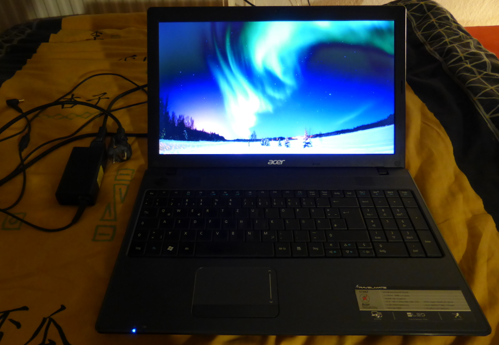
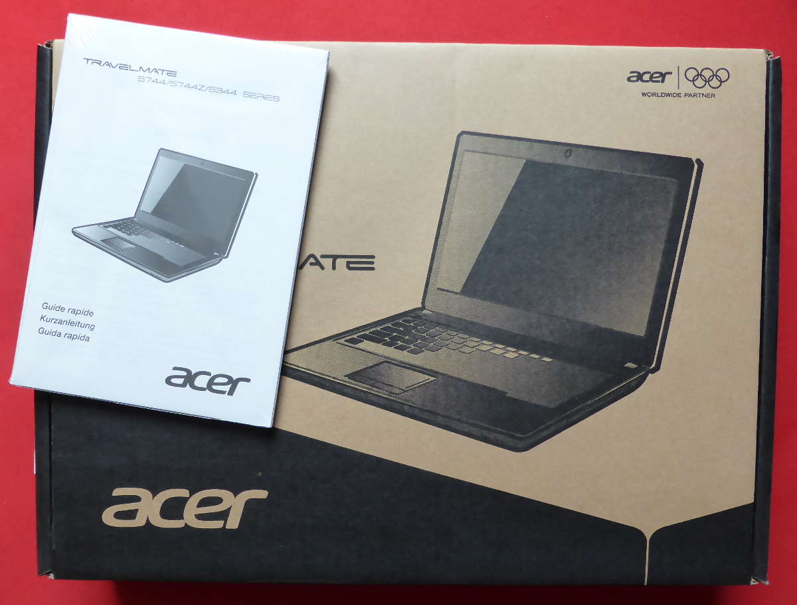
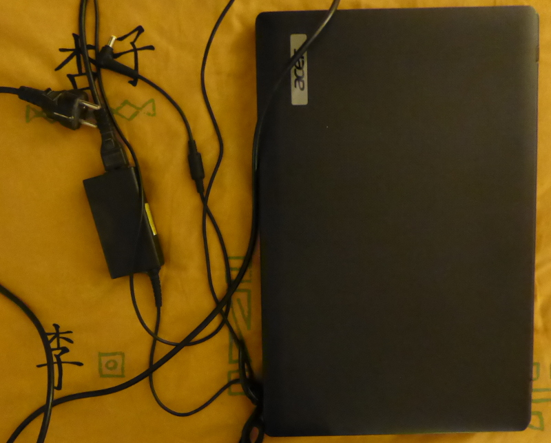

  Acer Travelmate 5744Z

    <figure>
        
    </figure>
    <figure>
        
    </figure>
    <figure>
        
    </figure>

  

    &euro;200.00,
    <link itemprop="availability" href="http://schema.org/InStock" />Verfügbar
  

  <b>Beschreibung:</b>
  Siehe <a href="https://martin-thoma.com/review-des-acer-travelmate-5744z/">Review des Acer Travelmate 5744Z</a> 
  Als Betriebssystem wurde ein <a href="https://de.wikipedia.org/wiki/Ubuntu#Versionstabelle">Ubuntu 16.04</a> (MATE) frisch aufgesetzt. 
   
  Mängel: Lüfter muss mal gereinigt werden, da er manchmal rattert.

